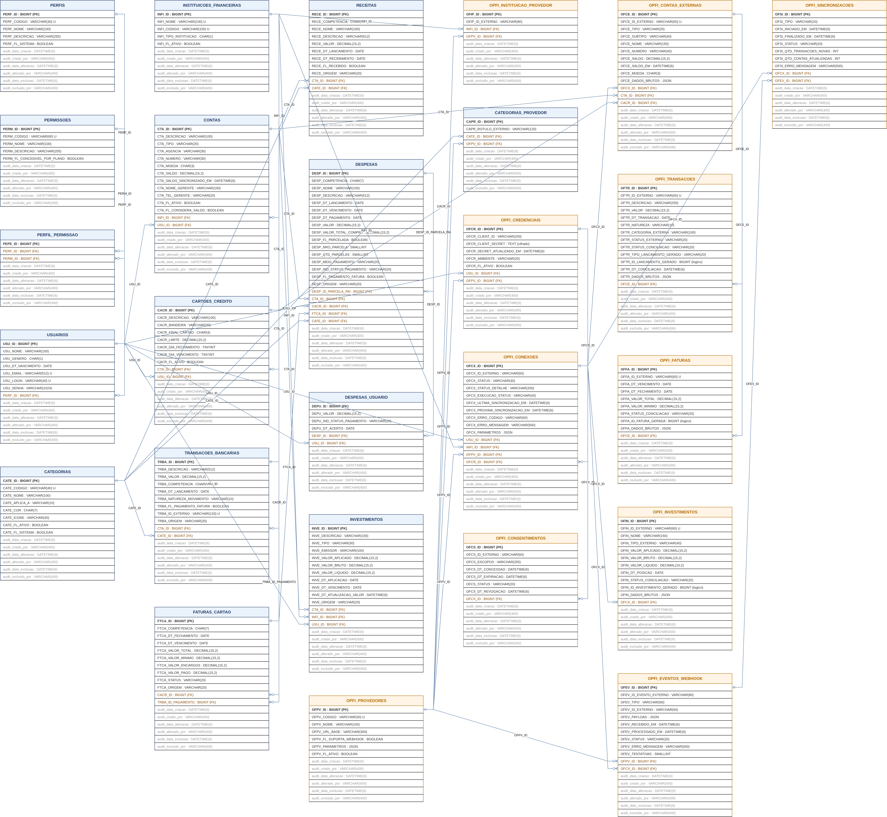
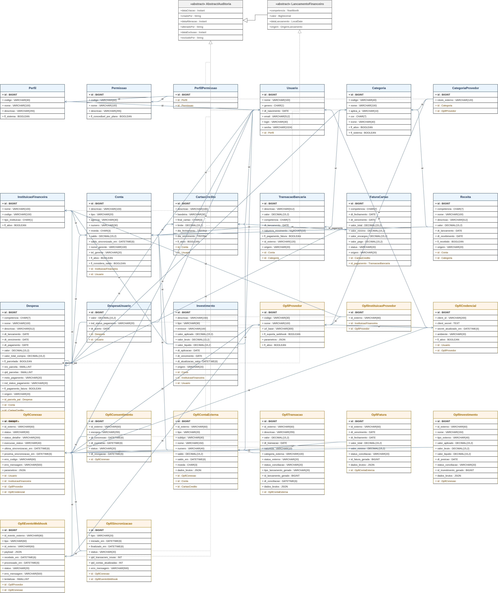

# dscproject — Análise de Sistemas
## Documento 0 — Fundação (Banco de Dados e Mapeamento JPA)

**Gerado em:** 06/09/2026  
**Atualizado em:** 11/09/2026  
**Versão:** 1.7  
**Status:** Analisado  
**Projeto:** `dscproject-spring-mvc` (geração 2 — monólito Spring MVC + Thymeleaf)  

---

## Informações sobre o Documento

| Órgão | dscproject | Setor | Pessoal |
|---|---|---|---|
| Plataforma | dscproject-spring-mvc | Disciplina | Documentação |
| Área Cliente | Diego Cordeiro | Versão do Modelo | 2 (padrão híbrido) |

## Revisões e Aprovações

| Responsável por | Nome | Data de Execução |
|---|---|---|
| Revisão | Diego dos Santos Cordeiro | — |

## Histórico de Versões

| Versão | Data | Analista | Descrição |
|---|---|---|---|
| 1.0 | 06/09/2026 | Diego dos Santos Cordeiro | Criação do documento. 20 tabelas (11 do domínio + 9 da camada Open Finance). DDL MySQL, mapeamento JPA completo, mapeamento de auditoria (Envers). Engenharia reversa dos repositórios `dsc-backend`, `dsc-frontend` e `dsc-spring-mvc` |
| 1.1 | 06/09/2026 | Diego dos Santos Cordeiro | Abstração de provedor de Open Finance: novas tabelas `OPFI_PROVEDORES`, `OPFI_INSTITUICAO_PROVEDOR` e `CATEGORIAS_PROVEDOR`; colunas de id externo renomeadas de `..._PLUGGY_...` para `..._ID_EXTERNO`; `OPFI_CREDENCIAIS` passa a ser única por usuário + provedor. Total de 23 tabelas. Auditoria alinhada à `AbstractAuditoria` da geração 1 (prefixo `audit_`). Estratégia de migrations em duas fases (`ddl-auto=update` no desenvolvimento, Flyway a partir da homologação). Sem migração de dados da geração 1 |
| 1.2 | 06/09/2026 | Diego dos Santos Cordeiro | RBAC: o enum `Perfis` vira as tabelas `PERFIS`, `PERMISSOES` e `PERFIL_PERMISSAO` (N:N). `USUARIOS.USU_PERFIL` (enum) passa a `PERF_ID` (FK). `PERMISSOES` tem a marca `PERM_FL_CONCEDIVEL_POR_PLANO` — costura para um módulo futuro de planos pagos, sem modelar as tabelas de plano agora. Total de 26 tabelas. Origem no documento `01 - manter-usuario` |
| 1.3 | 07/09/2026 | Diego dos Santos Cordeiro | `PERMISSOES` ganha `PERM_MODULO` (agrupa o seletor de perfil) e `PERM_FL_ORFA` (permissão sem correspondente no catálogo do código). Convenção do `PERM_CODIGO` fixada como **domínio-primeiro** (`USUARIOS_LISTAR`, `PERFIS_MANTER`). Sem mudança nas três tabelas de RBAC além dessas colunas. Origem nos documentos `01 - manter-usuario` e `02 - manter-perfil-permissao` |
| 1.4 | 08/09/2026 | Diego dos Santos Cordeiro | Duas mudanças: (a) `INSTITUICOES_FINANCEIRAS` ganha `INFI_FL_SISTEMA` (QUADRO_DESCRITIVO_4 e DDL_4) — padroniza a proteção da carga inicial com `CATE_FL_SISTEMA`; (b) nova tabela `PARAMETROS_GLOBAIS` (QUADRO_DESCRITIVO_28, prefixo `PAGL_`, tabela-raiz sem FK), semeada por um loader no código na inicialização — mesmo padrão do catálogo de permissões; `PAGL_TIPO_DADO` com domínio `STRING`/`INTEGER`/`DECIMAL`/`BOOLEAN`/`JSON` e `CHECK`. Total passa de 26 para **27 tabelas**. Origem no documento `03 - manter-parametro-global` |
| 1.5 | 11/09/2026 | Diego dos Santos Cordeiro | Agenda de Contatos Privada e Rateio Extra-Sistema: (a) nova tabela `CONTATOS` (QUADRO_DESCRITIVO_29, prefixo `CONT_`), vinculada ao usuário dono (`USU_ID_DONO`), com tipo `EXTERNO` (pessoas fora da plataforma com dados de acerto/Pix) e `SISTEMA` (conexão com outros usuários da plataforma via convite aceito); (b) atualização de `DESPESAS_USUARIO` (QUADRO_DESCRITIVO_11), substituindo a FK para `USUARIOS (USU_ID)` pela FK para `CONTATOS (CONT_ID)`, tratando co-participantes uniformemente como contatos do dono da despesa e eliminando o vazamento de dados de usuários na busca de rateio. Total passa de 27 para **28 tabelas**. Origem nos documentos `09 - manter-despesa` e `16 - manter-contato` |
| 1.6 | 11/09/2026 | Diego dos Santos Cordeiro | Despesas Recorrentes: suporte a despesas fixas periódicas (aluguel, condomínio, assinaturas, etc.) em `DESPESAS` (QUADRO_DESCRITIVO_10 e DDL_10) com a adição das colunas `DESP_FL_RECORRENTE` (booleano indicando recorrência) e `DESP_ID_RECORRENTE_PAI` (auto-relacionamento com a despesa-mãe da série periódica). Origem no documento `09 - manter-despesa` |
| 1.7 | 11/09/2026 | Diego dos Santos Cordeiro | Redes Sociais do Usuário e Refinamento Granular de Permissões: (a) nova tabela associativa `USUARIOS_REDES_SOCIAIS` (QUADRO_DESCRITIVO_30, prefixo `USRS_`), vinculada a `USUARIOS (USU_ID)`, para persistência das redes sociais do usuário (LinkedIn, GitHub, Facebook, Instagram, Twitter/X, YouTube, etc.) que refletem no perfil e nos ícones da interface admin; (b) decomposição mandatória das permissões agregadas `MANTER` em permissões atômicas por operação (`LISTAR`, `INSERIR`, `EDITAR`, `EXCLUIR`, `DESATIVAR`/`ATIVAR`, `AJUSTAR_SALDO`, `PAGAR`, `IMPORTAR`). Total passa de 28 para **29 tabelas**. Origem nos documentos `01 - manter-usuario` e `02 - manter-perfil-permissao` |

---

## Diretrizes para Elaboração do Documento

| Nº | DIRETRIZ |
|---|---|
| D01 | Não usar termos técnicos de programação no corpo funcional do documento. Siglas de banco (`DDL`, `FK`, `PK`, `JSON`) são permitidas nas Seções 6 e 7, dirigidas ao desenvolvedor. |
| D02 | O termo `endpoint` não aparece neste documento — a camada de serviços é coberta nos documentos de tela. |
| D03 | A linguagem das Seções 1 a 3 deve ser compreensível para um analista funcional que não é desenvolvedor. |

---

## 1. Introdução

Este é o **documento de fundação** (Documento 0) do `dscproject-spring-mvc`. Diferente dos documentos de tela — que descrevem uma funcionalidade específica (Manter Despesa, Importar Extrato, Dashboard, etc.) — este documento tem um objetivo único e transversal: **definir, de uma só vez, toda a estrutura de dados do sistema (29 tabelas) e o mapeamento das entidades Java correspondente.**

O `dscproject` é um sistema pessoal de organização de finanças (receitas, despesas, transações bancárias, cartões, faturas, investimentos, instituições financeiras e dashboard). Existem hoje duas gerações:

- **Geração 1 — API REST + SPA Angular** (`dscproject-backend` + `dscproject-frontend`): versão em produção, com todos os módulos financeiros implementados.
- **Geração 2 — monólito Spring MVC + Thymeleaf** (`dscproject-spring-mvc`): reescrita, hoje só com o módulo de Usuário. É o alvo deste documento.

Este documento consolida **o modelo de todo o domínio financeiro da geração 1**, reescrito para a geração 2 com as melhorias descritas na Seção 2, e acrescenta a **camada de integração Open Finance** (prefixo `OPFI_`), que permite sincronizar contas, transações, faturas e investimentos a partir de um provedor de Open Finance (Pluggy inicialmente). O que é consolidado é o **modelo**, não os dados: a geração 2 nasce com o banco vazio e o histórico é reconstruído pelo *backfill* do Open Finance (ver Observação 18a).

### Princípio central — o Open Finance é opcional e aditivo

**Todo o domínio funciona 100% manualmente.** Cada entidade do domínio (`Receita`, `Despesa`, `TransacaoBancaria`, `FaturaCartao`, `Investimento`, `Conta`, `CartaoCredito`) tem tela de cadastro próprio. A camada `OPFI_` é uma **fonte de entrada opcional**: sincroniza dados de um provedor para tabelas de *staging* e, num passo de **conciliação** (automático por regra de categoria ou manual pelo usuário), gera ou vincula registros do domínio. **Nenhuma tabela do domínio depende do Open Finance para existir ou ser preenchida.** Quem não conectar o Open Finance usa o sistema inteiro na mão, como na geração 1.

### Por que criar toda a estrutura num único passo

As 29 tabelas têm forte interdependência por chaves estrangeiras: `CONTAS` depende de `INSTITUICOES_FINANCEIRAS` e `USUARIOS`; `DESPESAS` depende de `CONTAS`, `CARTOES_CREDITO`, `FATURAS_CARTAO` e `CATEGORIAS`; `DESPESAS_USUARIO` depende de `DESPESAS` e `CONTATOS`; `USUARIOS_REDES_SOCIAIS` depende de `USUARIOS`; as tabelas `OPFI_` encadeiam provedor → credencial → conexão → conta externa → transação. Criar a estrutura completa na ordem correta de dependência (Seção 6.4) evita migrations parciais que deixariam o schema inconsistente entre as entregas das telas.

### Escopo deste documento

- Estrutura completa de banco das 29 tabelas (Seção 6), com um QUADRO_DESCRITIVO e um DDL por tabela, na ordem de dependência de criação.
- Mapeamento das entidades Java (Seção 7), incluindo a superclasse de auditoria, os conversores e os enums de domínio.

### Não contempla

- Telas, regras de tela, regras de negócio, mensagens e protótipos — cobertos nos documentos de tela.
- Camada de serviços, repositórios, conversores de tela e controladores — a Seção 7 trata apenas do mapeamento das entidades.
- O algoritmo de cifra da credencial Open Finance, o fluxo do widget de conexão do provedor e a estratégia de agendamento do job de sincronização — decisões técnicas registradas no design de cada tela.

---

## 2. Observações

| Nº | OBSERVAÇÃO | REFERÊNCIA / IMPACTO |
|---|---|---|
| 1 | **Nomenclatura de tabelas:** MAIÚSCULAS, no plural, **sem prefixo de módulo** no domínio (`USUARIOS`, `DESPESAS`, `CONTAS`). O domínio financeiro *é* o sistema — não há outro módulo com que colidir. A **única exceção** é a camada Open Finance, com prefixo `OPFI_`, por ser um contexto separado de sincronização externa. `CATEGORIAS_PROVEDOR` fica no domínio (prefixo de coluna `CAPR_`) por ser um mapa de categoria; as demais tabelas de mapeamento e *staging* são `OPFI_`. | Padrão do schema da geração 1 |
| 1a | **Abstração de provedor (decisão de 06/09/2026):** a camada Open Finance **não é acoplada à Pluggy**. Há um catálogo `OPFI_PROVEDORES` (`PLUGGY`, `BELVO`, uma API própria certificada, etc.), e cada provedor tem uma classe *Strategy* Java que fala com a API dele. Todas as colunas de id vindas de fora são `..._ID_EXTERNO` (não `..._PLUGGY_...`), sempre acompanhadas do provedor. Adicionar um provedor novo = uma linha em `OPFI_PROVEDORES` + uma *Strategy* + as credenciais; **zero mudança de schema**. Mesmo padrão do `ia_provedores` do módulo de I.A. | [QUADRO_DESCRITIVO_13](#quadro-descritivo-13) |
| 2 | **Nomenclatura de colunas:** cada tabela tem um **prefixo próprio** (3 a 4 letras) para suas colunas (`USU_`, `DESP_`, `CTA_`, `OFTR_`), conforme o padrão da geração 1. FKs carregam o prefixo da tabela **de origem** (`DESPESAS.CTA_ID` referencia `CONTAS`). | Padrão do schema da geração 1 |
| 3 | **Auditoria (melhoria A):** a classe `AbstractAuditoria` da geração 1 (`@MappedSuperclass`, `@Audited` — Hibernate Envers) é **portada preservando os nomes**: prefixo de coluna `audit_`, campos `audit_data_criacao`, `audit_criado_por`, `audit_data_alteracao`, `audit_alterado_por`. Duas mudanças pontuais: autor passa de `VARCHAR(40)` para `VARCHAR(400)`, e são acrescentados 2 campos de *soft delete* — `audit_data_exclusao` e `audit_excluido_por`. Datas em `DATETIME(6)`. Herdada por todas as 26 tabelas de dados/infraestrutura + as 3 de RBAC (29 no total), inclusive associativas e de *staging*. | Classe `AbstractAuditoria` da geração 1 |
| 4 | **Soft delete:** exclusão lógica via `audit_data_exclusao` / `audit_excluido_por`. Nenhum `DELETE` físico no domínio. Consultas do sistema filtram `audit_data_exclusao IS NULL`. | Melhoria A |
| 5 | **Chave primária:** `{PREFIXO}_ID` do tipo `BIGINT NOT NULL AUTO_INCREMENT`, mapeada com `@GeneratedValue(strategy = GenerationType.IDENTITY)`. | Padrão do schema da geração 1 |
| 6 | **Banco:** MySQL 8 (InnoDB, `utf8mb4`). Tipos: `BIGINT`, `VARCHAR`, `CHAR`, `DECIMAL(15,2)` para valores monetários, `DATE` para datas de negócio, `DATETIME(6)` para carimbos de tempo, `JSON` para dados brutos do provedor, `BOOLEAN` (`TINYINT(1)`) para flags. | RNF03 |
| 7 | **Migrations (decisão travada):** durante o desenvolvimento das telas da geração 2, mantém-se `spring.jpa.hibernate.ddl-auto=update` (como já está hoje) — o schema ainda muda muito e não há dado real. **Antes da primeira subida em homologação**, o schema é congelado num script Flyway `V1__init.sql` (gerado a partir da Seção 6) e o `ddl-auto` passa a `validate`. A partir daí, toda alteração de estrutura é um script Flyway versionado. Os DDLs da Seção 6 são a fonte desse `V1__init.sql`. | Seção 6.4 |
| 8 | **Split de `TipoRegistroFinanceiro` (melhoria B):** o enum da geração 1 tem o código `"D"` duplicado (`DESPESA` e `DEBITO`) — `toEnum("D")` nunca devolve `DEBITO`. Este documento separa em dois conceitos: **`TipoLancamento`** (`RECEITA` / `DESPESA` — o que o lançamento é) e **`NaturezaMovimento`** (`CREDITO` / `DEBITO` — o sentido do movimento na conta). | Seção 7.3 |
| 9 | **Superclasse `LancamentoFinanceiro` (melhoria C):** `Receita`, `Despesa` e `TransacaoBancaria` compartilham valor, competência, data de lançamento, categoria e conta via um `@MappedSuperclass`. As **tabelas continuam separadas** — não há unificação com discriminador. | Seção 7.2 |
| 10 | **Datas de lançamento (melhoria D):** padronizadas em `LocalDate` (`DATE`). A geração 1 usa três tipos diferentes (`Instant`, `LocalDate`, `java.util.Date`). | Seção 7 |
| 11 | **`CONTAS` (melhoria E):** a tabela `INSTITUICOES_FINANCEIRAS_USUARIO` da geração 1 é renomeada para `CONTAS` e ganha tipo de conta, saldo, moeda e carimbo da última sincronização de saldo. Semanticamente sempre foi "a conta do usuário numa instituição". | [QUADRO_DESCRITIVO_5](#quadro-descritivo-5) |
| 12 | **Parcelamento (melhoria F):** `DESPESAS.DESP_ID_PARCELA_PAI` passa a ser FK real (auto-relacionamento `@ManyToOne Despesa parcelaPai`), não um `Long` solto. | [QUADRO_DESCRITIVO_10](#quadro-descritivo-10) |
| 13 | **Competência (melhoria G):** `CHAR(7)` no formato `yyyy-MM`, com `CHECK` de formato, mapeada em Java como `java.time.YearMonth` via `AttributeConverter`. A geração 1 usa `String` com *default* `"0000-00"` e formato citado divergente (`MM/AAAA`). | Seção 7.4 |
| 14 | **Categorias (melhoria — decisão travada):** `CategoriaRegistroFinanceiro` deixa de ser enum e vira a tabela **`CATEGORIAS`**, editável por tela. O mapa "categoria do provedor → categoria do usuário" fica na tabela `CATEGORIAS_PROVEDOR` (categoria × provedor × rótulo externo), usada na conciliação automática. | [QUADRO_DESCRITIVO_3](#quadro-descritivo-3), [QUADRO_DESCRITIVO_15](#quadro-descritivo-15) |
| 15 | **Cartão de crédito (decisão travada):** compras no cartão continuam sendo `Despesa`. O **cartão** vira a tabela de referência `CARTOES_CREDITO` (limite, fechamento, vencimento). A **fatura** vira `FATURAS_CARTAO` — tabela fina, com ciclo de vida (`ABERTA` → `FECHADA` → `PAGA`/`PAGA_PARCIAL`), **lançável manualmente**. Enquanto `ABERTA`, a tela mostra o parcial somando as despesas do cartão na competência; quando `FECHADA`, vale o `FTCA_VALOR_TOTAL` gravado (fato imutável). | [QUADRO_DESCRITIVO_6](#quadro-descritivo-6), [QUADRO_DESCRITIVO_8](#quadro-descritivo-8) |
| 16 | **Pagamento de fatura:** registrado como `TransacaoBancaria` (débito em conta) com `TRBA_FL_PAGAMENTO_FATURA = TRUE`, e **excluído** do total de gastos por categoria — senão conta em dobro com as compras já lançadas. A regra de exclusão é detalhada no documento de tela do Dashboard. | [QUADRO_DESCRITIVO_7](#quadro-descritivo-7) |
| 17 | **Investimentos (melhoria I):** entidade nova `INVESTIMENTOS`. Não existe na geração 1. | [QUADRO_DESCRITIVO_12](#quadro-descritivo-12) |
| 18 | **Origem do registro:** todo lançamento do domínio tem a coluna `{PREFIXO}_ORIGEM` (`MANUAL` / `OPEN_FINANCE` / `IMPORTACAO`), para distinguir o que foi digitado do que veio do provedor ou de um arquivo. A carga inicial (*backfill*) da geração 2 vem do Open Finance com `ORIGEM = OPEN_FINANCE`; o que for lançado depois é `MANUAL`. | Seções 6 e 7 |
| 18a | **Sem migração de dados da geração 1:** a geração 2 nasce com o banco vazio. O histórico é reconstruído pelo *backfill* do Open Finance (janela regulatória de ~12 meses, suficiente porque o sistema tem menos de um ano). O que não vier do provedor é digitado. Não há script de carga a partir do banco de produção da geração 1. | Decisão de 06/09/2026 |
| 19 | **Camada Open Finance — *staging* + conciliação:** as tabelas `OPFI_*` guardam o dado **bruto** do provedor (id externo + `JSON` com o *payload* completo). A conciliação transforma um registro de *staging* num registro do domínio e grava o vínculo lógico (`OFTR_ID_LANCAMENTO_GERADO` + `OFTR_TIPO_LANCAMENTO_GERADO`). O domínio **nunca** é escrito diretamente pelo job de sincronização. | [QUADRO_DESCRITIVO_20](#quadro-descritivo-20) |
| 20 | **Credencial do provedor (decisão travada — BYOK cifrado):** cada usuário guarda uma credencial **por provedor** (`OPFI_CREDENCIAIS`, único por `USU_ID` + `OFPV_ID`), com `OFCR_CLIENT_SECRET` **armazenado cifrado**, nunca em texto puro, chave simétrica mantida fora do banco. Segue o padrão do token cifrado de `ia_provedores` do módulo de I.A. O modelo BYOK é uma zona cinzenta contratual da Pluggy — antes de cobrar de terceiros, confirmar com o provedor (registrado no design da tela de conexão). | RNF02 |
| 21 | **Vínculo lógico (não FK):** onde uma tabela de *staging* aponta para "o registro do domínio que foi gerado", o vínculo é **lógico** (`{prefixo}_id_..._gerado` + `{prefixo}_tipo_..._gerado`), não FK física, porque o alvo é polimórfico (`RECEITAS` / `DESPESAS` / `TRANSACOES_BANCARIAS`). | Seção 6 |
| 22 | **Segredos versionados:** `application-dev.properties` da geração 2 versiona senha de banco e senha de app do Gmail. A chave de cifra da credencial Open Finance **não** pode seguir esse caminho — variável de ambiente. Item a corrigir junto com a adoção do Flyway. | RNF02 / A Confirmar |
| 23 | **RBAC (origem no documento `01 - manter-usuario`):** o enum `Perfis` da geração 1 vira três tabelas — `PERFIS`, `PERMISSOES` e `PERFIL_PERMISSAO` (N:N). `USUARIOS` deixa de ter a coluna `USU_PERFIL` (enum) e passa a ter `PERF_ID` (FK, um perfil por usuário). `getAuthorities()` deriva as autoridades das permissões do perfil. As permissões são **granulares por operação** (`USUARIOS_LISTAR`, `USUARIOS_INSERIR`, …) e nascem de carga inicial + catálogo do código; a tela de edição de permissão por perfil (`02 - manter-perfil-permissao`) apenas liga/desliga vínculos. | [QUADRO_DESCRITIVO_25](#quadro-descritivo-25) |
| 24 | **Costura para planos pagos (sem modelar agora):** `PERMISSOES.PERM_FL_CONCEDIVEL_POR_PLANO` marca as permissões que um plano pago poderá conceder além do perfil (ex.: `OPEN_FINANCE_CONECTAR`, `DESPESA_RATEAR_MULTIUSUARIO`). O resolvedor de autoridades do usuário é desenhado como **permissão efetiva = permissões do perfil ∪ permissões do plano**. As tabelas de plano/assinatura/cota ficam num módulo futuro (`NN - planos-e-assinaturas`) — este documento só deixa o ponto de extensão. | [QUADRO_DESCRITIVO_26](#quadro-descritivo-26) |
| 25 | **Numeração dos QUADRO_DESCRITIVO:** a partir da versão 1.2, os quadros são numerados por **ordem de inclusão no documento**, não por ordem de criação das tabelas. A ordem de criação é a da coluna "Ordem" na visão geral e a da Seção 6.4. Assim, acréscimos futuros entram no fim da Seção 6 sem renumerar os quadros já referenciados pelos documentos de tela. | Seção 6 |
| 26 | **Agenda de Contatos Privada e Rateio Extra-Sistema (origem nos documentos `09 - manter-despesa` e `16 - manter-contato`):** o rateio de despesas passa a referenciar a tabela `CONTATOS` (`CONT_ID`) em vez de apontar diretamente para `USUARIOS`. Cada contato pertence exclusivamente a um usuário (`USU_ID_DONO`) e pode ser do tipo `EXTERNO` (não possui conta no sistema; guarda nome, telefone e chave PIX para acertos) ou `SISTEMA` (usuário da plataforma conectado via convite aceito, `USU_ID_CONECTADO`). Isso elimina a busca aberta na base global de usuários do sistema, garantindo privacidade/LGPD e permitindo dividir gastos com quem está fora da plataforma. | [QUADRO_DESCRITIVO_11](#quadro-descritivo-11), [QUADRO_DESCRITIVO_29](#quadro-descritivo-29) |
| 27 | **Redes Sociais do Usuário (origem no documento `01 - manter-usuario`):** Criação da tabela associativa `USUARIOS_REDES_SOCIAIS` (prefixo `USRS_`), vinculada a `USUARIOS (USU_ID)`, para permitir que o usuário associe seus perfis públicos (LinkedIn, GitHub, Facebook, Instagram, Twitter/X, YouTube, etc.) à sua conta. Esses links refletem na nova aba de configurações do usuário (`/minha-conta`) e alimentam dinamicamente os ícones sociais no layout administrativo do sistema (`templates/sistema/template-admin/fragments/footer.html` e `header.html`). | [QUADRO_DESCRITIVO_30](#quadro-descritivo-30) |
| 28 | **Decomposição Granular de Permissões MANTER (origem no documento `02 - manter-perfil-permissao`):** Proibição arquitetural do sufixo agregador genérico `_MANTER` no catálogo de permissões RBAC. Todas as permissões legadas (`PERFIS_MANTER`, `CONTAS_MANTER`, `CARTOES_MANTER`, `RECEITAS_MANTER`, `DESPESAS_MANTER`, `INSTITUICOES_MANTER`, `INSTITUICOES_PROVEDOR_MANTER`) são desmembradas em ações atômicas (`_LISTAR`, `_INSERIR`, `_EDITAR`, `_EXCLUIR`, `_DESATIVAR`/`_ATIVAR`, `_AJUSTAR_SALDO`, `_PAGAR`, `_IMPORTAR`). O catálogo Java passa a expor o método de decomposição reversa para garantir compatibilidade retroativa transitória. | [QUADRO_DESCRITIVO_26](#quadro-descritivo-26) |

---

## 3. Requisitos

### 3.2 Requisitos Não Funcionais

| ID | CATEGORIA | DESCRIÇÃO | CRITÉRIO DE ACEITAÇÃO |
|---|---|---|---|
| RNF01 | Independência do provedor | O sistema deve ser plenamente utilizável sem nenhuma conexão Open Finance. Toda entidade do domínio tem cadastro manual. | Validado ao criar receita, despesa, transação, fatura e investimento sem nenhuma credencial `OPFI_` cadastrada. |
| RNF02 | Segurança da credencial | `OFCR_CLIENT_SECRET` deve ser persistido cifrado, com chave simétrica fora do banco, e nunca retornado em claro na leitura comum. | Validado por inspeção do valor persistido na coluna. |
| RNF03 | Nomenclatura | O schema segue o padrão do `dscproject`: tabelas MAIÚSCULAS no plural sem prefixo de módulo (exceto `OPFI_`), colunas com prefixo próprio por tabela, PK `{PREFIXO}_ID BIGINT AUTO_INCREMENT`, 6 campos `audit_*`. | Validado por revisão do DDL contra este documento. |
| RNF04 | Auditoria | Todas as 29 tabelas têm auditoria completa via Hibernate Envers (`@Audited`), gerando a tabela `_aud` correspondente, inclusive as associativas e as de *staging*. | Validado por inspeção das tabelas `_aud` após operações de CRUD. |
| RNF05 | Integridade monetária | Valores monetários em `DECIMAL(15,2)`. Nunca `DOUBLE`/`FLOAT`. | Validado por revisão do DDL. |
| RNF06 | Integridade do JSON | As colunas `..._DADOS_BRUTOS` e `..._PARAMETROS` (`JSON`) devem ser validadas como JSON válido na camada de negócio antes de persistir. | Validado por teste de persistência com JSON válido e inválido. |
| RNF07 | Idempotência da sincronização | Reprocessar o mesmo evento de webhook ou a mesma transação do provedor não pode duplicar registros. Garantido pelas chaves únicas dos ids externos por provedor (`OFTR_ID_EXTERNO`, `OFEV_ID_EVENTO_EXTERNO`, etc.). | Validado por reprocessamento do mesmo evento duas vezes. |
| RNF08 | Rastreabilidade da conciliação | Todo registro do domínio criado a partir do Open Finance deve ser rastreável até a transação de *staging* de origem, e vice-versa. | Validado por consulta cruzada entre `OPFI_TRANSACOES` e o lançamento gerado. |
| RNF09 | Migrations versionadas | A partir da primeira subida em homologação, nenhuma alteração de schema fora do Flyway, com `ddl-auto=validate`. Antes disso (desenvolvimento local), `ddl-auto=update` é aceito. | Validado ao subir a aplicação em homologação contra um banco criado só pelos scripts Flyway. |

---

## 6. Banco de Dados

Esta seção descreve as **29 tabelas** do `dscproject-spring-mvc`, na **ordem de criação por dependência de FK** — cada tabela só referencia tabelas criadas antes dela.

Todas as tabelas seguem `AbstractAuditoria` (6 campos `audit_*`, [QUADRO_DESCRITIVO_1](#quadro-descritivo-1)) e são auditadas via Hibernate Envers.

### Visão geral das tabelas

"Ordem" = ordem de criação (dependência de FK). "Quadro" = número do QUADRO_DESCRITIVO na Seção 6 (por ordem de inclusão no documento — ver Observação 25).

| Ordem | Quadro | Prefixo col. | Tabela | Camada | Função |
|---|---|---|---|---|---|
| 1 | 25 | `PERF_` | `PERFIS` | RBAC | Perfil de acesso (era enum `Perfis`) |
| 2 | 26 | `PERM_` | `PERMISSOES` | RBAC | Permissão granular por operação; código domínio-primeiro, agrupada por módulo; marca a que um plano pago poderá conceder e a órfã |
| 3 | 27 | `PEPE_` | `PERFIL_PERMISSAO` | RBAC | N:N perfil × permissão |
| 4 | 2 | `USU_` | `USUARIOS` | Domínio | Usuário do sistema (implementa `UserDetails`); FK para `PERFIS` |
| 5 | 3 | `CATE_` | `CATEGORIAS` | Domínio | Categorias de receita/despesa (era enum) |
| 6 | 4 | `INFI_` | `INSTITUICOES_FINANCEIRAS` | Domínio | Catálogo de bancos e corretoras |
| 7 | 5 | `CTA_` | `CONTAS` | Domínio | Conta do usuário numa instituição (era `INSTITUICOES_FINANCEIRAS_USUARIO`) |
| 8 | 6 | `CACR_` | `CARTOES_CREDITO` | Domínio | Cartão de crédito — referência (limite, fechamento, vencimento) |
| 9 | 7 | `TRBA_` | `TRANSACOES_BANCARIAS` | Domínio | Movimento em conta (crédito/débito) |
| 10 | 8 | `FTCA_` | `FATURAS_CARTAO` | Domínio | Fatura mensal de um cartão — ciclo de vida, lançável manual |
| 11 | 9 | `RECE_` | `RECEITAS` | Domínio | Receita (entrada de dinheiro) |
| 12 | 10 | `DESP_` | `DESPESAS` | Domínio | Despesa (saída de dinheiro), com parcelamento e rateio |
| 13 | 29 | `CONT_` | `CONTATOS` | Domínio | Agenda de contatos do próprio usuário (contatos extra-sistema e conexões via convite) |
| 14 | 11 | `DEPU_` | `DESPESAS_USUARIO` | Domínio | Rateio de uma despesa entre contatos da agenda do usuário |
| 15 | 12 | `INVE_` | `INVESTIMENTOS` | Domínio | Posição de investimento |
| 16 | 13 | `OFPV_` | `OPFI_PROVEDORES` | Open Finance | Catálogo de provedores de Open Finance (Pluggy, Belvo, API própria) |
| 17 | 14 | `OFIP_` | `OPFI_INSTITUICAO_PROVEDOR` | Open Finance | Mapa instituição × provedor × id do *connector* externo |
| 18 | 15 | `CAPR_` | `CATEGORIAS_PROVEDOR` | Domínio | Mapa categoria × provedor × rótulo externo (conciliação automática) |
| 19 | 16 | `OFCR_` | `OPFI_CREDENCIAIS` | Open Finance | Credencial BYOK do usuário num provedor (secret cifrado) |
| 20 | 17 | `OFCX_` | `OPFI_CONEXOES` | Open Finance | Conexão do usuário com uma instituição via um provedor |
| 21 | 18 | `OFCS_` | `OPFI_CONSENTIMENTOS` | Open Finance | Espelho do consentimento Open Finance (escopo, validade) |
| 22 | 19 | `OFCE_` | `OPFI_CONTAS_EXTERNAS` | Open Finance | Conta/cartão trazido do provedor, vinculado a uma conta do domínio |
| 23 | 20 | `OFTR_` | `OPFI_TRANSACOES` | Open Finance | *Staging* de transações + conciliação com o domínio |
| 24 | 21 | `OFFA_` | `OPFI_FATURAS` | Open Finance | *Staging* de faturas de cartão do provedor |
| 25 | 22 | `OFIN_` | `OPFI_INVESTIMENTOS` | Open Finance | *Staging* de investimentos do provedor |
| 26 | 23 | `OFEV_` | `OPFI_EVENTOS_WEBHOOK` | Open Finance | Log de eventos de webhook (idempotência e reprocessamento) |
| 27 | 24 | `OFSI_` | `OPFI_SINCRONIZACOES` | Open Finance | Log de cada execução do job de sincronização |
| 28 | 28 | `PAGL_` | `PARAMETROS_GLOBAIS` | Infraestrutura | Parâmetros globais de configuração (contrato lido em runtime por `buscarValorPorCodigo`); tabela-raiz sem FK, semeada por um loader no código na inicialização |
| 29 | 30 | `USRS_` | `USUARIOS_REDES_SOCIAIS` | Domínio | Redes sociais associadas ao usuário (LinkedIn, GitHub, etc.) para exibição no perfil e ícones do layout admin |

---

### <a id="quadro-descritivo-1"></a>QUADRO_DESCRITIVO_1 — AbstractAuditoria (`@MappedSuperclass`)

> **SUPERCLASSE DE AUDITORIA:** AbstractAuditoria (`@MappedSuperclass`)
> OBSERVAÇÕES: Não é tabela. Portada da geração 1 (`br.com.dscproject.domain.AbstractAuditoria`) — mantém prefixo `audit_` e os nomes originais, e acrescenta os 2 campos de exclusão (soft delete). Os 6 campos são herdados por TODAS as 29 tabelas. Nos demais QUADROS, o bloco de auditoria é citado de forma compacta, referenciando este quadro.

| ID | NOME | PROPRIEDADES | OBSERVAÇÕES |
|---|---|---|---|
| 1 | AUDITORIA – DATA DE CRIAÇÃO | Campo: audit_data_criacao<br>Tipo: DATETIME(6)<br>Obrigatório: SIM<br>Default: CURRENT_TIMESTAMP(6) | JÁ EXISTE (geração 1). Autor `Instant`, `@CreatedDate`. |
| 2 | AUDITORIA – CRIADO POR | Campo: audit_criado_por<br>Tipo: VARCHAR(400)<br>Obrigatório: SIM | JÁ EXISTE. Alargado de `40` para `400`. `@CreatedBy`. |
| 3 | AUDITORIA – DATA DE ALTERAÇÃO | Campo: audit_data_alteracao<br>Tipo: DATETIME(6)<br>Obrigatório: NÃO | JÁ EXISTE. `@LastModifiedDate`. |
| 4 | AUDITORIA – ALTERADO POR | Campo: audit_alterado_por<br>Tipo: VARCHAR(400)<br>Obrigatório: NÃO | JÁ EXISTE. Alargado de `40` para `400`. `@LastModifiedBy`. |
| 5 | AUDITORIA – DATA DE EXCLUSÃO | Campo: audit_data_exclusao<br>Tipo: DATETIME(6)<br>Obrigatório: NÃO | NOVO. Preenchido no *soft delete*. |
| 6 | AUDITORIA – EXCLUÍDO POR | Campo: audit_excluido_por<br>Tipo: VARCHAR(400)<br>Obrigatório: NÃO | NOVO |

> **ALTERAÇÃO NA ESTRUTURA DO BANCO DE DADOS**

```sql
-- DDL_1
-- Não gera DDL próprio. Os 6 campos abaixo entram em toda tabela:
--     audit_data_criacao      DATETIME(6)     NOT NULL DEFAULT CURRENT_TIMESTAMP(6),
--     audit_criado_por        VARCHAR(400)    NOT NULL,
--     audit_data_alteracao    DATETIME(6)     NULL,
--     audit_alterado_por      VARCHAR(400)    NULL,
--     audit_data_exclusao     DATETIME(6)     NULL,
--     audit_excluido_por      VARCHAR(400)    NULL
```

---

### <a id="quadro-descritivo-2"></a>QUADRO_DESCRITIVO_2 — USUARIOS

> **TABELA DO BANCO DE DADOS:** USUARIOS
> OBSERVAÇÕES: Usuário do sistema. Implementa `UserDetails` (Spring Security). Já existe na geração 2 (módulo Usuário) sem auditoria — este documento acrescenta o bloco `audit_*` e `@Audited`. Na Fase 1 (`ddl-auto=update`) o Hibernate cria as colunas novas; no `V1__init.sql` a tabela já nasce completa.

| ID | NOME | PROPRIEDADES | OBSERVAÇÕES |
|---|---|---|---|
| 1 | IDENTIFICADOR | Campo: USU_ID<br>Tipo: BIGINT<br>Obrigatório: SIM<br>Chave: PK<br>Auto incremento: SIM | JÁ EXISTE |
| 2 | NOME | Campo: USU_NOME<br>Tipo: VARCHAR(100)<br>Obrigatório: SIM | JÁ EXISTE |
| 3 | GÊNERO | Campo: USU_GENERO<br>Tipo: CHAR(1)<br>Obrigatório: SIM<br>Domínio: F, M, O | JÁ EXISTE. Enum `Genero`. |
| 4 | DATA DE NASCIMENTO | Campo: USU_DT_NASCIMENTO<br>Tipo: DATE<br>Obrigatório: NÃO | JÁ EXISTE. Era `java.util.Date` — passa a `LocalDate`. |
| 5 | E-MAIL | Campo: USU_EMAIL<br>Tipo: VARCHAR(512)<br>Obrigatório: SIM<br>Único: SIM | JÁ EXISTE |
| 6 | LOGIN | Campo: USU_LOGIN<br>Tipo: VARCHAR(40)<br>Obrigatório: SIM<br>Único: SIM | JÁ EXISTE |
| 7 | SENHA | Campo: USU_SENHA<br>Tipo: VARCHAR(1024)<br>Obrigatório: SIM | JÁ EXISTE. Hash BCrypt. |
| 8 | PERFIL | Campo: PERF_ID<br>Tipo: BIGINT<br>Obrigatório: SIM<br>Chave: FK → PERFIS (PERF_ID) | ALTERADO (v1.2). Era `USU_PERFIL VARCHAR(20)` com enum `Perfis`; vira FK para a tabela `PERFIS` ([QUADRO_DESCRITIVO_25](#quadro-descritivo-25)). |
| 9-14 | AUDITORIA | Ver [QUADRO_DESCRITIVO_1](#quadro-descritivo-1) | NOVO (hoje sem auditoria na geração 2) |

> **ALTERAÇÃO NA ESTRUTURA DO BANCO DE DADOS**

```sql
-- DDL_2
CREATE TABLE USUARIOS (
    USU_ID              BIGINT          NOT NULL AUTO_INCREMENT,
    USU_NOME            VARCHAR(100)    NOT NULL,
    USU_GENERO          CHAR(1)         NOT NULL,
    USU_DT_NASCIMENTO   DATE            NULL,
    USU_EMAIL           VARCHAR(512)    NOT NULL,
    USU_LOGIN           VARCHAR(40)     NOT NULL,
    USU_SENHA           VARCHAR(1024)   NOT NULL,
    PERF_ID             BIGINT          NOT NULL,
    audit_data_criacao      DATETIME(6)     NOT NULL DEFAULT CURRENT_TIMESTAMP(6),
    audit_criado_por        VARCHAR(400)    NOT NULL,
    audit_data_alteracao    DATETIME(6)     NULL,
    audit_alterado_por      VARCHAR(400)    NULL,
    audit_data_exclusao     DATETIME(6)     NULL,
    audit_excluido_por      VARCHAR(400)    NULL,
    CONSTRAINT pk_usuarios        PRIMARY KEY (USU_ID),
    CONSTRAINT uq_usuarios_email  UNIQUE (USU_EMAIL),
    CONSTRAINT uq_usuarios_login  UNIQUE (USU_LOGIN),
    CONSTRAINT fk_usuarios_perfil FOREIGN KEY (PERF_ID) REFERENCES PERFIS (PERF_ID),
    CONSTRAINT ck_usuarios_genero CHECK (USU_GENERO IN ('F', 'M', 'O'))
) ENGINE = InnoDB DEFAULT CHARSET = utf8mb4;

CREATE INDEX idx_usuarios_perfil ON USUARIOS (PERF_ID);
```

---

### <a id="quadro-descritivo-3"></a>QUADRO_DESCRITIVO_3 — CATEGORIAS

> **TABELA DO BANCO DE DADOS:** CATEGORIAS
> OBSERVAÇÕES: Categorias de lançamento, editáveis por tela. Substitui o enum `CategoriaRegistroFinanceiro` da geração 1. O mapa "categoria do provedor → categoria do usuário" fica na tabela `CATEGORIAS_PROVEDOR` ([QUADRO_DESCRITIVO_15](#quadro-descritivo-15)), não aqui. `CATE_FL_SISTEMA` protege as categorias de carga inicial da exclusão.

| ID | NOME | PROPRIEDADES | OBSERVAÇÕES |
|---|---|---|---|
| 1 | IDENTIFICADOR | Campo: CATE_ID<br>Tipo: BIGINT<br>Obrigatório: SIM<br>Chave: PK<br>Auto incremento: SIM | NOVO |
| 2 | CÓDIGO | Campo: CATE_CODIGO<br>Tipo: VARCHAR(40)<br>Obrigatório: SIM<br>Único: SIM | NOVO. Ex.: SALARIO, ALIMENTACAO, CARTAO_DE_CREDITO. |
| 3 | NOME | Campo: CATE_NOME<br>Tipo: VARCHAR(100)<br>Obrigatório: SIM | NOVO. Nome de exibição. |
| 4 | APLICA-SE A | Campo: CATE_APLICA_A<br>Tipo: VARCHAR(10)<br>Obrigatório: SIM<br>Domínio: RECEITA, DESPESA, AMBOS | NOVO. Restringe em quais lançamentos a categoria aparece. |
| 5 | COR | Campo: CATE_COR<br>Tipo: CHAR(7)<br>Obrigatório: NÃO | NOVO. Hex (`#RRGGBB`) para os gráficos do dashboard. |
| 6 | ÍCONE | Campo: CATE_ICONE<br>Tipo: VARCHAR(40)<br>Obrigatório: NÃO | NOVO. Nome do ícone na tela. |
| 7 | ATIVA | Campo: CATE_FL_ATIVO<br>Tipo: BOOLEAN<br>Obrigatório: SIM<br>Default: TRUE | NOVO |
| 8 | CATEGORIA DE SISTEMA | Campo: CATE_FL_SISTEMA<br>Tipo: BOOLEAN<br>Obrigatório: SIM<br>Default: FALSE | NOVO. TRUE nas categorias de carga inicial — não podem ser excluídas pela tela. |
| 9-14 | AUDITORIA | Ver [QUADRO_DESCRITIVO_1](#quadro-descritivo-1) | NOVO |

> **ALTERAÇÃO NA ESTRUTURA DO BANCO DE DADOS**

```sql
-- DDL_3
CREATE TABLE CATEGORIAS (
    CATE_ID                 BIGINT          NOT NULL AUTO_INCREMENT,
    CATE_CODIGO             VARCHAR(40)     NOT NULL,
    CATE_NOME               VARCHAR(100)    NOT NULL,
    CATE_APLICA_A           VARCHAR(10)     NOT NULL,
    CATE_COR                CHAR(7)         NULL,
    CATE_ICONE              VARCHAR(40)     NULL,
    CATE_FL_ATIVO           BOOLEAN         NOT NULL DEFAULT TRUE,
    CATE_FL_SISTEMA         BOOLEAN         NOT NULL DEFAULT FALSE,
    audit_data_criacao      DATETIME(6)     NOT NULL DEFAULT CURRENT_TIMESTAMP(6),
    audit_criado_por        VARCHAR(400)    NOT NULL,
    audit_data_alteracao    DATETIME(6)     NULL,
    audit_alterado_por      VARCHAR(400)    NULL,
    audit_data_exclusao     DATETIME(6)     NULL,
    audit_excluido_por      VARCHAR(400)    NULL,
    CONSTRAINT pk_categorias         PRIMARY KEY (CATE_ID),
    CONSTRAINT uq_categorias_codigo  UNIQUE (CATE_CODIGO),
    CONSTRAINT ck_categorias_aplica  CHECK (CATE_APLICA_A IN ('RECEITA', 'DESPESA', 'AMBOS'))
) ENGINE = InnoDB DEFAULT CHARSET = utf8mb4;
```

---

### <a id="quadro-descritivo-4"></a>QUADRO_DESCRITIVO_4 — INSTITUICOES_FINANCEIRAS

> **TABELA DO BANCO DE DADOS:** INSTITUICOES_FINANCEIRAS
> OBSERVAÇÕES: Catálogo de bancos e corretoras. O vínculo com o *connector* de cada provedor de Open Finance fica na tabela `OPFI_INSTITUICAO_PROVEDOR` ([QUADRO_DESCRITIVO_14](#quadro-descritivo-14)), não aqui — uma instituição pode ter id em vários provedores.

| ID | NOME | PROPRIEDADES | OBSERVAÇÕES |
|---|---|---|---|
| 1 | IDENTIFICADOR | Campo: INFI_ID<br>Tipo: BIGINT<br>Obrigatório: SIM<br>Chave: PK<br>Auto incremento: SIM | JÁ EXISTE |
| 2 | NOME | Campo: INFI_NOME<br>Tipo: VARCHAR(100)<br>Obrigatório: SIM<br>Único: SIM | JÁ EXISTE |
| 3 | CÓDIGO | Campo: INFI_CODIGO<br>Tipo: VARCHAR(100)<br>Obrigatório: NÃO<br>Único: SIM | JÁ EXISTE. Código COMPE / ISPB do banco. |
| 4 | TIPO DE INSTITUIÇÃO | Campo: INFI_TIPO_INSTITUICAO<br>Tipo: CHAR(1)<br>Obrigatório: SIM<br>Domínio: B, C | JÁ EXISTE. Enum `TipoInstituicaoFinanceira` (B=Banco, C=Corretora). |
| 5 | ATIVA | Campo: INFI_FL_ATIVO<br>Tipo: BOOLEAN<br>Obrigatório: SIM<br>Default: TRUE | NOVO |
| 6 | INSTITUIÇÃO DE SISTEMA | Campo: INFI_FL_SISTEMA<br>Tipo: BOOLEAN<br>Obrigatório: SIM<br>Default: FALSE | NOVO. TRUE nas instituições da carga inicial (lista-base de bancos/corretoras) — não podem ser excluídas pela tela. Mesmo padrão de `CATE_FL_SISTEMA` ([QUADRO_DESCRITIVO_3](#quadro-descritivo-3)). |
| 7-12 | AUDITORIA | Ver [QUADRO_DESCRITIVO_1](#quadro-descritivo-1) | NOVO |

> **ALTERAÇÃO NA ESTRUTURA DO BANCO DE DADOS**

```sql
-- DDL_4
CREATE TABLE INSTITUICOES_FINANCEIRAS (
    INFI_ID                     BIGINT          NOT NULL AUTO_INCREMENT,
    INFI_NOME                   VARCHAR(100)    NOT NULL,
    INFI_CODIGO                 VARCHAR(100)    NULL,
    INFI_TIPO_INSTITUICAO       CHAR(1)         NOT NULL,
    INFI_FL_ATIVO               BOOLEAN         NOT NULL DEFAULT TRUE,
    INFI_FL_SISTEMA             BOOLEAN         NOT NULL DEFAULT FALSE,
    audit_data_criacao      DATETIME(6)     NOT NULL DEFAULT CURRENT_TIMESTAMP(6),
    audit_criado_por        VARCHAR(400)    NOT NULL,
    audit_data_alteracao    DATETIME(6)     NULL,
    audit_alterado_por      VARCHAR(400)    NULL,
    audit_data_exclusao     DATETIME(6)     NULL,
    audit_excluido_por      VARCHAR(400)    NULL,
    CONSTRAINT pk_instituicoes_financeiras         PRIMARY KEY (INFI_ID),
    CONSTRAINT uq_instituicoes_financeiras_nome    UNIQUE (INFI_NOME),
    CONSTRAINT uq_instituicoes_financeiras_codigo  UNIQUE (INFI_CODIGO),
    CONSTRAINT ck_instituicoes_financeiras_tipo    CHECK (INFI_TIPO_INSTITUICAO IN ('B', 'C'))
) ENGINE = InnoDB DEFAULT CHARSET = utf8mb4;
```

---

### <a id="quadro-descritivo-5"></a>QUADRO_DESCRITIVO_5 — CONTAS

> **TABELA DO BANCO DE DADOS:** CONTAS
> OBSERVAÇÕES: Conta do usuário numa instituição. Era `INSTITUICOES_FINANCEIRAS_USUARIO` na geração 1. `CTA_SALDO` é o saldo corrente; `CTA_SALDO_SINCRONIZADO_EM` é preenchido quando o saldo veio de sincronização. `CTA_FL_CONSIDERA_SALDO` controla se a conta entra no "saldo geral" do dashboard.

| ID | NOME | PROPRIEDADES | OBSERVAÇÕES |
|---|---|---|---|
| 1 | IDENTIFICADOR | Campo: CTA_ID<br>Tipo: BIGINT<br>Obrigatório: SIM<br>Chave: PK<br>Auto incremento: SIM | NOVO (renomeada) |
| 2 | DESCRIÇÃO | Campo: CTA_DESCRICAO<br>Tipo: VARCHAR(100)<br>Obrigatório: SIM | NOVO. Ex.: "NUBANK CONTA CORRENTE". |
| 3 | TIPO DE CONTA | Campo: CTA_TIPO<br>Tipo: VARCHAR(20)<br>Obrigatório: SIM<br>Domínio: CORRENTE, POUPANCA, INVESTIMENTO, CARTEIRA | NOVO. Enum `TipoConta`. |
| 4 | AGÊNCIA | Campo: CTA_AGENCIA<br>Tipo: VARCHAR(30)<br>Obrigatório: NÃO | JÁ EXISTE (`INFU_AGENCIA`) |
| 5 | NÚMERO | Campo: CTA_NUMERO<br>Tipo: VARCHAR(30)<br>Obrigatório: NÃO | JÁ EXISTE (`INFU_CONTA`) |
| 6 | MOEDA | Campo: CTA_MOEDA<br>Tipo: CHAR(3)<br>Obrigatório: SIM<br>Default: BRL | NOVO. ISO 4217. |
| 7 | SALDO | Campo: CTA_SALDO<br>Tipo: DECIMAL(15,2)<br>Obrigatório: SIM<br>Default: 0.00 | NOVO. Saldo corrente da conta. |
| 8 | SALDO SINCRONIZADO EM | Campo: CTA_SALDO_SINCRONIZADO_EM<br>Tipo: DATETIME(6)<br>Obrigatório: NÃO | NOVO. Nulo = saldo sempre foi manual. |
| 9 | NOME DO GERENTE | Campo: CTA_NOME_GERENTE<br>Tipo: VARCHAR(100)<br>Obrigatório: NÃO | JÁ EXISTE (`INFU_NOM_GERENTE`) |
| 10 | TELEFONE DO GERENTE | Campo: CTA_TEL_GERENTE<br>Tipo: VARCHAR(20)<br>Obrigatório: NÃO | JÁ EXISTE (`INFU_TEL_GERENTE`) |
| 11 | ATIVA | Campo: CTA_FL_ATIVO<br>Tipo: BOOLEAN<br>Obrigatório: SIM<br>Default: TRUE | NOVO |
| 12 | CONSIDERA NO SALDO GERAL | Campo: CTA_FL_CONSIDERA_SALDO<br>Tipo: BOOLEAN<br>Obrigatório: SIM<br>Default: TRUE | NOVO |
| 13 | INSTITUIÇÃO | Campo: INFI_ID<br>Tipo: BIGINT<br>Obrigatório: SIM<br>Chave: FK → INSTITUICOES_FINANCEIRAS (INFI_ID) | JÁ EXISTE |
| 14 | USUÁRIO | Campo: USU_ID<br>Tipo: BIGINT<br>Obrigatório: SIM<br>Chave: FK → USUARIOS (USU_ID) | JÁ EXISTE |
| 15-20 | AUDITORIA | Ver [QUADRO_DESCRITIVO_1](#quadro-descritivo-1) | NOVO |

> **ALTERAÇÃO NA ESTRUTURA DO BANCO DE DADOS**

```sql
-- DDL_5
CREATE TABLE CONTAS (
    CTA_ID                      BIGINT          NOT NULL AUTO_INCREMENT,
    CTA_DESCRICAO               VARCHAR(100)    NOT NULL,
    CTA_TIPO                    VARCHAR(20)     NOT NULL,
    CTA_AGENCIA                 VARCHAR(30)     NULL,
    CTA_NUMERO                  VARCHAR(30)     NULL,
    CTA_MOEDA                   CHAR(3)         NOT NULL DEFAULT 'BRL',
    CTA_SALDO                   DECIMAL(15,2)   NOT NULL DEFAULT 0.00,
    CTA_SALDO_SINCRONIZADO_EM   DATETIME(6)     NULL,
    CTA_NOME_GERENTE            VARCHAR(100)    NULL,
    CTA_TEL_GERENTE             VARCHAR(20)     NULL,
    CTA_FL_ATIVO                BOOLEAN         NOT NULL DEFAULT TRUE,
    CTA_FL_CONSIDERA_SALDO      BOOLEAN         NOT NULL DEFAULT TRUE,
    INFI_ID                     BIGINT          NOT NULL,
    USU_ID                      BIGINT          NOT NULL,
    audit_data_criacao      DATETIME(6)     NOT NULL DEFAULT CURRENT_TIMESTAMP(6),
    audit_criado_por        VARCHAR(400)    NOT NULL,
    audit_data_alteracao    DATETIME(6)     NULL,
    audit_alterado_por      VARCHAR(400)    NULL,
    audit_data_exclusao     DATETIME(6)     NULL,
    audit_excluido_por      VARCHAR(400)    NULL,
    CONSTRAINT pk_contas                PRIMARY KEY (CTA_ID),
    CONSTRAINT fk_contas_instituicao    FOREIGN KEY (INFI_ID) REFERENCES INSTITUICOES_FINANCEIRAS (INFI_ID),
    CONSTRAINT fk_contas_usuario        FOREIGN KEY (USU_ID)  REFERENCES USUARIOS (USU_ID),
    CONSTRAINT ck_contas_tipo           CHECK (CTA_TIPO IN ('CORRENTE', 'POUPANCA', 'INVESTIMENTO', 'CARTEIRA'))
) ENGINE = InnoDB DEFAULT CHARSET = utf8mb4;

CREATE INDEX idx_contas_usuario     ON CONTAS (USU_ID);
CREATE INDEX idx_contas_instituicao ON CONTAS (INFI_ID);
```

---

### <a id="quadro-descritivo-6"></a>QUADRO_DESCRITIVO_6 — CARTOES_CREDITO

> **TABELA DO BANCO DE DADOS:** CARTOES_CREDITO
> OBSERVAÇÕES: Cartão de crédito — dados de referência. Compras no cartão são `Despesa` (ver [QUADRO_DESCRITIVO_10](#quadro-descritivo-10)). `CTA_ID` de `CARTOES_CREDITO` referencia a conta que a fatura debita.

| ID | NOME | PROPRIEDADES | OBSERVAÇÕES |
|---|---|---|---|
| 1 | IDENTIFICADOR | Campo: CACR_ID<br>Tipo: BIGINT<br>Obrigatório: SIM<br>Chave: PK<br>Auto incremento: SIM | NOVO |
| 2 | DESCRIÇÃO | Campo: CACR_DESCRICAO<br>Tipo: VARCHAR(100)<br>Obrigatório: SIM | NOVO. Ex.: "NUBANK ULTRAVIOLETA". |
| 3 | BANDEIRA | Campo: CACR_BANDEIRA<br>Tipo: VARCHAR(30)<br>Obrigatório: NÃO | NOVO. VISA, MASTERCARD, ELO, AMEX. |
| 4 | FINAL DO CARTÃO | Campo: CACR_FINAL_CARTAO<br>Tipo: CHAR(4)<br>Obrigatório: NÃO | NOVO. Últimos 4 dígitos. |
| 5 | LIMITE | Campo: CACR_LIMITE<br>Tipo: DECIMAL(15,2)<br>Obrigatório: NÃO | NOVO |
| 6 | DIA DE FECHAMENTO | Campo: CACR_DIA_FECHAMENTO<br>Tipo: TINYINT<br>Obrigatório: NÃO | NOVO. 1 a 31. |
| 7 | DIA DE VENCIMENTO | Campo: CACR_DIA_VENCIMENTO<br>Tipo: TINYINT<br>Obrigatório: NÃO | NOVO. 1 a 31. |
| 8 | ATIVO | Campo: CACR_FL_ATIVO<br>Tipo: BOOLEAN<br>Obrigatório: SIM<br>Default: TRUE | NOVO |
| 9 | CONTA DE DÉBITO | Campo: CTA_ID<br>Tipo: BIGINT<br>Obrigatório: NÃO<br>Chave: FK → CONTAS (CTA_ID) | NOVO. Conta onde a fatura é debitada. |
| 10 | USUÁRIO | Campo: USU_ID<br>Tipo: BIGINT<br>Obrigatório: SIM<br>Chave: FK → USUARIOS (USU_ID) | NOVO |
| 11-16 | AUDITORIA | Ver [QUADRO_DESCRITIVO_1](#quadro-descritivo-1) | NOVO |

> **ALTERAÇÃO NA ESTRUTURA DO BANCO DE DADOS**

```sql
-- DDL_6
CREATE TABLE CARTOES_CREDITO (
    CACR_ID             BIGINT          NOT NULL AUTO_INCREMENT,
    CACR_DESCRICAO      VARCHAR(100)    NOT NULL,
    CACR_BANDEIRA       VARCHAR(30)     NULL,
    CACR_FINAL_CARTAO   CHAR(4)         NULL,
    CACR_LIMITE         DECIMAL(15,2)   NULL,
    CACR_DIA_FECHAMENTO TINYINT         NULL,
    CACR_DIA_VENCIMENTO TINYINT         NULL,
    CACR_FL_ATIVO       BOOLEAN         NOT NULL DEFAULT TRUE,
    CTA_ID              BIGINT          NULL,
    USU_ID              BIGINT          NOT NULL,
    audit_data_criacao      DATETIME(6)     NOT NULL DEFAULT CURRENT_TIMESTAMP(6),
    audit_criado_por        VARCHAR(400)    NOT NULL,
    audit_data_alteracao    DATETIME(6)     NULL,
    audit_alterado_por      VARCHAR(400)    NULL,
    audit_data_exclusao     DATETIME(6)     NULL,
    audit_excluido_por      VARCHAR(400)    NULL,
    CONSTRAINT pk_cartoes_credito          PRIMARY KEY (CACR_ID),
    CONSTRAINT fk_cartoes_credito_conta    FOREIGN KEY (CTA_ID) REFERENCES CONTAS (CTA_ID),
    CONSTRAINT fk_cartoes_credito_usuario  FOREIGN KEY (USU_ID) REFERENCES USUARIOS (USU_ID),
    CONSTRAINT ck_cartoes_credito_fech     CHECK (CACR_DIA_FECHAMENTO IS NULL OR CACR_DIA_FECHAMENTO BETWEEN 1 AND 31),
    CONSTRAINT ck_cartoes_credito_venc     CHECK (CACR_DIA_VENCIMENTO IS NULL OR CACR_DIA_VENCIMENTO BETWEEN 1 AND 31)
) ENGINE = InnoDB DEFAULT CHARSET = utf8mb4;

CREATE INDEX idx_cartoes_credito_usuario ON CARTOES_CREDITO (USU_ID);
```

---

### <a id="quadro-descritivo-7"></a>QUADRO_DESCRITIVO_7 — TRANSACOES_BANCARIAS

> **TABELA DO BANCO DE DADOS:** TRANSACOES_BANCARIAS
> OBSERVAÇÕES: Movimento em conta (crédito ou débito). `TRBA_FL_PAGAMENTO_FATURA = TRUE` marca o débito que pagou uma fatura de cartão — excluído do total de gastos por categoria. `TRBA_ID_EXTERNO` guarda o id de origem (OFX, provedor) para deduplicação.

| ID | NOME | PROPRIEDADES | OBSERVAÇÕES |
|---|---|---|---|
| 1 | IDENTIFICADOR | Campo: TRBA_ID<br>Tipo: BIGINT<br>Obrigatório: SIM<br>Chave: PK<br>Auto incremento: SIM | JÁ EXISTE |
| 2 | DESCRIÇÃO | Campo: TRBA_DESCRICAO<br>Tipo: VARCHAR(512)<br>Obrigatório: SIM | JÁ EXISTE |
| 3 | VALOR | Campo: TRBA_VALOR<br>Tipo: DECIMAL(15,2)<br>Obrigatório: SIM | JÁ EXISTE |
| 4 | COMPETÊNCIA | Campo: TRBA_COMPETENCIA<br>Tipo: CHAR(7)<br>Obrigatório: SIM<br>Formato: yyyy-MM | NOVO. Alinha com `RECEITAS` e `DESPESAS`. |
| 5 | DATA DE LANÇAMENTO | Campo: TRBA_DT_LANCAMENTO<br>Tipo: DATE<br>Obrigatório: SIM | JÁ EXISTE. Era `java.util.Date` — passa a `LocalDate`. |
| 6 | NATUREZA DO MOVIMENTO | Campo: TRBA_NATUREZA_MOVIMENTO<br>Tipo: VARCHAR(10)<br>Obrigatório: SIM<br>Domínio: CREDITO, DEBITO | NOVO (split — melhoria B). Enum `NaturezaMovimento`. |
| 7 | PAGAMENTO DE FATURA | Campo: TRBA_FL_PAGAMENTO_FATURA<br>Tipo: BOOLEAN<br>Obrigatório: SIM<br>Default: FALSE | NOVO |
| 8 | ID EXTERNO | Campo: TRBA_ID_EXTERNO<br>Tipo: VARCHAR(120)<br>Obrigatório: NÃO<br>Único: SIM | NOVO. Substitui `TRBA_OFX_TRANSACAO_ID`. Deduplicação de importação. |
| 9 | ORIGEM | Campo: TRBA_ORIGEM<br>Tipo: VARCHAR(20)<br>Obrigatório: SIM<br>Default: MANUAL<br>Domínio: MANUAL, OPEN_FINANCE, IMPORTACAO | NOVO |
| 10 | CONTA | Campo: CTA_ID<br>Tipo: BIGINT<br>Obrigatório: SIM<br>Chave: FK → CONTAS (CTA_ID) | ALTERADO. Era `INFU_ID`. |
| 11 | CATEGORIA | Campo: CATE_ID<br>Tipo: BIGINT<br>Obrigatório: NÃO<br>Chave: FK → CATEGORIAS (CATE_ID) | ALTERADO. Era enum. |
| 12-17 | AUDITORIA | Ver [QUADRO_DESCRITIVO_1](#quadro-descritivo-1) | NOVO |

> **ALTERAÇÃO NA ESTRUTURA DO BANCO DE DADOS**

```sql
-- DDL_7
CREATE TABLE TRANSACOES_BANCARIAS (
    TRBA_ID                     BIGINT          NOT NULL AUTO_INCREMENT,
    TRBA_DESCRICAO              VARCHAR(512)    NOT NULL,
    TRBA_VALOR                  DECIMAL(15,2)   NOT NULL,
    TRBA_COMPETENCIA            CHAR(7)         NOT NULL,
    TRBA_DT_LANCAMENTO          DATE            NOT NULL,
    TRBA_NATUREZA_MOVIMENTO     VARCHAR(10)     NOT NULL,
    TRBA_FL_PAGAMENTO_FATURA    BOOLEAN         NOT NULL DEFAULT FALSE,
    TRBA_ID_EXTERNO             VARCHAR(120)    NULL,
    TRBA_ORIGEM                 VARCHAR(20)     NOT NULL DEFAULT 'MANUAL',
    CTA_ID                      BIGINT          NOT NULL,
    CATE_ID                     BIGINT          NULL,
    audit_data_criacao      DATETIME(6)     NOT NULL DEFAULT CURRENT_TIMESTAMP(6),
    audit_criado_por        VARCHAR(400)    NOT NULL,
    audit_data_alteracao    DATETIME(6)     NULL,
    audit_alterado_por      VARCHAR(400)    NULL,
    audit_data_exclusao     DATETIME(6)     NULL,
    audit_excluido_por      VARCHAR(400)    NULL,
    CONSTRAINT pk_transacoes_bancarias           PRIMARY KEY (TRBA_ID),
    CONSTRAINT uq_transacoes_bancarias_externo   UNIQUE (TRBA_ID_EXTERNO),
    CONSTRAINT fk_transacoes_bancarias_conta     FOREIGN KEY (CTA_ID)  REFERENCES CONTAS (CTA_ID),
    CONSTRAINT fk_transacoes_bancarias_categoria FOREIGN KEY (CATE_ID) REFERENCES CATEGORIAS (CATE_ID),
    CONSTRAINT ck_transacoes_bancarias_natureza  CHECK (TRBA_NATUREZA_MOVIMENTO IN ('CREDITO', 'DEBITO')),
    CONSTRAINT ck_transacoes_bancarias_competencia CHECK (TRBA_COMPETENCIA REGEXP '^[0-9]{4}-(0[1-9]|1[0-2])$'),
    CONSTRAINT ck_transacoes_bancarias_origem    CHECK (TRBA_ORIGEM IN ('MANUAL', 'OPEN_FINANCE', 'IMPORTACAO'))
) ENGINE = InnoDB DEFAULT CHARSET = utf8mb4;

CREATE INDEX idx_transacoes_bancarias_conta       ON TRANSACOES_BANCARIAS (CTA_ID);
CREATE INDEX idx_transacoes_bancarias_competencia ON TRANSACOES_BANCARIAS (TRBA_COMPETENCIA);
```

---

### <a id="quadro-descritivo-8"></a>QUADRO_DESCRITIVO_8 — FATURAS_CARTAO

> **TABELA DO BANCO DE DADOS:** FATURAS_CARTAO
> OBSERVAÇÕES: Fatura mensal de um cartão. Uma linha por ciclo (`CACR_ID` + `FTCA_COMPETENCIA` únicos). Criada quando a fatura fecha OU manualmente pelo usuário. Status: ABERTA → FECHADA → PAGA / PAGA_PARCIAL. Enquanto ABERTA, a tela mostra o parcial somando as despesas do cartão na competência; quando FECHADA, vale `FTCA_VALOR_TOTAL`. `FTCA_ID` de pagamento aponta para a transação de débito.

| ID | NOME | PROPRIEDADES | OBSERVAÇÕES |
|---|---|---|---|
| 1 | IDENTIFICADOR | Campo: FTCA_ID<br>Tipo: BIGINT<br>Obrigatório: SIM<br>Chave: PK<br>Auto incremento: SIM | NOVO |
| 2 | COMPETÊNCIA | Campo: FTCA_COMPETENCIA<br>Tipo: CHAR(7)<br>Obrigatório: SIM<br>Formato: yyyy-MM | NOVO. Mês de referência da fatura. |
| 3 | DATA DE FECHAMENTO | Campo: FTCA_DT_FECHAMENTO<br>Tipo: DATE<br>Obrigatório: NÃO | NOVO. Nula enquanto ABERTA. |
| 4 | DATA DE VENCIMENTO | Campo: FTCA_DT_VENCIMENTO<br>Tipo: DATE<br>Obrigatório: SIM | NOVO |
| 5 | VALOR TOTAL | Campo: FTCA_VALOR_TOTAL<br>Tipo: DECIMAL(15,2)<br>Obrigatório: NÃO | NOVO. Autoritativo quando FECHADA. |
| 6 | VALOR MÍNIMO | Campo: FTCA_VALOR_MINIMO<br>Tipo: DECIMAL(15,2)<br>Obrigatório: NÃO | NOVO |
| 7 | ENCARGOS | Campo: FTCA_VALOR_ENCARGOS<br>Tipo: DECIMAL(15,2)<br>Obrigatório: NÃO | NOVO. Juros, IOF, multa — o que faz o total divergir da soma das compras. |
| 8 | VALOR PAGO | Campo: FTCA_VALOR_PAGO<br>Tipo: DECIMAL(15,2)<br>Obrigatório: SIM<br>Default: 0.00 | NOVO |
| 9 | STATUS | Campo: FTCA_STATUS<br>Tipo: VARCHAR(20)<br>Obrigatório: SIM<br>Default: ABERTA<br>Domínio: ABERTA, FECHADA, PAGA, PAGA_PARCIAL | NOVO. Enum `StatusFatura`. |
| 10 | ORIGEM | Campo: FTCA_ORIGEM<br>Tipo: VARCHAR(20)<br>Obrigatório: SIM<br>Default: MANUAL<br>Domínio: MANUAL, OPEN_FINANCE | NOVO |
| 11 | CARTÃO | Campo: CACR_ID<br>Tipo: BIGINT<br>Obrigatório: SIM<br>Chave: FK → CARTOES_CREDITO (CACR_ID) | NOVO |
| 12 | TRANSAÇÃO DE PAGAMENTO | Campo: TRBA_ID_PAGAMENTO<br>Tipo: BIGINT<br>Obrigatório: NÃO<br>Chave: FK → TRANSACOES_BANCARIAS (TRBA_ID) | NOVO. Débito em conta que quitou a fatura. |
| 13-18 | AUDITORIA | Ver [QUADRO_DESCRITIVO_1](#quadro-descritivo-1) | NOVO |

> **ALTERAÇÃO NA ESTRUTURA DO BANCO DE DADOS**

```sql
-- DDL_8
CREATE TABLE FATURAS_CARTAO (
    FTCA_ID                 BIGINT          NOT NULL AUTO_INCREMENT,
    FTCA_COMPETENCIA        CHAR(7)         NOT NULL,
    FTCA_DT_FECHAMENTO      DATE            NULL,
    FTCA_DT_VENCIMENTO      DATE            NOT NULL,
    FTCA_VALOR_TOTAL        DECIMAL(15,2)   NULL,
    FTCA_VALOR_MINIMO       DECIMAL(15,2)   NULL,
    FTCA_VALOR_ENCARGOS     DECIMAL(15,2)   NULL,
    FTCA_VALOR_PAGO         DECIMAL(15,2)   NOT NULL DEFAULT 0.00,
    FTCA_STATUS             VARCHAR(20)     NOT NULL DEFAULT 'ABERTA',
    FTCA_ORIGEM             VARCHAR(20)     NOT NULL DEFAULT 'MANUAL',
    CACR_ID                 BIGINT          NOT NULL,
    TRBA_ID_PAGAMENTO       BIGINT          NULL,
    audit_data_criacao      DATETIME(6)     NOT NULL DEFAULT CURRENT_TIMESTAMP(6),
    audit_criado_por        VARCHAR(400)    NOT NULL,
    audit_data_alteracao    DATETIME(6)     NULL,
    audit_alterado_por      VARCHAR(400)    NULL,
    audit_data_exclusao     DATETIME(6)     NULL,
    audit_excluido_por      VARCHAR(400)    NULL,
    CONSTRAINT pk_faturas_cartao             PRIMARY KEY (FTCA_ID),
    CONSTRAINT uq_faturas_cartao_ciclo       UNIQUE (CACR_ID, FTCA_COMPETENCIA),
    CONSTRAINT fk_faturas_cartao_cartao      FOREIGN KEY (CACR_ID)           REFERENCES CARTOES_CREDITO (CACR_ID),
    CONSTRAINT fk_faturas_cartao_pagamento   FOREIGN KEY (TRBA_ID_PAGAMENTO) REFERENCES TRANSACOES_BANCARIAS (TRBA_ID),
    CONSTRAINT ck_faturas_cartao_status      CHECK (FTCA_STATUS IN ('ABERTA', 'FECHADA', 'PAGA', 'PAGA_PARCIAL')),
    CONSTRAINT ck_faturas_cartao_origem      CHECK (FTCA_ORIGEM IN ('MANUAL', 'OPEN_FINANCE')),
    CONSTRAINT ck_faturas_cartao_competencia CHECK (FTCA_COMPETENCIA REGEXP '^[0-9]{4}-(0[1-9]|1[0-2])$')
) ENGINE = InnoDB DEFAULT CHARSET = utf8mb4;

CREATE INDEX idx_faturas_cartao_cartao ON FATURAS_CARTAO (CACR_ID);
```

---

### <a id="quadro-descritivo-9"></a>QUADRO_DESCRITIVO_9 — RECEITAS

> **TABELA DO BANCO DE DADOS:** RECEITAS
> OBSERVAÇÕES: Entrada de dinheiro. Herda de `LancamentoFinanceiro` (Seção 7.2). `RECE_FL_RECEBIDO` distingue receita prevista de recebida.

| ID | NOME | PROPRIEDADES | OBSERVAÇÕES |
|---|---|---|---|
| 1 | IDENTIFICADOR | Campo: RECE_ID<br>Tipo: BIGINT<br>Obrigatório: SIM<br>Chave: PK<br>Auto incremento: SIM | JÁ EXISTE |
| 2 | COMPETÊNCIA | Campo: RECE_COMPETENCIA<br>Tipo: CHAR(7)<br>Obrigatório: SIM<br>Formato: yyyy-MM | JÁ EXISTE. *Default* `"0000-00"` removido — competência é obrigatória. |
| 3 | NOME | Campo: RECE_NOME<br>Tipo: VARCHAR(100)<br>Obrigatório: SIM | JÁ EXISTE |
| 4 | DESCRIÇÃO | Campo: RECE_DESCRICAO<br>Tipo: VARCHAR(512)<br>Obrigatório: NÃO | ALTERADO. Era obrigatória. |
| 5 | VALOR | Campo: RECE_VALOR<br>Tipo: DECIMAL(15,2)<br>Obrigatório: SIM | JÁ EXISTE |
| 6 | DATA DE LANÇAMENTO | Campo: RECE_DT_LANCAMENTO<br>Tipo: DATE<br>Obrigatório: SIM | JÁ EXISTE. Era `Instant` — passa a `LocalDate`. |
| 7 | DATA DE RECEBIMENTO | Campo: RECE_DT_RECEBIMENTO<br>Tipo: DATE<br>Obrigatório: NÃO | NOVO |
| 8 | RECEBIDO | Campo: RECE_FL_RECEBIDO<br>Tipo: BOOLEAN<br>Obrigatório: SIM<br>Default: FALSE | NOVO |
| 9 | ORIGEM | Campo: RECE_ORIGEM<br>Tipo: VARCHAR(20)<br>Obrigatório: SIM<br>Default: MANUAL<br>Domínio: MANUAL, OPEN_FINANCE, IMPORTACAO | NOVO |
| 10 | CONTA | Campo: CTA_ID<br>Tipo: BIGINT<br>Obrigatório: NÃO<br>Chave: FK → CONTAS (CTA_ID) | ALTERADO. Era `INFU_ID`. |
| 11 | CATEGORIA | Campo: CATE_ID<br>Tipo: BIGINT<br>Obrigatório: NÃO<br>Chave: FK → CATEGORIAS (CATE_ID) | ALTERADO. Era enum. |
| 12-17 | AUDITORIA | Ver [QUADRO_DESCRITIVO_1](#quadro-descritivo-1) | NOVO |

> **ALTERAÇÃO NA ESTRUTURA DO BANCO DE DADOS**

```sql
-- DDL_9
CREATE TABLE RECEITAS (
    RECE_ID                 BIGINT          NOT NULL AUTO_INCREMENT,
    RECE_COMPETENCIA        CHAR(7)         NOT NULL,
    RECE_NOME               VARCHAR(100)    NOT NULL,
    RECE_DESCRICAO          VARCHAR(512)    NULL,
    RECE_VALOR              DECIMAL(15,2)   NOT NULL,
    RECE_DT_LANCAMENTO      DATE            NOT NULL,
    RECE_DT_RECEBIMENTO     DATE            NULL,
    RECE_FL_RECEBIDO        BOOLEAN         NOT NULL DEFAULT FALSE,
    RECE_ORIGEM             VARCHAR(20)     NOT NULL DEFAULT 'MANUAL',
    CTA_ID                  BIGINT          NULL,
    CATE_ID                 BIGINT          NULL,
    audit_data_criacao      DATETIME(6)     NOT NULL DEFAULT CURRENT_TIMESTAMP(6),
    audit_criado_por        VARCHAR(400)    NOT NULL,
    audit_data_alteracao    DATETIME(6)     NULL,
    audit_alterado_por      VARCHAR(400)    NULL,
    audit_data_exclusao     DATETIME(6)     NULL,
    audit_excluido_por      VARCHAR(400)    NULL,
    CONSTRAINT pk_receitas              PRIMARY KEY (RECE_ID),
    CONSTRAINT fk_receitas_conta        FOREIGN KEY (CTA_ID)  REFERENCES CONTAS (CTA_ID),
    CONSTRAINT fk_receitas_categoria    FOREIGN KEY (CATE_ID) REFERENCES CATEGORIAS (CATE_ID),
    CONSTRAINT ck_receitas_competencia  CHECK (RECE_COMPETENCIA REGEXP '^[0-9]{4}-(0[1-9]|1[0-2])$'),
    CONSTRAINT ck_receitas_origem       CHECK (RECE_ORIGEM IN ('MANUAL', 'OPEN_FINANCE', 'IMPORTACAO'))
) ENGINE = InnoDB DEFAULT CHARSET = utf8mb4;

CREATE INDEX idx_receitas_competencia ON RECEITAS (RECE_COMPETENCIA);
CREATE INDEX idx_receitas_conta       ON RECEITAS (CTA_ID);
```

---

### <a id="quadro-descritivo-10"></a>QUADRO_DESCRITIVO_10 — DESPESAS

> **TABELA DO BANCO DE DADOS:** DESPESAS
> OBSERVAÇÕES: Saída de dinheiro. Herda de `LancamentoFinanceiro` (Seção 7.2). Cobre compra à vista, compra parcelada (auto-relacionamento `DESP_ID_PARCELA_PAI`) e compra no cartão (`CACR_ID`). `DESP_VALOR` é o valor desta despesa/parcela; `DESP_VALOR_TOTAL_COMPRA` é o valor cheio quando parcelada. `DESP_FL_PAGAMENTO_FATURA` marca a despesa que representa o pagamento de uma fatura, quando lançada como despesa em vez de transação.

| ID | NOME | PROPRIEDADES | OBSERVAÇÕES |
|---|---|---|---|
| 1 | IDENTIFICADOR | Campo: DESP_ID<br>Tipo: BIGINT<br>Obrigatório: SIM<br>Chave: PK<br>Auto incremento: SIM | JÁ EXISTE |
| 2 | COMPETÊNCIA | Campo: DESP_COMPETENCIA<br>Tipo: CHAR(7)<br>Obrigatório: SIM<br>Formato: yyyy-MM | JÁ EXISTE. *Default* `"0000-00"` removido. |
| 3 | NOME | Campo: DESP_NOME<br>Tipo: VARCHAR(100)<br>Obrigatório: SIM | JÁ EXISTE |
| 4 | DESCRIÇÃO | Campo: DESP_DESCRICAO<br>Tipo: VARCHAR(512)<br>Obrigatório: NÃO | JÁ EXISTE |
| 5 | DATA DE LANÇAMENTO | Campo: DESP_DT_LANCAMENTO<br>Tipo: DATE<br>Obrigatório: SIM | JÁ EXISTE |
| 6 | DATA DE VENCIMENTO | Campo: DESP_DT_VENCIMENTO<br>Tipo: DATE<br>Obrigatório: NÃO | JÁ EXISTE |
| 7 | DATA DE PAGAMENTO | Campo: DESP_DT_PAGAMENTO<br>Tipo: DATE<br>Obrigatório: NÃO | JÁ EXISTE |
| 8 | VALOR | Campo: DESP_VALOR<br>Tipo: DECIMAL(15,2)<br>Obrigatório: SIM | JÁ EXISTE. Valor desta despesa/parcela. |
| 9 | VALOR TOTAL DA COMPRA | Campo: DESP_VALOR_TOTAL_COMPRA<br>Tipo: DECIMAL(15,2)<br>Obrigatório: NÃO | RENOMEADO de `DESP_VALOR_TOTAL_A_DIVIDIR` + `DESP_VALOR_PARCELADO` (consolidados num só). |
| 10 | PARCELADA | Campo: DESP_FL_PARCELADA<br>Tipo: BOOLEAN<br>Obrigatório: SIM<br>Default: FALSE | JÁ EXISTE (`DESP_EXISTE_PARCELA`) |
| 11 | NÚMERO DA PARCELA | Campo: DESP_NRO_PARCELA<br>Tipo: SMALLINT<br>Obrigatório: NÃO | JÁ EXISTE |
| 12 | QUANTIDADE DE PARCELAS | Campo: DESP_QTD_PARCELAS<br>Tipo: SMALLINT<br>Obrigatório: NÃO | JÁ EXISTE |
| 13 | MEIO DE PAGAMENTO | Campo: DESP_MEIO_PAGAMENTO<br>Tipo: VARCHAR(20)<br>Obrigatório: NÃO<br>Domínio: DINHEIRO, DEBITO, CREDITO, PIX, BOLETO, TRANSFERENCIA | NOVO. Enum `MeioPagamento`. |
| 14 | STATUS DE PAGAMENTO | Campo: DESP_IND_STATUS_PAGAMENTO<br>Tipo: VARCHAR(20)<br>Obrigatório: NÃO<br>Domínio: SIM, NAO, NAO_SE_APLICA | JÁ EXISTE. Enum `StatusPagamento`. |
| 15 | PAGAMENTO DE FATURA | Campo: DESP_FL_PAGAMENTO_FATURA<br>Tipo: BOOLEAN<br>Obrigatório: SIM<br>Default: FALSE | NOVO |
| 16 | ORIGEM | Campo: DESP_ORIGEM<br>Tipo: VARCHAR(20)<br>Obrigatório: SIM<br>Default: MANUAL<br>Domínio: MANUAL, OPEN_FINANCE, IMPORTACAO | NOVO |
| 17 | PARCELA PAI | Campo: DESP_ID_PARCELA_PAI<br>Tipo: BIGINT<br>Obrigatório: NÃO<br>Chave: FK → DESPESAS (DESP_ID) | ALTERADO (melhoria F). Era `Long` solto. |
| 18 | CONTA | Campo: CTA_ID<br>Tipo: BIGINT<br>Obrigatório: NÃO<br>Chave: FK → CONTAS (CTA_ID) | ALTERADO. Era `INFU_ID`. |
| 19 | CARTÃO | Campo: CACR_ID<br>Tipo: BIGINT<br>Obrigatório: NÃO<br>Chave: FK → CARTOES_CREDITO (CACR_ID) | NOVO. Nulo = à vista/débito/dinheiro. |
| 20 | FATURA | Campo: FTCA_ID<br>Tipo: BIGINT<br>Obrigatório: NÃO<br>Chave: FK → FATURAS_CARTAO (FTCA_ID) | NOVO. Fatura em que a compra entrou. |
| 21 | CATEGORIA | Campo: CATE_ID<br>Tipo: BIGINT<br>Obrigatório: NÃO<br>Chave: FK → CATEGORIAS (CATE_ID) | ALTERADO. Era enum. |
| 22 | RECORRENTE | Campo: DESP_FL_RECORRENTE<br>Tipo: BOOLEAN<br>Obrigatório: SIM<br>Default: FALSE | NOVO. Indica se a despesa faz parte de uma série recorrente (despesa fixa mensal projetada). |
| 23 | RECORRÊNCIA PAI | Campo: DESP_ID_RECORRENTE_PAI<br>Tipo: BIGINT<br>Obrigatório: NÃO<br>Chave: FK → DESPESAS (DESP_ID) | NOVO. Identificador da despesa-mãe geradora da série periódica. |
| 24-29 | AUDITORIA | Ver [QUADRO_DESCRITIVO_1](#quadro-descritivo-1) | NOVO |

> **ALTERAÇÃO NA ESTRUTURA DO BANCO DE DADOS**

```sql
-- DDL_10
CREATE TABLE DESPESAS (
    DESP_ID                     BIGINT          NOT NULL AUTO_INCREMENT,
    DESP_COMPETENCIA            CHAR(7)         NOT NULL,
    DESP_NOME                   VARCHAR(100)    NOT NULL,
    DESP_DESCRICAO              VARCHAR(512)    NULL,
    DESP_DT_LANCAMENTO          DATE            NOT NULL,
    DESP_DT_VENCIMENTO          DATE            NULL,
    DESP_DT_PAGAMENTO           DATE            NULL,
    DESP_VALOR                  DECIMAL(15,2)   NOT NULL,
    DESP_VALOR_TOTAL_COMPRA     DECIMAL(15,2)   NULL,
    DESP_FL_PARCELADA           BOOLEAN         NOT NULL DEFAULT FALSE,
    DESP_NRO_PARCELA            SMALLINT        NULL,
    DESP_QTD_PARCELAS           SMALLINT        NULL,
    DESP_FL_RECORRENTE          BOOLEAN         NOT NULL DEFAULT FALSE,
    DESP_ID_RECORRENTE_PAI      BIGINT          NULL,
    DESP_MEIO_PAGAMENTO         VARCHAR(20)     NULL,
    DESP_IND_STATUS_PAGAMENTO   VARCHAR(20)     NULL,
    DESP_FL_PAGAMENTO_FATURA    BOOLEAN         NOT NULL DEFAULT FALSE,
    DESP_ORIGEM                 VARCHAR(20)     NOT NULL DEFAULT 'MANUAL',
    DESP_ID_PARCELA_PAI         BIGINT          NULL,
    CTA_ID                      BIGINT          NULL,
    CACR_ID                     BIGINT          NULL,
    FTCA_ID                     BIGINT          NULL,
    CATE_ID                     BIGINT          NULL,
    audit_data_criacao      DATETIME(6)     NOT NULL DEFAULT CURRENT_TIMESTAMP(6),
    audit_criado_por        VARCHAR(400)    NOT NULL,
    audit_data_alteracao    DATETIME(6)     NULL,
    audit_alterado_por      VARCHAR(400)    NULL,
    audit_data_exclusao     DATETIME(6)     NULL,
    audit_excluido_por      VARCHAR(400)    NULL,
    CONSTRAINT pk_despesas                  PRIMARY KEY (DESP_ID),
    CONSTRAINT fk_despesas_parcela_pai      FOREIGN KEY (DESP_ID_PARCELA_PAI) REFERENCES DESPESAS (DESP_ID),
    CONSTRAINT fk_despesas_recorrente_pai   FOREIGN KEY (DESP_ID_RECORRENTE_PAI) REFERENCES DESPESAS (DESP_ID),
    CONSTRAINT fk_despesas_conta            FOREIGN KEY (CTA_ID)  REFERENCES CONTAS (CTA_ID),
    CONSTRAINT fk_despesas_cartao           FOREIGN KEY (CACR_ID) REFERENCES CARTOES_CREDITO (CACR_ID),
    CONSTRAINT fk_despesas_fatura           FOREIGN KEY (FTCA_ID) REFERENCES FATURAS_CARTAO (FTCA_ID),
    CONSTRAINT fk_despesas_categoria        FOREIGN KEY (CATE_ID) REFERENCES CATEGORIAS (CATE_ID),
    CONSTRAINT ck_despesas_competencia      CHECK (DESP_COMPETENCIA REGEXP '^[0-9]{4}-(0[1-9]|1[0-2])$'),
    CONSTRAINT ck_despesas_meio_pagamento   CHECK (DESP_MEIO_PAGAMENTO IS NULL OR DESP_MEIO_PAGAMENTO IN ('DINHEIRO', 'DEBITO', 'CREDITO', 'PIX', 'BOLETO', 'TRANSFERENCIA')),
    CONSTRAINT ck_despesas_status_pagamento CHECK (DESP_IND_STATUS_PAGAMENTO IS NULL OR DESP_IND_STATUS_PAGAMENTO IN ('SIM', 'NAO', 'NAO_SE_APLICA')),
    CONSTRAINT ck_despesas_origem           CHECK (DESP_ORIGEM IN ('MANUAL', 'OPEN_FINANCE', 'IMPORTACAO'))
) ENGINE = InnoDB DEFAULT CHARSET = utf8mb4;

CREATE INDEX idx_despesas_competencia    ON DESPESAS (DESP_COMPETENCIA);
CREATE INDEX idx_despesas_conta          ON DESPESAS (CTA_ID);
CREATE INDEX idx_despesas_cartao         ON DESPESAS (CACR_ID);
CREATE INDEX idx_despesas_fatura         ON DESPESAS (FTCA_ID);
CREATE INDEX idx_despesas_parcela_pai    ON DESPESAS (DESP_ID_PARCELA_PAI);
CREATE INDEX idx_despesas_recorrente_pai ON DESPESAS (DESP_ID_RECORRENTE_PAI);
```

---

### <a id="quadro-descritivo-11"></a>QUADRO_DESCRITIVO_11 — DESPESAS_USUARIO

> **TABELA DO BANCO DE DADOS:** DESPESAS_USUARIO
> OBSERVAÇÕES: Rateio de uma despesa entre contatos da agenda do usuário (`CONTATOS`). Um par (`DESP_ID`, `CONT_ID`) por linha. `DEPU_IND_STATUS_PAGAMENTO` com o enum `StatusPagamento` (`SIM`, `NAO`, `NAO_SE_APLICA`), alinhado com `DESPESAS`.

| ID | NOME | PROPRIEDADES | OBSERVAÇÕES |
|---|---|---|---|
| 1 | IDENTIFICADOR | Campo: DEPU_ID<br>Tipo: BIGINT<br>Obrigatório: SIM<br>Chave: PK<br>Auto incremento: SIM | JÁ EXISTE |
| 2 | VALOR | Campo: DEPU_VALOR<br>Tipo: DECIMAL(15,2)<br>Obrigatório: SIM | JÁ EXISTE |
| 3 | STATUS DE PAGAMENTO | Campo: DEPU_IND_STATUS_PAGAMENTO<br>Tipo: VARCHAR(20)<br>Obrigatório: SIM<br>Default: NAO<br>Domínio: SIM, NAO, NAO_SE_APLICA | ALTERADO. Era BOOLEAN. |
| 4 | DATA DO ACERTO | Campo: DEPU_DT_ACERTO<br>Tipo: DATE<br>Obrigatório: NÃO | NOVO. Quando a pessoa acertou a parte dela. |
| 5 | DESPESA | Campo: DESP_ID<br>Tipo: BIGINT<br>Obrigatório: SIM<br>Chave: FK → DESPESAS (DESP_ID) | JÁ EXISTE |
| 6 | CONTATO | Campo: CONT_ID<br>Tipo: BIGINT<br>Obrigatório: SIM<br>Chave: FK → CONTATOS (CONT_ID) | ALTERADO (v1.5). Era `USU_ID` com FK para `USUARIOS`. Vira FK para `CONTATOS` ([QUADRO_DESCRITIVO_29](#quadro-descritivo-29)), unificando o rateio com a agenda de contatos do próprio dono da despesa (pessoas extra-sistema ou usuários da plataforma conectados via convite). |
| 7-12 | AUDITORIA | Ver [QUADRO_DESCRITIVO_1](#quadro-descritivo-1) | NOVO |

> **ALTERAÇÃO NA ESTRUTURA DO BANCO DE DADOS**

```sql
-- DDL_11
CREATE TABLE DESPESAS_USUARIO (
    DEPU_ID                     BIGINT          NOT NULL AUTO_INCREMENT,
    DEPU_VALOR                  DECIMAL(15,2)   NOT NULL,
    DEPU_IND_STATUS_PAGAMENTO   VARCHAR(20)     NOT NULL DEFAULT 'NAO',
    DEPU_DT_ACERTO              DATE            NULL,
    DESP_ID                     BIGINT          NOT NULL,
    CONT_ID                     BIGINT          NOT NULL,
    audit_data_criacao      DATETIME(6)     NOT NULL DEFAULT CURRENT_TIMESTAMP(6),
    audit_criado_por        VARCHAR(400)    NOT NULL,
    audit_data_alteracao    DATETIME(6)     NULL,
    audit_alterado_por      VARCHAR(400)    NULL,
    audit_data_exclusao     DATETIME(6)     NULL,
    audit_excluido_por      VARCHAR(400)    NULL,
    CONSTRAINT pk_despesas_usuario          PRIMARY KEY (DEPU_ID),
    CONSTRAINT uq_despesas_usuario_par      UNIQUE (DESP_ID, CONT_ID),
    CONSTRAINT fk_despesas_usuario_despesa  FOREIGN KEY (DESP_ID) REFERENCES DESPESAS (DESP_ID),
    CONSTRAINT fk_despesas_usuario_contato  FOREIGN KEY (CONT_ID) REFERENCES CONTATOS (CONT_ID),
    CONSTRAINT ck_despesas_usuario_status   CHECK (DEPU_IND_STATUS_PAGAMENTO IN ('SIM', 'NAO', 'NAO_SE_APLICA'))
) ENGINE = InnoDB DEFAULT CHARSET = utf8mb4;

CREATE INDEX idx_despesas_usuario_despesa ON DESPESAS_USUARIO (DESP_ID);
CREATE INDEX idx_despesas_usuario_contato ON DESPESAS_USUARIO (CONT_ID);
```

---

### <a id="quadro-descritivo-12"></a>QUADRO_DESCRITIVO_12 — INVESTIMENTOS

> **TABELA DO BANCO DE DADOS:** INVESTIMENTOS
> OBSERVAÇÕES: Posição de investimento. Não existe na geração 1. `INVE_VALOR_APLICADO` é o custo; `INVE_VALOR_BRUTO` / `INVE_VALOR_LIQUIDO` são a posição corrente, atualizados manualmente ou por sincronização (`INVE_DT_ATUALIZACAO_VALOR`).

| ID | NOME | PROPRIEDADES | OBSERVAÇÕES |
|---|---|---|---|
| 1 | IDENTIFICADOR | Campo: INVE_ID<br>Tipo: BIGINT<br>Obrigatório: SIM<br>Chave: PK<br>Auto incremento: SIM | NOVO |
| 2 | DESCRIÇÃO | Campo: INVE_DESCRICAO<br>Tipo: VARCHAR(150)<br>Obrigatório: SIM | NOVO. Ex.: "TESOURO SELIC 2029". |
| 3 | TIPO | Campo: INVE_TIPO<br>Tipo: VARCHAR(30)<br>Obrigatório: SIM<br>Domínio: RENDA_FIXA, RENDA_VARIAVEL, FUNDO, TESOURO, PREVIDENCIA, CRIPTO, OUTRO | NOVO. Enum `TipoInvestimento`. |
| 4 | EMISSOR | Campo: INVE_EMISSOR<br>Tipo: VARCHAR(100)<br>Obrigatório: NÃO | NOVO |
| 5 | VALOR APLICADO | Campo: INVE_VALOR_APLICADO<br>Tipo: DECIMAL(15,2)<br>Obrigatório: SIM | NOVO. Custo de aquisição. |
| 6 | VALOR BRUTO | Campo: INVE_VALOR_BRUTO<br>Tipo: DECIMAL(15,2)<br>Obrigatório: NÃO | NOVO. Posição corrente antes de impostos. |
| 7 | VALOR LÍQUIDO | Campo: INVE_VALOR_LIQUIDO<br>Tipo: DECIMAL(15,2)<br>Obrigatório: NÃO | NOVO. Posição corrente após impostos/taxas. |
| 8 | DATA DE APLICAÇÃO | Campo: INVE_DT_APLICACAO<br>Tipo: DATE<br>Obrigatório: NÃO | NOVO |
| 9 | DATA DE VENCIMENTO | Campo: INVE_DT_VENCIMENTO<br>Tipo: DATE<br>Obrigatório: NÃO | NOVO |
| 10 | VALOR ATUALIZADO EM | Campo: INVE_DT_ATUALIZACAO_VALOR<br>Tipo: DATETIME(6)<br>Obrigatório: NÃO | NOVO |
| 11 | ORIGEM | Campo: INVE_ORIGEM<br>Tipo: VARCHAR(20)<br>Obrigatório: SIM<br>Default: MANUAL<br>Domínio: MANUAL, OPEN_FINANCE | NOVO |
| 12 | CONTA | Campo: CTA_ID<br>Tipo: BIGINT<br>Obrigatório: NÃO<br>Chave: FK → CONTAS (CTA_ID) | NOVO |
| 13 | INSTITUIÇÃO | Campo: INFI_ID<br>Tipo: BIGINT<br>Obrigatório: NÃO<br>Chave: FK → INSTITUICOES_FINANCEIRAS (INFI_ID) | NOVO. Corretora/banco, quando não há conta. |
| 14 | USUÁRIO | Campo: USU_ID<br>Tipo: BIGINT<br>Obrigatório: SIM<br>Chave: FK → USUARIOS (USU_ID) | NOVO |
| 15-20 | AUDITORIA | Ver [QUADRO_DESCRITIVO_1](#quadro-descritivo-1) | NOVO |

> **ALTERAÇÃO NA ESTRUTURA DO BANCO DE DADOS**

```sql
-- DDL_12
CREATE TABLE INVESTIMENTOS (
    INVE_ID                     BIGINT          NOT NULL AUTO_INCREMENT,
    INVE_DESCRICAO              VARCHAR(150)    NOT NULL,
    INVE_TIPO                   VARCHAR(30)     NOT NULL,
    INVE_EMISSOR               VARCHAR(100)    NULL,
    INVE_VALOR_APLICADO         DECIMAL(15,2)   NOT NULL,
    INVE_VALOR_BRUTO            DECIMAL(15,2)   NULL,
    INVE_VALOR_LIQUIDO          DECIMAL(15,2)   NULL,
    INVE_DT_APLICACAO           DATE            NULL,
    INVE_DT_VENCIMENTO          DATE            NULL,
    INVE_DT_ATUALIZACAO_VALOR   DATETIME(6)     NULL,
    INVE_ORIGEM                 VARCHAR(20)     NOT NULL DEFAULT 'MANUAL',
    CTA_ID                      BIGINT          NULL,
    INFI_ID                     BIGINT          NULL,
    USU_ID                      BIGINT          NOT NULL,
    audit_data_criacao      DATETIME(6)     NOT NULL DEFAULT CURRENT_TIMESTAMP(6),
    audit_criado_por        VARCHAR(400)    NOT NULL,
    audit_data_alteracao    DATETIME(6)     NULL,
    audit_alterado_por      VARCHAR(400)    NULL,
    audit_data_exclusao     DATETIME(6)     NULL,
    audit_excluido_por      VARCHAR(400)    NULL,
    CONSTRAINT pk_investimentos              PRIMARY KEY (INVE_ID),
    CONSTRAINT fk_investimentos_conta        FOREIGN KEY (CTA_ID)  REFERENCES CONTAS (CTA_ID),
    CONSTRAINT fk_investimentos_instituicao  FOREIGN KEY (INFI_ID) REFERENCES INSTITUICOES_FINANCEIRAS (INFI_ID),
    CONSTRAINT fk_investimentos_usuario      FOREIGN KEY (USU_ID)  REFERENCES USUARIOS (USU_ID),
    CONSTRAINT ck_investimentos_tipo         CHECK (INVE_TIPO IN ('RENDA_FIXA', 'RENDA_VARIAVEL', 'FUNDO', 'TESOURO', 'PREVIDENCIA', 'CRIPTO', 'OUTRO')),
    CONSTRAINT ck_investimentos_origem       CHECK (INVE_ORIGEM IN ('MANUAL', 'OPEN_FINANCE'))
) ENGINE = InnoDB DEFAULT CHARSET = utf8mb4;

CREATE INDEX idx_investimentos_usuario ON INVESTIMENTOS (USU_ID);
```

---

### <a id="quadro-descritivo-13"></a>QUADRO_DESCRITIVO_13 — OPFI_PROVEDORES

> **TABELA DO BANCO DE DADOS:** OPFI_PROVEDORES
> OBSERVAÇÕES: Catálogo dos provedores de Open Finance que o sistema conhece (ponto único de verdade). Cada provedor tem uma classe *Strategy* Java identificada por `OFPV_CODIGO`. Adicionar um provedor (Belvo, uma API própria certificada) = uma linha aqui + uma *Strategy*, sem mudança de schema. Mesmo padrão do `ia_provedores` do módulo de I.A.

| ID | NOME | PROPRIEDADES | OBSERVAÇÕES |
|---|---|---|---|
| 1 | IDENTIFICADOR | Campo: OFPV_ID<br>Tipo: BIGINT<br>Obrigatório: SIM<br>Chave: PK<br>Auto incremento: SIM | NOVO |
| 2 | CÓDIGO | Campo: OFPV_CODIGO<br>Tipo: VARCHAR(30)<br>Obrigatório: SIM<br>Único: SIM | NOVO. Identificador técnico da *Strategy* (ex.: PLUGGY, BELVO, API_PROPRIA). |
| 3 | NOME | Campo: OFPV_NOME<br>Tipo: VARCHAR(100)<br>Obrigatório: SIM | NOVO. Nome de exibição. |
| 4 | URL BASE | Campo: OFPV_URL_BASE<br>Tipo: VARCHAR(300)<br>Obrigatório: NÃO | NOVO. *Endpoint* base da API do provedor. Vazio = usa o default da *Strategy*. |
| 5 | SUPORTA WEBHOOK | Campo: OFPV_FL_SUPORTA_WEBHOOK<br>Tipo: BOOLEAN<br>Obrigatório: SIM<br>Default: FALSE | NOVO. Se FALSE, a sincronização é sempre por *polling* agendado. |
| 6 | PARÂMETROS | Campo: OFPV_PARAMETROS<br>Tipo: JSON<br>Obrigatório: NÃO | NOVO. Config que varia por provedor. Validado antes de persistir. |
| 7 | ATIVO | Campo: OFPV_FL_ATIVO<br>Tipo: BOOLEAN<br>Obrigatório: SIM<br>Default: TRUE | NOVO |
| 8-13 | AUDITORIA | Ver [QUADRO_DESCRITIVO_1](#quadro-descritivo-1) | NOVO |

> **ALTERAÇÃO NA ESTRUTURA DO BANCO DE DADOS**

```sql
-- DDL_13
CREATE TABLE OPFI_PROVEDORES (
    OFPV_ID                     BIGINT          NOT NULL AUTO_INCREMENT,
    OFPV_CODIGO                 VARCHAR(30)     NOT NULL,
    OFPV_NOME                   VARCHAR(100)    NOT NULL,
    OFPV_URL_BASE               VARCHAR(300)    NULL,
    OFPV_FL_SUPORTA_WEBHOOK     BOOLEAN         NOT NULL DEFAULT FALSE,
    OFPV_PARAMETROS             JSON            NULL,
    OFPV_FL_ATIVO               BOOLEAN         NOT NULL DEFAULT TRUE,
    audit_data_criacao          DATETIME(6)     NOT NULL DEFAULT CURRENT_TIMESTAMP(6),
    audit_criado_por            VARCHAR(400)    NOT NULL,
    audit_data_alteracao        DATETIME(6)     NULL,
    audit_alterado_por          VARCHAR(400)    NULL,
    audit_data_exclusao         DATETIME(6)     NULL,
    audit_excluido_por          VARCHAR(400)    NULL,
    CONSTRAINT pk_opfi_provedores         PRIMARY KEY (OFPV_ID),
    CONSTRAINT uq_opfi_provedores_codigo  UNIQUE (OFPV_CODIGO)
) ENGINE = InnoDB DEFAULT CHARSET = utf8mb4;
```

---

### <a id="quadro-descritivo-14"></a>QUADRO_DESCRITIVO_14 — OPFI_INSTITUICAO_PROVEDOR

> **TABELA DO BANCO DE DADOS:** OPFI_INSTITUICAO_PROVEDOR
> OBSERVAÇÕES: Mapa de "como cada provedor identifica esta instituição". Substitui a coluna `INFI_PLUGGY_CONNECTOR_ID` da versão 1.0 — uma instituição pode ter id em vários provedores.

| ID | NOME | PROPRIEDADES | OBSERVAÇÕES |
|---|---|---|---|
| 1 | IDENTIFICADOR | Campo: OFIP_ID<br>Tipo: BIGINT<br>Obrigatório: SIM<br>Chave: PK<br>Auto incremento: SIM | NOVO |
| 2 | ID EXTERNO | Campo: OFIP_ID_EXTERNO<br>Tipo: VARCHAR(80)<br>Obrigatório: SIM | NOVO. Id do *connector*/instituição no provedor. |
| 3 | INSTITUIÇÃO | Campo: INFI_ID<br>Tipo: BIGINT<br>Obrigatório: SIM<br>Chave: FK → INSTITUICOES_FINANCEIRAS (INFI_ID) | NOVO |
| 4 | PROVEDOR | Campo: OFPV_ID<br>Tipo: BIGINT<br>Obrigatório: SIM<br>Chave: FK → OPFI_PROVEDORES (OFPV_ID) | NOVO |
| 5-10 | AUDITORIA | Ver [QUADRO_DESCRITIVO_1](#quadro-descritivo-1) | NOVO |

> **ALTERAÇÃO NA ESTRUTURA DO BANCO DE DADOS**

```sql
-- DDL_14
CREATE TABLE OPFI_INSTITUICAO_PROVEDOR (
    OFIP_ID                     BIGINT          NOT NULL AUTO_INCREMENT,
    OFIP_ID_EXTERNO             VARCHAR(80)     NOT NULL,
    INFI_ID                     BIGINT          NOT NULL,
    OFPV_ID                     BIGINT          NOT NULL,
    audit_data_criacao          DATETIME(6)     NOT NULL DEFAULT CURRENT_TIMESTAMP(6),
    audit_criado_por            VARCHAR(400)    NOT NULL,
    audit_data_alteracao        DATETIME(6)     NULL,
    audit_alterado_por          VARCHAR(400)    NULL,
    audit_data_exclusao         DATETIME(6)     NULL,
    audit_excluido_por          VARCHAR(400)    NULL,
    CONSTRAINT pk_opfi_instituicao_provedor         PRIMARY KEY (OFIP_ID),
    CONSTRAINT uq_opfi_instituicao_provedor_par     UNIQUE (INFI_ID, OFPV_ID),
    CONSTRAINT uq_opfi_instituicao_provedor_externo UNIQUE (OFPV_ID, OFIP_ID_EXTERNO),
    CONSTRAINT fk_opfi_instituicao_provedor_inst    FOREIGN KEY (INFI_ID) REFERENCES INSTITUICOES_FINANCEIRAS (INFI_ID),
    CONSTRAINT fk_opfi_instituicao_provedor_prov    FOREIGN KEY (OFPV_ID) REFERENCES OPFI_PROVEDORES (OFPV_ID)
) ENGINE = InnoDB DEFAULT CHARSET = utf8mb4;
```

---

### <a id="quadro-descritivo-15"></a>QUADRO_DESCRITIVO_15 — CATEGORIAS_PROVEDOR

> **TABELA DO BANCO DE DADOS:** CATEGORIAS_PROVEDOR
> OBSERVAÇÕES: Mapa "rótulo de categoria do provedor → categoria do usuário". Substitui a coluna `CATE_CATEGORIA_PLUGGY` da versão 1.0. A conciliação automática de uma transação de *staging* casa `OFTR_CATEGORIA_EXTERNA` + provedor com uma linha aqui e resolve o `CATE_ID`. Fica no domínio (prefixo `CAPR_`) por ser um atributo de categoria.

| ID | NOME | PROPRIEDADES | OBSERVAÇÕES |
|---|---|---|---|
| 1 | IDENTIFICADOR | Campo: CAPR_ID<br>Tipo: BIGINT<br>Obrigatório: SIM<br>Chave: PK<br>Auto incremento: SIM | NOVO |
| 2 | RÓTULO EXTERNO | Campo: CAPR_ROTULO_EXTERNO<br>Tipo: VARCHAR(120)<br>Obrigatório: SIM | NOVO. A categoria como o provedor a nomeia. |
| 3 | CATEGORIA | Campo: CATE_ID<br>Tipo: BIGINT<br>Obrigatório: SIM<br>Chave: FK → CATEGORIAS (CATE_ID) | NOVO |
| 4 | PROVEDOR | Campo: OFPV_ID<br>Tipo: BIGINT<br>Obrigatório: SIM<br>Chave: FK → OPFI_PROVEDORES (OFPV_ID) | NOVO |
| 5-10 | AUDITORIA | Ver [QUADRO_DESCRITIVO_1](#quadro-descritivo-1) | NOVO |

> **ALTERAÇÃO NA ESTRUTURA DO BANCO DE DADOS**

```sql
-- DDL_15
CREATE TABLE CATEGORIAS_PROVEDOR (
    CAPR_ID                     BIGINT          NOT NULL AUTO_INCREMENT,
    CAPR_ROTULO_EXTERNO         VARCHAR(120)    NOT NULL,
    CATE_ID                     BIGINT          NOT NULL,
    OFPV_ID                     BIGINT          NOT NULL,
    audit_data_criacao          DATETIME(6)     NOT NULL DEFAULT CURRENT_TIMESTAMP(6),
    audit_criado_por            VARCHAR(400)    NOT NULL,
    audit_data_alteracao        DATETIME(6)     NULL,
    audit_alterado_por          VARCHAR(400)    NULL,
    audit_data_exclusao         DATETIME(6)     NULL,
    audit_excluido_por          VARCHAR(400)    NULL,
    CONSTRAINT pk_categorias_provedor         PRIMARY KEY (CAPR_ID),
    CONSTRAINT uq_categorias_provedor_rotulo  UNIQUE (OFPV_ID, CAPR_ROTULO_EXTERNO),
    CONSTRAINT fk_categorias_provedor_cat     FOREIGN KEY (CATE_ID) REFERENCES CATEGORIAS (CATE_ID),
    CONSTRAINT fk_categorias_provedor_prov    FOREIGN KEY (OFPV_ID) REFERENCES OPFI_PROVEDORES (OFPV_ID)
) ENGINE = InnoDB DEFAULT CHARSET = utf8mb4;
```

---

### <a id="quadro-descritivo-16"></a>QUADRO_DESCRITIVO_16 — OPFI_CREDENCIAIS

> **TABELA DO BANCO DE DADOS:** OPFI_CREDENCIAIS
> OBSERVAÇÕES: Credencial BYOK do usuário num provedor. `OFCR_CLIENT_SECRET` armazenado cifrado (chave simétrica fora do banco), nunca retornado em claro na leitura comum. Uma credencial ativa por par usuário + provedor.

| ID | NOME | PROPRIEDADES | OBSERVAÇÕES |
|---|---|---|---|
| 1 | IDENTIFICADOR | Campo: OFCR_ID<br>Tipo: BIGINT<br>Obrigatório: SIM<br>Chave: PK<br>Auto incremento: SIM | NOVO |
| 2 | CLIENT ID | Campo: OFCR_CLIENT_ID<br>Tipo: VARCHAR(200)<br>Obrigatório: SIM | NOVO |
| 3 | CLIENT SECRET | Campo: OFCR_CLIENT_SECRET<br>Tipo: TEXT<br>Obrigatório: SIM | NOVO. Cifrado. Nunca em claro na leitura comum. |
| 4 | SECRET ATUALIZADO EM | Campo: OFCR_SECRET_ATUALIZADO_EM<br>Tipo: DATETIME(6)<br>Obrigatório: NÃO | NOVO |
| 5 | AMBIENTE | Campo: OFCR_AMBIENTE<br>Tipo: VARCHAR(20)<br>Obrigatório: SIM<br>Default: PRODUCTION<br>Domínio: SANDBOX, PRODUCTION | NOVO |
| 6 | ATIVA | Campo: OFCR_FL_ATIVO<br>Tipo: BOOLEAN<br>Obrigatório: SIM<br>Default: TRUE | NOVO |
| 7 | USUÁRIO | Campo: USU_ID<br>Tipo: BIGINT<br>Obrigatório: SIM<br>Chave: FK → USUARIOS (USU_ID) | NOVO |
| 8 | PROVEDOR | Campo: OFPV_ID<br>Tipo: BIGINT<br>Obrigatório: SIM<br>Chave: FK → OPFI_PROVEDORES (OFPV_ID) | NOVO |
| 9-14 | AUDITORIA | Ver [QUADRO_DESCRITIVO_1](#quadro-descritivo-1) | NOVO |

> **ALTERAÇÃO NA ESTRUTURA DO BANCO DE DADOS**

```sql
-- DDL_16
CREATE TABLE OPFI_CREDENCIAIS (
    OFCR_ID                     BIGINT          NOT NULL AUTO_INCREMENT,
    OFCR_CLIENT_ID              VARCHAR(200)    NOT NULL,
    OFCR_CLIENT_SECRET          TEXT            NOT NULL,
    OFCR_SECRET_ATUALIZADO_EM   DATETIME(6)     NULL,
    OFCR_AMBIENTE               VARCHAR(20)     NOT NULL DEFAULT 'PRODUCTION',
    OFCR_FL_ATIVO               BOOLEAN         NOT NULL DEFAULT TRUE,
    USU_ID                      BIGINT          NOT NULL,
    OFPV_ID                     BIGINT          NOT NULL,
    audit_data_criacao          DATETIME(6)     NOT NULL DEFAULT CURRENT_TIMESTAMP(6),
    audit_criado_por            VARCHAR(400)    NOT NULL,
    audit_data_alteracao        DATETIME(6)     NULL,
    audit_alterado_por          VARCHAR(400)    NULL,
    audit_data_exclusao         DATETIME(6)     NULL,
    audit_excluido_por          VARCHAR(400)    NULL,
    CONSTRAINT pk_opfi_credenciais            PRIMARY KEY (OFCR_ID),
    CONSTRAINT uq_opfi_credenciais_usu_prov   UNIQUE (USU_ID, OFPV_ID),
    CONSTRAINT fk_opfi_credenciais_usuario    FOREIGN KEY (USU_ID)  REFERENCES USUARIOS (USU_ID),
    CONSTRAINT fk_opfi_credenciais_provedor   FOREIGN KEY (OFPV_ID) REFERENCES OPFI_PROVEDORES (OFPV_ID),
    CONSTRAINT ck_opfi_credenciais_ambiente   CHECK (OFCR_AMBIENTE IN ('SANDBOX', 'PRODUCTION'))
) ENGINE = InnoDB DEFAULT CHARSET = utf8mb4;
```

---

### <a id="quadro-descritivo-17"></a>QUADRO_DESCRITIVO_17 — OPFI_CONEXOES

> **TABELA DO BANCO DE DADOS:** OPFI_CONEXOES
> OBSERVAÇÕES: Conexão do usuário com uma instituição via um provedor. `OFCX_ID_EXTERNO` único por provedor. Status espelha o do provedor. O `OFPV_ID` é redundante com o da credencial, mantido para consulta direta ("conexões do provedor X").

| ID | NOME | PROPRIEDADES | OBSERVAÇÕES |
|---|---|---|---|
| 1 | IDENTIFICADOR | Campo: OFCX_ID<br>Tipo: BIGINT<br>Obrigatório: SIM<br>Chave: PK<br>Auto incremento: SIM | NOVO |
| 2 | ID EXTERNO | Campo: OFCX_ID_EXTERNO<br>Tipo: VARCHAR(60)<br>Obrigatório: SIM | NOVO. Id da conexão (Item) no provedor. |
| 3 | STATUS | Campo: OFCX_STATUS<br>Tipo: VARCHAR(30)<br>Obrigatório: SIM<br>Domínio: ATUALIZANDO, ATUALIZADO, ERRO_LOGIN, DESATUALIZADO, AGUARDANDO_USUARIO | NOVO. Enum `StatusConexao`. |
| 4 | DETALHE DO STATUS | Campo: OFCX_STATUS_DETALHE<br>Tipo: VARCHAR(200)<br>Obrigatório: NÃO | NOVO |
| 5 | STATUS DE EXECUÇÃO | Campo: OFCX_EXECUCAO_STATUS<br>Tipo: VARCHAR(40)<br>Obrigatório: NÃO | NOVO. `executionStatus` bruto do provedor. |
| 6 | ÚLTIMA SINCRONIZAÇÃO EM | Campo: OFCX_ULTIMA_SINCRONIZACAO_EM<br>Tipo: DATETIME(6)<br>Obrigatório: NÃO | NOVO |
| 7 | PRÓXIMA SINCRONIZAÇÃO EM | Campo: OFCX_PROXIMA_SINCRONIZACAO_EM<br>Tipo: DATETIME(6)<br>Obrigatório: NÃO | NOVO |
| 8 | CÓDIGO DO ERRO | Campo: OFCX_ERRO_CODIGO<br>Tipo: VARCHAR(60)<br>Obrigatório: NÃO | NOVO |
| 9 | MENSAGEM DO ERRO | Campo: OFCX_ERRO_MENSAGEM<br>Tipo: VARCHAR(500)<br>Obrigatório: NÃO | NOVO |
| 10 | PARÂMETROS | Campo: OFCX_PARAMETROS<br>Tipo: JSON<br>Obrigatório: NÃO | NOVO. Validado antes de persistir. |
| 11 | USUÁRIO | Campo: USU_ID<br>Tipo: BIGINT<br>Obrigatório: SIM<br>Chave: FK → USUARIOS (USU_ID) | NOVO |
| 12 | INSTITUIÇÃO | Campo: INFI_ID<br>Tipo: BIGINT<br>Obrigatório: NÃO<br>Chave: FK → INSTITUICOES_FINANCEIRAS (INFI_ID) | NOVO |
| 13 | PROVEDOR | Campo: OFPV_ID<br>Tipo: BIGINT<br>Obrigatório: SIM<br>Chave: FK → OPFI_PROVEDORES (OFPV_ID) | NOVO |
| 14 | CREDENCIAL | Campo: OFCR_ID<br>Tipo: BIGINT<br>Obrigatório: SIM<br>Chave: FK → OPFI_CREDENCIAIS (OFCR_ID) | NOVO |
| 15-20 | AUDITORIA | Ver [QUADRO_DESCRITIVO_1](#quadro-descritivo-1) | NOVO |

> **ALTERAÇÃO NA ESTRUTURA DO BANCO DE DADOS**

```sql
-- DDL_17
CREATE TABLE OPFI_CONEXOES (
    OFCX_ID                         BIGINT          NOT NULL AUTO_INCREMENT,
    OFCX_ID_EXTERNO                 VARCHAR(60)     NOT NULL,
    OFCX_STATUS                     VARCHAR(30)     NOT NULL,
    OFCX_STATUS_DETALHE             VARCHAR(200)    NULL,
    OFCX_EXECUCAO_STATUS            VARCHAR(40)     NULL,
    OFCX_ULTIMA_SINCRONIZACAO_EM    DATETIME(6)     NULL,
    OFCX_PROXIMA_SINCRONIZACAO_EM   DATETIME(6)     NULL,
    OFCX_ERRO_CODIGO                VARCHAR(60)     NULL,
    OFCX_ERRO_MENSAGEM              VARCHAR(500)    NULL,
    OFCX_PARAMETROS                 JSON            NULL,
    USU_ID                          BIGINT          NOT NULL,
    INFI_ID                         BIGINT          NULL,
    OFPV_ID                         BIGINT          NOT NULL,
    OFCR_ID                         BIGINT          NOT NULL,
    audit_data_criacao              DATETIME(6)     NOT NULL DEFAULT CURRENT_TIMESTAMP(6),
    audit_criado_por                VARCHAR(400)    NOT NULL,
    audit_data_alteracao            DATETIME(6)     NULL,
    audit_alterado_por              VARCHAR(400)    NULL,
    audit_data_exclusao             DATETIME(6)     NULL,
    audit_excluido_por              VARCHAR(400)    NULL,
    CONSTRAINT pk_opfi_conexoes             PRIMARY KEY (OFCX_ID),
    CONSTRAINT uq_opfi_conexoes_externo     UNIQUE (OFPV_ID, OFCX_ID_EXTERNO),
    CONSTRAINT fk_opfi_conexoes_usuario     FOREIGN KEY (USU_ID)  REFERENCES USUARIOS (USU_ID),
    CONSTRAINT fk_opfi_conexoes_instituicao FOREIGN KEY (INFI_ID) REFERENCES INSTITUICOES_FINANCEIRAS (INFI_ID),
    CONSTRAINT fk_opfi_conexoes_provedor    FOREIGN KEY (OFPV_ID) REFERENCES OPFI_PROVEDORES (OFPV_ID),
    CONSTRAINT fk_opfi_conexoes_credencial  FOREIGN KEY (OFCR_ID) REFERENCES OPFI_CREDENCIAIS (OFCR_ID),
    CONSTRAINT ck_opfi_conexoes_status      CHECK (OFCX_STATUS IN ('ATUALIZANDO', 'ATUALIZADO', 'ERRO_LOGIN', 'DESATUALIZADO', 'AGUARDANDO_USUARIO'))
) ENGINE = InnoDB DEFAULT CHARSET = utf8mb4;

CREATE INDEX idx_opfi_conexoes_usuario  ON OPFI_CONEXOES (USU_ID);
CREATE INDEX idx_opfi_conexoes_provedor ON OPFI_CONEXOES (OFPV_ID);
```

---

### <a id="quadro-descritivo-18"></a>QUADRO_DESCRITIVO_18 — OPFI_CONSENTIMENTOS

> **TABELA DO BANCO DE DADOS:** OPFI_CONSENTIMENTOS
> OBSERVAÇÕES: Espelho do consentimento Open Finance de uma conexão. O provedor gerencia o consentimento no banco; esta tabela guarda escopo e validade para exibir ao usuário e alertar antes de expirar.

| ID | NOME | PROPRIEDADES | OBSERVAÇÕES |
|---|---|---|---|
| 1 | IDENTIFICADOR | Campo: OFCS_ID<br>Tipo: BIGINT<br>Obrigatório: SIM<br>Chave: PK<br>Auto incremento: SIM | NOVO |
| 2 | CONSENTIMENTO DO AGREGADOR | Campo: OFCS_ID_EXTERNO<br>Tipo: VARCHAR(60)<br>Obrigatório: NÃO | NOVO |
| 3 | ESCOPOS | Campo: OFCS_ESCOPOS<br>Tipo: VARCHAR(255)<br>Obrigatório: SIM | NOVO. Lista separada por vírgula (ex.: ACCOUNTS,TRANSACTIONS,CREDIT_CARDS,INVESTMENTS). |
| 4 | DATA DE CONCESSÃO | Campo: OFCS_DT_CONCESSAO<br>Tipo: DATETIME(6)<br>Obrigatório: SIM | NOVO |
| 5 | DATA DE EXPIRAÇÃO | Campo: OFCS_DT_EXPIRACAO<br>Tipo: DATETIME(6)<br>Obrigatório: NÃO | NOVO |
| 6 | STATUS | Campo: OFCS_STATUS<br>Tipo: VARCHAR(20)<br>Obrigatório: SIM<br>Domínio: ATIVO, EXPIRADO, REVOGADO, PENDENTE | NOVO. Enum `StatusConsentimento`. |
| 7 | DATA DE REVOGAÇÃO | Campo: OFCS_DT_REVOGACAO<br>Tipo: DATETIME(6)<br>Obrigatório: NÃO | NOVO |
| 8 | CONEXÃO | Campo: OFCX_ID<br>Tipo: BIGINT<br>Obrigatório: SIM<br>Chave: FK → OPFI_CONEXOES (OFCX_ID) | NOVO |
| 9-14 | AUDITORIA | Ver [QUADRO_DESCRITIVO_1](#quadro-descritivo-1) | NOVO |

> **ALTERAÇÃO NA ESTRUTURA DO BANCO DE DADOS**

```sql
-- DDL_18
CREATE TABLE OPFI_CONSENTIMENTOS (
    OFCS_ID                     BIGINT          NOT NULL AUTO_INCREMENT,
    OFCS_ID_EXTERNO      VARCHAR(60)     NULL,
    OFCS_ESCOPOS                VARCHAR(255)    NOT NULL,
    OFCS_DT_CONCESSAO           DATETIME(6)     NOT NULL,
    OFCS_DT_EXPIRACAO           DATETIME(6)     NULL,
    OFCS_STATUS                 VARCHAR(20)     NOT NULL,
    OFCS_DT_REVOGACAO           DATETIME(6)     NULL,
    OFCX_ID                     BIGINT          NOT NULL,
    audit_data_criacao      DATETIME(6)     NOT NULL DEFAULT CURRENT_TIMESTAMP(6),
    audit_criado_por        VARCHAR(400)    NOT NULL,
    audit_data_alteracao    DATETIME(6)     NULL,
    audit_alterado_por      VARCHAR(400)    NULL,
    audit_data_exclusao     DATETIME(6)     NULL,
    audit_excluido_por      VARCHAR(400)    NULL,
    CONSTRAINT pk_opfi_consentimentos         PRIMARY KEY (OFCS_ID),
    CONSTRAINT fk_opfi_consentimentos_conexao FOREIGN KEY (OFCX_ID) REFERENCES OPFI_CONEXOES (OFCX_ID),
    CONSTRAINT ck_opfi_consentimentos_status  CHECK (OFCS_STATUS IN ('ATIVO', 'EXPIRADO', 'REVOGADO', 'PENDENTE'))
) ENGINE = InnoDB DEFAULT CHARSET = utf8mb4;

CREATE INDEX idx_opfi_consentimentos_conexao ON OPFI_CONSENTIMENTOS (OFCX_ID);
```

---

### <a id="quadro-descritivo-19"></a>QUADRO_DESCRITIVO_19 — OPFI_CONTAS_EXTERNAS

> **TABELA DO BANCO DE DADOS:** OPFI_CONTAS_EXTERNAS
> OBSERVAÇÕES: Conta ou cartão trazido do provedor. `OFCE_ID_EXTERNO` único. Vincula-se a uma `CONTA` (`CTA_ID`) ou a um `CARTAO_CREDITO` (`CACR_ID`) do domínio — o vínculo é feito uma vez, no primeiro reconhecimento, e reusado nas sincronizações seguintes.

| ID | NOME | PROPRIEDADES | OBSERVAÇÕES |
|---|---|---|---|
| 1 | IDENTIFICADOR | Campo: OFCE_ID<br>Tipo: BIGINT<br>Obrigatório: SIM<br>Chave: PK<br>Auto incremento: SIM | NOVO |
| 2 | CONTA DO AGREGADOR | Campo: OFCE_ID_EXTERNO<br>Tipo: VARCHAR(60)<br>Obrigatório: SIM<br>Único: SIM | NOVO |
| 3 | TIPO | Campo: OFCE_TIPO<br>Tipo: VARCHAR(20)<br>Obrigatório: SIM<br>Domínio: BANK, CREDIT | NOVO |
| 4 | SUBTIPO | Campo: OFCE_SUBTIPO<br>Tipo: VARCHAR(40)<br>Obrigatório: NÃO | NOVO. Ex.: CHECKING_ACCOUNT, SAVINGS_ACCOUNT, CREDIT_CARD. |
| 5 | NOME | Campo: OFCE_NOME<br>Tipo: VARCHAR(150)<br>Obrigatório: NÃO | NOVO |
| 6 | NÚMERO | Campo: OFCE_NUMERO<br>Tipo: VARCHAR(40)<br>Obrigatório: NÃO | NOVO |
| 7 | SALDO | Campo: OFCE_SALDO<br>Tipo: DECIMAL(15,2)<br>Obrigatório: NÃO | NOVO |
| 8 | SALDO EM | Campo: OFCE_SALDO_EM<br>Tipo: DATETIME(6)<br>Obrigatório: NÃO | NOVO |
| 9 | MOEDA | Campo: OFCE_MOEDA<br>Tipo: CHAR(3)<br>Obrigatório: SIM<br>Default: BRL | NOVO |
| 10 | DADOS BRUTOS | Campo: OFCE_DADOS_BRUTOS<br>Tipo: JSON<br>Obrigatório: NÃO | NOVO. *Payload* completo do provedor. |
| 11 | CONEXÃO | Campo: OFCX_ID<br>Tipo: BIGINT<br>Obrigatório: SIM<br>Chave: FK → OPFI_CONEXOES (OFCX_ID) | NOVO |
| 12 | CONTA DO DOMÍNIO | Campo: CTA_ID<br>Tipo: BIGINT<br>Obrigatório: NÃO<br>Chave: FK → CONTAS (CTA_ID) | NOVO. Vínculo de conciliação. |
| 13 | CARTÃO DO DOMÍNIO | Campo: CACR_ID<br>Tipo: BIGINT<br>Obrigatório: NÃO<br>Chave: FK → CARTOES_CREDITO (CACR_ID) | NOVO. Vínculo de conciliação (quando TIPO = CREDIT). |
| 14-19 | AUDITORIA | Ver [QUADRO_DESCRITIVO_1](#quadro-descritivo-1) | NOVO |

> **ALTERAÇÃO NA ESTRUTURA DO BANCO DE DADOS**

```sql
-- DDL_19
CREATE TABLE OPFI_CONTAS_EXTERNAS (
    OFCE_ID                     BIGINT          NOT NULL AUTO_INCREMENT,
    OFCE_ID_EXTERNO      VARCHAR(60)     NOT NULL,
    OFCE_TIPO                   VARCHAR(20)     NOT NULL,
    OFCE_SUBTIPO                VARCHAR(40)     NULL,
    OFCE_NOME                   VARCHAR(150)    NULL,
    OFCE_NUMERO                 VARCHAR(40)     NULL,
    OFCE_SALDO                  DECIMAL(15,2)   NULL,
    OFCE_SALDO_EM               DATETIME(6)     NULL,
    OFCE_MOEDA                  CHAR(3)         NOT NULL DEFAULT 'BRL',
    OFCE_DADOS_BRUTOS           JSON            NULL,
    OFCX_ID                     BIGINT          NOT NULL,
    CTA_ID                      BIGINT          NULL,
    CACR_ID                     BIGINT          NULL,
    audit_data_criacao      DATETIME(6)     NOT NULL DEFAULT CURRENT_TIMESTAMP(6),
    audit_criado_por        VARCHAR(400)    NOT NULL,
    audit_data_alteracao    DATETIME(6)     NULL,
    audit_alterado_por      VARCHAR(400)    NULL,
    audit_data_exclusao     DATETIME(6)     NULL,
    audit_excluido_por      VARCHAR(400)    NULL,
    CONSTRAINT pk_opfi_contas_externas          PRIMARY KEY (OFCE_ID),
    CONSTRAINT uq_opfi_contas_externas_account  UNIQUE (OFCE_ID_EXTERNO),
    CONSTRAINT fk_opfi_contas_externas_conexao  FOREIGN KEY (OFCX_ID)  REFERENCES OPFI_CONEXOES (OFCX_ID),
    CONSTRAINT fk_opfi_contas_externas_conta    FOREIGN KEY (CTA_ID)   REFERENCES CONTAS (CTA_ID),
    CONSTRAINT fk_opfi_contas_externas_cartao   FOREIGN KEY (CACR_ID)  REFERENCES CARTOES_CREDITO (CACR_ID),
    CONSTRAINT ck_opfi_contas_externas_tipo     CHECK (OFCE_TIPO IN ('BANK', 'CREDIT'))
) ENGINE = InnoDB DEFAULT CHARSET = utf8mb4;

CREATE INDEX idx_opfi_contas_externas_conexao ON OPFI_CONTAS_EXTERNAS (OFCX_ID);
```

---

### <a id="quadro-descritivo-20"></a>QUADRO_DESCRITIVO_20 — OPFI_TRANSACOES

> **TABELA DO BANCO DE DADOS:** OPFI_TRANSACOES
> OBSERVAÇÕES: *Staging* das transações do provedor + estado de conciliação. `OFTR_ID_EXTERNO` único (idempotência). Ao conciliar, grava-se o vínculo lógico com o lançamento gerado no domínio (`OFTR_TIPO_LANCAMENTO_GERADO` + `OFTR_ID_LANCAMENTO_GERADO`) — não é FK física porque o alvo é polimórfico (RECEITAS / DESPESAS / TRANSACOES_BANCARIAS).

| ID | NOME | PROPRIEDADES | OBSERVAÇÕES |
|---|---|---|---|
| 1 | IDENTIFICADOR | Campo: OFTR_ID<br>Tipo: BIGINT<br>Obrigatório: SIM<br>Chave: PK<br>Auto incremento: SIM | NOVO |
| 2 | TRANSAÇÃO DO AGREGADOR | Campo: OFTR_ID_EXTERNO<br>Tipo: VARCHAR(60)<br>Obrigatório: SIM<br>Único: SIM | NOVO |
| 3 | DESCRIÇÃO | Campo: OFTR_DESCRICAO<br>Tipo: VARCHAR(255)<br>Obrigatório: SIM | NOVO |
| 4 | VALOR | Campo: OFTR_VALOR<br>Tipo: DECIMAL(15,2)<br>Obrigatório: SIM | NOVO |
| 5 | DATA DA TRANSAÇÃO | Campo: OFTR_DT_TRANSACAO<br>Tipo: DATE<br>Obrigatório: SIM | NOVO |
| 6 | NATUREZA | Campo: OFTR_NATUREZA<br>Tipo: VARCHAR(10)<br>Obrigatório: SIM<br>Domínio: CREDITO, DEBITO | NOVO |
| 7 | CATEGORIA DO AGREGADOR | Campo: OFTR_CATEGORIA_EXTERNA<br>Tipo: VARCHAR(100)<br>Obrigatório: NÃO | NOVO. Casada com `CATEGORIAS_PROVEDOR` (rótulo externo + provedor) na conciliação automática. |
| 8 | STATUS NO AGREGADOR | Campo: OFTR_STATUS_EXTERNO<br>Tipo: VARCHAR(20)<br>Obrigatório: NÃO<br>Domínio: PENDING, POSTED | NOVO |
| 9 | STATUS DA CONCILIAÇÃO | Campo: OFTR_STATUS_CONCILIACAO<br>Tipo: VARCHAR(20)<br>Obrigatório: SIM<br>Default: PENDENTE<br>Domínio: PENDENTE, CONCILIADA, IGNORADA | NOVO. Enum `StatusConciliacao`. |
| 10 | TIPO DO LANÇAMENTO GERADO | Campo: OFTR_TIPO_LANCAMENTO_GERADO<br>Tipo: VARCHAR(20)<br>Obrigatório: NÃO<br>Domínio: RECEITA, DESPESA, TRANSACAO_BANCARIA | NOVO. Vínculo lógico (parte 1). |
| 11 | ID DO LANÇAMENTO GERADO | Campo: OFTR_ID_LANCAMENTO_GERADO<br>Tipo: BIGINT<br>Obrigatório: NÃO | NOVO. Vínculo lógico (parte 2). Não é FK. |
| 12 | DATA DA CONCILIAÇÃO | Campo: OFTR_DT_CONCILIACAO<br>Tipo: DATETIME(6)<br>Obrigatório: NÃO | NOVO |
| 13 | DADOS BRUTOS | Campo: OFTR_DADOS_BRUTOS<br>Tipo: JSON<br>Obrigatório: NÃO | NOVO |
| 14 | CONTA EXTERNA | Campo: OFCE_ID<br>Tipo: BIGINT<br>Obrigatório: SIM<br>Chave: FK → OPFI_CONTAS_EXTERNAS (OFCE_ID) | NOVO |
| 15-20 | AUDITORIA | Ver [QUADRO_DESCRITIVO_1](#quadro-descritivo-1) | NOVO |

> **ALTERAÇÃO NA ESTRUTURA DO BANCO DE DADOS**

```sql
-- DDL_20
CREATE TABLE OPFI_TRANSACOES (
    OFTR_ID                         BIGINT          NOT NULL AUTO_INCREMENT,
    OFTR_ID_EXTERNO      VARCHAR(60)     NOT NULL,
    OFTR_DESCRICAO                  VARCHAR(255)    NOT NULL,
    OFTR_VALOR                      DECIMAL(15,2)   NOT NULL,
    OFTR_DT_TRANSACAO               DATE            NOT NULL,
    OFTR_NATUREZA                   VARCHAR(10)     NOT NULL,
    OFTR_CATEGORIA_EXTERNA           VARCHAR(100)    NULL,
    OFTR_STATUS_EXTERNO              VARCHAR(20)     NULL,
    OFTR_STATUS_CONCILIACAO         VARCHAR(20)     NOT NULL DEFAULT 'PENDENTE',
    OFTR_TIPO_LANCAMENTO_GERADO     VARCHAR(20)     NULL,
    OFTR_ID_LANCAMENTO_GERADO       BIGINT          NULL,
    OFTR_DT_CONCILIACAO             DATETIME(6)     NULL,
    OFTR_DADOS_BRUTOS               JSON            NULL,
    OFCE_ID                         BIGINT          NOT NULL,
    audit_data_criacao      DATETIME(6)     NOT NULL DEFAULT CURRENT_TIMESTAMP(6),
    audit_criado_por        VARCHAR(400)    NOT NULL,
    audit_data_alteracao    DATETIME(6)     NULL,
    audit_alterado_por      VARCHAR(400)    NULL,
    audit_data_exclusao     DATETIME(6)     NULL,
    audit_excluido_por      VARCHAR(400)    NULL,
    CONSTRAINT pk_opfi_transacoes                PRIMARY KEY (OFTR_ID),
    CONSTRAINT uq_opfi_transacoes_transaction    UNIQUE (OFTR_ID_EXTERNO),
    CONSTRAINT fk_opfi_transacoes_conta_externa  FOREIGN KEY (OFCE_ID) REFERENCES OPFI_CONTAS_EXTERNAS (OFCE_ID),
    CONSTRAINT ck_opfi_transacoes_natureza       CHECK (OFTR_NATUREZA IN ('CREDITO', 'DEBITO')),
    CONSTRAINT ck_opfi_transacoes_conciliacao    CHECK (OFTR_STATUS_CONCILIACAO IN ('PENDENTE', 'CONCILIADA', 'IGNORADA')),
    CONSTRAINT ck_opfi_transacoes_tipo_gerado    CHECK (OFTR_TIPO_LANCAMENTO_GERADO IS NULL OR OFTR_TIPO_LANCAMENTO_GERADO IN ('RECEITA', 'DESPESA', 'TRANSACAO_BANCARIA'))
) ENGINE = InnoDB DEFAULT CHARSET = utf8mb4;

CREATE INDEX idx_opfi_transacoes_conta_externa ON OPFI_TRANSACOES (OFCE_ID);
CREATE INDEX idx_opfi_transacoes_conciliacao   ON OPFI_TRANSACOES (OFTR_STATUS_CONCILIACAO);
```

---

### <a id="quadro-descritivo-21"></a>QUADRO_DESCRITIVO_21 — OPFI_FATURAS

> **TABELA DO BANCO DE DADOS:** OPFI_FATURAS
> OBSERVAÇÕES: *Staging* das faturas de cartão do provedor. Vínculo lógico com `FATURAS_CARTAO` (`OFFA_ID_FATURA_GERADA`).

| ID | NOME | PROPRIEDADES | OBSERVAÇÕES |
|---|---|---|---|
| 1 | IDENTIFICADOR | Campo: OFFA_ID<br>Tipo: BIGINT<br>Obrigatório: SIM<br>Chave: PK<br>Auto incremento: SIM | NOVO |
| 2 | FATURA DO AGREGADOR | Campo: OFFA_ID_EXTERNO<br>Tipo: VARCHAR(60)<br>Obrigatório: NÃO<br>Único: SIM | NOVO |
| 3 | DATA DE VENCIMENTO | Campo: OFFA_DT_VENCIMENTO<br>Tipo: DATE<br>Obrigatório: SIM | NOVO |
| 4 | DATA DE FECHAMENTO | Campo: OFFA_DT_FECHAMENTO<br>Tipo: DATE<br>Obrigatório: NÃO | NOVO |
| 5 | VALOR TOTAL | Campo: OFFA_VALOR_TOTAL<br>Tipo: DECIMAL(15,2)<br>Obrigatório: NÃO | NOVO |
| 6 | VALOR MÍNIMO | Campo: OFFA_VALOR_MINIMO<br>Tipo: DECIMAL(15,2)<br>Obrigatório: NÃO | NOVO |
| 7 | STATUS DA CONCILIAÇÃO | Campo: OFFA_STATUS_CONCILIACAO<br>Tipo: VARCHAR(20)<br>Obrigatório: SIM<br>Default: PENDENTE<br>Domínio: PENDENTE, CONCILIADA, IGNORADA | NOVO |
| 8 | ID DA FATURA GERADA | Campo: OFFA_ID_FATURA_GERADA<br>Tipo: BIGINT<br>Obrigatório: NÃO | NOVO. Vínculo lógico com FATURAS_CARTAO. |
| 9 | DADOS BRUTOS | Campo: OFFA_DADOS_BRUTOS<br>Tipo: JSON<br>Obrigatório: NÃO | NOVO |
| 10 | CONTA EXTERNA | Campo: OFCE_ID<br>Tipo: BIGINT<br>Obrigatório: SIM<br>Chave: FK → OPFI_CONTAS_EXTERNAS (OFCE_ID) | NOVO |
| 11-16 | AUDITORIA | Ver [QUADRO_DESCRITIVO_1](#quadro-descritivo-1) | NOVO |

> **ALTERAÇÃO NA ESTRUTURA DO BANCO DE DADOS**

```sql
-- DDL_21
CREATE TABLE OPFI_FATURAS (
    OFFA_ID                     BIGINT          NOT NULL AUTO_INCREMENT,
    OFFA_ID_EXTERNO         VARCHAR(60)     NULL,
    OFFA_DT_VENCIMENTO          DATE            NOT NULL,
    OFFA_DT_FECHAMENTO          DATE            NULL,
    OFFA_VALOR_TOTAL            DECIMAL(15,2)   NULL,
    OFFA_VALOR_MINIMO           DECIMAL(15,2)   NULL,
    OFFA_STATUS_CONCILIACAO     VARCHAR(20)     NOT NULL DEFAULT 'PENDENTE',
    OFFA_ID_FATURA_GERADA       BIGINT          NULL,
    OFFA_DADOS_BRUTOS           JSON            NULL,
    OFCE_ID                     BIGINT          NOT NULL,
    audit_data_criacao      DATETIME(6)     NOT NULL DEFAULT CURRENT_TIMESTAMP(6),
    audit_criado_por        VARCHAR(400)    NOT NULL,
    audit_data_alteracao    DATETIME(6)     NULL,
    audit_alterado_por      VARCHAR(400)    NULL,
    audit_data_exclusao     DATETIME(6)     NULL,
    audit_excluido_por      VARCHAR(400)    NULL,
    CONSTRAINT pk_opfi_faturas                PRIMARY KEY (OFFA_ID),
    CONSTRAINT uq_opfi_faturas_bill           UNIQUE (OFFA_ID_EXTERNO),
    CONSTRAINT fk_opfi_faturas_conta_externa  FOREIGN KEY (OFCE_ID) REFERENCES OPFI_CONTAS_EXTERNAS (OFCE_ID),
    CONSTRAINT ck_opfi_faturas_conciliacao    CHECK (OFFA_STATUS_CONCILIACAO IN ('PENDENTE', 'CONCILIADA', 'IGNORADA'))
) ENGINE = InnoDB DEFAULT CHARSET = utf8mb4;

CREATE INDEX idx_opfi_faturas_conta_externa ON OPFI_FATURAS (OFCE_ID);
```

---

### <a id="quadro-descritivo-22"></a>QUADRO_DESCRITIVO_22 — OPFI_INVESTIMENTOS

> **TABELA DO BANCO DE DADOS:** OPFI_INVESTIMENTOS
> OBSERVAÇÕES: *Staging* das posições de investimento do provedor. Vínculo lógico com `INVESTIMENTOS` (`OFIN_ID_INVESTIMENTO_GERADO`).

| ID | NOME | PROPRIEDADES | OBSERVAÇÕES |
|---|---|---|---|
| 1 | IDENTIFICADOR | Campo: OFIN_ID<br>Tipo: BIGINT<br>Obrigatório: SIM<br>Chave: PK<br>Auto incremento: SIM | NOVO |
| 2 | INVESTIMENTO DO AGREGADOR | Campo: OFIN_ID_EXTERNO<br>Tipo: VARCHAR(60)<br>Obrigatório: SIM<br>Único: SIM | NOVO |
| 3 | NOME | Campo: OFIN_NOME<br>Tipo: VARCHAR(150)<br>Obrigatório: SIM | NOVO |
| 4 | TIPO NO AGREGADOR | Campo: OFIN_TIPO_EXTERNO<br>Tipo: VARCHAR(40)<br>Obrigatório: NÃO | NOVO |
| 5 | VALOR APLICADO | Campo: OFIN_VALOR_APLICADO<br>Tipo: DECIMAL(15,2)<br>Obrigatório: NÃO | NOVO |
| 6 | VALOR BRUTO | Campo: OFIN_VALOR_BRUTO<br>Tipo: DECIMAL(15,2)<br>Obrigatório: NÃO | NOVO |
| 7 | VALOR LÍQUIDO | Campo: OFIN_VALOR_LIQUIDO<br>Tipo: DECIMAL(15,2)<br>Obrigatório: NÃO | NOVO |
| 8 | DATA DA POSIÇÃO | Campo: OFIN_DT_POSICAO<br>Tipo: DATE<br>Obrigatório: NÃO | NOVO |
| 9 | STATUS DA CONCILIAÇÃO | Campo: OFIN_STATUS_CONCILIACAO<br>Tipo: VARCHAR(20)<br>Obrigatório: SIM<br>Default: PENDENTE<br>Domínio: PENDENTE, CONCILIADA, IGNORADA | NOVO |
| 10 | ID DO INVESTIMENTO GERADO | Campo: OFIN_ID_INVESTIMENTO_GERADO<br>Tipo: BIGINT<br>Obrigatório: NÃO | NOVO. Vínculo lógico com INVESTIMENTOS. |
| 11 | DADOS BRUTOS | Campo: OFIN_DADOS_BRUTOS<br>Tipo: JSON<br>Obrigatório: NÃO | NOVO |
| 12 | CONEXÃO | Campo: OFCX_ID<br>Tipo: BIGINT<br>Obrigatório: SIM<br>Chave: FK → OPFI_CONEXOES (OFCX_ID) | NOVO |
| 13-18 | AUDITORIA | Ver [QUADRO_DESCRITIVO_1](#quadro-descritivo-1) | NOVO |

> **ALTERAÇÃO NA ESTRUTURA DO BANCO DE DADOS**

```sql
-- DDL_22
CREATE TABLE OPFI_INVESTIMENTOS (
    OFIN_ID                         BIGINT          NOT NULL AUTO_INCREMENT,
    OFIN_ID_EXTERNO       VARCHAR(60)     NOT NULL,
    OFIN_NOME                       VARCHAR(150)    NOT NULL,
    OFIN_TIPO_EXTERNO                VARCHAR(40)     NULL,
    OFIN_VALOR_APLICADO             DECIMAL(15,2)   NULL,
    OFIN_VALOR_BRUTO                DECIMAL(15,2)   NULL,
    OFIN_VALOR_LIQUIDO              DECIMAL(15,2)   NULL,
    OFIN_DT_POSICAO                 DATE            NULL,
    OFIN_STATUS_CONCILIACAO         VARCHAR(20)     NOT NULL DEFAULT 'PENDENTE',
    OFIN_ID_INVESTIMENTO_GERADO     BIGINT          NULL,
    OFIN_DADOS_BRUTOS               JSON            NULL,
    OFCX_ID                         BIGINT          NOT NULL,
    audit_data_criacao      DATETIME(6)     NOT NULL DEFAULT CURRENT_TIMESTAMP(6),
    audit_criado_por        VARCHAR(400)    NOT NULL,
    audit_data_alteracao    DATETIME(6)     NULL,
    audit_alterado_por      VARCHAR(400)    NULL,
    audit_data_exclusao     DATETIME(6)     NULL,
    audit_excluido_por      VARCHAR(400)    NULL,
    CONSTRAINT pk_opfi_investimentos             PRIMARY KEY (OFIN_ID),
    CONSTRAINT uq_opfi_investimentos_investment  UNIQUE (OFIN_ID_EXTERNO),
    CONSTRAINT fk_opfi_investimentos_conexao     FOREIGN KEY (OFCX_ID) REFERENCES OPFI_CONEXOES (OFCX_ID),
    CONSTRAINT ck_opfi_investimentos_conciliacao CHECK (OFIN_STATUS_CONCILIACAO IN ('PENDENTE', 'CONCILIADA', 'IGNORADA'))
) ENGINE = InnoDB DEFAULT CHARSET = utf8mb4;

CREATE INDEX idx_opfi_investimentos_conexao ON OPFI_INVESTIMENTOS (OFCX_ID);
```

---

### <a id="quadro-descritivo-23"></a>QUADRO_DESCRITIVO_23 — OPFI_EVENTOS_WEBHOOK

> **TABELA DO BANCO DE DADOS:** OPFI_EVENTOS_WEBHOOK
> OBSERVAÇÕES: Log de eventos de webhook. `OFEV_ID_EVENTO_EXTERNO` único por provedor garante idempotência — o mesmo evento reprocessado não duplica efeito. O `OFPV_ID` é obrigatório e não derivável da conexão: o evento precisa ser roteado/verificado antes de casar a conexão (`OFCX_ID` é nulo até lá). `OFEV_TENTATIVAS` conta as reexecuções em caso de erro.

| ID | NOME | PROPRIEDADES | OBSERVAÇÕES |
|---|---|---|---|
| 1 | IDENTIFICADOR | Campo: OFEV_ID<br>Tipo: BIGINT<br>Obrigatório: SIM<br>Chave: PK<br>Auto incremento: SIM | NOVO |
| 2 | ID DO EVENTO EXTERNO | Campo: OFEV_ID_EVENTO_EXTERNO<br>Tipo: VARCHAR(80)<br>Obrigatório: NÃO | NOVO. Id do evento no provedor. |
| 3 | TIPO | Campo: OFEV_TIPO<br>Tipo: VARCHAR(60)<br>Obrigatório: SIM | NOVO. Ex.: item/updated, transactions/created. |
| 4 | ID EXTERNO DA CONEXÃO | Campo: OFEV_ID_EXTERNO<br>Tipo: VARCHAR(60)<br>Obrigatório: NÃO | NOVO. Id da conexão (Item) no provedor, para casar com `OPFI_CONEXOES`. |
| 5 | PAYLOAD | Campo: OFEV_PAYLOAD<br>Tipo: JSON<br>Obrigatório: SIM | NOVO. Corpo completo do evento. |
| 6 | RECEBIDO EM | Campo: OFEV_RECEBIDO_EM<br>Tipo: DATETIME(6)<br>Obrigatório: SIM | NOVO |
| 7 | PROCESSADO EM | Campo: OFEV_PROCESSADO_EM<br>Tipo: DATETIME(6)<br>Obrigatório: NÃO | NOVO |
| 8 | STATUS | Campo: OFEV_STATUS<br>Tipo: VARCHAR(20)<br>Obrigatório: SIM<br>Default: PENDENTE<br>Domínio: PENDENTE, PROCESSADO, ERRO | NOVO |
| 9 | MENSAGEM DO ERRO | Campo: OFEV_ERRO_MENSAGEM<br>Tipo: VARCHAR(500)<br>Obrigatório: NÃO | NOVO |
| 10 | TENTATIVAS | Campo: OFEV_TENTATIVAS<br>Tipo: SMALLINT<br>Obrigatório: SIM<br>Default: 0 | NOVO |
| 11 | PROVEDOR | Campo: OFPV_ID<br>Tipo: BIGINT<br>Obrigatório: SIM<br>Chave: FK → OPFI_PROVEDORES (OFPV_ID) | NOVO |
| 12 | CONEXÃO | Campo: OFCX_ID<br>Tipo: BIGINT<br>Obrigatório: NÃO<br>Chave: FK → OPFI_CONEXOES (OFCX_ID) | NOVO. Nulo se o evento chegar antes da conexão ser reconhecida. |
| 13-18 | AUDITORIA | Ver [QUADRO_DESCRITIVO_1](#quadro-descritivo-1) | NOVO |

> **ALTERAÇÃO NA ESTRUTURA DO BANCO DE DADOS**

```sql
-- DDL_23
CREATE TABLE OPFI_EVENTOS_WEBHOOK (
    OFEV_ID                     BIGINT          NOT NULL AUTO_INCREMENT,
    OFEV_ID_EVENTO_EXTERNO      VARCHAR(80)     NULL,
    OFEV_TIPO                   VARCHAR(60)     NOT NULL,
    OFEV_ID_EXTERNO             VARCHAR(60)     NULL,
    OFEV_PAYLOAD                JSON            NOT NULL,
    OFEV_RECEBIDO_EM            DATETIME(6)     NOT NULL,
    OFEV_PROCESSADO_EM          DATETIME(6)     NULL,
    OFEV_STATUS                 VARCHAR(20)     NOT NULL DEFAULT 'PENDENTE',
    OFEV_ERRO_MENSAGEM          VARCHAR(500)    NULL,
    OFEV_TENTATIVAS             SMALLINT        NOT NULL DEFAULT 0,
    OFPV_ID                     BIGINT          NOT NULL,
    OFCX_ID                     BIGINT          NULL,
    audit_data_criacao          DATETIME(6)     NOT NULL DEFAULT CURRENT_TIMESTAMP(6),
    audit_criado_por            VARCHAR(400)    NOT NULL,
    audit_data_alteracao        DATETIME(6)     NULL,
    audit_alterado_por          VARCHAR(400)    NULL,
    audit_data_exclusao         DATETIME(6)     NULL,
    audit_excluido_por          VARCHAR(400)    NULL,
    CONSTRAINT pk_opfi_eventos_webhook          PRIMARY KEY (OFEV_ID),
    CONSTRAINT uq_opfi_eventos_webhook_event    UNIQUE (OFPV_ID, OFEV_ID_EVENTO_EXTERNO),
    CONSTRAINT fk_opfi_eventos_webhook_provedor FOREIGN KEY (OFPV_ID) REFERENCES OPFI_PROVEDORES (OFPV_ID),
    CONSTRAINT fk_opfi_eventos_webhook_conexao  FOREIGN KEY (OFCX_ID) REFERENCES OPFI_CONEXOES (OFCX_ID),
    CONSTRAINT ck_opfi_eventos_webhook_status   CHECK (OFEV_STATUS IN ('PENDENTE', 'PROCESSADO', 'ERRO'))
) ENGINE = InnoDB DEFAULT CHARSET = utf8mb4;

CREATE INDEX idx_opfi_eventos_webhook_status ON OPFI_EVENTOS_WEBHOOK (OFEV_STATUS);
```

---

### <a id="quadro-descritivo-24"></a>QUADRO_DESCRITIVO_24 — OPFI_SINCRONIZACOES

> **TABELA DO BANCO DE DADOS:** OPFI_SINCRONIZACOES
> OBSERVAÇÕES: Log de cada execução do job de sincronização de uma conexão. Serve para diagnóstico e para exibir ao usuário "última atualização".

| ID | NOME | PROPRIEDADES | OBSERVAÇÕES |
|---|---|---|---|
| 1 | IDENTIFICADOR | Campo: OFSI_ID<br>Tipo: BIGINT<br>Obrigatório: SIM<br>Chave: PK<br>Auto incremento: SIM | NOVO |
| 2 | TIPO | Campo: OFSI_TIPO<br>Tipo: VARCHAR(20)<br>Obrigatório: SIM<br>Domínio: MANUAL, AGENDADA, WEBHOOK | NOVO |
| 3 | INICIADO EM | Campo: OFSI_INICIADO_EM<br>Tipo: DATETIME(6)<br>Obrigatório: SIM | NOVO |
| 4 | FINALIZADO EM | Campo: OFSI_FINALIZADO_EM<br>Tipo: DATETIME(6)<br>Obrigatório: NÃO | NOVO |
| 5 | STATUS | Campo: OFSI_STATUS<br>Tipo: VARCHAR(20)<br>Obrigatório: SIM<br>Domínio: EXECUTANDO, CONCLUIDA, ERRO_PARCIAL, ERRO | NOVO |
| 6 | TRANSAÇÕES NOVAS | Campo: OFSI_QTD_TRANSACOES_NOVAS<br>Tipo: INT<br>Obrigatório: SIM<br>Default: 0 | NOVO |
| 7 | CONTAS ATUALIZADAS | Campo: OFSI_QTD_CONTAS_ATUALIZADAS<br>Tipo: INT<br>Obrigatório: SIM<br>Default: 0 | NOVO |
| 8 | MENSAGEM DO ERRO | Campo: OFSI_ERRO_MENSAGEM<br>Tipo: VARCHAR(500)<br>Obrigatório: NÃO | NOVO |
| 9 | CONEXÃO | Campo: OFCX_ID<br>Tipo: BIGINT<br>Obrigatório: SIM<br>Chave: FK → OPFI_CONEXOES (OFCX_ID) | NOVO |
| 10 | EVENTO DE ORIGEM | Campo: OFEV_ID<br>Tipo: BIGINT<br>Obrigatório: NÃO<br>Chave: FK → OPFI_EVENTOS_WEBHOOK (OFEV_ID) | NOVO. Preenchido quando o tipo é WEBHOOK. |
| 11-16 | AUDITORIA | Ver [QUADRO_DESCRITIVO_1](#quadro-descritivo-1) | NOVO |

> **ALTERAÇÃO NA ESTRUTURA DO BANCO DE DADOS**

```sql
-- DDL_24
CREATE TABLE OPFI_SINCRONIZACOES (
    OFSI_ID                         BIGINT          NOT NULL AUTO_INCREMENT,
    OFSI_TIPO                       VARCHAR(20)     NOT NULL,
    OFSI_INICIADO_EM                DATETIME(6)     NOT NULL,
    OFSI_FINALIZADO_EM              DATETIME(6)     NULL,
    OFSI_STATUS                     VARCHAR(20)     NOT NULL,
    OFSI_QTD_TRANSACOES_NOVAS       INT             NOT NULL DEFAULT 0,
    OFSI_QTD_CONTAS_ATUALIZADAS     INT             NOT NULL DEFAULT 0,
    OFSI_ERRO_MENSAGEM              VARCHAR(500)    NULL,
    OFCX_ID                         BIGINT          NOT NULL,
    OFEV_ID                         BIGINT          NULL,
    audit_data_criacao      DATETIME(6)     NOT NULL DEFAULT CURRENT_TIMESTAMP(6),
    audit_criado_por        VARCHAR(400)    NOT NULL,
    audit_data_alteracao    DATETIME(6)     NULL,
    audit_alterado_por      VARCHAR(400)    NULL,
    audit_data_exclusao     DATETIME(6)     NULL,
    audit_excluido_por      VARCHAR(400)    NULL,
    CONSTRAINT pk_opfi_sincronizacoes           PRIMARY KEY (OFSI_ID),
    CONSTRAINT fk_opfi_sincronizacoes_conexao   FOREIGN KEY (OFCX_ID) REFERENCES OPFI_CONEXOES (OFCX_ID),
    CONSTRAINT fk_opfi_sincronizacoes_evento    FOREIGN KEY (OFEV_ID) REFERENCES OPFI_EVENTOS_WEBHOOK (OFEV_ID),
    CONSTRAINT ck_opfi_sincronizacoes_tipo      CHECK (OFSI_TIPO IN ('MANUAL', 'AGENDADA', 'WEBHOOK')),
    CONSTRAINT ck_opfi_sincronizacoes_status    CHECK (OFSI_STATUS IN ('EXECUTANDO', 'CONCLUIDA', 'ERRO_PARCIAL', 'ERRO'))
) ENGINE = InnoDB DEFAULT CHARSET = utf8mb4;

CREATE INDEX idx_opfi_sincronizacoes_conexao ON OPFI_SINCRONIZACOES (OFCX_ID);
```

---

### <a id="quadro-descritivo-25"></a>QUADRO_DESCRITIVO_25 — PERFIS

_Acréscimo da versão 1.2 (RBAC). Ordem de criação: **1** — antes de `USUARIOS`._

> **TABELA DO BANCO DE DADOS:** PERFIS
> OBSERVAÇÕES: Perfil de acesso do usuário. Substitui o enum `Perfis` da geração 1. Um usuário tem um perfil ([QUADRO_DESCRITIVO_2](#quadro-descritivo-2)). `PERF_FL_SISTEMA` protege os perfis de carga inicial (`ADMIN`, `USER`) da exclusão pela tela.

| ID | NOME | PROPRIEDADES | OBSERVAÇÕES |
|---|---|---|---|
| 1 | IDENTIFICADOR | Campo: PERF_ID<br>Tipo: BIGINT<br>Obrigatório: SIM<br>Chave: PK<br>Auto incremento: SIM | NOVO |
| 2 | CÓDIGO | Campo: PERF_CODIGO<br>Tipo: VARCHAR(30)<br>Obrigatório: SIM<br>Único: SIM | NOVO. Ex.: ADMIN, USER. Usado como `ROLE_{CODIGO}` nas autoridades. |
| 3 | NOME | Campo: PERF_NOME<br>Tipo: VARCHAR(100)<br>Obrigatório: SIM | NOVO. Nome de exibição. |
| 4 | DESCRIÇÃO | Campo: PERF_DESCRICAO<br>Tipo: VARCHAR(255)<br>Obrigatório: NÃO | NOVO |
| 5 | PERFIL DE SISTEMA | Campo: PERF_FL_SISTEMA<br>Tipo: BOOLEAN<br>Obrigatório: SIM<br>Default: FALSE | NOVO |
| 6-11 | AUDITORIA | Ver [QUADRO_DESCRITIVO_1](#quadro-descritivo-1) | NOVO |

> **ALTERAÇÃO NA ESTRUTURA DO BANCO DE DADOS**

```sql
-- DDL_25
CREATE TABLE PERFIS (
    PERF_ID             BIGINT          NOT NULL AUTO_INCREMENT,
    PERF_CODIGO         VARCHAR(30)     NOT NULL,
    PERF_NOME           VARCHAR(100)    NOT NULL,
    PERF_DESCRICAO      VARCHAR(255)    NULL,
    PERF_FL_SISTEMA     BOOLEAN         NOT NULL DEFAULT FALSE,
    audit_data_criacao      DATETIME(6)     NOT NULL DEFAULT CURRENT_TIMESTAMP(6),
    audit_criado_por        VARCHAR(400)    NOT NULL,
    audit_data_alteracao    DATETIME(6)     NULL,
    audit_alterado_por      VARCHAR(400)    NULL,
    audit_data_exclusao     DATETIME(6)     NULL,
    audit_excluido_por      VARCHAR(400)    NULL,
    CONSTRAINT pk_perfis         PRIMARY KEY (PERF_ID),
    CONSTRAINT uq_perfis_codigo  UNIQUE (PERF_CODIGO)
) ENGINE = InnoDB DEFAULT CHARSET = utf8mb4;
```

---

### <a id="quadro-descritivo-26"></a>QUADRO_DESCRITIVO_26 — PERMISSOES

_Acréscimo da versão 1.2 (RBAC). Ordem de criação: **2** — antes de `USUARIOS`._

> **TABELA DO BANCO DE DADOS:** PERMISSOES
> OBSERVAÇÕES: Capacidade granular verificável em tela e serviço. O código é **domínio-primeiro** (ex.: `USUARIOS_LISTAR`, `USUARIOS_EDITAR`, `PERFIS_MANTER`, `DESPESA_MANTER`, `OPEN_FINANCE_CONECTAR`) — agrupa por módulo naturalmente. Nasce de carga inicial e do **catálogo do código** (constante/enum por capacidade), refletido aqui por um sincronizador; a tela não cria nem apaga permissão. `PERM_MODULO` agrupa as permissões no seletor de perfil. `PERM_FL_ORFA` marca permissão que existe na tabela mas não no catálogo do código (não pode ser vinculada a novos perfis). `PERM_FL_CONCEDIVEL_POR_PLANO` marca as que um módulo futuro de planos pagos poderá conceder além do perfil (ver Observação 24).

| ID | NOME | PROPRIEDADES | OBSERVAÇÕES |
|---|---|---|---|
| 1 | IDENTIFICADOR | Campo: PERM_ID<br>Tipo: BIGINT<br>Obrigatório: SIM<br>Chave: PK<br>Auto incremento: SIM | NOVO |
| 2 | CÓDIGO | Campo: PERM_CODIGO<br>Tipo: VARCHAR(60)<br>Obrigatório: SIM<br>Único: SIM | NOVO. Domínio-primeiro. Vira a autoridade `PERM_{CODIGO}`. |
| 3 | NOME | Campo: PERM_NOME<br>Tipo: VARCHAR(100)<br>Obrigatório: SIM | NOVO |
| 4 | DESCRIÇÃO | Campo: PERM_DESCRICAO<br>Tipo: VARCHAR(255)<br>Obrigatório: NÃO | NOVO |
| 5 | MÓDULO | Campo: PERM_MODULO<br>Tipo: VARCHAR(40)<br>Obrigatório: SIM | NOVO. Módulo a que a permissão pertence (ex.: `Usuários`, `Perfis e Permissões`). Agrupa o seletor de permissões. |
| 6 | CONCEDÍVEL POR PLANO | Campo: PERM_FL_CONCEDIVEL_POR_PLANO<br>Tipo: BOOLEAN<br>Obrigatório: SIM<br>Default: FALSE | NOVO. Costura para planos pagos. |
| 7 | ÓRFÃ | Campo: PERM_FL_ORFA<br>Tipo: BOOLEAN<br>Obrigatório: SIM<br>Default: FALSE | NOVO. TRUE quando o `PERM_CODIGO` não existe mais no catálogo do código. Marcada pelo sincronizador. |
| 8-13 | AUDITORIA | Ver [QUADRO_DESCRITIVO_1](#quadro-descritivo-1) | NOVO |

> **ALTERAÇÃO NA ESTRUTURA DO BANCO DE DADOS**

```sql
-- DDL_26
CREATE TABLE PERMISSOES (
    PERM_ID                     BIGINT          NOT NULL AUTO_INCREMENT,
    PERM_CODIGO                 VARCHAR(60)     NOT NULL,
    PERM_NOME                   VARCHAR(100)    NOT NULL,
    PERM_DESCRICAO              VARCHAR(255)    NULL,
    PERM_MODULO                 VARCHAR(40)     NOT NULL,
    PERM_FL_CONCEDIVEL_POR_PLANO BOOLEAN        NOT NULL DEFAULT FALSE,
    PERM_FL_ORFA                BOOLEAN         NOT NULL DEFAULT FALSE,
    audit_data_criacao      DATETIME(6)     NOT NULL DEFAULT CURRENT_TIMESTAMP(6),
    audit_criado_por        VARCHAR(400)    NOT NULL,
    audit_data_alteracao    DATETIME(6)     NULL,
    audit_alterado_por      VARCHAR(400)    NULL,
    audit_data_exclusao     DATETIME(6)     NULL,
    audit_excluido_por      VARCHAR(400)    NULL,
    CONSTRAINT pk_permissoes         PRIMARY KEY (PERM_ID),
    CONSTRAINT uq_permissoes_codigo  UNIQUE (PERM_CODIGO)
) ENGINE = InnoDB DEFAULT CHARSET = utf8mb4;
```

---

### <a id="quadro-descritivo-27"></a>QUADRO_DESCRITIVO_27 — PERFIL_PERMISSAO

_Acréscimo da versão 1.2 (RBAC). Ordem de criação: **3** — depois de `PERFIS` e `PERMISSOES`, antes de `USUARIOS`._

> **TABELA DO BANCO DE DADOS:** PERFIL_PERMISSAO
> OBSERVAÇÕES: N:N perfil × permissão. `getAuthorities()` de `Usuario` resolve: perfil do usuário → permissões vinculadas aqui → autoridade `PERM_{CODIGO}` de cada uma, mais `ROLE_{PERF_CODIGO}` do próprio perfil.

| ID | NOME | PROPRIEDADES | OBSERVAÇÕES |
|---|---|---|---|
| 1 | IDENTIFICADOR | Campo: PEPE_ID<br>Tipo: BIGINT<br>Obrigatório: SIM<br>Chave: PK<br>Auto incremento: SIM | NOVO |
| 2 | PERFIL | Campo: PERF_ID<br>Tipo: BIGINT<br>Obrigatório: SIM<br>Chave: FK → PERFIS (PERF_ID) | NOVO |
| 3 | PERMISSÃO | Campo: PERM_ID<br>Tipo: BIGINT<br>Obrigatório: SIM<br>Chave: FK → PERMISSOES (PERM_ID) | NOVO |
| 4-9 | AUDITORIA | Ver [QUADRO_DESCRITIVO_1](#quadro-descritivo-1) | NOVO |

> **ALTERAÇÃO NA ESTRUTURA DO BANCO DE DADOS**

```sql
-- DDL_27
CREATE TABLE PERFIL_PERMISSAO (
    PEPE_ID             BIGINT          NOT NULL AUTO_INCREMENT,
    PERF_ID             BIGINT          NOT NULL,
    PERM_ID             BIGINT          NOT NULL,
    audit_data_criacao      DATETIME(6)     NOT NULL DEFAULT CURRENT_TIMESTAMP(6),
    audit_criado_por        VARCHAR(400)    NOT NULL,
    audit_data_alteracao    DATETIME(6)     NULL,
    audit_alterado_por      VARCHAR(400)    NULL,
    audit_data_exclusao     DATETIME(6)     NULL,
    audit_excluido_por      VARCHAR(400)    NULL,
    CONSTRAINT pk_perfil_permissao         PRIMARY KEY (PEPE_ID),
    CONSTRAINT uq_perfil_permissao_par     UNIQUE (PERF_ID, PERM_ID),
    CONSTRAINT fk_perfil_permissao_perfil  FOREIGN KEY (PERF_ID) REFERENCES PERFIS (PERF_ID),
    CONSTRAINT fk_perfil_permissao_perm    FOREIGN KEY (PERM_ID) REFERENCES PERMISSOES (PERM_ID)
) ENGINE = InnoDB DEFAULT CHARSET = utf8mb4;
```

---

### <a id="quadro-descritivo-28"></a>QUADRO_DESCRITIVO_28 — PARAMETROS_GLOBAIS

_Acréscimo da versão 1.4. Ordem de criação: **tabela-raiz, sem FK** — pode entrar já no primeiro grupo do `V1__init.sql` (Seção 6.4). Origem no documento `03 - manter-parametro-global`._

> **TABELA DO BANCO DE DADOS:** PARAMETROS_GLOBAIS
> OBSERVAÇÕES: Parâmetros globais de configuração. Portada da feature `ParametroGlobal` do `portal-lgpd-api`, com uma diferença de modelo: os parâmetros **não são criados nem excluídos por tela**. Cada parâmetro é declarado num **catálogo no código** (interface `ParametroDefinido` — `codigo`, `nome`, `descricao`, `modulo`, `tipo`, `valorDefault` — uma classe/`enum` por módulo, um agregador e um sincronizador), refletido aqui por um `ParametroCatalogoService.sincronizar()` que roda na inicialização — mesmo padrão do catálogo de permissões ([QUADRO_DESCRITIVO_26](#quadro-descritivo-26)). A tela `03 - manter-parametro-global` edita apenas `PAGL_VALOR` e `PAGL_MOTIVO` — `PAGL_TIPO_DADO` vem do catálogo do código e é somente-leitura na tela. O resto do sistema lê o valor por `buscarValorPorCodigo(codigo)`. `PAGL_FL_ORFA` marca o parâmetro que existe na tabela mas não no catálogo do código (mesmo conceito de `PERM_FL_ORFA`); o sincronizador nunca apaga linha. Carga inicial pelo sincronizador, **não** pelo `V1__init.sql`.

| ID | NOME | PROPRIEDADES | OBSERVAÇÕES |
|---|---|---|---|
| 1 | IDENTIFICADOR | Campo: PAGL_ID<br>Tipo: BIGINT<br>Obrigatório: SIM<br>Chave: PK<br>Auto incremento: SIM | NOVO |
| 2 | CÓDIGO | Campo: PAGL_CODIGO<br>Tipo: VARCHAR(50)<br>Obrigatório: SIM<br>Único: SIM | NOVO. A chave lida por `buscarValorPorCodigo`. Vem do catálogo do código — somente-leitura na tela. |
| 3 | NOME | Campo: PAGL_NOME<br>Tipo: VARCHAR(200)<br>Obrigatório: SIM | NOVO. Nome de exibição. Do catálogo — somente-leitura na tela. |
| 4 | DESCRIÇÃO | Campo: PAGL_DESCRICAO<br>Tipo: VARCHAR(512)<br>Obrigatório: SIM | NOVO. Do catálogo — somente-leitura na tela. |
| 5 | MÓDULO | Campo: PAGL_MODULO<br>Tipo: VARCHAR(200)<br>Obrigatório: SIM | NOVO. Módulo a que o parâmetro pertence; agrupa a listagem. Do catálogo — somente-leitura na tela. |
| 6 | TIPO DE DADO | Campo: PAGL_TIPO_DADO<br>Tipo: VARCHAR(15)<br>Obrigatório: SIM<br>Domínio: STRING, INTEGER, DECIMAL, BOOLEAN, JSON | NOVO. Define a validação de `PAGL_VALOR` (para `JSON`, *parse* sintático — mesma abordagem do RNF06). Vem do catálogo do código — somente-leitura na tela. |
| 7 | VALOR | Campo: PAGL_VALOR<br>Tipo: TEXT<br>Obrigatório: SIM | NOVO. Valor corrente, editável pela tela e validado conforme `PAGL_TIPO_DADO`. `TEXT` (não `JSON` nativo) — a validação de `JSON` é na aplicação, como nas demais colunas `JSON`. O sincronizador nunca sobrescreve este campo depois da primeira carga. |
| 8 | VALOR PADRÃO | Campo: PAGL_VALOR_DEFAULT<br>Tipo: TEXT<br>Obrigatório: SIM | NOVO. Valor semeado pelo catálogo do código; base do "restaurar padrão" da tela. |
| 9 | MOTIVO | Campo: PAGL_MOTIVO<br>Tipo: VARCHAR(255)<br>Obrigatório: NÃO | NOVO. Motivo da última alteração; obrigatório a cada edição pela tela e gravado também na revisão do Envers. |
| 10 | ÓRFÃO | Campo: PAGL_FL_ORFA<br>Tipo: BOOLEAN<br>Obrigatório: SIM<br>Default: FALSE | NOVO. TRUE quando o `PAGL_CODIGO` não existe mais no catálogo do código. Marcado pelo sincronizador; nunca apagado. |
| 11-16 | AUDITORIA | Ver [QUADRO_DESCRITIVO_1](#quadro-descritivo-1) | NOVO |

> **ALTERAÇÃO NA ESTRUTURA DO BANCO DE DADOS**

```sql
-- DDL_28
CREATE TABLE PARAMETROS_GLOBAIS (
    PAGL_ID                 BIGINT          NOT NULL AUTO_INCREMENT,
    PAGL_CODIGO             VARCHAR(50)     NOT NULL,
    PAGL_NOME               VARCHAR(200)    NOT NULL,
    PAGL_DESCRICAO          VARCHAR(512)    NOT NULL,
    PAGL_MODULO             VARCHAR(200)    NOT NULL,
    PAGL_TIPO_DADO          VARCHAR(15)     NOT NULL,
    PAGL_VALOR              TEXT            NOT NULL,
    PAGL_VALOR_DEFAULT      TEXT            NOT NULL,
    PAGL_MOTIVO             VARCHAR(255)    NULL,
    PAGL_FL_ORFA            BOOLEAN         NOT NULL DEFAULT FALSE,
    audit_data_criacao      DATETIME(6)     NOT NULL DEFAULT CURRENT_TIMESTAMP(6),
    audit_criado_por        VARCHAR(400)    NOT NULL,
    audit_data_alteracao    DATETIME(6)     NULL,
    audit_alterado_por      VARCHAR(400)    NULL,
    audit_data_exclusao     DATETIME(6)     NULL,
    audit_excluido_por      VARCHAR(400)    NULL,
    CONSTRAINT pk_parametros_globais         PRIMARY KEY (PAGL_ID),
    CONSTRAINT uq_parametros_globais_codigo  UNIQUE (PAGL_CODIGO),
    CONSTRAINT ck_parametros_globais_tipo    CHECK (PAGL_TIPO_DADO IN ('STRING', 'INTEGER', 'DECIMAL', 'BOOLEAN', 'JSON'))
) ENGINE = InnoDB DEFAULT CHARSET = utf8mb4;
```

---

### <a id="quadro-descritivo-29"></a>QUADRO_DESCRITIVO_29 — CONTATOS

_Acréscimo da versão 1.5. Ordem de criação: **13** (após `USUARIOS` e antes de `DESPESAS_USUARIO`). Origem nos documentos `09 - manter-despesa` e `16 - manter-contato`._

> **TABELA DO BANCO DE DADOS:** CONTATOS  
> OBSERVAÇÕES: Agenda de contatos privada do próprio usuário. Cada registro pertence exclusivamente ao usuário autenticado (`USU_ID_DONO`). Possui dois tipos fundamentais (`CONT_TIPO`):
> 1. `EXTERNO`: Contato extra-sistema (amigos, familiares, colegas de república ou prestadores que não utilizam a plataforma). Permite cadastrar nome completo, e-mail opcional, telefone/WhatsApp e chave PIX para fins de acertos e reembolsos de rateios. Nasce imediatamente com status `ATIVO`.
> 2. `SISTEMA`: Conexão com outro usuário real da plataforma (`USU_ID_CONECTADO`). Passa pelo fluxo de convites por e-mail ou código de usuário (`PENDENTE_CONVITE` → `ATIVO` após aceite, `RECUSADO`, `BLOQUEADO`). Somente contatos com status `ATIVO` são elegíveis para rateio de despesas.
> Esta tabela é a fonte oficial do rateio de despesas (`DESPESAS_USUARIO`), garantindo o isolamento da base de usuários (LGPD) e resolvendo o rateio com pessoas fora da plataforma.

| ID | NOME | PROPRIEDADES | OBSERVAÇÕES |
|---|---|---|---|
| 1 | IDENTIFICADOR | Campo: CONT_ID<br>Tipo: BIGINT<br>Obrigatório: SIM<br>Chave: PK<br>Auto incremento: SIM | NOVO |
| 2 | USUÁRIO DONO | Campo: USU_ID_DONO<br>Tipo: BIGINT<br>Obrigatório: SIM<br>Chave: FK → USUARIOS (USU_ID) | NOVO. Dono da agenda de contatos. Isolamento row-level estrito. |
| 3 | TIPO DE CONTATO | Campo: CONT_TIPO<br>Tipo: VARCHAR(20)<br>Obrigatório: SIM<br>Default: EXTERNO<br>Domínio: EXTERNO, SISTEMA | NOVO. Diferencia contato extra-sistema de conexão com usuário da plataforma. |
| 4 | USUÁRIO CONECTADO | Campo: USU_ID_CONECTADO<br>Tipo: BIGINT<br>Obrigatório: NÃO<br>Chave: FK → USUARIOS (USU_ID) | NOVO. Preenchido quando `CONT_TIPO = SISTEMA`. |
| 5 | NOME DO CONTATO | Campo: CONT_NOME<br>Tipo: VARCHAR(150)<br>Obrigatório: SIM | NOVO. Nome ou apelido do contato definido pelo dono. |
| 6 | E-MAIL | Campo: CONT_EMAIL<br>Tipo: VARCHAR(100)<br>Obrigatório: NÃO | NOVO. E-mail do contato ou e-mail de convite. |
| 7 | TELEFONE | Campo: CONT_TELEFONE<br>Tipo: VARCHAR(20)<br>Obrigatório: NÃO | NOVO. Telefone / WhatsApp do contato para contato e cobrança. |
| 8 | CHAVE PIX | Campo: CONT_CHAVE_PIX<br>Tipo: VARCHAR(100)<br>Obrigatório: NÃO | NOVO. Chave PIX do contato para facilitar acertos e reembolsos de rateio. |
| 9 | STATUS | Campo: CONT_STATUS<br>Tipo: VARCHAR(20)<br>Obrigatório: SIM<br>Default: ATIVO<br>Domínio: ATIVO, PENDENTE_CONVITE, RECUSADO, BLOQUEADO | NOVO. Ciclo de vida do contato/convite. Apenas `ATIVO` é elegível para rateio. |
| 10-15 | AUDITORIA | Ver [QUADRO_DESCRITIVO_1](#quadro-descritivo-1) | NOVO |

> **ALTERAÇÃO NA ESTRUTURA DO BANCO DE DADOS**

```sql
-- DDL_29
CREATE TABLE CONTATOS (
    CONT_ID                     BIGINT          NOT NULL AUTO_INCREMENT,
    USU_ID_DONO                 BIGINT          NOT NULL,
    CONT_TIPO                   VARCHAR(20)     NOT NULL DEFAULT 'EXTERNO',
    USU_ID_CONECTADO            BIGINT          NULL,
    CONT_NOME                   VARCHAR(150)    NOT NULL,
    CONT_EMAIL                  VARCHAR(100)    NULL,
    CONT_TELEFONE               VARCHAR(20)     NULL,
    CONT_CHAVE_PIX              VARCHAR(100)    NULL,
    CONT_STATUS                 VARCHAR(20)     NOT NULL DEFAULT 'ATIVO',
    audit_data_criacao          DATETIME(6)     NOT NULL DEFAULT CURRENT_TIMESTAMP(6),
    audit_criado_por            VARCHAR(400)    NOT NULL,
    audit_data_alteracao        DATETIME(6)     NULL,
    audit_alterado_por          VARCHAR(400)    NULL,
    audit_data_exclusao         DATETIME(6)     NULL,
    audit_excluido_por          VARCHAR(400)    NULL,
    CONSTRAINT pk_contatos                   PRIMARY KEY (CONT_ID),
    CONSTRAINT fk_contatos_usuario_dono      FOREIGN KEY (USU_ID_DONO)      REFERENCES USUARIOS (USU_ID),
    CONSTRAINT fk_contatos_usuario_conectado FOREIGN KEY (USU_ID_CONECTADO) REFERENCES USUARIOS (USU_ID),
    CONSTRAINT uq_contatos_dono_conectado    UNIQUE (USU_ID_DONO, USU_ID_CONECTADO),
    CONSTRAINT ck_contatos_tipo              CHECK (CONT_TIPO IN ('EXTERNO', 'SISTEMA')),
    CONSTRAINT ck_contatos_status            CHECK (CONT_STATUS IN ('ATIVO', 'PENDENTE_CONVITE', 'RECUSADO', 'BLOQUEADO'))
) ENGINE = InnoDB DEFAULT CHARSET = utf8mb4;

CREATE INDEX idx_contatos_usuario_dono ON CONTATOS (USU_ID_DONO);
CREATE INDEX idx_contatos_usuario_conectado ON CONTATOS (USU_ID_CONECTADO);
```

---

### <a id="quadro-descritivo-30"></a>QUADRO_DESCRITIVO_30 — USUARIOS_REDES_SOCIAIS

_Acréscimo da versão 1.7. Ordem de criação: **29** (após `USUARIOS`). Origem no documento `01 - manter-usuario`._

> **TABELA DO BANCO DE DADOS:** USUARIOS_REDES_SOCIAIS  
> OBSERVAÇÕES: Tabela associativa que vincula o usuário autenticado (`USU_ID`) aos seus perfis de redes sociais (LinkedIn, GitHub, Facebook, Instagram, Twitter/X, YouTube, etc.). Permite enriquecer a experiência do perfil e exibe dinamicamente os ícones sociais correspondentes no layout administrativo (`templates/sistema/template-admin/fragments/footer.html` e `header.html`). Cada usuário pode possuir no máximo um registro ativo por tipo de rede social (`UQ_USUARIOS_REDES_SOCIAIS_USU_TIPO`).

| ID | NOME | PROPRIEDADES | OBSERVAÇÕES |
|---|---|---|---|
| 1 | IDENTIFICADOR | Campo: USRS_ID<br>Tipo: BIGINT<br>Obrigatório: SIM<br>Chave: PK<br>Auto incremento: SIM | NOVO |
| 2 | USUÁRIO | Campo: USU_ID<br>Tipo: BIGINT<br>Obrigatório: SIM<br>Chave: FK → USUARIOS (USU_ID) | NOVO. Usuário proprietário do perfil social. |
| 3 | TIPO DE REDE SOCIAL | Campo: USRS_TIPO<br>Tipo: VARCHAR(30)<br>Obrigatório: SIM<br>Domínio: LINKEDIN, GITHUB, FACEBOOK, INSTAGRAM, TWITTER_X, YOUTUBE, OUTRO | NOVO. Identificador do serviço / plataforma de rede social. |
| 4 | URL DO PERFIL | Campo: USRS_URL<br>Tipo: VARCHAR(500)<br>Obrigatório: SIM | NOVO. Link completo para a página/perfil público do usuário na respectiva rede. |
| 5 | IDENTIFICADOR / HANDLE | Campo: USRS_IDENTIFICADOR<br>Tipo: VARCHAR(100)<br>Obrigatório: NÃO | NOVO. Nome de usuário (@usuario / handle) para exibição textual complementar. |
| 6 | ATIVO | Campo: USRS_FL_ATIVO<br>Tipo: BOOLEAN<br>Obrigatório: SIM<br>Default: TRUE | NOVO. Controla se o ícone correspondente deve ser exibido no layout admin. |
| 7-12 | AUDITORIA | Ver [QUADRO_DESCRITIVO_1](#quadro-descritivo-1) | NOVO |

> **ALTERAÇÃO NA ESTRUTURA DO BANCO DE DADOS**

```sql
-- DDL_30
CREATE TABLE USUARIOS_REDES_SOCIAIS (
    USRS_ID                     BIGINT          NOT NULL AUTO_INCREMENT,
    USU_ID                      BIGINT          NOT NULL,
    USRS_TIPO                   VARCHAR(30)     NOT NULL,
    USRS_URL                    VARCHAR(500)    NOT NULL,
    USRS_IDENTIFICADOR          VARCHAR(100)    NULL,
    USRS_FL_ATIVO               BOOLEAN         NOT NULL DEFAULT TRUE,
    audit_data_criacao          DATETIME(6)     NOT NULL DEFAULT CURRENT_TIMESTAMP(6),
    audit_criado_por            VARCHAR(400)    NOT NULL,
    audit_data_alteracao        DATETIME(6)     NULL,
    audit_alterado_por          VARCHAR(400)    NULL,
    audit_data_exclusao         DATETIME(6)     NULL,
    audit_excluido_por          VARCHAR(400)    NULL,
    CONSTRAINT pk_usuarios_redes_sociais        PRIMARY KEY (USRS_ID),
    CONSTRAINT fk_usrs_usuario                  FOREIGN KEY (USU_ID) REFERENCES USUARIOS (USU_ID),
    CONSTRAINT uq_usrs_usuario_tipo             UNIQUE (USU_ID, USRS_TIPO),
    CONSTRAINT ck_usrs_tipo                     CHECK (USRS_TIPO IN ('LINKEDIN', 'GITHUB', 'FACEBOOK', 'INSTAGRAM', 'TWITTER_X', 'YOUTUBE', 'OUTRO'))
) ENGINE = InnoDB DEFAULT CHARSET = utf8mb4;

CREATE INDEX idx_usrs_usuario ON USUARIOS_REDES_SOCIAIS (USU_ID);
```

---

### 6.1 Diagrama ER



Fonte editável: `documento-0-fundacao-der.drawio` (29 tabelas, 47 chaves estrangeiras; domínio em azul, camada Open Finance em laranja, `PARAMETROS_GLOBAIS` isolada — sem FK). O layout automático tem cruzamentos — reorganizar no draw.io quando for para o `.docx`.

### 6.1.1 Diagrama de Classes



Mapeamento 1:1 entidade ↔ tabela, com a herança de `AbstractAuditoria` e `LancamentoFinanceiro`. Fontes: `documento-0-fundacao-classes.drawio`, `documento-0-fundacao-classes.puml` (PlantUML) e `documento-0-fundacao-classes.xmi` (Umbrello).

### 6.2 Auditoria de Tabelas

Todas as 29 tabelas são auditadas via Hibernate Envers (`@Audited`), gerando a tabela de histórico `{TABELA}_aud` com os campos `rev` e `revtype`.

| TABELA PRINCIPAL | TABELA DE AUDITORIA |
|---|---|
| PERFIS | PERFIS_aud |
| PERMISSOES | PERMISSOES_aud |
| PERFIL_PERMISSAO | PERFIL_PERMISSAO_aud |
| USUARIOS | USUARIOS_aud |
| USUARIOS_REDES_SOCIAIS | USUARIOS_REDES_SOCIAIS_aud |
| CONTATOS | CONTATOS_aud |
| CATEGORIAS | CATEGORIAS_aud |
| INSTITUICOES_FINANCEIRAS | INSTITUICOES_FINANCEIRAS_aud |
| CONTAS | CONTAS_aud |
| CARTOES_CREDITO | CARTOES_CREDITO_aud |
| TRANSACOES_BANCARIAS | TRANSACOES_BANCARIAS_aud |
| FATURAS_CARTAO | FATURAS_CARTAO_aud |
| RECEITAS | RECEITAS_aud |
| DESPESAS | DESPESAS_aud |
| DESPESAS_USUARIO | DESPESAS_USUARIO_aud |
| INVESTIMENTOS | INVESTIMENTOS_aud |
| OPFI_PROVEDORES | OPFI_PROVEDORES_aud |
| OPFI_INSTITUICAO_PROVEDOR | OPFI_INSTITUICAO_PROVEDOR_aud |
| CATEGORIAS_PROVEDOR | CATEGORIAS_PROVEDOR_aud |
| OPFI_CREDENCIAIS | OPFI_CREDENCIAIS_aud |
| OPFI_CONEXOES | OPFI_CONEXOES_aud |
| OPFI_CONSENTIMENTOS | OPFI_CONSENTIMENTOS_aud |
| OPFI_CONTAS_EXTERNAS | OPFI_CONTAS_EXTERNAS_aud |
| OPFI_TRANSACOES | OPFI_TRANSACOES_aud |
| OPFI_FATURAS | OPFI_FATURAS_aud |
| OPFI_INVESTIMENTOS | OPFI_INVESTIMENTOS_aud |
| OPFI_EVENTOS_WEBHOOK | OPFI_EVENTOS_WEBHOOK_aud |
| OPFI_SINCRONIZACOES | OPFI_SINCRONIZACOES_aud |
| PARAMETROS_GLOBAIS | PARAMETROS_GLOBAIS_aud |

Além destas, o Envers cria a tabela global `REVINFO` (uma linha por revisão, com carimbo de tempo e autor).

### 6.3 Procedures / Views / Triggers / Functions

Não há. Toda a lógica fica na camada de serviços. Faturas em aberto, totais por competência e saldo consolidado são consultas parametrizadas, detalhadas nos documentos de tela.

### 6.4 Roteiro de Evolução

#### Fase 1 — desenvolvimento (agora)

`spring.jpa.hibernate.ddl-auto=update`. O schema é criado e ajustado pelo Hibernate a partir das entidades da Seção 7, à medida que as telas são construídas. Sem scripts. Banco de dev pode ser recriado à vontade.

#### Fase 2 — congelamento (antes da primeira homologação)

O schema estabilizado é transposto para **um** script Flyway `V1__init.sql`, gerado a partir da Seção 6 (as 29 tabelas na ordem de dependência de FK abaixo). O `ddl-auto` passa a `validate`. A partir daqui, toda mudança de estrutura é um script `V2__…`, `V3__…` versionado.

Ordem das tabelas dentro do `V1__init.sql` (cada uma só referencia tabelas criadas antes):

| Grupo | Tabelas |
|---|---|
| 0 | `PERFIS`, `PERMISSOES`, `PERFIL_PERMISSAO` (+ carga inicial: perfis `ADMIN`/`USER`, catálogo de permissões e os vínculos perfil×permissão); `PARAMETROS_GLOBAIS` (tabela-raiz, sem FK; **carga inicial pelo sincronizador do catálogo do código na inicialização**, não pelo `V1__init.sql`) |
| 1 | `USUARIOS` (FK para `PERFIS`), `USUARIOS_REDES_SOCIAIS` (FK para `USUARIOS`) |
| 2 | `CATEGORIAS` (+ carga inicial das categorias equivalentes ao enum da geração 1, com `CATE_FL_SISTEMA = TRUE`) |
| 3 | `INSTITUICOES_FINANCEIRAS`, `CONTAS` |
| 4 | `CARTOES_CREDITO` |
| 5 | `TRANSACOES_BANCARIAS` |
| 6 | `FATURAS_CARTAO` |
| 7 | `CONTATOS` (FK para `USUARIOS`), `RECEITAS`, `DESPESAS`, `DESPESAS_USUARIO` (FK para `DESPESAS` e `CONTATOS`) |
| 8 | `INVESTIMENTOS` |
| 9 | `OPFI_PROVEDORES` |
| 10 | `OPFI_INSTITUICAO_PROVEDOR`, `CATEGORIAS_PROVEDOR` |
| 11 | `OPFI_CREDENCIAIS`, `OPFI_CONEXOES`, `OPFI_CONSENTIMENTOS` |
| 12 | `OPFI_CONTAS_EXTERNAS`, `OPFI_TRANSACOES`, `OPFI_FATURAS`, `OPFI_INVESTIMENTOS` |
| 13 | `OPFI_EVENTOS_WEBHOOK`, `OPFI_SINCRONIZACOES` |

#### Carga de dados

A geração 2 sobe com o banco vazio (ver Observação 18a). Não há migração do banco da geração 1. O histórico é reconstruído pelo *backfill* do Open Finance na primeira sincronização de cada conexão; o que não vier do provedor é digitado.

**A Confirmar:**
- Tabelas Envers `_aud`: criadas pelo Hibernate na primeira subida com `validate`, ou incluídas no `V1__init.sql`. Recomendação: incluir no `V1__init.sql` para o banco nascer completo.

---

## 7. Entidades JPA

Pacote raiz: `br.com.diegocordeiro.dscproject`.

### 7.1 Estrutura de pacotes

```
model/
  AbstractAuditoria               (@MappedSuperclass — 6 campos audit_*)
  LancamentoFinanceiro            (@MappedSuperclass — campos comuns de Receita/Despesa/TransacaoBancaria)
  Perfil  Permissao  PerfilPermissao  ParametroGlobal
  Usuario  UsuarioRedeSocial  Contato  Categoria  CategoriaProvedor  InstituicaoFinanceira  Conta  CartaoCredito
  TransacaoBancaria  FaturaCartao  Receita  Despesa  DespesaUsuario  Investimento
  opfi/
    OpfiProvedor  OpfiInstituicaoProvedor  OpfiCredencial  OpfiConexao  OpfiConsentimento
    OpfiContaExterna  OpfiTransacao  OpfiFatura  OpfiInvestimento  OpfiEventoWebhook  OpfiSincronizacao
enums/
  Genero  TipoInstituicaoFinanceira  TipoConta  TipoLancamento  TipoParametro
  NaturezaMovimento  MeioPagamento  StatusPagamento  StatusFatura  TipoInvestimento  OrigemLancamento
  TipoContato  StatusContato  TipoRedeSocial
  opfi/
    StatusConexao  StatusConsentimento  StatusConciliacao  StatusSincronizacao  TipoSincronizacao
converter/
  YearMonthConverter              (AttributeConverter<YearMonth, String>)
```

### 7.2 `AbstractAuditoria` e `LancamentoFinanceiro`

**`AbstractAuditoria`** (`@MappedSuperclass`, `@Audited`, `@EntityListeners(AuditingEntityListener.class)`) — portada da geração 1, com os nomes de atributo e coluna **preservados**; só os 2 últimos campos são acréscimo:

| Atributo Java | Coluna | Tipo Java | Anotações | Situação |
|---|---|---|---|---|
| `dataCriacao` | `audit_data_criacao` | `Instant` | `@CreatedDate`, `updatable = false` | Já existe |
| `criadoPor` | `audit_criado_por` | `String` | `@CreatedBy`, `updatable = false`, `length = 400` | Já existe (era `length = 40`) |
| `dataAlteracao` | `audit_data_alteracao` | `Instant` | `@LastModifiedDate` | Já existe |
| `alteradoPor` | `audit_alterado_por` | `String` | `@LastModifiedBy`, `length = 400` | Já existe (era `length = 40`) |
| `dataExclusao` | `audit_data_exclusao` | `Instant` | — (preenchido no serviço, no *soft delete*) | Novo |
| `excluidoPor` | `audit_excluido_por` | `String` | `length = 400` | Novo |

> A classe da geração 1 tem `@JsonIgnore` em cada campo e inicializa `dataCriacao` / `dataAlteracao` com `Instant.now()` — preservar. `@EnableJpaAuditing` já está ativo no `DscprojectApplication` da geração 2.

O *soft delete* é aplicado via `@SQLDelete` + `@SQLRestriction("audit_data_exclusao IS NULL")` em cada entidade concreta, ou centralizado num `@Filter` — decisão técnica no design da primeira tela de CRUD.

**`LancamentoFinanceiro`** (`@MappedSuperclass extends AbstractAuditoria`) — campos comuns de `Receita`, `Despesa` e `TransacaoBancaria`:

| Atributo | Coluna | Tipo |
|---|---|---|
| `competencia` | `{PREFIXO}_COMPETENCIA` | `YearMonth` (via `YearMonthConverter`) |
| `valor` | `{PREFIXO}_VALOR` | `BigDecimal` |
| `dataLancamento` | `{PREFIXO}_DT_LANCAMENTO` | `LocalDate` |
| `origem` | `{PREFIXO}_ORIGEM` | `OrigemLancamento` (enum `@Enumerated(STRING)`) |
| `conta` | `CTA_ID` | `@ManyToOne Conta` |
| `categoria` | `CATE_ID` | `@ManyToOne Categoria` |

> Observação: como o prefixo de coluna muda por tabela, os campos herdados usam `@AttributeOverride` em cada entidade concreta, ou o `PhysicalNamingStrategy` do projeto resolve o prefixo. Decisão técnica no design da primeira tela de lançamento.

### 7.3 Enums de domínio

| Enum | Valores | Observação |
|---|---|---|
| `Genero` | `FEMININO("F")`, `MASCULINO("M")`, `OUTRO("O")` | Já existe. |
| ~~`Perfis`~~ | — | **Removido na v1.2.** Virou a tabela `PERFIS` ([QUADRO_DESCRITIVO_25](#quadro-descritivo-25)). |
| `TipoInstituicaoFinanceira` | `BANCO("B")`, `CORRETORA("C")` | Já existe. |
| `TipoConta` | `CORRENTE`, `POUPANCA`, `INVESTIMENTO`, `CARTEIRA` | Novo. |
| `TipoLancamento` | `RECEITA`, `DESPESA` | Novo — metade do split de `TipoRegistroFinanceiro`. |
| `NaturezaMovimento` | `CREDITO`, `DEBITO` | Novo — outra metade do split. Resolve o código `"D"` duplicado. |
| `MeioPagamento` | `DINHEIRO`, `DEBITO`, `CREDITO`, `PIX`, `BOLETO`, `TRANSFERENCIA` | Novo. |
| `StatusPagamento` | `SIM`, `NAO`, `NAO_SE_APLICA` | Já existe. Passa a valer também em `DESPESAS_USUARIO` (era boolean). |
| `StatusFatura` | `ABERTA`, `FECHADA`, `PAGA`, `PAGA_PARCIAL` | Novo. |
| `TipoInvestimento` | `RENDA_FIXA`, `RENDA_VARIAVEL`, `FUNDO`, `TESOURO`, `PREVIDENCIA`, `CRIPTO`, `OUTRO` | Novo. |
| `OrigemLancamento` | `MANUAL`, `OPEN_FINANCE`, `IMPORTACAO` | Novo. |
| `TipoParametro` | `STRING`, `INTEGER`, `DECIMAL`, `BOOLEAN`, `JSON` | Novo (v1.4). Domínio de `PAGL_TIPO_DADO`; define a validação do valor do parâmetro global (`JSON` = *parse* sintático). |
| `TipoContato` | `EXTERNO`, `SISTEMA` | Novo (v1.5). Domínio de `CONT_TIPO`; diferencia contato extra-sistema de conexão de usuário via convite. |
| `StatusContato` | `ATIVO`, `PENDENTE_CONVITE`, `RECUSADO`, `BLOQUEADO` | Novo (v1.5). Domínio de `CONT_STATUS`; ciclo de vida do contato/convite. |
| `TipoRedeSocial` | `LINKEDIN`, `GITHUB`, `FACEBOOK`, `INSTAGRAM`, `TWITTER_X`, `YOUTUBE`, `OUTRO` | Novo (v1.7). Domínio de `USRS_TIPO`; redes sociais vinculadas ao usuário. |

**Enums da camada Open Finance** (`enums/opfi/`):

| Enum | Valores |
|---|---|
| `StatusConexao` | `ATUALIZANDO`, `ATUALIZADO`, `ERRO_LOGIN`, `DESATUALIZADO`, `AGUARDANDO_USUARIO` |
| `StatusConsentimento` | `ATIVO`, `EXPIRADO`, `REVOGADO`, `PENDENTE` |
| `StatusConciliacao` | `PENDENTE`, `CONCILIADA`, `IGNORADA` |
| `StatusSincronizacao` | `EXECUTANDO`, `CONCLUIDA`, `ERRO_PARCIAL`, `ERRO` |
| `TipoSincronizacao` | `MANUAL`, `AGENDADA`, `WEBHOOK` |

> A geração 1 grava enums ora pelo `name()` (`@Enumerated(STRING)`), ora por um código curto (`Genero`, `TipoInstituicaoFinanceira` têm `toEnum`/`getCodigo`). Este documento padroniza: **enums de 1 caractere** (`Genero`, `TipoInstituicaoFinanceira`) mantêm o código curto na coluna `CHAR(1)`; **todos os demais** gravam o `name()` completo em `VARCHAR`, com `CHECK` no banco.

### 7.4 Conversor `YearMonthConverter`

`@Converter(autoApply = true)` sobre `AttributeConverter<YearMonth, String>`:
- `convertToDatabaseColumn`: `YearMonth` → `"yyyy-MM"` (`DateTimeFormatter.ofPattern("yyyy-MM")`).
- `convertToEntityAttribute`: `"yyyy-MM"` → `YearMonth.parse(...)`.

Aplica-se às colunas `RECE_COMPETENCIA`, `DESP_COMPETENCIA`, `TRBA_COMPETENCIA`, `FTCA_COMPETENCIA`. O `CHECK` de formato no banco (`REGEXP '^[0-9]{4}-(0[1-9]|1[0-2])$'`) é a segunda linha de defesa.

### 7.5 Mapa entidade × tabela

| Entidade Java | Tabela | Superclasse |
|---|---|---|
| `Perfil` | `PERFIS` | `AbstractAuditoria` |
| `Permissao` | `PERMISSOES` | `AbstractAuditoria` |
| `PerfilPermissao` | `PERFIL_PERMISSAO` | `AbstractAuditoria` |
| `ParametroGlobal` | `PARAMETROS_GLOBAIS` | `AbstractAuditoria` (`@Audited`; sem relacionamento — tabela-raiz) |
| `Usuario` | `USUARIOS` | `AbstractAuditoria` (implementa `UserDetails`; `@ManyToOne Perfil`) |
| `UsuarioRedeSocial` | `USUARIOS_REDES_SOCIAIS` | `AbstractAuditoria` (`@ManyToOne Usuario usuario`) |
| `Contato` | `CONTATOS` | `AbstractAuditoria` (`@ManyToOne Usuario usuarioDono`, `@ManyToOne Usuario usuarioConectado`) |
| `Categoria` | `CATEGORIAS` | `AbstractAuditoria` |
| `CategoriaProvedor` | `CATEGORIAS_PROVEDOR` | `AbstractAuditoria` |
| `InstituicaoFinanceira` | `INSTITUICOES_FINANCEIRAS` | `AbstractAuditoria` |
| `Conta` | `CONTAS` | `AbstractAuditoria` |
| `CartaoCredito` | `CARTOES_CREDITO` | `AbstractAuditoria` |
| `TransacaoBancaria` | `TRANSACOES_BANCARIAS` | `LancamentoFinanceiro` |
| `FaturaCartao` | `FATURAS_CARTAO` | `AbstractAuditoria` |
| `Receita` | `RECEITAS` | `LancamentoFinanceiro` |
| `Despesa` | `DESPESAS` | `LancamentoFinanceiro` |
| `DespesaUsuario` | `DESPESAS_USUARIO` | `AbstractAuditoria` (`@ManyToOne Despesa despesa`, `@ManyToOne Contato contato`) |
| `Investimento` | `INVESTIMENTOS` | `AbstractAuditoria` |
| `OpfiProvedor` | `OPFI_PROVEDORES` | `AbstractAuditoria` |
| `OpfiInstituicaoProvedor` | `OPFI_INSTITUICAO_PROVEDOR` | `AbstractAuditoria` |
| `OpfiCredencial` | `OPFI_CREDENCIAIS` | `AbstractAuditoria` |
| `OpfiConexao` | `OPFI_CONEXOES` | `AbstractAuditoria` |
| `OpfiConsentimento` | `OPFI_CONSENTIMENTOS` | `AbstractAuditoria` |
| `OpfiContaExterna` | `OPFI_CONTAS_EXTERNAS` | `AbstractAuditoria` |
| `OpfiTransacao` | `OPFI_TRANSACOES` | `AbstractAuditoria` |
| `OpfiFatura` | `OPFI_FATURAS` | `AbstractAuditoria` |
| `OpfiInvestimento` | `OPFI_INVESTIMENTOS` | `AbstractAuditoria` |
| `OpfiEventoWebhook` | `OPFI_EVENTOS_WEBHOOK` | `AbstractAuditoria` |
| `OpfiSincronizacao` | `OPFI_SINCRONIZACOES` | `AbstractAuditoria` |

---

## 17. Anexos

- Contexto dos projetos: `shared/knowledge/projetos/dscproject/contexto/` (`dsc-backend.md`, `dsc-frontend.md`, `dsc-spring-mvc.md`).
- Template de referência: `72b-template-doc-analise.md` (padrão híbrido de 17 seções).
- Documento de fundação de referência: Módulo Gerenciamento de I.A — Estrutura Base (7GRC).
- Pesquisa de agregadores Open Finance (Pluggy × Belvo): registrada na sessão de análise de 06/09/2026.
- Repositório alvo: `https://github.com/sgtchacald/dscproject-spring-mvc`.
