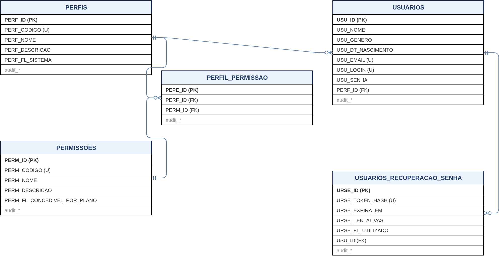
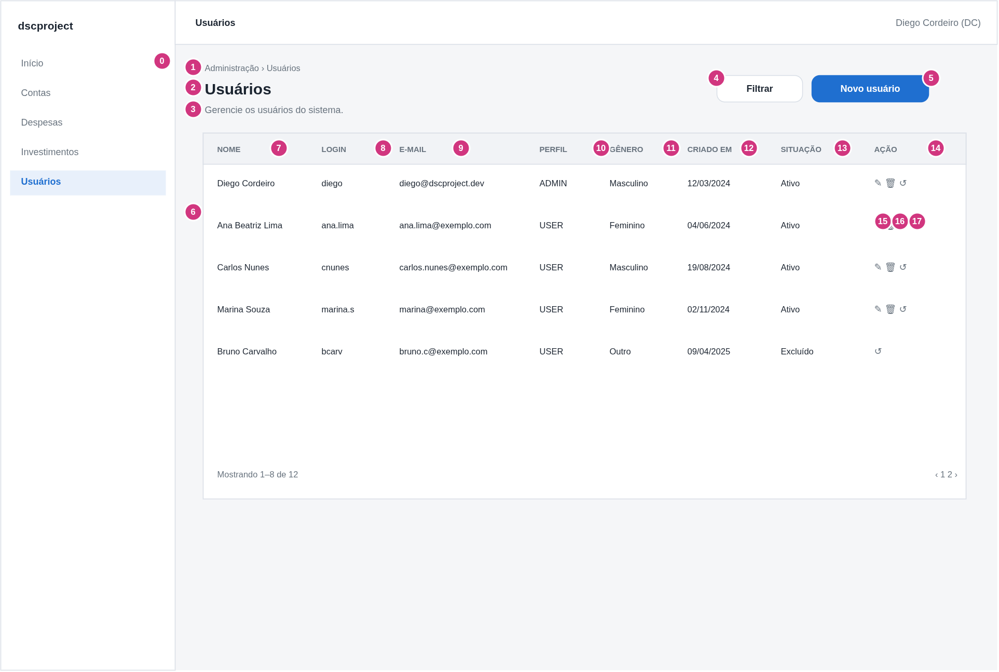
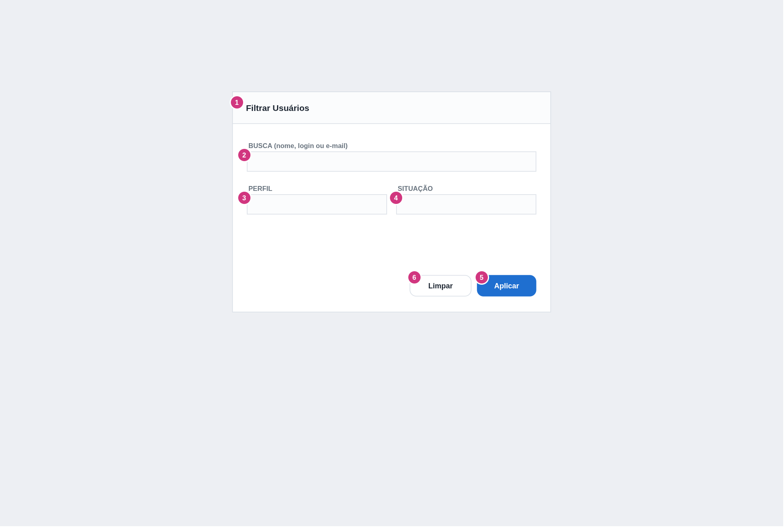
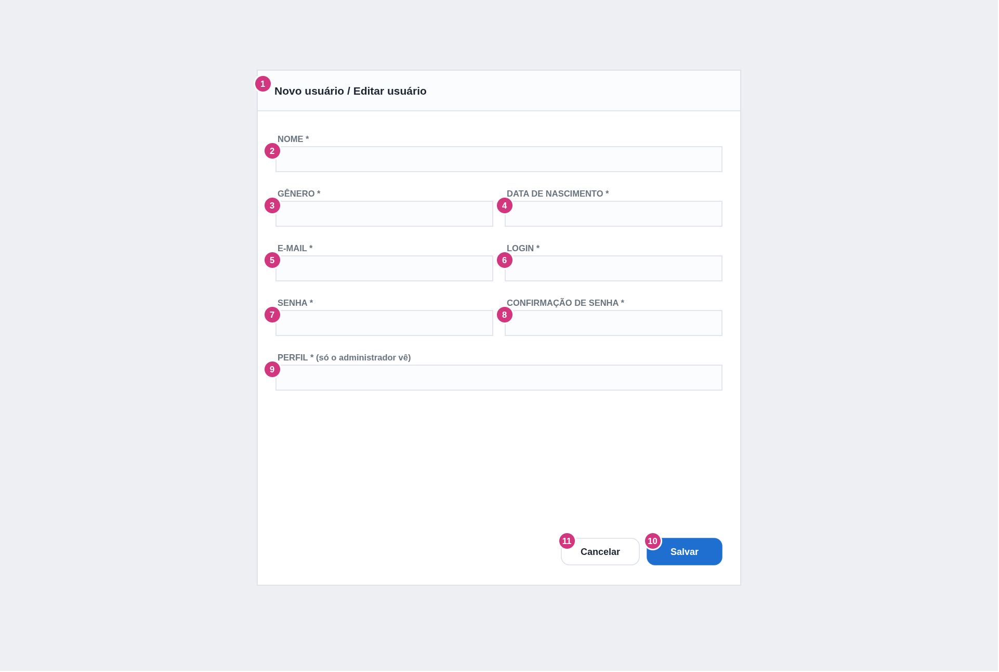
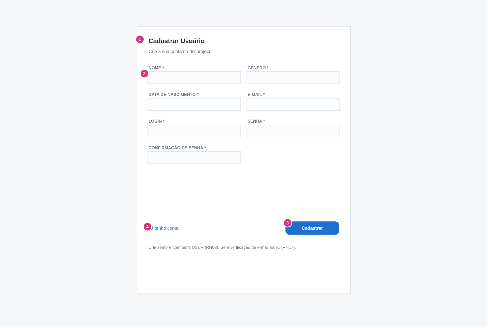
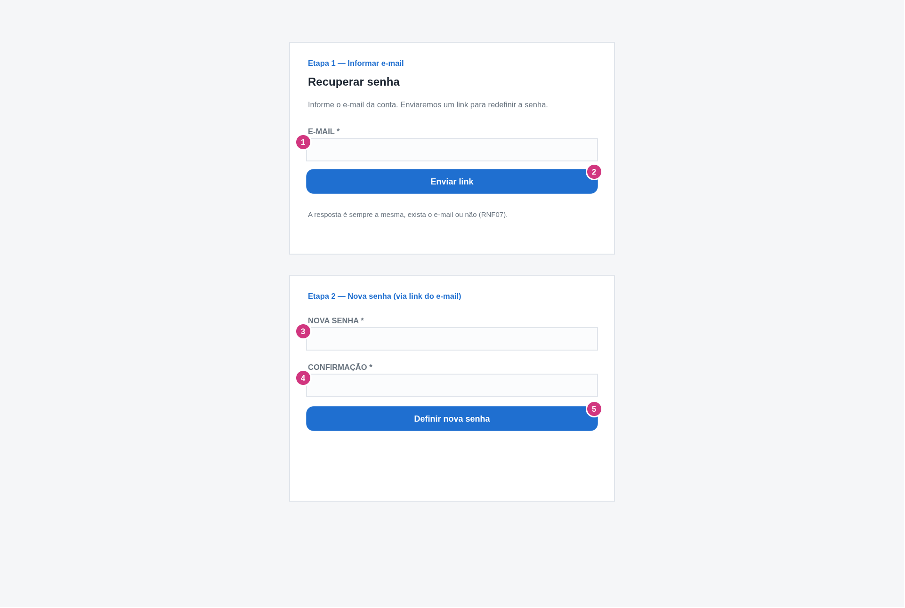

# dscproject — Análise de Sistemas
## Módulo Usuário — ADMIN — Manter Usuário

**Gerado em:** 06/09/2026
**Versão:** 1.3.1
**Projeto:** `dscproject-spring-mvc` (geração 2)

---

## Informações sobre o Documento

| Órgão | dscproject | Setor | Pessoal |
|---|---|---|---|
| Plataforma | dscproject-spring-mvc | Disciplina | Documentação |
| Área Cliente | Diego Cordeiro | Versão do Modelo | 2 (padrão híbrido) |

## Revisões e Aprovações

| Responsável por | Nome | Data de Execução |
|---|---|---|
| Revisão | Diego dos Santos Cordeiro | — |

## Histórico de Versões

| Versão | Data | Analista Responsável | Descrição da Alteração |
|---|---|---|---|
| 1.0 | 06/09/2026 | Diego dos Santos Cordeiro | Criação do documento. Mescla o que existe nas gerações 1 (API REST + Angular) e 2 (Spring MVC) e define o CRUD completo de usuário para a geração 2, incluindo editar e excluir (que não existem em nenhuma geração), RBAC (perfil × permissão) e recuperação de senha por token |
| 1.1 | 06/09/2026 | Diego dos Santos Cordeiro | Fecha os itens "A Confirmar": verificação de e-mail no auto-cadastro **fica fora da v1** ([RN17](#rn17)); limite de recuperação de senha fixado em 3 a cada 15 min ([RN16](#rn16)); consulta [C3](#c3) passa a buscar pelo hash do token. Protótipos de interface incluídos na Seção 7 |
| 1.2 | 07/09/2026 | Diego dos Santos Cordeiro | A permissão única `ADMINISTRAR_USUARIOS` vira cinco, granulares por operação: `USUARIOS_LISTAR`, `USUARIOS_INSERIR`, `USUARIOS_EDITAR`, `USUARIOS_EXCLUIR`, `USUARIOS_VER_HISTORICO` (convenção domínio-primeiro). Nova Seção 13.1 com a matriz Perfil × Permissão. Cada EDP passa a exigir a permissão da sua operação ([RN01](#rn01)) |
| 1.3 | 07/09/2026 | Diego dos Santos Cordeiro | Separa a troca de senha da edição cadastral: [EDP05](#edp05) não altera mais senha; nova ação dedicada no grid ([RT13](#rt13) / [EDP12](#edp12) / [QUADRO_DESCRITIVO_7](#quadro-descritivo-7)). Nova tela **Configurações da Conta** (self-service) — [QUADRO_DESCRITIVO_8](#quadro-descritivo-8), [EDP13](#edp13)/[EDP14](#edp14), [RN18](#rn18)/[RN19](#rn19), [RT14](#rt14) —, em que o usuário edita os próprios dados e a própria senha sem alterar o perfil. Novas [MSG21](#msg21) e [MSG22](#msg22); novos [RF12](#rf12)/[RF13](#rf13), [CAUS09](#caus09)/[CAUS10](#caus10). A Seção 6 (Banco de Dados) permanece inalterada |
| 1.3.1 | 07/09/2026 | Diego dos Santos Cordeiro | Ajustes de revisão: o combobox de PERFIL ([SB01](#sb01), [QUADRO_DESCRITIVO_3](#quadro-descritivo-3) e [_4](#quadro-descritivo-4)) passa a carregar os registros da tabela `PERFIS`, não uma lista fixa. A tela Configurações da Conta ([QUADRO_DESCRITIVO_8](#quadro-descritivo-8)) é acessada ao **clicar no nome do usuário na sidebar**, não por item de menu próprio |

---

## Diretrizes para Elaboração do Documento

| Nº | DIRETRIZ |
|---|---|
| D01 | As responsabilidades de camada são documentadas como **Regra de Tela (RT)** e **Regra de Negócio (RN)** — nunca "o backend deve" / "o frontend deve". |
| D02 | O termo `endpoint` é aceito na Seção 8. Fora dela, "chamada ao serviço". |
| D03 | A estrutura de dados é a do Documento 0 (`00 - analise-geral`). Este documento **referencia** os QUADRO_DESCRITIVO do Documento 0; só descreve por completo a tabela nova que ele introduz (`USUARIOS_RECUPERACAO_SENHA`). |

---

## 1. Introdução

Este documento descreve a funcionalidade **Manter Usuário** do `dscproject-spring-mvc`. É o primeiro documento de tela do sistema — o Documento 0 (`00 - analise-geral`) já definiu toda a estrutura de dados.

O `dscproject` tem hoje duas gerações. O CRUD de usuário **nunca foi concluído** em nenhuma delas:

- **Geração 1** (API REST + SPA Angular): expõe `GET /usuarios` (lista, **e devolve o hash da senha**), o auto-cadastro público (`POST /usuarios/inserir-usuario-site`, com ADMIN definido por comparação de string de login), `GET /usuarios/existe-usuario`, o histórico via Envers e a recuperação de senha em `/auth` (gera senha aleatória e **grava no log** — e-mail desligado). **Não tem editar nem excluir.** O Angular não tem tela de listagem/edição/exclusão de usuário.
- **Geração 2** (Spring MVC + Thymeleaf): a rota `GET /usuarios/listar` existe mas o template está **vazio**. O auto-cadastro (`POST /usuarios/inserir`) funciona por um modal na tela de login, também com ADMIN por string de login (`"dscordeiro86"`). Não tem listar (efetivo), editar, excluir, histórico nem recuperação de senha.

Este documento **mescla as duas gerações** e define, para a geração 2, o CRUD administrativo completo de usuário, com as correções que o levantamento apontou (Seção 2).

**Escopo deste documento:**
- Tela de **listagem** de usuários (grid), restrita a quem tem a permissão [PERM01](#perm01), com filtro por modal.
- **Cadastro e edição** de usuário via modal único (perfil ADMIN). Senha só no cadastro.
- **Alteração de senha de usuário pelo ADMIN** — ação dedicada no grid, separada da edição cadastral.
- **Configurações da Conta** (self-service) — o próprio usuário autenticado, de qualquer perfil, edita seus dados e troca a própria senha.
- **Exclusão lógica** (soft delete) de usuário, com as travas de negócio.
- **Histórico** de alterações do usuário (Hibernate Envers).
- **Auto-cadastro pelo site** (público) — a tela que a geração 2 já tem, revisada.
- **Recuperação de senha** por token enviado ao e-mail (público) — substitui o fluxo da geração 1.
- Definição dos perfis `ADMIN` e `USER` e das permissões que esta tela usa (o RBAC completo é do Documento 0).

**Não contempla:**
- Tela de **editor de perfil × permissão** (`NN - manter-perfil-permissao`) — documento de admin futuro. Aqui, perfis e permissões vêm de carga inicial.
- Login e logout (Spring Security form login) — já implementado.
- Planos pagos e cotas — módulo futuro (`NN - planos-e-assinaturas`); ver Observação 24 do Documento 0.

**Perfis com acesso:** [PERF01](#perf01) (ADMIN) para o CRUD administrativo e a ação de alterar senha de usuário. Auto-cadastro e recuperação de senha são públicos. **Configurações da Conta** é acessível a qualquer usuário autenticado ([PERF01](#perf01) e [PERF02](#perf02)).

---

## 2. Observações

| Nº | OBSERVAÇÃO | REFERÊNCIA / IMPACTO |
|---|---|---|
| 1 | **A senha nunca sai numa listagem ou leitura comum.** A geração 1 devolve o hash BCrypt no `GET /usuarios`. O retorno de [EDP02](#edp02) e [EDP03](#edp03) não inclui a senha em nenhuma hipótese. | [RN03](#rn03) / [RNF02](#rnf02) |
| 2 | **Perfil ADMIN deixa de ser definido por string de login.** Hoje é `login == "chacalsgt"` (geração 1) e `login == "dscordeiro86"` (geração 2). Passa a: a **carga inicial** cria um usuário ADMIN; o auto-cadastro pelo site sempre cria com perfil `USER` ([RN08](#rn08)); a promoção a ADMIN é feita por um ADMIN na tela de edição ([RN09](#rn09)). | [RN08](#rn08), [RN09](#rn09) |
| 3 | **RBAC.** O perfil do usuário é uma FK para `PERFIS` (Documento 0, [QUADRO_DESCRITIVO_25](../00%20-%20analise-geral/documento-0-fundacao.md#quadro-descritivo-25)). `getAuthorities()` do `Usuario` resolve: perfil → permissões vinculadas em `PERFIL_PERMISSAO` → autoridade `PERM_{CODIGO}` de cada uma, mais `ROLE_{PERF_CODIGO}`. **[Requer código]** | [RN01](#rn01) |
| 4 | **Autorização por rota.** A geração 2 hoje não distingue ADMIN de USER — qualquer autenticado acessa tudo. Cada endpoint do CRUD administrativo passa a exigir a autoridade da **sua operação** (`PERM_USUARIOS_LISTAR`, `PERM_USUARIOS_INSERIR`, `PERM_USUARIOS_EDITAR`, `PERM_USUARIOS_EXCLUIR`, `PERM_USUARIOS_VER_HISTORICO` — ver Seção 13 e o mapa em [RN01](#rn01)). Auto-cadastro, `existe-usuario`, `recuperar-senha` e `login` permanecem públicos. | [RN01](#rn01) / [RNF01](#rnf01) |
| 5 | **Exclusão é lógica** (`audit_data_exclusao` / `audit_excluido_por`), nunca física. Não é permitido excluir a si mesmo ([RN10](#rn10)) nem o último usuário ADMIN ativo ([RN11](#rn11)). O usuário excluído não consegue autenticar ([RN12](#rn12)). | [RN10](#rn10), [RN11](#rn11), [RN12](#rn12) |
| 6 | **`nascimento` é obrigatório.** A geração 2 já exige; a geração 1 não tinha o campo. Fica obrigatório. | [RT07](#rt07) |
| 7 | **Confirmação de senha** existe só na geração 2 (campo `confirmacaoSenha`, não persistido). Mantida no cadastro e na troca de senha. | [RT08](#rt08) |
| 8 | **Recuperação de senha por token.** Substitui o fluxo da geração 1 (senha aleatória gravada no log). Nova tabela `USUARIOS_RECUPERACAO_SENHA` ([QUADRO_DESCRITIVO_1](#quadro-descritivo-1)): guarda o **hash** de um token de uso único, com validade e limite de tentativas. O e-mail reutiliza o `spring-boot-starter-mail` já configurado. **[Requer código]** | [RN13](#rn13)–[RN16](#rn16) |
| 9 | **Verificação de e-mail no auto-cadastro — decidido: não na v1.** O auto-cadastro cria o usuário ativo, que já pode entrar. A verificação por link é um incremento futuro, provavelmente junto com o módulo de planos pagos (que trará a coluna e o fluxo). O parâmetro `USU_VERIFICACAO_EMAIL_ATIVA` fica reservado, com valor `false`. | [RN17](#rn17) |
| 10 | **`existe-usuario` é público** e funciona como oráculo de enumeração de login/e-mail. Mantido (a geração 1 e 2 dependem dele no cadastro), com ciência do risco. Alternativa futura: mover a checagem para dentro do submit. | [EDP07](#edp07) |
| 11 | **Gênero** continua enum de 1 caractere (`Genero` — F/M/O), gravado direto na coluna `USU_GENERO CHAR(1)`, conforme o Documento 0. | Documento 0, Seção 7.3 |
| 12 | O grid é **client-side** (carrega a lista completa uma vez e pagina/ordena no navegador com DataTables). O sistema é pessoal, com poucos usuários; paginação server-side seria complexidade sem ganho. | [EDP02](#edp02) / [RNF03](#rnf03) |
| 13 | **Auditoria.** `USUARIOS`, `PERFIS`, `PERMISSOES`, `PERFIL_PERMISSAO` e `USUARIOS_RECUPERACAO_SENHA` são auditadas via Hibernate Envers (`@Audited`), conforme o Documento 0. | [RNF04](#rnf04) |
| 14 | **Campos residuais no front da geração 1.** `usuario.model.ts` carrega `valorDividido`, `statusPagamento` e `logado` — resquício do rateio de despesa. Não fazem parte do usuário; são ignorados neste documento. | — |
| 15 | **Troca de senha fora da edição cadastral.** A edição administrativa ([EDP05](#edp05)) deixa de aceitar senha. A troca da senha de outro usuário passa a ser uma ação dedicada no grid ([RT13](#rt13)); a troca da própria senha fica em Configurações da Conta ([EDP14](#edp14)). Decisão de estrutura: mantém-se um único [QUADRO_DESCRITIVO_4](#quadro-descritivo-4), com Senha e Confirmação exibidos **apenas no modo criação** — mais enxuto que dois quadros. | [RN07](#rn07), [RN18](#rn18) |
| 16 | **Configurações da Conta (self-service).** Nova tela para o próprio usuário autenticado editar seus dados e senha, cobrindo o que a Seção 1 listava como "Tela Meu Perfil — documento futuro". O id é sempre do contexto de segurança, nunca da requisição; o perfil é imutável na tela; não há permissão específica. | [RN19](#rn19) |

---

## 3. Requisitos

### 3.1 Requisitos Funcionais

| ID | DESCRIÇÃO | PRIORIDADE | SITUAÇÃO |
|---|---|---|---|
| <a id="rf01"></a>RF01 | O sistema deve exibir a quem tem a permissão [PERM01](#perm01) uma tela listando os usuários cadastrados, com as colunas: Nome, Login, E-mail, Perfil, Gênero, Criado em e Situação. | Alta | Em análise |
| <a id="rf02"></a>RF02 | O sistema deve permitir filtrar a listagem por texto (nome/login/e-mail), Perfil e Situação (Ativo/Excluído/Todos), por meio de um modal acionado pelo botão "Filtrar". | Alta | Em análise |
| <a id="rf03"></a>RF03 | O sistema deve permitir cadastrar um novo usuário via modal (perfil ADMIN), com os campos: Nome, Gênero, Data de nascimento, E-mail, Login, Senha, Confirmação de senha e Perfil. A senha inicial é obrigatória no cadastro. | Alta | Em análise |
| <a id="rf04"></a>RF04 | O sistema deve permitir editar um usuário existente via modal, com os campos Nome, Gênero, Data de nascimento, E-mail, Login e Perfil. A edição administrativa **não** altera a senha — a troca de senha de outro usuário é feita por ação dedicada ([RF12](#rf12)). | Alta | Em análise |
| <a id="rf05"></a>RF05 | O sistema deve impedir o cadastro ou a alteração de um usuário com login ou e-mail já em uso por outro usuário. | Alta | Em análise |
| <a id="rf06"></a>RF06 | O sistema deve permitir a exclusão lógica de um usuário, impedindo a exclusão do próprio usuário logado e do último ADMIN ativo. | Alta | Em análise |
| <a id="rf07"></a>RF07 | O sistema deve exibir o histórico de alterações de um usuário (criação, edições, exclusão), sem exibir a senha em nenhuma revisão. | Média | Em análise |
| <a id="rf08"></a>RF08 | O sistema deve disponibilizar uma tela pública de auto-cadastro, que cria o usuário sempre com o perfil `USER`. | Alta | Em análise |
| <a id="rf09"></a>RF09 | O sistema deve disponibilizar um fluxo público de recuperação de senha: o usuário informa o e-mail, recebe um link com token de uso único e define uma nova senha. | Alta | Em análise |
| <a id="rf10"></a>RF10 | O sistema deve derivar as autoridades do usuário do seu perfil e das permissões vinculadas ao perfil (RBAC), restringindo **cada operação** do CRUD administrativo à sua permissão ([PERM01](#perm01)–[PERM05](#perm05)). | Alta | Em análise |
| <a id="rf11"></a>RF11 | O sistema deve armazenar a senha com hash BCrypt e nunca devolvê-la (nem o hash) em resposta de listagem, edição ou histórico. | Alta | Em análise |
| <a id="rf12"></a>RF12 | O sistema deve permitir ao ADMIN alterar a senha de um usuário por uma ação dedicada no grid, separada da edição cadastral, exigindo a confirmação da nova senha e sem alterar nenhum outro dado do usuário. | Alta | Em análise |
| <a id="rf13"></a>RF13 | O sistema deve disponibilizar a qualquer usuário autenticado a tela Configurações da Conta, onde ele edita os próprios dados (Nome, Gênero, Data de nascimento, E-mail, Login) e, opcionalmente, troca a própria senha, sem poder alterar o próprio perfil. | Alta | Em análise |

### 3.2 Requisitos Não Funcionais

| ID | CATEGORIA | DESCRIÇÃO | CRITÉRIO DE ACEITAÇÃO |
|---|---|---|---|
| <a id="rnf01"></a>RNF01 | Segurança | Cada endpoint do CRUD administrativo deve exigir a autoridade da sua operação (`PERM_USUARIOS_*`, conforme a Seção 13 e [RN01](#rn01)). Nenhum usuário sem a permissão correspondente obtém resposta de sucesso. | Teste de acesso com ADMIN, com USER e com um perfil que tenha só parte das permissões. |
| <a id="rnf02"></a>RNF02 | Segurança | A senha (e o hash) nunca aparece em resposta de [EDP02](#edp02), [EDP03](#edp03) ou [EDP08](#edp08), nem em log. | Inspeção das respostas e dos logs após operações de CRUD. |
| <a id="rnf03"></a>RNF03 | Desempenho | A listagem ([EDP02](#edp02)) responde em menos de 1 s para a base esperada (dezenas de usuários), carregando a lista completa uma vez. | Medição em ambiente de homologação. |
| <a id="rnf04"></a>RNF04 | Auditoria | `USUARIOS`, `PERFIS`, `PERMISSOES`, `PERFIL_PERMISSAO` e `USUARIOS_RECUPERACAO_SENHA` têm auditoria completa via Hibernate Envers. | Inspeção das tabelas `_aud` após CRUD. |
| <a id="rnf05"></a>RNF05 | Segurança | O token de recuperação de senha é gravado apenas como hash, com validade de 30 minutos e no máximo 5 tentativas de uso. | Teste do fluxo com token válido, inválido, expirado e acima do limite. |
| <a id="rnf06"></a>RNF06 | Usabilidade | A interface segue o padrão do projeto (Thymeleaf + Tabler + DataTables + AJAX) e é responsiva. | Revisão visual. |
| <a id="rnf07"></a>RNF07 | Segurança | O fluxo de recuperação de senha responde a mesma mensagem quer o e-mail exista ou não ([MSG15](#msg15)), para não confirmar a existência de contas. | Teste com e-mail existente e inexistente. |

---

## 4. Casos de Uso

[Inserir diagrama de casos de uso — `manter-usuario-casos-uso.drawio` quando gerado.]

| CÓDIGO | NOME | ATOR PRINCIPAL | DESCRIÇÃO |
|---|---|---|---|
| <a id="caus01"></a>CAUS01 | Listar Usuários | [PERF01](#perf01) | ADMIN acessa o menu e visualiza a lista de usuários. ([RF01](#rf01)) |
| <a id="caus02"></a>CAUS02 | Filtrar Usuários | [PERF01](#perf01) | ADMIN abre o modal de filtro, informa texto, perfil e/ou situação e aplica. ([RF02](#rf02)) |
| <a id="caus03"></a>CAUS03 | Cadastrar Usuário | [PERF01](#perf01) | ADMIN abre o modal de cadastro, preenche os dados e confirma. ([RF03](#rf03), [RF05](#rf05)) |
| <a id="caus04"></a>CAUS04 | Editar Usuário | [PERF01](#perf01) | ADMIN abre o modal de edição de um usuário, altera os dados (opcionalmente a senha) e confirma. ([RF04](#rf04), [RF05](#rf05)) |
| <a id="caus05"></a>CAUS05 | Excluir Usuário | [PERF01](#perf01) | ADMIN exclui logicamente um usuário, respeitando as travas. ([RF06](#rf06)) |
| <a id="caus06"></a>CAUS06 | Ver Histórico do Usuário | [PERF01](#perf01) | ADMIN abre o histórico de alterações de um usuário. ([RF07](#rf07)) |
| <a id="caus07"></a>CAUS07 | Auto-cadastrar-se | Visitante | Visitante preenche o formulário público e cria a própria conta com perfil USER. ([RF08](#rf08)) |
| <a id="caus08"></a>CAUS08 | Recuperar Senha | Visitante | Visitante informa o e-mail, recebe o link com token e define nova senha. ([RF09](#rf09)) |
| <a id="caus09"></a>CAUS09 | Alterar Senha de Usuário | [PERF01](#perf01) | ADMIN altera a senha de um usuário pela ação dedicada do grid, sem passar pela edição cadastral. ([RF12](#rf12)) |
| <a id="caus10"></a>CAUS10 | Gerir a Própria Conta | [PERF01](#perf01), [PERF02](#perf02) | Usuário autenticado edita os próprios dados e, opcionalmente, troca a própria senha em Configurações da Conta. ([RF13](#rf13)) |

---

## 5. Localização / Critérios de Aceitação

**Caminho de Navegação:**
- Menu principal > Administração > Usuários (CRUD administrativo)
- Clicar no nome do usuário na sidebar → `/minha-conta` (Configurações da Conta; disponível a qualquer usuário autenticado — ADMIN e USER)

**Critérios de Aceitação:**
- O menu 'Usuários' é visível apenas para quem tem [PERM01](#perm01).
- Ao acessar a tela, a listagem é carregada automaticamente.
- O filtro é aplicado por um modal acionado pelo botão "Filtrar".
- O cadastro e a edição são feitos num modal único; Senha e Confirmação só aparecem no modo criação.
- A troca de senha de um usuário é uma ação dedicada do grid, que não altera nenhum outro dado.
- Em Configurações da Conta o usuário altera apenas o próprio registro e não vê o campo Perfil.
- Não é permitido cadastrar dois usuários com o mesmo login ou e-mail.
- Não é permitido excluir a si mesmo nem o último ADMIN ativo.
- A senha nunca é exibida (nem o hash) na listagem, edição ou histórico.
- O auto-cadastro cria sempre com perfil USER.
- A recuperação de senha usa token de uso único enviado por e-mail; a resposta não revela se o e-mail existe.

---

## 6. Banco de Dados

Toda a estrutura de `USUARIOS` e do RBAC está no **Documento 0** (`00 - analise-geral`):

| Tabela | Onde | Observação |
|---|---|---|
| `USUARIOS` | Documento 0 — [QUADRO_DESCRITIVO_2](../00%20-%20analise-geral/documento-0-fundacao.md#quadro-descritivo-2) | `USU_PERFIL` (enum) já virou `PERF_ID` (FK) na v1.2 do Documento 0 |
| `PERFIS` | Documento 0 — [QUADRO_DESCRITIVO_25](../00%20-%20analise-geral/documento-0-fundacao.md#quadro-descritivo-25) | Carga inicial: `ADMIN`, `USER` |
| `PERMISSOES` | Documento 0 — [QUADRO_DESCRITIVO_26](../00%20-%20analise-geral/documento-0-fundacao.md#quadro-descritivo-26) | Carga inicial: as 5 permissões do módulo Usuários (Seção 13), módulo `Usuários` |
| `PERFIL_PERMISSAO` | Documento 0 — [QUADRO_DESCRITIVO_27](../00%20-%20analise-geral/documento-0-fundacao.md#quadro-descritivo-27) | Carga inicial: `ADMIN` recebe as 5; `USER`, nenhuma (Seção 13.1) |

Este documento **introduz uma tabela nova**: `USUARIOS_RECUPERACAO_SENHA`. Segue o padrão `AbstractAuditoria` do Documento 0 (6 campos `audit_*`).

### <a id="quadro-descritivo-1"></a>QUADRO_DESCRITIVO_1 — USUARIOS_RECUPERACAO_SENHA

> **TABELA DO BANCO DE DADOS:** USUARIOS_RECUPERACAO_SENHA
> OBSERVAÇÕES: Tabela auxiliar do fluxo de recuperação de senha. Guarda o hash de um token de uso único enviado ao e-mail do usuário. O token nunca é gravado em claro. Registros expirados/utilizados são mantidos para auditoria.

| ID | NOME | PROPRIEDADES | OBSERVAÇÕES |
|---|---|---|---|
| <a id="qdd1-1"></a>1 | IDENTIFICADOR | Campo: URSE_ID<br>Tipo: BIGINT<br>Obrigatório: SIM<br>Chave: PK<br>Auto incremento: SIM | NOVO |
| <a id="qdd1-2"></a>2 | TOKEN HASH | Campo: URSE_TOKEN_HASH<br>Tipo: VARCHAR(255)<br>Obrigatório: SIM<br>Único: SIM | NOVO. Hash do token enviado no link (nunca o token em claro). |
| <a id="qdd1-3"></a>3 | EXPIRA EM | Campo: URSE_EXPIRA_EM<br>Tipo: DATETIME(6)<br>Obrigatório: SIM | NOVO. Instante de expiração (solicitação + 30 min). |
| <a id="qdd1-4"></a>4 | TENTATIVAS | Campo: URSE_TENTATIVAS<br>Tipo: SMALLINT<br>Obrigatório: SIM<br>Default: 0 | NOVO. Ao atingir o limite (5), o token é invalidado. |
| <a id="qdd1-5"></a>5 | UTILIZADO | Campo: URSE_FL_UTILIZADO<br>Tipo: BOOLEAN<br>Obrigatório: SIM<br>Default: FALSE | NOVO. Marca o token como consumido (impede reuso). |
| <a id="qdd1-6"></a>6 | USUÁRIO | Campo: USU_ID<br>Tipo: BIGINT<br>Obrigatório: SIM<br>Chave: FK → USUARIOS (USU_ID) | NOVO |
| <a id="qdd1-7"></a>7-12 | AUDITORIA | Ver Documento 0, [QUADRO_DESCRITIVO_1](../00%20-%20analise-geral/documento-0-fundacao.md#quadro-descritivo-1) | NOVO |

> **ALTERAÇÃO NA ESTRUTURA DO BANCO DE DADOS**

```sql
-- DDL_1
CREATE TABLE USUARIOS_RECUPERACAO_SENHA (
    URSE_ID             BIGINT          NOT NULL AUTO_INCREMENT,
    URSE_TOKEN_HASH     VARCHAR(255)    NOT NULL,
    URSE_EXPIRA_EM      DATETIME(6)     NOT NULL,
    URSE_TENTATIVAS     SMALLINT        NOT NULL DEFAULT 0,
    URSE_FL_UTILIZADO   BOOLEAN         NOT NULL DEFAULT FALSE,
    USU_ID              BIGINT          NOT NULL,
    audit_data_criacao      DATETIME(6)     NOT NULL DEFAULT CURRENT_TIMESTAMP(6),
    audit_criado_por        VARCHAR(400)    NOT NULL,
    audit_data_alteracao    DATETIME(6)     NULL,
    audit_alterado_por      VARCHAR(400)    NULL,
    audit_data_exclusao     DATETIME(6)     NULL,
    audit_excluido_por      VARCHAR(400)    NULL,
    CONSTRAINT pk_usuarios_recuperacao_senha        PRIMARY KEY (URSE_ID),
    CONSTRAINT uq_usuarios_recuperacao_senha_token  UNIQUE (URSE_TOKEN_HASH),
    CONSTRAINT fk_usuarios_recuperacao_senha_usu    FOREIGN KEY (USU_ID) REFERENCES USUARIOS (USU_ID)
) ENGINE = InnoDB DEFAULT CHARSET = utf8mb4;

CREATE INDEX idx_usuarios_recuperacao_senha_usu ON USUARIOS_RECUPERACAO_SENHA (USU_ID);
```

> Este acréscimo deve ser absorvido pelo Documento 0 (próxima revisão) — nova tabela, ordem de criação **depois de `USUARIOS`**.

### 6.1 Diagrama ER



Subconjunto do DER do Documento 0 pertinente a esta tela. Fonte: `prototipo/manter-usuario-der.drawio`.

### 6.2 Auditoria de Tabelas

| TABELA PRINCIPAL | TABELA DE AUDITORIA | CAMPOS AUDITADOS |
|---|---|---|
| USUARIOS | USUARIOS_aud | Nome, gênero, nascimento, e-mail, login, senha (o **hash**; nunca exibido nas telas de histórico), perfil |
| USUARIOS_RECUPERACAO_SENHA | USUARIOS_RECUPERACAO_SENHA_aud | Todos os campos, exceto o token em claro (guarda-se apenas o hash). Registra criação, incremento de tentativas e consumo |

### 6.3 Procedures / Views / Triggers / Functions

Nenhuma. Hash de senha, geração/validação do token de recuperação e resolução das autoridades ficam na camada de serviço.

---

## 7. Protótipos de Interface

Protótipo navegável (HTML): `prototipo/manter-usuario-prototipo.html`. Wireframes abaixo: `prototipo/manter-usuario-prototipo.drawio`. Os números em destaque nas telas correspondem aos IDs dos itens do respectivo QUADRO_DESCRITIVO.

### <a id="quadro-descritivo-2"></a>7.1 Tela: Usuários (Listagem) — QUADRO_DESCRITIVO_2



> OBSERVAÇÕES: Tela acessada via 'Administração > Usuários'. Restrita a quem tem [PERM01](#perm01). O filtro é acionado por um modal (botão "Filtrar"). A senha nunca aparece.

| ID | NOME | PROPRIEDADES | OBSERVAÇÕES |
|---|---|---|---|
| <a id="qdd2-0"></a>0 | LINK | Caminho: "/usuarios/listar" | — |
| <a id="qdd2-1"></a>1 | BREADCRUMB | Tipo: Texto<br>Texto: Administração > Usuários | — |
| <a id="qdd2-2"></a>2 | TÍTULO DA TELA | Tipo: Texto<br>Texto: Usuários | — |
| <a id="qdd2-3"></a>3 | DESCRIÇÃO | Tipo: Texto<br>Texto: Gerencie os usuários do sistema. | — |
| <a id="qdd2-4"></a>4 | BOTÃO FILTRAR | Tipo: Botão<br>Texto: Filtrar<br>Ícone: filter | Ao clicar, executar [RT01](#rt01). |
| <a id="qdd2-5"></a>5 | BOTÃO NOVO USUÁRIO | Tipo: Botão<br>Texto: Novo usuário<br>Ícone: plus | Visível a quem tem [PERM02](#perm02). Ao clicar, executar [RT04](#rt04). |
| <a id="qdd2-6"></a>6 | GRID DE LISTAGEM | Tipo: Grid (DataTables, client-side)<br>Colunas: [ID7](#qdd2-7)…[ID13](#qdd2-13)<br>Paginação: no navegador<br>Itens por página: 10, 25, 50<br>Ordenação padrão: Nome crescente<br>Endpoint: [EDP02](#edp02) | Carrega a lista completa uma vez. Filtra em memória conforme [RT02](#rt02). |
| <a id="qdd2-7"></a>7 | NOME | Tipo: Coluna<br>Ordenação: Sim | Exibe [C1](#c1).nome. |
| <a id="qdd2-8"></a>8 | LOGIN | Tipo: Coluna<br>Ordenação: Sim | Exibe [C1](#c1).login. |
| <a id="qdd2-9"></a>9 | E-MAIL | Tipo: Coluna<br>Ordenação: Sim | Exibe [C1](#c1).email. |
| <a id="qdd2-10"></a>10 | PERFIL | Tipo: Coluna (badge)<br>Ordenação: Sim | Exibe [C1](#c1).perfilNome. |
| <a id="qdd2-11"></a>11 | GÊNERO | Tipo: Coluna<br>Ordenação: Não | Exibe a descrição do gênero (Feminino/Masculino/Outro). |
| <a id="qdd2-12"></a>12 | CRIADO EM | Tipo: Coluna (data)<br>Ordenação: Sim | Exibe [C1](#c1).criadoEm formatado dd/MM/yyyy. |
| <a id="qdd2-13"></a>13 | SITUAÇÃO | Tipo: Coluna (badge)<br>Ordenação: Sim | Ativo (verde) quando `audit_data_exclusao` é nulo; Excluído (cinza) caso contrário. |
| <a id="qdd2-14"></a>14 | AÇÃO | Tipo: Coluna | Ícones [ID15](#qdd2-15), [ID16](#qdd2-16), [ID17](#qdd2-17), [ID18](#qdd2-18). |
| <a id="qdd2-15"></a>15 | ÍCONE EDITAR | Tipo: Ícone<br>Ícone: edit<br>Tooltip: Editar usuário | Visível a quem tem [PERM03](#perm03). Ao clicar, executar [RT05](#rt05). Oculto para usuários excluídos. |
| <a id="qdd2-16"></a>16 | ÍCONE EXCLUIR | Tipo: Ícone<br>Ícone: trash<br>Tooltip: Excluir usuário | Visível a quem tem [PERM04](#perm04). Ao clicar, executar [RT09](#rt09). Oculto para o próprio usuário logado e para usuários já excluídos. |
| <a id="qdd2-17"></a>17 | ÍCONE HISTÓRICO | Tipo: Ícone<br>Ícone: history<br>Tooltip: Ver histórico | Visível a quem tem [PERM05](#perm05). Ao clicar, executar [RT10](#rt10). |
| <a id="qdd2-18"></a>18 | ÍCONE ALTERAR SENHA | Tipo: Ícone<br>Ícone: key<br>Tooltip: Alterar senha | Visível a quem tem [PERM03](#perm03). Ao clicar, executar [RT13](#rt13). Oculto para usuários excluídos. |

### <a id="quadro-descritivo-3"></a>7.2 Modal: Filtrar Usuários — QUADRO_DESCRITIVO_3



> OBSERVAÇÕES: Todos os campos são opcionais. O filtro é aplicado em memória sobre a lista já carregada ([RT02](#rt02)).

| ID | NOME | PROPRIEDADES | OBSERVAÇÕES |
|---|---|---|---|
| <a id="qdd3-1"></a>1 | TÍTULO DO MODAL | Tipo: Texto<br>Texto: Filtrar Usuários | — |
| <a id="qdd3-2"></a>2 | FILTRO – BUSCA | Tipo: Input Text<br>Obrigatório: Não<br>Placeholder: Nome, login ou e-mail<br>Tooltip: Filtre por parte do nome, do login ou do e-mail. | Filtro parcial e sem acento sobre nome, login e e-mail. |
| <a id="qdd3-3"></a>3 | FILTRO – PERFIL | Tipo: Combobox<br>Obrigatório: Não<br>Placeholder: Todos<br>Domínio: "Todos" + os perfis da tabela `PERFIS` | Filtra por [C1](#c1).perfilCodigo. Ver [SB01](#sb01). |
| <a id="qdd3-4"></a>4 | FILTRO – SITUAÇÃO | Tipo: Combobox<br>Obrigatório: Não<br>Valor default: Ativo<br>Domínio: Ativo / Excluído / Todos | Filtra pela presença de `audit_data_exclusao`. Ver [SB02](#sb02). |
| <a id="qdd3-5"></a>5 | BOTÃO APLICAR | Tipo: Botão<br>Texto: Aplicar | Ao clicar, executar [RT02](#rt02). |
| <a id="qdd3-6"></a>6 | BOTÃO LIMPAR | Tipo: Botão<br>Texto: Limpar | Ao clicar, executar [RT03](#rt03). |

### <a id="quadro-descritivo-4"></a>7.3 Modal: Cadastro / Edição de Usuário — QUADRO_DESCRITIVO_4



> OBSERVAÇÕES: Modal único de cadastro e edição — aberto por [PERM02](#perm02) (criação) ou [PERM03](#perm03) (edição). Os campos Senha ([ID7](#qdd4-7)) e Confirmação de senha ([ID8](#qdd4-8)) aparecem **apenas no modo criação**; na edição o modal não os exibe e a troca de senha é feita pela ação dedicada do grid ([RT13](#rt13)). O campo Perfil só aparece para quem pode definir perfil ([RN09](#rn09)) — no auto-cadastro público ([QUADRO_DESCRITIVO_5](#quadro-descritivo-5)) ele não existe.

| ID | NOME | PROPRIEDADES | OBSERVAÇÕES |
|---|---|---|---|
| <a id="qdd4-1"></a>1 | TÍTULO DO MODAL | Tipo: Texto<br>Texto: Novo usuário / Editar usuário | Varia conforme o modo. |
| <a id="qdd4-2"></a>2 | CAMPO – NOME | Tipo: Input Text<br>Tamanho: 100<br>Obrigatório: Sim | Grava em `USU_NOME`. |
| <a id="qdd4-3"></a>3 | CAMPO – GÊNERO | Tipo: Combobox<br>Obrigatório: Sim<br>Domínio: Feminino / Masculino / Outro | Grava em `USU_GENERO` (F/M/O). |
| <a id="qdd4-4"></a>4 | CAMPO – DATA DE NASCIMENTO | Tipo: Input Date<br>Obrigatório: Sim | Grava em `USU_DT_NASCIMENTO`. Executar [RT07](#rt07). |
| <a id="qdd4-5"></a>5 | CAMPO – E-MAIL | Tipo: Input Email<br>Tamanho: 512<br>Obrigatório: Sim | Grava em `USU_EMAIL`. Único ([RN04](#rn04)). Executar [RT06](#rt06). |
| <a id="qdd4-6"></a>6 | CAMPO – LOGIN | Tipo: Input Text<br>Tamanho: 40<br>Mín.: 4<br>Obrigatório: Sim | Grava em `USU_LOGIN`. Único ([RN04](#rn04)). Executar [RT06](#rt06). |
| <a id="qdd4-7"></a>7 | CAMPO – SENHA | Tipo: Input Password<br>Mín.: 6<br>Obrigatório: Sim<br>Exibição: só no modo criação | Cifra BCrypt no serviço ([RN02](#rn02)). |
| <a id="qdd4-8"></a>8 | CAMPO – CONFIRMAÇÃO DE SENHA | Tipo: Input Password<br>Obrigatório: Sim<br>Exibição: só no modo criação | Executar [RT08](#rt08). Não persiste. |
| <a id="qdd4-9"></a>9 | CAMPO – PERFIL | Tipo: Combobox<br>Obrigatório: Sim<br>Domínio: perfis da tabela `PERFIS` | Grava `PERF_ID`. Só visível para quem pode definir perfil. Executar [RN09](#rn09). |
| <a id="qdd4-10"></a>10 | BOTÃO SALVAR | Tipo: Botão<br>Texto: Salvar<br>Endpoint: [EDP04](#edp04) (criação) ou [EDP05](#edp05) (edição) | Ao clicar, executar [RT08](#rt08). |
| <a id="qdd4-11"></a>11 | BOTÃO CANCELAR | Tipo: Botão<br>Texto: Cancelar | Fecha sem salvar. |

### <a id="quadro-descritivo-5"></a>7.4 Tela: Auto-cadastro (pública) — QUADRO_DESCRITIVO_5



> OBSERVAÇÕES: Tela pública, acionada pelo link "Cadastre-se" na tela de login. Cria sempre com perfil `USER` ([RN08](#rn08)). Mesmos campos do [QUADRO_DESCRITIVO_4](#quadro-descritivo-4), **sem** o campo Perfil.

| ID | NOME | PROPRIEDADES | OBSERVAÇÕES |
|---|---|---|---|
| <a id="qdd5-1"></a>1 | TÍTULO | Tipo: Texto<br>Texto: Cadastrar Usuário | — |
| <a id="qdd5-2"></a>2 | CAMPOS | Nome, Gênero, Data de nascimento, E-mail, Login, Senha, Confirmação de senha | Mesmas regras dos IDs 2–8 do [QUADRO_DESCRITIVO_4](#quadro-descritivo-4). |
| <a id="qdd5-3"></a>3 | BOTÃO CADASTRAR | Tipo: Botão<br>Texto: Cadastrar<br>Endpoint: [EDP09](#edp09) | Ao clicar, executar [RT08](#rt08) (sem o campo Perfil). Em sucesso, exibir [MSG01](#msg01); o usuário já pode entrar. |
| <a id="qdd5-4"></a>4 | LINK – JÁ TENHO CONTA | Tipo: Link<br>Texto: Já tenho conta | Volta para a tela de login. |

### <a id="quadro-descritivo-6"></a>7.5 Tela: Recuperar Senha (pública) — QUADRO_DESCRITIVO_6



> OBSERVAÇÕES: Fluxo em duas etapas. Etapa 1: informar o e-mail. Etapa 2 (via link do e-mail): definir a nova senha. A resposta da etapa 1 é sempre a mesma ([MSG15](#msg15)), independentemente de o e-mail existir ([RNF07](#rnf07)).

| ID | NOME | PROPRIEDADES | OBSERVAÇÕES |
|---|---|---|---|
| <a id="qdd6-1"></a>1 | CAMPO – E-MAIL (etapa 1) | Tipo: Input Email<br>Obrigatório: Sim | Enviado a [EDP10](#edp10). |
| <a id="qdd6-2"></a>2 | BOTÃO ENVIAR LINK (etapa 1) | Tipo: Botão<br>Texto: Enviar link<br>Endpoint: [EDP10](#edp10) | Ao clicar, executar [RT11](#rt11). |
| <a id="qdd6-3"></a>3 | CAMPO – NOVA SENHA (etapa 2) | Tipo: Input Password<br>Mín.: 6<br>Obrigatório: Sim | — |
| <a id="qdd6-4"></a>4 | CAMPO – CONFIRMAÇÃO (etapa 2) | Tipo: Input Password<br>Obrigatório: Sim | Executar [RT08](#rt08). |
| <a id="qdd6-5"></a>5 | BOTÃO DEFINIR SENHA (etapa 2) | Tipo: Botão<br>Texto: Definir nova senha<br>Endpoint: [EDP11](#edp11) | Ao clicar, executar [RT12](#rt12). |

### <a id="quadro-descritivo-7"></a>7.6 Modal: Alterar Senha do Usuário — QUADRO_DESCRITIVO_7

> OBSERVAÇÕES: Aberto pela ação "Alterar senha" do grid ([ID18](#qdd2-18)), restrita a [PERM03](#perm03). O título exibe o nome do usuário-alvo. Não altera nenhum outro dado do usuário ([RN18](#rn18)).

| ID | NOME | PROPRIEDADES | OBSERVAÇÕES |
|---|---|---|---|
| <a id="qdd7-1"></a>1 | TÍTULO DO MODAL | Tipo: Texto<br>Texto: Alterar senha de "{nome}" | Nome do usuário-alvo. |
| <a id="qdd7-2"></a>2 | CAMPO – NOVA SENHA | Tipo: Input Password<br>Mín.: 6<br>Obrigatório: Sim | Cifra BCrypt no serviço ([RN02](#rn02)). |
| <a id="qdd7-3"></a>3 | CAMPO – CONFIRMAÇÃO DE NOVA SENHA | Tipo: Input Password<br>Obrigatório: Sim | Executar [RT13](#rt13). Não persiste. |
| <a id="qdd7-4"></a>4 | BOTÃO SALVAR | Tipo: Botão<br>Texto: Salvar<br>Endpoint: [EDP12](#edp12) | Ao clicar, executar [RT13](#rt13). |
| <a id="qdd7-5"></a>5 | BOTÃO CANCELAR | Tipo: Botão<br>Texto: Cancelar | Fecha sem salvar. |

### <a id="quadro-descritivo-8"></a>7.7 Tela: Configurações da Conta (self-service) — QUADRO_DESCRITIVO_8

> OBSERVAÇÕES: Tela acessada ao clicar no nome do usuário na sidebar, disponível a qualquer perfil autenticado. Layout: um `card` com navegação vertical (list-group) à esquerda e o conteúdo à direita, **sem foto/avatar**. Um único botão "Salvar" ([ID13](#qdd8-13)) abrange as duas abas. O usuário edita **somente o próprio registro** — o id vem do contexto de segurança ([RN19](#rn19)). Não há campo Perfil.

| ID | NOME | PROPRIEDADES | OBSERVAÇÕES |
|---|---|---|---|
| <a id="qdd8-0"></a>0 | LINK | Caminho: "/minha-conta" | — |
| <a id="qdd8-1"></a>1 | TÍTULO DA PÁGINA | Tipo: Texto<br>Texto: Configurações da Conta | Aba do navegador e `h2` do cabeçalho. |
| <a id="qdd8-2"></a>2 | NAVEGAÇÃO – ABA "MINHA CONTA" | Tipo: Item de list-group<br>Texto: Minha Conta | Exibe os campos [ID6](#qdd8-6)–[ID10](#qdd8-10). |
| <a id="qdd8-3"></a>3 | NAVEGAÇÃO – ABA "ALTERAR SENHA" | Tipo: Item de list-group<br>Texto: Alterar Senha | Exibe os campos [ID11](#qdd8-11)–[ID12](#qdd8-12). |
| <a id="qdd8-4"></a>4 | CABEÇALHO DO CARD DE CONTEÚDO | Tipo: Texto<br>Texto: Meus Dados | — |
| <a id="qdd8-5"></a>5 | CARREGAMENTO | Endpoint: [EDP13](#edp13) | A página vem preenchida com os dados do usuário autenticado. Sem senha. |
| <a id="qdd8-6"></a>6 | CAMPO – NOME | Tipo: Input Text<br>Tamanho: 100<br>Obrigatório: Sim | Grava em `USU_NOME`. |
| <a id="qdd8-7"></a>7 | CAMPO – GÊNERO | Tipo: Combobox<br>Obrigatório: Sim<br>Domínio: Feminino / Masculino / Outro | Grava em `USU_GENERO` (F/M/O). [RN06](#rn06). |
| <a id="qdd8-8"></a>8 | CAMPO – DATA DE NASCIMENTO | Tipo: Input Date<br>Obrigatório: Sim | Grava em `USU_DT_NASCIMENTO`. Executar [RT07](#rt07). |
| <a id="qdd8-9"></a>9 | CAMPO – E-MAIL | Tipo: Input Email<br>Tamanho: 512<br>Obrigatório: Sim | Grava em `USU_EMAIL`. Único ([RN04](#rn04)). Executar [RT06](#rt06). |
| <a id="qdd8-10"></a>10 | CAMPO – LOGIN | Tipo: Input Text<br>Tamanho: 40<br>Mín.: 4<br>Obrigatório: Sim | Grava em `USU_LOGIN`. Único ([RN04](#rn04)). Executar [RT06](#rt06). |
| <a id="qdd8-11"></a>11 | CAMPO – NOVA SENHA | Tipo: Input Password<br>Mín.: 6<br>Obrigatório: Não | Vazio mantém a senha atual ([RN19](#rn19)). |
| <a id="qdd8-12"></a>12 | CAMPO – CONFIRMAÇÃO DE NOVA SENHA | Tipo: Input Password<br>Obrigatório: quando Nova senha preenchida | Executar [RT14](#rt14). Não persiste. |
| <a id="qdd8-13"></a>13 | BOTÃO SALVAR | Tipo: Botão<br>Texto: Salvar<br>Endpoint: [EDP14](#edp14) | Botão único das duas abas. Ao clicar, executar [RT14](#rt14). |

### 7.8 Suggestion Boxes

| ID | NOME | DESCRIÇÃO |
|---|---|---|
| <a id="sb01"></a>SB01 | PERFIL | Itens carregados da tabela `PERFIS` (Documento 0, [QUADRO_DESCRITIVO_25](../00%20-%20analise-geral/documento-0-fundacao.md#quadro-descritivo-25)) — via atributo de modelo na renderização da página/modal, ordenados por nome. No filtro ([QUADRO_DESCRITIVO_3](#quadro-descritivo-3)), a opção "Todos" é adicional. Nunca `<option>` fixo no HTML. |
| <a id="sb02"></a>SB02 | SITUAÇÃO | Domínio fixo do próprio filtro (não é entidade): Ativo, Excluído, Todos. |

### 7.9 Regras de Tela

| ID | DESCRIÇÃO |
|---|---|
| <a id="rt01"></a>RT01 | Ao clicar em "Filtrar" ([ID4](#qdd2-4)), abrir o modal de filtro ([QUADRO_DESCRITIVO_3](#quadro-descritivo-3)) com os valores atualmente aplicados. |
| <a id="rt02"></a>RT02 | Ao clicar em "Aplicar" ([ID5](#qdd3-5)), filtrar **em memória** a lista já carregada por [EDP02](#edp02): busca parcial e sem acento sobre nome/login/e-mail, perfil exato e situação. Fechar o modal. Se nada restar, exibir [MSG13](#msg13) na área do grid. |
| <a id="rt03"></a>RT03 | Ao clicar em "Limpar" ([ID6](#qdd3-6)), voltar Busca e Perfil para vazio, Situação para "Ativo", e reaplicar conforme [RT02](#rt02). |
| <a id="rt04"></a>RT04 | Ao clicar em "Novo usuário" ([ID5](#qdd2-5)), abrir o modal ([QUADRO_DESCRITIVO_4](#quadro-descritivo-4)) em modo criação, campos vazios, Perfil default "USER". |
| <a id="rt05"></a>RT05 | Ao clicar no ícone Editar ([ID15](#qdd2-15)) — visível só com [PERM03](#perm03) —, chamar [EDP03](#edp03) com o id e abrir o modal em modo edição, preenchendo os campos. O modal em modo edição não exibe Senha nem Confirmação. |
| <a id="rt06"></a>RT06 | Ao perder o foco dos campos Login ou E-mail, chamar [EDP07](#edp07) e, se o valor já estiver em uso por outro usuário, marcar o campo com [MSG03](#msg03) (login) ou [MSG04](#msg04) (e-mail); o valor atual do próprio usuário é ignorado. A validação definitiva é no salvar ([RN04](#rn04)). |
| <a id="rt07"></a>RT07 | O campo Data de nascimento é obrigatório e não pode ser data futura ([RN05](#rn05)). Se vazio, [MSG05](#msg05); se futura, [MSG06](#msg06). O campo Gênero é obrigatório ([RN06](#rn06)). |
| <a id="rt08"></a>RT08 | Ao clicar em "Salvar" / "Cadastrar": validar obrigatórios ([MSG02](#msg02)); no modo criação, exigir a Confirmação igual à Senha ([MSG07](#msg07)). Em modo criação chamar [EDP04](#edp04) (admin) ou [EDP09](#edp09) (auto-cadastro); em edição, [EDP05](#edp05). Em sucesso, exibir [MSG01](#msg01) (criação) ou [MSG08](#msg08) (edição), fechar o modal e recarregar o grid via [EDP02](#edp02). Login/e-mail duplicado → [MSG03](#msg03)/[MSG04](#msg04). |
| <a id="rt09"></a>RT09 | Ao clicar no ícone Excluir ([ID16](#qdd2-16)) — visível só com [PERM04](#perm04) —, exibir a confirmação [MSG09](#msg09). Ao confirmar, chamar [EDP06](#edp06). Se for o próprio usuário → [MSG10](#msg10); se for o último ADMIN ativo → [MSG11](#msg11). Em sucesso, exibir [MSG12](#msg12) e recarregar o grid. |
| <a id="rt10"></a>RT10 | Ao clicar no ícone Histórico ([ID17](#qdd2-17)) — visível só com [PERM05](#perm05) —, chamar [EDP08](#edp08) e abrir uma tela/modal listando as revisões (data, autor, o que mudou). A senha **nunca** é exibida em nenhuma revisão. |
| <a id="rt11"></a>RT11 | Na etapa 1 de recuperar senha, ao clicar em "Enviar link" ([ID2](#qdd6-2)): validar o e-mail ([MSG02](#msg02)) e chamar [EDP10](#edp10). Sempre exibir [MSG15](#msg15), independentemente do retorno. |
| <a id="rt12"></a>RT12 | Na etapa 2, ao clicar em "Definir nova senha" ([ID5](#qdd6-5)): validar senha (mín. 6) e confirmação igual ([MSG07](#msg07)), e chamar [EDP11](#edp11) com o token da URL. Em sucesso, exibir [MSG14](#msg14) e redirecionar para o login. Token inválido → [MSG17](#msg17); expirado → [MSG18](#msg18); acima do limite → [MSG19](#msg19). |
| <a id="rt13"></a>RT13 | Ao clicar no ícone Alterar senha ([ID18](#qdd2-18)) — visível só com [PERM03](#perm03) —, abrir o modal ([QUADRO_DESCRITIVO_7](#quadro-descritivo-7)) com o nome do usuário-alvo no título. Ao clicar em "Salvar": validar os obrigatórios ([MSG02](#msg02)) e a Confirmação igual à Nova senha ([MSG07](#msg07)), e chamar [EDP12](#edp12). Em sucesso, exibir [MSG21](#msg21) e fechar o modal; o grid não é recarregado. |
| <a id="rt14"></a>RT14 | Na tela Configurações da Conta, ao clicar em "Salvar" ([ID13](#qdd8-13)): validar os obrigatórios das duas abas ([MSG02](#msg02)), executar [RT07](#rt07); se a Nova senha estiver preenchida, exigir a Confirmação igual ([MSG07](#msg07)). Chamar [EDP14](#edp14). Em sucesso, exibir [MSG22](#msg22). Login/e-mail já usado por outro → [MSG03](#msg03)/[MSG04](#msg04). |

---

## 8. Endpoints

| CÓDIGO | HTTP | PERMISSÃO | PATH | FINALIZADO? |
|---|---|---|---|---|
| <a id="edp01"></a>EDP01 | GET | [PERM01](#perm01) | /usuarios/listar | Parcial (rota existe na geração 2; template a construir) |
| Retorna a página da listagem (Thymeleaf). O grid é carregado por [EDP02](#edp02). | | | | |
| <a id="edp02"></a>EDP02 | GET | [PERM01](#perm01) | /usuarios/listar-dados | N |
| Retorna a lista de usuários em JSON para o grid. Executa [C1](#c1). **Nunca** inclui a senha. Campos: id, nome, login, email, perfilCodigo, perfilNome, generoDescricao, criadoEm, excluido (boolean). Sem paginação (client-side). | | | | |
| <a id="edp03"></a>EDP03 | GET | [PERM03](#perm03) | /usuarios/buscar/{id} | N |
| Retorna um usuário para edição (só consumido pelo modal de edição). Executa [RN03](#rn03): sem senha. Campos: id, nome, genero, nascimento, email, login, perfilCodigo. | | | | |
| <a id="edp04"></a>EDP04 | POST | [PERM02](#perm02) | /usuarios/inserir | S (existe na geração 2, hoje **público**; passa a exigir [PERM02](#perm02)) |
| Cadastra um usuário (admin). Executa [RN02](#rn02), [RN04](#rn04), [RN09](#rn09). Dados: nome, genero, nascimento, email, login, senha, confirmacaoSenha, perfilCodigo. Retorno: 200 `{sucesso:true}` ([MSG01](#msg01)) ou 422 `{sucesso:false, errosCampos, errosNegocio}` ([MSG02](#msg02)/[MSG03](#msg03)/[MSG04](#msg04)/[MSG07](#msg07)). | | | | |
| <a id="edp05"></a>EDP05 | PUT | [PERM03](#perm03) | /usuarios/editar/{id} | N |
| Edita os dados cadastrais e o perfil de um usuário; **não** a senha. Executa [RN04](#rn04), [RN09](#rn09). Dados: nome, genero, nascimento, email, login, perfilCodigo. A senha é alterada só por [EDP12](#edp12). Retorno: 200 ([MSG08](#msg08)) ou 422. | | | | |
| <a id="edp06"></a>EDP06 | DELETE | [PERM04](#perm04) | /usuarios/excluir/{id} | N |
| Exclusão lógica. Executa [RN10](#rn10) (não o próprio), [RN11](#rn11) (não o último ADMIN). Preenche `audit_data_exclusao` / `audit_excluido_por`. Retorno: 200 ([MSG12](#msg12)) ou 422 ([MSG10](#msg10)/[MSG11](#msg11)). | | | | |
| <a id="edp07"></a>EDP07 | GET | Público | /usuarios/existe?valor= | S (existe nas duas gerações) |
| Retorna boolean — existe usuário com esse login **ou** e-mail. Executa [C2](#c2). Usado pelas RT de validação em tempo real. | | | | |
| <a id="edp08"></a>EDP08 | GET | [PERM05](#perm05) | /usuarios/historico/{id} | S (existe na geração 1) |
| Retorna as revisões do usuário (Hibernate Envers), paginado. Executa [RN03](#rn03): zera a senha em cada revisão. | | | | |
| <a id="edp09"></a>EDP09 | POST | Público | /usuarios/cadastrar-site | S (existe como `/usuarios/inserir` na geração 2 e `/usuarios/inserir-usuario-site` na geração 1) |
| Auto-cadastro público. Executa [RN02](#rn02), [RN04](#rn04), [RN08](#rn08) (força perfil USER). Dados: nome, genero, nascimento, email, login, senha, confirmacaoSenha. Retorno: 200 ([MSG01](#msg01)) ou 422. | | | | |
| <a id="edp10"></a>EDP10 | POST | Público | /usuarios/recuperar-senha/solicitar | N |
| Etapa 1. Executa [RN13](#rn13): se existir usuário com o e-mail, gera token, grava o hash em `USUARIOS_RECUPERACAO_SENHA` (validade 30 min), invalida tokens pendentes anteriores e envia o link por e-mail ([MSG20](#msg20)). Dados: email. Retorno: **sempre** 200 ([MSG15](#msg15)). | | | | |
| <a id="edp11"></a>EDP11 | POST | Público | /usuarios/recuperar-senha/confirmar | N |
| Etapa 2. Executa [RN14](#rn14) (valida o token via [C3](#c3)), [RN15](#rn15) (troca a senha, cifra BCrypt, marca o token como utilizado) e [RN16](#rn16) (limite de tentativas). Dados: token, senha, confirmacaoSenha. Retorno: 200 ([MSG14](#msg14)) ou 422 ([MSG17](#msg17)/[MSG18](#msg18)/[MSG19](#msg19)). | | | | |
| <a id="edp12"></a>EDP12 | PUT | [PERM03](#perm03) | /usuarios/{id}/senha | N |
| Altera a senha de um usuário (ação administrativa dedicada). Executa [RN18](#rn18). Dados: senha, confirmacaoSenha. Não altera nenhum outro campo. Retorno: 200 ([MSG21](#msg21)) ou 422 ([MSG02](#msg02)/[MSG07](#msg07)). | | | | |
| <a id="edp13"></a>EDP13 | GET | Autenticado | /minha-conta | N |
| Retorna a página Configurações da Conta (Thymeleaf) já preenchida com os dados do usuário autenticado. O id vem do contexto de segurança ([RN19](#rn19)). **Nunca** inclui a senha. | | | | |
| <a id="edp14"></a>EDP14 | PUT | Autenticado | /minha-conta | N |
| Salva os dados da própria conta e, opcionalmente, a senha. Executa [RN19](#rn19). Dados: nome, genero, nascimento, email, login, senha, confirmacaoSenha. Não recebe id nem perfil. Retorno: 200 ([MSG22](#msg22)) ou 422 ([MSG02](#msg02)/[MSG03](#msg03)/[MSG04](#msg04)/[MSG06](#msg06)/[MSG07](#msg07)). | | | | |

---

## 9. Regras de Negócio

| ID | DESCRIÇÃO |
|---|---|
| <a id="rn01"></a>RN01 | Cada endpoint do CRUD administrativo exige a autoridade da sua operação: [EDP01](#edp01)/[EDP02](#edp02) → `PERM_USUARIOS_LISTAR`; [EDP04](#edp04) → `PERM_USUARIOS_INSERIR`; [EDP03](#edp03)/[EDP05](#edp05) → `PERM_USUARIOS_EDITAR`; [EDP06](#edp06) → `PERM_USUARIOS_EXCLUIR`; [EDP08](#edp08) → `PERM_USUARIOS_VER_HISTORICO`. [EDP12](#edp12) → `PERM_USUARIOS_EDITAR`. As autoridades são resolvidas pelo `getAuthorities()` do `Usuario` a partir do perfil e das permissões vinculadas em `PERFIL_PERMISSAO`. [EDP07](#edp07), [EDP09](#edp09), [EDP10](#edp10) e [EDP11](#edp11) são públicos. [EDP13](#edp13) e [EDP14](#edp14) exigem apenas usuário autenticado (self-service, sem permissão específica). |
| <a id="rn02"></a>RN02 | A senha é cifrada com BCrypt no serviço antes de persistir. Tamanho mínimo de 6 caracteres. Nunca trafega nem é gravada em claro. |
| <a id="rn03"></a>RN03 | A senha (e o hash) nunca é incluída no retorno de [EDP02](#edp02), [EDP03](#edp03) ou [EDP08](#edp08), nem escrita em log. |
| <a id="rn04"></a>RN04 | `USU_LOGIN` e `USU_EMAIL` são únicos entre usuários não excluídos. Ao cadastrar ([EDP04](#edp04)/[EDP09](#edp09)) ou editar ([EDP05](#edp05)), se o login ou o e-mail já pertencer a **outro** usuário, impedir e retornar [MSG03](#msg03) (login) ou [MSG04](#msg04) (e-mail). Executa [C2](#c2). |
| <a id="rn05"></a>RN05 | `nascimento` é obrigatório e não pode ser data futura. |
| <a id="rn06"></a>RN06 | `genero` é obrigatório e deve ser um dos valores do enum `Genero` (F/M/O). |
| <a id="rn07"></a>RN07 | A edição administrativa ([EDP05](#edp05)) nunca altera a senha — só os dados cadastrais e o perfil. A troca de senha de outro usuário é feita pelo ADMIN via [EDP12](#edp12); a troca da própria senha, via [EDP14](#edp14). |
| <a id="rn08"></a>RN08 | O auto-cadastro ([EDP09](#edp09)) **força** o perfil `USER`, ignorando qualquer perfil enviado na requisição. |
| <a id="rn09"></a>RN09 | O campo Perfil só é aceito de um usuário com [PERM02](#perm02) (no cadastro — [EDP04](#edp04)) ou [PERM03](#perm03) (na edição — [EDP05](#edp05)). Um ADMIN pode promover/rebaixar outro usuário, respeitando [RN11](#rn11) ao rebaixar. |
| <a id="rn10"></a>RN10 | Um usuário não pode excluir a si mesmo ([EDP06](#edp06)). Retornar [MSG10](#msg10). |
| <a id="rn11"></a>RN11 | Não é permitido excluir ([EDP06](#edp06)) nem rebaixar de ADMIN para USER ([EDP05](#edp05)) o **último** usuário ADMIN ativo (não excluído). Executa [C4](#c4). Retornar [MSG11](#msg11). |
| <a id="rn12"></a>RN12 | Um usuário com `audit_data_exclusao` preenchido não autentica: o `UserDetailsService` recusa o login com a mesma mensagem genérica de credencial inválida. |
| <a id="rn13"></a>RN13 | Ao solicitar recuperação de senha ([EDP10](#edp10)): se existir usuário ativo com o e-mail, gerar um token aleatório, gravar apenas o seu hash em `USUARIOS_RECUPERACAO_SENHA` (validade de 30 minutos), invalidar tokens pendentes anteriores do mesmo usuário e enviar o link ([MSG20](#msg20)). Se não existir, não fazer nada. A resposta ao chamador é **sempre** [MSG15](#msg15). |
| <a id="rn14"></a>RN14 | Ao confirmar ([EDP11](#edp11)), validar via [C3](#c3) que existe um token não utilizado, não expirado, com tentativas abaixo do limite (5) e cujo hash confere. Inválido → incrementar `URSE_TENTATIVAS` e retornar [MSG17](#msg17); expirado → [MSG18](#msg18); acima do limite → [MSG19](#msg19). |
| <a id="rn15"></a>RN15 | Token válido ([RN14](#rn14)): aplicar [RN02](#rn02) na nova senha, marcar `URSE_FL_UTILIZADO = TRUE` e registrar em auditoria. Não altera mais nada do usuário. Retornar [MSG14](#msg14). |
| <a id="rn16"></a>RN16 | As solicitações de recuperação ([EDP10](#edp10)) são limitadas a **3 a cada 15 minutos** por e-mail. Atingido o limite, [EDP10](#edp10) não gera nem envia novo token, mas a resposta ao chamador continua sendo [MSG15](#msg15) (não revela o bloqueio). |
| <a id="rn17"></a>RN17 | Na v1, a verificação de e-mail **não é aplicada**: o auto-cadastro ([EDP09](#edp09)) cria o usuário ativo, apto a autenticar. O parâmetro `USU_VERIFICACAO_EMAIL_ATIVA` fica reservado (`false`) para um incremento futuro que, quando ativado, criará o usuário em estado "não verificado" e enviará um link de confirmação. |
| <a id="rn18"></a>RN18 | A alteração de senha de um usuário pelo ADMIN ([EDP12](#edp12)) exige [PERM03](#perm03), aplica [RN02](#rn02) sobre a nova senha e exige a Confirmação igual ([MSG07](#msg07)). Não altera nenhum outro campo do usuário. Registra em auditoria (Envers). Retornar [MSG21](#msg21). |
| <a id="rn19"></a>RN19 | Na tela Configurações da Conta ([EDP13](#edp13)/[EDP14](#edp14)), o usuário altera **apenas o próprio registro**: o id é obtido do contexto de segurança, nunca da requisição. [EDP14](#edp14) sempre persiste nome, gênero, nascimento, e-mail e login, aplicando [RN04](#rn04) (unicidade entre não excluídos, ignorando o próprio), [RN05](#rn05) e [RN06](#rn06). O perfil é imutável nesta tela — qualquer perfil enviado na requisição é ignorado. Se Nova senha e Confirmação vierem **vazias**, a senha atual é mantida; se preenchidas, exige a Confirmação igual ([MSG07](#msg07)) e aplica [RN02](#rn02). Retornar [MSG22](#msg22). |

---

## 10. Mensagens de Sistema

| CÓDIGO | DESCRIÇÃO |
|---|---|
| <a id="msg01"></a>MSG01 | Usuário cadastrado com sucesso. |
| <a id="msg02"></a>MSG02 | O campo {campo} é obrigatório. |
| <a id="msg03"></a>MSG03 | Este login já está em uso. |
| <a id="msg04"></a>MSG04 | Este e-mail já está em uso. |
| <a id="msg05"></a>MSG05 | A data de nascimento é obrigatória. |
| <a id="msg06"></a>MSG06 | A data de nascimento não pode ser futura. |
| <a id="msg07"></a>MSG07 | As senhas não conferem. |
| <a id="msg08"></a>MSG08 | Usuário atualizado com sucesso. |
| <a id="msg09"></a>MSG09 | Confirma a exclusão do usuário "{nome}"? |
| <a id="msg10"></a>MSG10 | Você não pode excluir o seu próprio usuário. |
| <a id="msg11"></a>MSG11 | Não é possível excluir ou rebaixar o último usuário administrador ativo. |
| <a id="msg12"></a>MSG12 | Usuário excluído com sucesso. |
| <a id="msg13"></a>MSG13 | Nenhum usuário encontrado com os filtros informados. |
| <a id="msg14"></a>MSG14 | Senha redefinida com sucesso. Você já pode entrar com a nova senha. |
| <a id="msg15"></a>MSG15 | Se houver uma conta com esse e-mail, enviamos um link para redefinir a senha. |
| <a id="msg16"></a>MSG16 | (Reservada — incremento futuro de verificação de e-mail.) Enviamos um link de confirmação para o seu e-mail. Confirme para poder entrar. |
| <a id="msg17"></a>MSG17 | Link de redefinição inválido. Solicite um novo. |
| <a id="msg18"></a>MSG18 | Link de redefinição expirado. Solicite um novo. |
| <a id="msg19"></a>MSG19 | Muitas tentativas com este link. Solicite um novo. |
| <a id="msg20"></a>MSG20 | Template de e-mail (recuperação de senha):<br>Assunto: Redefinição de senha — dscproject<br><br>Olá {nome},<br><br>Recebemos um pedido para redefinir a sua senha. Clique no link abaixo (válido por 30 minutos):<br>{link}<br><br>Se não foi você, ignore este e-mail.<br><br>dscproject — Notificação automática. |
| <a id="msg21"></a>MSG21 | Senha do usuário alterada com sucesso. |
| <a id="msg22"></a>MSG22 | Dados atualizados com sucesso. |

---

## 11. Consultas

| CÓDIGO | DESCRIÇÃO |
|---|---|
| <a id="c1"></a>C1 | Listagem de usuários para o grid — sem senha.<br>`SELECT u.USU_ID, u.USU_NOME, u.USU_LOGIN, u.USU_EMAIL, u.USU_GENERO,`<br>`       p.PERF_CODIGO, p.PERF_NOME, u.audit_data_criacao,`<br>`       (u.audit_data_exclusao IS NOT NULL) AS excluido`<br>`FROM USUARIOS u`<br>`JOIN PERFIS p ON p.PERF_ID = u.PERF_ID`<br>`WHERE (:situacao = 'TODOS'`<br>`   OR (:situacao = 'ATIVO'    AND u.audit_data_exclusao IS NULL)`<br>`   OR (:situacao = 'EXCLUIDO' AND u.audit_data_exclusao IS NOT NULL))`<br>`ORDER BY u.USU_NOME ASC;` |
| <a id="c2"></a>C2 | Verifica se login ou e-mail já pertence a outro usuário (RN04).<br>`SELECT COUNT(*) FROM USUARIOS u`<br>`WHERE u.audit_data_exclusao IS NULL`<br>`  AND (u.USU_LOGIN = :valor OR u.USU_EMAIL = :valor)`<br>`  AND (:idAtual IS NULL OR u.USU_ID <> :idAtual);` |
| <a id="c3"></a>C3 | Busca o registro de recuperação pelo hash do token (RN14). O serviço aplica o mesmo algoritmo de hash sobre o token recebido na URL e consulta por igualdade.<br>`SELECT r.URSE_ID, r.URSE_TENTATIVAS, r.URSE_EXPIRA_EM, r.URSE_FL_UTILIZADO, r.USU_ID`<br>`FROM USUARIOS_RECUPERACAO_SENHA r`<br>`WHERE r.URSE_TOKEN_HASH = :tokenHash`<br>`  AND r.audit_data_exclusao IS NULL;`<br>-- não encontrado → MSG17; URSE_FL_UTILIZADO = TRUE → MSG17;<br>-- URSE_EXPIRA_EM < agora → MSG18; URSE_TENTATIVAS >= 5 → MSG19 |
| <a id="c4"></a>C4 | Conta os usuários ADMIN ativos (RN11).<br>`SELECT COUNT(*) FROM USUARIOS u`<br>`JOIN PERFIS p ON p.PERF_ID = u.PERF_ID`<br>`WHERE p.PERF_CODIGO = 'ADMIN'`<br>`  AND u.audit_data_exclusao IS NULL;` |

---

## 12. Parâmetros de Sistema

| PARÂMETRO | VALOR PADRÃO | DESCRIÇÃO |
|---|---|---|
| USU_RECUP_SENHA_VALIDADE_MIN | 30 | Validade, em minutos, do token de recuperação de senha. |
| USU_RECUP_SENHA_MAX_TENTATIVAS | 5 | Máximo de tentativas de uso de um token antes de invalidá-lo. |
| USU_SENHA_TAMANHO_MINIMO | 6 | Tamanho mínimo da senha. |
| USU_VERIFICACAO_EMAIL_ATIVA | false | Liga/desliga a verificação de e-mail no auto-cadastro ([RN17](#rn17)). |

---

## 13. Permissões

Todas do módulo **Usuários** (`PERM_MODULO = 'Usuários'`). Fazem parte do catálogo do código e da carga inicial (Documento 0, [QUADRO_DESCRITIVO_26](../00%20-%20analise-geral/documento-0-fundacao.md#quadro-descritivo-26)). Convenção domínio-primeiro; cada uma vira a autoridade `PERM_{CÓDIGO}`.

| CÓDIGO | DESCRIÇÃO | PERFIS COM ACESSO |
|---|---|---|
| <a id="perm01"></a>PERM01 | `USUARIOS_LISTAR` — abrir a tela de Usuários, listar e filtrar. Controla também a visibilidade do menu 'Usuários'. | [PERF01](#perf01) |
| <a id="perm02"></a>PERM02 | `USUARIOS_INSERIR` — cadastrar novo usuário, inclusive escolher o perfil ([RN09](#rn09)). | [PERF01](#perf01) |
| <a id="perm03"></a>PERM03 | `USUARIOS_EDITAR` — editar usuário existente, inclusive trocar o perfil ([RN09](#rn09)). Cobre [EDP03](#edp03) (buscar para edição) e [EDP12](#edp12) (alterar a senha do usuário pela ação dedicada). | [PERF01](#perf01) |
| <a id="perm04"></a>PERM04 | `USUARIOS_EXCLUIR` — exclusão lógica de usuário, respeitadas as travas ([RN10](#rn10), [RN11](#rn11)). | [PERF01](#perf01) |
| <a id="perm05"></a>PERM05 | `USUARIOS_VER_HISTORICO` — ver o histórico de alterações de um usuário. | [PERF01](#perf01) |

> A tela de edição de perfil × permissão é o documento `02 - manter-perfil-permissao`. Aqui, estas permissões e seus vínculos vêm de carga inicial.

### 13.1 Matriz Perfil × Permissão

| PERMISSÃO | ADMIN | USER |
|---|:-:|:-:|
| `USUARIOS_LISTAR` | ✓ | · |
| `USUARIOS_INSERIR` | ✓ | · |
| `USUARIOS_EDITAR` | ✓ | · |
| `USUARIOS_EXCLUIR` | ✓ | · |
| `USUARIOS_VER_HISTORICO` | ✓ | · |

`USER` não recebe nenhuma permissão deste módulo — o menu 'Usuários' e todos os endpoints do CRUD administrativo ficam indisponíveis. Auto-cadastro ([EDP09](#edp09)) e recuperação de senha ([EDP10](#edp10)/[EDP11](#edp11)) são públicos e não passam por permissão.

A ação **Alterar senha** do grid ([EDP12](#edp12)) usa a permissão existente `USUARIOS_EDITAR` ([PERM03](#perm03)) — o catálogo não muda. A tela **Configurações da Conta** ([EDP13](#edp13)/[EDP14](#edp14)) é self-service e **não** usa permissão: basta o usuário estar autenticado; ela não entra nesta matriz.

---

## 14. Perfis

| CÓDIGO | NOME | DESCRIÇÃO |
|---|---|---|
| <a id="perf01"></a>PERF01 | ADMIN | Administrador do sistema. Recebe todas as permissões na carga inicial, inclusive as cinco do módulo Usuários (Seção 13.1). Corresponde a `ROLE_ADMIN` no controle de acesso. |
| <a id="perf02"></a>PERF02 | USER | Usuário comum. Acessa os próprios dados financeiros. É o perfil do auto-cadastro. Não tem nenhuma permissão do módulo Usuários. Corresponde a `ROLE_USER`. |

---

## 15. Fluxo de Eventos

**Exclusão de usuário:**

```
1. ADMIN clica no ícone Excluir de uma linha do grid.
2. Sistema exibe a confirmação MSG09.
3. ADMIN confirma → chama EDP06.
        │
        ├─ É o próprio usuário logado (RN10)      → MSG10, nada muda.
        ├─ É o último ADMIN ativo (RN11 / C4)     → MSG11, nada muda.
        └─ OK → preenche audit_data_exclusao / audit_excluido_por,
                 audita (Envers), retorna MSG12 e o grid é recarregado.
```

**Recuperação de senha:**

```
1. Visitante informa o e-mail (etapa 1) → EDP10.
        │
        ├─ E-mail não existe          → nada acontece.
        └─ E-mail existe (RN13)        → gera token, grava hash (validade 30 min),
                                          invalida pendentes, envia MSG20 por e-mail.
   Resposta ao visitante: sempre MSG15.
2. Visitante abre o link do e-mail → tela etapa 2, define nova senha → EDP11.
        │
        ├─ Token inválido (RN14)       → MSG17.
        ├─ Token expirado (RN14)       → MSG18.
        ├─ Limite de tentativas (RN16) → MSG19.
        └─ OK (RN15)                   → cifra a nova senha, marca token utilizado,
                                          audita, retorna MSG14 e redireciona ao login.
```

**Alteração de senha pelo ADMIN:**

```
1. ADMIN clica no ícone "Alterar senha" de uma linha do grid.
2. Sistema abre o modal QUADRO_DESCRITIVO_7 com o nome do usuário-alvo.
3. ADMIN informa nova senha + confirmação e clica em Salvar → chama EDP12.
        │
        ├─ Obrigatório faltando (RN18)   → MSG02.
        ├─ Confirmação diferente (RN18)  → MSG07.
        └─ OK → cifra BCrypt, persiste só a senha, audita (Envers),
                 retorna MSG21 e fecha o modal (grid não recarrega).
```

**Atualização da própria conta:**

```
1. Usuário abre "Configurações da Conta" (menu do nome) → EDP13 carrega os dados.
2. Usuário ajusta os dados e/ou informa nova senha, clica em Salvar → EDP14.
        │
        ├─ Login/e-mail de outro usuário (RN04)    → MSG03/MSG04.
        ├─ Nascimento vazio/futuro (RN05)          → MSG05/MSG06.
        ├─ Nova senha sem confirmação igual (RN19) → MSG07.
        ├─ Nova senha vazia (RN19)                 → mantém a senha atual.
        └─ OK → persiste os dados; se veio nova senha, cifra BCrypt;
                 audita, retorna MSG22.
```

---

## 16. Critérios de Aceitação / BDD

### 16.0 Listar usuários

Dado que estou autenticado com um usuário que tem a permissão [PERM01](#perm01).
E que acesso o menu "Administração > Usuários".
Quando a tela carregar.
Então o sistema deve exibir o grid com todos os usuários ativos, ordenados por nome.
E a senha não deve aparecer em nenhuma coluna nem no conteúdo retornado.

### 16.1 Bloquear acesso de usuário sem permissão

Dado que estou autenticado com um usuário de perfil USER.
Quando eu tentar acessar "/usuarios/listar" ou chamar "/usuarios/listar-dados".
Então o sistema deve negar o acesso (HTTP 403).

### 16.2 Cadastrar usuário

Dado que estou na tela de Usuários com [PERM01](#perm01) e [PERM02](#perm02).
E que clico em "Novo usuário".
Quando eu preencher nome, gênero, data de nascimento, e-mail, login, senha e confirmação iguais, e um perfil, e clicar em "Salvar".
Então o sistema deve criar o usuário, exibir [MSG01](#msg01) e recarregar o grid.

### 16.3 Impedir login ou e-mail duplicado

Dado que já existe um usuário com o login "diego".
Quando eu tentar cadastrar outro usuário com o login "diego".
Então o sistema deve impedir e exibir [MSG03](#msg03).

### 16.4 Confirmação de senha diferente

Dado que estou cadastrando um usuário.
Quando a senha e a confirmação forem diferentes.
Então o sistema deve impedir o salvamento e exibir [MSG07](#msg07).

### 16.5 Editar usuário sem trocar a senha

Dado que edito um usuário existente.
E que deixo os campos Senha e Confirmação vazios.
Quando eu salvar.
Então o sistema deve atualizar os demais campos e **manter** a senha atual.

### 16.6 Auto-cadastro cria sempre USER

Dado que estou na tela pública de auto-cadastro.
Quando eu me cadastrar (mesmo que a requisição envie perfil = ADMIN).
Então o usuário deve ser criado com perfil USER.

### 16.7 Não excluir a si mesmo

Dado que estou autenticado como ADMIN.
Quando eu tentar excluir o meu próprio usuário.
Então o sistema deve impedir e exibir [MSG10](#msg10).

### 16.8 Não excluir o último ADMIN

Dado que só existe um usuário ADMIN ativo no sistema.
Quando outro ADMIN (ou um processo) tentar excluí-lo ou rebaixá-lo para USER.
Então o sistema deve impedir e exibir [MSG11](#msg11).

### 16.9 Usuário excluído não autentica

Dado que um usuário foi excluído logicamente.
Quando ele tentar fazer login.
Então o sistema deve recusar com a mesma mensagem de credencial inválida.

### 16.10 Recuperação de senha não revela existência de conta

Dado que informo um e-mail na etapa 1 de recuperação de senha.
Quando eu enviar — exista ou não uma conta com esse e-mail.
Então o sistema deve exibir sempre [MSG15](#msg15).

### 16.11 Token de recuperação expirado

Dado que solicitei a recuperação de senha há mais de 30 minutos.
Quando eu abrir o link e tentar definir a nova senha.
Então o sistema deve recusar e exibir [MSG18](#msg18).

### 16.12 Histórico não expõe a senha

Dado que abro o histórico de um usuário.
Quando as revisões forem exibidas.
Então nenhuma revisão deve conter a senha ou o hash.

### 16.13 Permissão parcial

Dado que estou autenticado com um perfil que tem [PERM01](#perm01) e [PERM05](#perm05), mas não [PERM04](#perm04).
Quando eu abrir a tela de Usuários.
Então o grid e o ícone de histórico devem aparecer.
E o ícone de excluir não deve aparecer.
E uma chamada direta a "/usuarios/excluir/{id}" deve retornar HTTP 403.

### 16.14 ADMIN altera a senha de um usuário pela ação dedicada

Dado que estou na tela de Usuários com [PERM03](#perm03).
E que clico no ícone "Alterar senha" de um usuário ativo.
Quando eu informar a Nova senha e a Confirmação iguais (mín. 6) e clicar em "Salvar".
Então o sistema deve gravar a nova senha cifrada, exibir [MSG21](#msg21) e não alterar nenhum outro dado do usuário.

### 16.15 A edição de usuário não expõe nem altera a senha

Dado que abro o modal de edição de um usuário existente.
Quando o modal for exibido.
Então não deve haver campo Senha nem Confirmação de senha.
E ao salvar, a senha atual do usuário deve permanecer inalterada.

### 16.16 Usuário atualiza os próprios dados sem trocar a senha

Dado que estou autenticado e abro "Configurações da Conta".
E que altero o nome e o e-mail e deixo Nova senha e Confirmação vazios.
Quando eu clicar em "Salvar".
Então o sistema deve atualizar os dados, manter a senha atual e exibir [MSG22](#msg22).

### 16.17 Usuário troca a própria senha nas Configurações

Dado que estou em "Configurações da Conta", aba "Alterar Senha".
Quando eu informar Nova senha e Confirmação iguais (mín. 6) e clicar em "Salvar".
Então o sistema deve cifrar e gravar a nova senha e exibir [MSG22](#msg22).

### 16.18 Usuário não consegue alterar o próprio perfil por essa tela

Dado que estou autenticado como USER em "Configurações da Conta".
Quando a tela for exibida e eu salvar, mesmo que a requisição inclua perfil = ADMIN.
Então não deve existir campo Perfil na tela.
E o perfil do meu usuário deve permanecer USER.

### 16.19 Login ou e-mail já usado por outro em Configurações da Conta

Dado que existe outro usuário com o e-mail "ana@x.com".
Quando eu, em "Configurações da Conta", tentar salvar com o e-mail "ana@x.com".
Então o sistema deve impedir e exibir [MSG04](#msg04).

---

## 17. Workshop de Análise

Data: —
Convidados: Diego Cordeiro
Participantes: Diego Cordeiro
Descrição: Levantamento feito a partir do código das gerações 1 (`dsc-backend` + `dsc-frontend`) e 2 (`dsc-spring-mvc`). Decisões: grid client-side; ADMIN por carga inicial (não por string de login); adicionar editar e excluir (inexistentes); exclusão lógica com travas (próprio usuário, último ADMIN); recuperação de senha por token; verificação de e-mail no auto-cadastro fica fora da v1 (incremento futuro); editor de perfil × permissão vira documento próprio. Revisão v1.2: permissão única quebrada em cinco, granulares por operação (`USUARIOS_LISTAR`/`_INSERIR`/`_EDITAR`/`_EXCLUIR`/`_VER_HISTORICO`), convenção domínio-primeiro. Revisão v1.3: troca de senha retirada da edição cadastral e transformada em ação dedicada no grid (ADMIN) e na nova tela self-service **Configurações da Conta**, onde o usuário edita os próprios dados e a própria senha sem alterar o perfil; nenhuma mudança de schema.

---

## 18. Anexos

- **Pendência (v1.3):** gerar os wireframes `.drawio` + PNG do modal Alterar Senha do Usuário ([QUADRO_DESCRITIVO_7](#quadro-descritivo-7)) e da tela Configurações da Conta ([QUADRO_DESCRITIVO_8](#quadro-descritivo-8)), acrescentar a coluna de ícone "Alterar senha" ao wireframe do grid ([QUADRO_DESCRITIVO_2](#quadro-descritivo-2)) e refletir tudo no protótipo navegável.
- Documento 0 — Fundação: `../00 - analise-geral/documento-0-fundacao.md`
- Código de referência geração 1: `dsc-backend` (`UsuarioController`, `UsuarioService`, `AuthenticationController`, `AutorizationService`, `UsuarioValidation`), `dsc-frontend` (`usuario.service.ts`).
- Código de referência geração 2: `dsc-spring-mvc` (`UsuarioController`, `UsuarioService`, `UsuarioValidator`, `UsuarioDTO`, `AutorizacaoService`, `SecurityConfig`, `login.html`).
