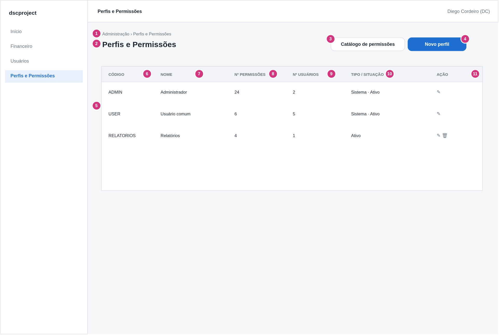
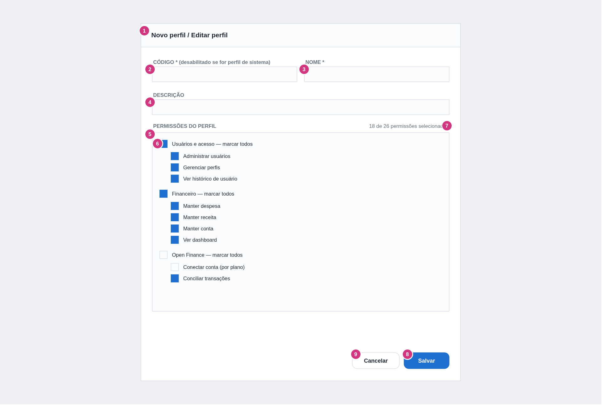
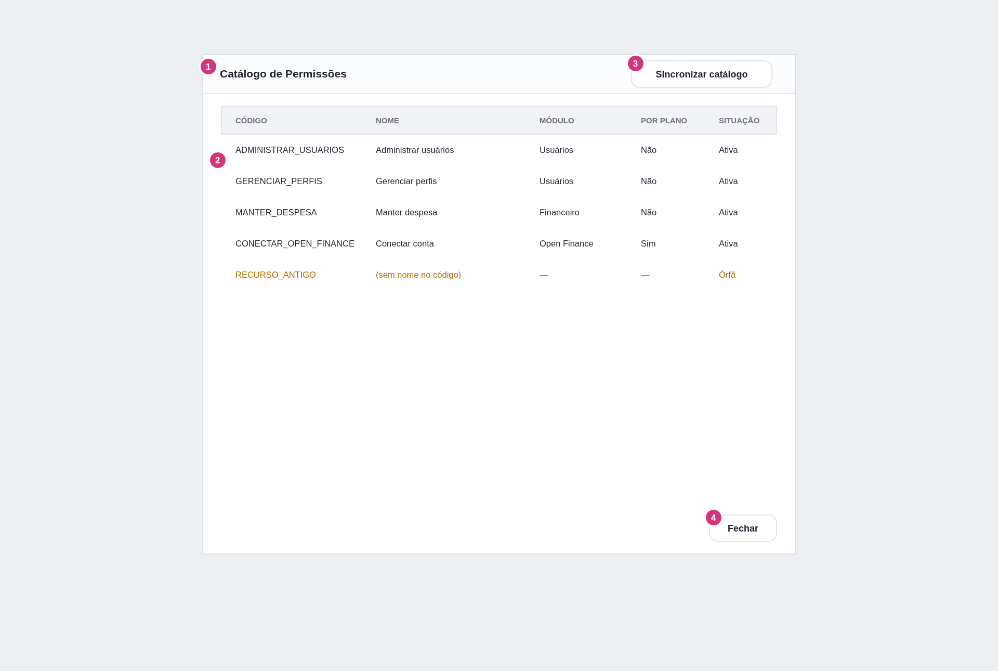

# dscproject — Análise de Sistemas
## Módulo Usuário — ADMIN — Manter Perfil e Permissões

**Gerado em:** 06/09/2026
**Versão:** 1.1
**Projeto:** `dscproject-spring-mvc` (geração 2)

---

## Informações sobre o Documento

| Órgão | dscproject | Setor | Pessoal |
|---|---|---|---|
| Plataforma | dscproject-spring-mvc | Disciplina | Documentação |
| Área Cliente | Diego Cordeiro | Versão do Modelo | 2 (padrão híbrido) |

## Revisões e Aprovações

| Responsável por | Nome | Data de Execução |
|---|---|---|
| Revisão | Diego dos Santos Cordeiro | — |

## Histórico de Versões

| Versão | Data | Analista Responsável | Descrição da Alteração |
|---|---|---|---|
| 1.0 | 06/09/2026 | Diego dos Santos Cordeiro | Criação do documento. Tela administrativa de RBAC: gerenciar perfis e vincular permissões a cada perfil. Complementa o documento `01 - manter-usuario` (que introduziu o RBAC e assumiu a carga inicial dos perfis/permissões) |
| 1.1 | 07/09/2026 | Diego dos Santos Cordeiro | `GERENCIAR_PERFIS` vira três permissões granulares: `PERFIS_LISTAR`, `PERFIS_MANTER`, `PERFIS_SINCRONIZAR_CATALOGO` (convenção domínio-primeiro). Nova Seção 13.1 com a matriz Perfil × Permissão. Anti-lockout e endpoints reescritos em cima das novas permissões. `PERM_MODULO` e `PERM_FL_ORFA` já absorvidos no Documento 0 v1.3 |

---

## Diretrizes para Elaboração do Documento

| Nº | DIRETRIZ |
|---|---|
| D01 | Responsabilidades de camada são documentadas como **Regra de Tela (RT)** e **Regra de Negócio (RN)**. |
| D02 | A estrutura de `PERFIS`, `PERMISSOES` e `PERFIL_PERMISSAO` é a do Documento 0 ([QUADRO_DESCRITIVO_25 a 27](../00%20-%20analise-geral/documento-0-fundacao.md#quadro-descritivo-25)). Este documento **não introduz tabela nova**. |
| D03 | A linguagem das Seções 1 a 3 deve ser compreensível para um analista funcional. |

---

## 1. Introdução

Este documento descreve a funcionalidade **Manter Perfil e Permissões**, a tela administrativa do RBAC do `dscproject-spring-mvc`.

O documento `01 - manter-usuario` transformou o enum `Perfis` da geração 1 nas tabelas `PERFIS`, `PERMISSOES` e `PERFIL_PERMISSAO` (N:N), e assumiu que perfis, permissões e seus vínculos vêm de **carga inicial** (script Flyway). Este documento cobre a tela que permite ao administrador, depois disso, **gerenciar os perfis** (criar, editar, excluir) e **ajustar quais permissões cada perfil concede**.

Conceitos:
- **Permissão** — uma capacidade granular verificável em tela e serviço, com código **domínio-primeiro** (ex.: `USUARIOS_EDITAR`, `PERFIS_MANTER`, `DESPESA_MANTER`, `OPEN_FINANCE_CONECTAR`). O **catálogo** de permissões é definido no código (uma constante/enum por capacidade) e refletido na tabela `PERMISSOES` por um **sincronizador** — a tela **não cria nem apaga** permissão.
- **Perfil** — um agrupamento nomeado de permissões (`ADMIN`, `USER`, e outros que o administrador criar). Um usuário tem **um** perfil ([documento `01 - manter-usuario`](../01%20-%20manter-usuario/documento-analise-manter-usuario.md)).
- As **autoridades** do usuário no Spring Security saem de: perfil do usuário → permissões vinculadas em `PERFIL_PERMISSAO` → uma autoridade `PERM_{CODIGO}` por permissão, mais `ROLE_{PERF_CODIGO}` do próprio perfil.

**Escopo deste documento:**
- Tela de **listagem de perfis**, restrita a quem tem a permissão [PERM01](#perm01).
- **Cadastro e edição de perfil** via modal, com o **seletor de permissões** (marcar/desmarcar as permissões que o perfil concede, agrupadas por módulo).
- **Exclusão de perfil**, com as travas: perfil de sistema não é excluível, e perfil com usuários vinculados não é excluível.
- **Catálogo de permissões** (visualização somente leitura) e a ação de **sincronizar o catálogo** com o código.
- As travas anti-lockout: um administrador não pode remover de si mesmo a permissão de gerenciar perfis/usuários, nem deixar o sistema sem nenhum perfil com essas permissões.

**Não contempla:**
- CRUD de usuário e atribuição de perfil ao usuário — documento `01 - manter-usuario`.
- Planos pagos e a coluna `PERM_FL_CONCEDIVEL_POR_PLANO` — módulo futuro (`NN - planos-e-assinaturas`); aqui a coluna é apenas exibida.
- A definição do catálogo de permissões em si (constantes no código) — decisão técnica registrada na Seção 2.

**Perfis com acesso:** [PERF01](#perf01) (ADMIN), ou qualquer perfil a quem um ADMIN conceda [PERM01](#perm01).

---

## 2. Observações

| Nº | OBSERVAÇÃO | REFERÊNCIA / IMPACTO |
|---|---|---|
| 1 | **O catálogo de permissões vive no código.** Cada capacidade é uma constante (proposta: um enum `Permissao` ou uma classe de constantes `Permissoes`), com código, nome e módulo. Um **sincronizador** roda na inicialização da aplicação (ou por ação da tela — [EDP08](#edp08)) e insere em `PERMISSOES` as que faltam. Permissão que existe na tabela mas não no código é marcada como **órfã** e não pode ser vinculada a novos perfis (análogo ao `IATO_FL_ORFA` das tools do módulo de I.A). **[Requer código]** | [RN08](#rn08), [RN09](#rn09) |
| 2 | **A tela nunca cria nem apaga permissão.** Só cria/edita/exclui **perfil** e liga/desliga o vínculo perfil × permissão em `PERFIL_PERMISSAO`. | [RN04](#rn04) |
| 3 | **Anti-lockout.** Um administrador não pode: (a) remover [PERM02](#perm02) (`PERFIS_MANTER`) do **próprio** perfil; (b) salvar uma alteração que deixe o sistema sem **nenhum** perfil, com usuários ativos, que tenha `PERFIS_MANTER`, nem sem nenhum que tenha `USUARIOS_EDITAR` (a permissão que reatribui o perfil de um usuário). | [RN05](#rn05), [RN06](#rn06) |
| 4 | **Perfil de sistema** (`PERF_FL_SISTEMA = TRUE` — hoje `ADMIN` e `USER`): o código não é editável e o perfil não é excluível. As permissões dele **são** editáveis, respeitando o anti-lockout. | [RN02](#rn02), [RN07](#rn07) |
| 5 | **Exclusão de perfil** é lógica (`audit_data_exclusao`), permitida só quando o perfil não é de sistema e não tem **nenhum** usuário (ativo ou excluído) vinculado. Ao excluir, o histórico dos vínculos `PERFIL_PERMISSAO` também é preservado (soft delete). | [RN07](#rn07) |
| 6 | **Efeito imediato nas sessões.** Ao alterar as permissões de um perfil, os usuários daquele perfil que já estão logados só recebem as novas autoridades na próxima requisição em que o `Usuario` for recarregado, ou no próximo login. O comportamento exato (recarregar a cada requisição × só no login) é decisão técnica. **A Confirmar.** | [RN10](#rn10) / A Confirmar |
| 7 | **Auditoria.** `PERFIS`, `PERMISSOES` e `PERFIL_PERMISSAO` são auditadas via Hibernate Envers, conforme o Documento 0. Toda alteração de vínculo perfil × permissão fica registrada (quem, quando, o quê). | [RNF03](#rnf03) |
| 8 | **`getAuthorities()` do `Usuario`** passa a consultar `PERFIL_PERMISSAO`. Para não pesar cada request, o conjunto de permissões do perfil pode ser cacheado por perfil e invalidado quando este documento gravar uma alteração. **[Requer código]** | [RN10](#rn10) |

---

## 3. Requisitos

### 3.1 Requisitos Funcionais

| ID | DESCRIÇÃO | PRIORIDADE | SITUAÇÃO |
|---|---|---|---|
| <a id="rf01"></a>RF01 | O sistema deve listar os perfis cadastrados, com: código, nome, quantidade de permissões, quantidade de usuários vinculados e situação. | Alta | Em análise |
| <a id="rf02"></a>RF02 | O sistema deve permitir cadastrar um novo perfil, com código, nome e descrição. | Alta | Em análise |
| <a id="rf03"></a>RF03 | O sistema deve permitir editar um perfil existente (nome e descrição; o código só de perfis não-sistema). | Alta | Em análise |
| <a id="rf04"></a>RF04 | O sistema deve, no cadastro e na edição de perfil, exibir o catálogo de permissões agrupado por módulo e permitir marcar/desmarcar as que o perfil concede. | Alta | Em análise |
| <a id="rf05"></a>RF05 | O sistema deve impedir a exclusão de um perfil de sistema e de um perfil com usuários vinculados. | Alta | Em análise |
| <a id="rf06"></a>RF06 | O sistema deve impedir alterações de permissão que tranquem o administrador fora da gestão de perfis/usuários (anti-lockout). | Alta | Em análise |
| <a id="rf07"></a>RF07 | O sistema deve exibir o catálogo de permissões (código, nome, módulo, se é concedível por plano, se está órfã) em modo somente leitura. | Média | Em análise |
| <a id="rf08"></a>RF08 | O sistema deve permitir sincronizar o catálogo de permissões da tabela com o do código, sob demanda. | Baixa | Em análise |

### 3.2 Requisitos Não Funcionais

| ID | CATEGORIA | DESCRIÇÃO | CRITÉRIO DE ACEITAÇÃO |
|---|---|---|---|
| <a id="rnf01"></a>RNF01 | Segurança | Cada endpoint desta tela exige a autoridade da sua operação (`PERM_PERFIS_LISTAR`, `PERM_PERFIS_MANTER` ou `PERM_PERFIS_SINCRONIZAR_CATALOGO` — ver Seção 13 e [RN01](#rn01)). | Teste de acesso com ADMIN, com USER e com um perfil que só liste. |
| <a id="rnf02"></a>RNF02 | Integridade | As travas anti-lockout ([RN05](#rn05), [RN06](#rn06)) são validadas no serviço, não só na tela. | Teste chamando o endpoint diretamente. |
| <a id="rnf03"></a>RNF03 | Auditoria | `PERFIS`, `PERMISSOES` e `PERFIL_PERMISSAO` têm auditoria completa via Hibernate Envers. | Inspeção das tabelas `_aud` após alterações. |
| <a id="rnf04"></a>RNF04 | Desempenho | A resolução das autoridades de um usuário não deve consultar o banco a cada requisição — o conjunto de permissões por perfil é cacheado e invalidado nas gravações desta tela. | Medição do nº de queries por requisição autenticada. |
| <a id="rnf05"></a>RNF05 | Usabilidade | O seletor de permissões agrupa por módulo, com marcar/desmarcar o grupo inteiro, e mostra a contagem selecionada. | Revisão visual do protótipo. |

---

## 4. Casos de Uso

[Inserir `manter-perfil-permissao-casos-uso.drawio` quando gerado.]

| CÓDIGO | NOME | ATOR PRINCIPAL | DESCRIÇÃO |
|---|---|---|---|
| <a id="caus01"></a>CAUS01 | Listar Perfis | [PERF01](#perf01) | ADMIN acessa o menu e visualiza os perfis. ([RF01](#rf01)) |
| <a id="caus02"></a>CAUS02 | Cadastrar Perfil | [PERF01](#perf01) | ADMIN cria um novo perfil e marca as permissões dele. ([RF02](#rf02), [RF04](#rf04)) |
| <a id="caus03"></a>CAUS03 | Editar Perfil e Permissões | [PERF01](#perf01) | ADMIN altera nome/descrição e o conjunto de permissões de um perfil. ([RF03](#rf03), [RF04](#rf04), [RF06](#rf06)) |
| <a id="caus04"></a>CAUS04 | Excluir Perfil | [PERF01](#perf01) | ADMIN exclui um perfil não-sistema sem usuários. ([RF05](#rf05)) |
| <a id="caus05"></a>CAUS05 | Consultar Catálogo de Permissões | [PERF01](#perf01) | ADMIN abre o catálogo de permissões em modo leitura. ([RF07](#rf07)) |
| <a id="caus06"></a>CAUS06 | Sincronizar Catálogo | [PERF01](#perf01) | ADMIN dispara a sincronização do catálogo da tabela com o do código. ([RF08](#rf08)) |

---

## 5. Localização / Critérios de Aceitação

**Caminho de Navegação:**
- Menu principal > Administração > Perfis e Permissões

**Critérios de Aceitação:**
- O menu 'Perfis e Permissões' é visível apenas para quem tem [PERM01](#perm01).
- A listagem carrega automaticamente, com a contagem de permissões e de usuários por perfil.
- O cadastro e a edição de perfil são feitos num modal único, que inclui o seletor de permissões.
- Não é possível excluir um perfil de sistema nem um perfil com usuários vinculados.
- Não é possível remover a permissão de gerenciar perfis do próprio perfil, nem deixar o sistema sem nenhum perfil com essa permissão.
- O catálogo de permissões é somente leitura; a tela não cria nem apaga permissões.

---

## 6. Banco de Dados

Nenhuma tabela nova. As três tabelas do RBAC estão no Documento 0:

| Tabela | Onde | Papel nesta tela |
|---|---|---|
| `PERFIS` | Documento 0 — [QUADRO_DESCRITIVO_25](../00%20-%20analise-geral/documento-0-fundacao.md#quadro-descritivo-25) | CRUD |
| `PERMISSOES` | Documento 0 — [QUADRO_DESCRITIVO_26](../00%20-%20analise-geral/documento-0-fundacao.md#quadro-descritivo-26) | Somente leitura + sincronização com o código |
| `PERFIL_PERMISSAO` | Documento 0 — [QUADRO_DESCRITIVO_27](../00%20-%20analise-geral/documento-0-fundacao.md#quadro-descritivo-27) | Vínculo criado/removido pela edição de perfil |

> **Absorvido no Documento 0 v1.3:** `PERMISSOES` ganhou `PERM_MODULO` (`VARCHAR(40)` — módulo a que a permissão pertence, para agrupar no seletor) e `PERM_FL_ORFA` (`BOOLEAN` default FALSE — permissão que existe na tabela mas não no catálogo do código). Ambas alimentadas pelo sincronizador ([Observação 1](#2-observações)).

### 6.1 Diagrama ER

Ver o DER do documento `01 - manter-usuario` (`images/manter-usuario-der.png`) — as mesmas três tabelas.

### 6.2 Auditoria de Tabelas

| TABELA PRINCIPAL | TABELA DE AUDITORIA | CAMPOS AUDITADOS |
|---|---|---|
| PERFIS | PERFIS_aud | Código, nome, descrição, flag de sistema |
| PERMISSOES | PERMISSOES_aud | Todos os campos (alterados só pelo sincronizador) |
| PERFIL_PERMISSAO | PERFIL_PERMISSAO_aud | Criação e exclusão lógica do vínculo — registra quem ligou/desligou cada permissão de cada perfil |

### 6.3 Procedures / Views / Triggers / Functions

Nenhuma. O sincronizador do catálogo e a resolução de autoridades ficam na camada de serviço.

---

## 7. Protótipos de Interface

Wireframes gerados de `prototipo/manter-perfil-permissao-prototipo.drawio`. Os números em destaque ligam a tela aos IDs do respectivo QUADRO_DESCRITIVO.

### <a id="quadro-descritivo-1"></a>7.1 Tela: Perfis e Permissões (Listagem) — QUADRO_DESCRITIVO_1



> OBSERVAÇÕES: Restrita a quem tem [PERM01](#perm01). Grid client-side.

| ID | NOME | PROPRIEDADES | OBSERVAÇÕES |
|---|---|---|---|
| <a id="qdd1-0"></a>0 | LINK | Caminho: "/perfis/listar" | — |
| <a id="qdd1-1"></a>1 | BREADCRUMB | Tipo: Texto<br>Texto: Administração > Perfis e Permissões | — |
| <a id="qdd1-2"></a>2 | TÍTULO | Tipo: Texto<br>Texto: Perfis e Permissões | — |
| <a id="qdd1-3"></a>3 | BOTÃO CATÁLOGO DE PERMISSÕES | Tipo: Botão | Ao clicar, executar [RT06](#rt06). |
| <a id="qdd1-4"></a>4 | BOTÃO NOVO PERFIL | Tipo: Botão (primário) | Visível a quem tem [PERM02](#perm02). Ao clicar, executar [RT01](#rt01). |
| <a id="qdd1-5"></a>5 | GRID DE PERFIS | Tipo: Grid (client-side)<br>Endpoint: [EDP02](#edp02)<br>Ordenação padrão: nome | Colunas [ID6](#qdd1-6)…[ID11](#qdd1-11). |
| <a id="qdd1-6"></a>6 | CÓDIGO | Coluna | Exibe [C1](#c1).codigo. |
| <a id="qdd1-7"></a>7 | NOME | Coluna | Exibe [C1](#c1).nome. |
| <a id="qdd1-8"></a>8 | Nº DE PERMISSÕES | Coluna (número) | Exibe [C1](#c1).qtdPermissoes. |
| <a id="qdd1-9"></a>9 | Nº DE USUÁRIOS | Coluna (número) | Exibe [C1](#c1).qtdUsuarios. |
| <a id="qdd1-10"></a>10 | SITUAÇÃO / TIPO | Coluna (badges) | "Sistema" quando `PERF_FL_SISTEMA`; "Ativo"/"Excluído" pela presença de `audit_data_exclusao`. |
| <a id="qdd1-11"></a>11 | AÇÃO | Coluna | Visível a quem tem [PERM02](#perm02). Ícone Editar ([RT02](#rt02)); ícone Excluir ([RT05](#rt05)) — oculto quando é perfil de sistema ou tem usuários. |

### <a id="quadro-descritivo-2"></a>7.2 Modal: Cadastro / Edição de Perfil — QUADRO_DESCRITIVO_2



> OBSERVAÇÕES: Modal único de cadastro e edição. A parte de baixo é o **seletor de permissões**: uma lista de grupos (um por módulo), cada grupo com um checkbox "marcar todos" e as permissões do módulo. Permissões **órfãs** aparecem desabilitadas com o rótulo "(órfã)". Permissões `concedível por plano` aparecem com um selo informativo.

| ID | NOME | PROPRIEDADES | OBSERVAÇÕES |
|---|---|---|---|
| <a id="qdd2-1"></a>1 | TÍTULO | Tipo: Texto<br>Texto: Novo perfil / Editar perfil | Varia conforme o modo. |
| <a id="qdd2-2"></a>2 | CAMPO – CÓDIGO | Tipo: Input Text<br>Tamanho: 30<br>Obrigatório: Sim | Grava `PERF_CODIGO`. Em maiúsculas ([RT08](#rt08)). Único ([RN03](#rn03)). **Desabilitado** em edição de perfil de sistema ([RN02](#rn02)). |
| <a id="qdd2-3"></a>3 | CAMPO – NOME | Tipo: Input Text<br>Tamanho: 100<br>Obrigatório: Sim | Grava `PERF_NOME`. |
| <a id="qdd2-4"></a>4 | CAMPO – DESCRIÇÃO | Tipo: Textarea<br>Tamanho: 255<br>Obrigatório: Não | Grava `PERF_DESCRICAO`. |
| <a id="qdd2-5"></a>5 | SELETOR DE PERMISSÕES | Tipo: Lista agrupada de checkboxes<br>Endpoint: [EDP04](#edp04) (catálogo) + [EDP03](#edp03) (marcadas) | Executar [RT03](#rt03). Agrupado por `PERM_MODULO`. |
| <a id="qdd2-6"></a>6 | GRUPO – "MARCAR TODOS" | Tipo: Checkbox (tri-state) por módulo | Marca/desmarca todas as permissões não-órfãs do módulo. |
| <a id="qdd2-7"></a>7 | CONTADOR | Tipo: Texto<br>Texto: "{n} de {total} permissões selecionadas" | Atualiza ao marcar/desmarcar. |
| <a id="qdd2-8"></a>8 | BOTÃO SALVAR | Tipo: Botão (primário)<br>Endpoint: [EDP05](#edp05) (criação) / [EDP06](#edp06) (edição) | Ao clicar, executar [RT04](#rt04). |
| <a id="qdd2-9"></a>9 | BOTÃO CANCELAR | Tipo: Botão | Fecha sem salvar. |

### <a id="quadro-descritivo-3"></a>7.3 Modal: Catálogo de Permissões (somente leitura) — QUADRO_DESCRITIVO_3



> OBSERVAÇÕES: Só exibe. Uma linha por permissão, agrupada por módulo.

| ID | NOME | PROPRIEDADES | OBSERVAÇÕES |
|---|---|---|---|
| <a id="qdd3-1"></a>1 | TÍTULO | Tipo: Texto<br>Texto: Catálogo de Permissões | — |
| <a id="qdd3-2"></a>2 | LISTA | Tipo: Tabela agrupada<br>Endpoint: [EDP04](#edp04) | Colunas: Código, Nome, Módulo, Concedível por plano (Sim/Não), Situação (Ativa / Órfã). |
| <a id="qdd3-3"></a>3 | BOTÃO SINCRONIZAR CATÁLOGO | Tipo: Botão<br>Endpoint: [EDP08](#edp08) | Visível a quem tem [PERM03](#perm03). Ao clicar, executar [RT07](#rt07). |
| <a id="qdd3-4"></a>4 | BOTÃO FECHAR | Tipo: Botão | Fecha o modal. |

### 7.4 Regras de Tela

| ID | DESCRIÇÃO |
|---|---|
| <a id="rt01"></a>RT01 | Ao clicar em "Novo perfil" ([ID4](#qdd1-4)) — visível só com [PERM02](#perm02) —, abrir o modal ([QUADRO_DESCRITIVO_2](#quadro-descritivo-2)) em modo criação: campos vazios, seletor de permissões carregado por [EDP04](#edp04) com tudo desmarcado. |
| <a id="rt02"></a>RT02 | Ao clicar no ícone Editar de uma linha — visível só com [PERM02](#perm02) —, chamar [EDP03](#edp03) com o id e abrir o modal em modo edição, com nome/descrição preenchidos, código exibido (desabilitado se for perfil de sistema — [RN02](#rn02)) e o seletor de permissões com as permissões atuais marcadas. |
| <a id="rt03"></a>RT03 | No seletor de permissões: marcar/desmarcar uma permissão atualiza o contador ([ID7](#qdd2-7)) e o estado tri-state do "marcar todos" do módulo. Permissões órfãs ficam desabilitadas. Se a alteração violar o anti-lockout ([RN05](#rn05)), impedir o desmarque e exibir [MSG05](#msg05). |
| <a id="rt04"></a>RT04 | Ao clicar em "Salvar": validar código e nome obrigatórios ([MSG02](#msg02)). Em criação chamar [EDP05](#edp05); em edição, [EDP06](#edp06), enviando os dados do perfil e a **lista completa** de códigos de permissão marcados. Em sucesso, exibir [MSG01](#msg01) (criação) ou [MSG03](#msg03) (edição), fechar e recarregar o grid. Código duplicado → [MSG04](#msg04). Anti-lockout no servidor → [MSG06](#msg06). |
| <a id="rt05"></a>RT05 | Ao clicar no ícone Excluir — visível só com [PERM02](#perm02) —, exibir a confirmação [MSG07](#msg07). Ao confirmar, chamar [EDP07](#edp07). Perfil de sistema → [MSG08](#msg08); perfil com usuários → [MSG09](#msg09). Em sucesso, exibir [MSG10](#msg10) e recarregar o grid. |
| <a id="rt06"></a>RT06 | Ao clicar em "Catálogo de permissões" ([ID3](#qdd1-3)), abrir o [QUADRO_DESCRITIVO_3](#quadro-descritivo-3) e carregar a lista por [EDP04](#edp04). O botão "Sincronizar catálogo" dentro do modal só aparece com [PERM03](#perm03). |
| <a id="rt07"></a>RT07 | Ao clicar em "Sincronizar catálogo" ([ID3](#qdd3-3)) — visível só com [PERM03](#perm03) —, chamar [EDP08](#edp08). Ao concluir, exibir [MSG11](#msg11) com o resumo (n inseridas, n marcadas como órfãs) e recarregar a lista. |
| <a id="rt08"></a>RT08 | Ao digitar no campo Código ([ID2](#qdd2-2)), converter o texto para maiúsculas automaticamente. |

---

## 8. Endpoints

| CÓDIGO | HTTP | PERMISSÃO | PATH | FINALIZADO? |
|---|---|---|---|---|
| <a id="edp01"></a>EDP01 | GET | [PERM01](#perm01) | /perfis/listar | N |
| Retorna a página da listagem (Thymeleaf). O grid é carregado por [EDP02](#edp02). | | | | |
| <a id="edp02"></a>EDP02 | GET | [PERM01](#perm01) | /perfis/listar-dados | N |
| Lista de perfis para o grid, em JSON. Executa [C1](#c1). Campos: id, codigo, nome, qtdPermissoes, qtdUsuarios, sistema (boolean), excluido (boolean). | | | | |
| <a id="edp03"></a>EDP03 | GET | [PERM02](#perm02) | /perfis/buscar/{id} | N |
| Retorna um perfil para edição: id, codigo, nome, descricao, sistema, e a lista de códigos de permissão vinculados. Executa [C2](#c2). | | | | |
| <a id="edp04"></a>EDP04 | GET | [PERM01](#perm01) | /permissoes/listar-dados | N |
| Retorna o catálogo de permissões, agrupado por módulo. Executa [C3](#c3). Campos por permissão: codigo, nome, modulo, concedivelPorPlano, orfa. Consumido pelo catálogo em leitura ([RT06](#rt06)) e pelo seletor do modal de perfil. | | | | |
| <a id="edp05"></a>EDP05 | POST | [PERM02](#perm02) | /perfis/inserir | N |
| Cria um perfil e seus vínculos de permissão. Executa [RN03](#rn03) (código único), [RN04](#rn04) (só permissões não-órfãs), [RN06](#rn06) (anti-lockout global). Dados: codigo, nome, descricao, permissoes (lista de códigos). Retorno: 200 ([MSG01](#msg01)) ou 422 ([MSG02](#msg02)/[MSG04](#msg04)/[MSG06](#msg06)). | | | | |
| <a id="edp06"></a>EDP06 | PUT | [PERM02](#perm02) | /perfis/editar/{id} | N |
| Edita o perfil e **substitui** o conjunto de vínculos de permissão pelo enviado. Executa [RN02](#rn02) (código de perfil de sistema não muda), [RN03](#rn03), [RN04](#rn04), [RN05](#rn05) e [RN06](#rn06) (anti-lockout). Marca como excluídos os vínculos que saíram e cria os que entraram. Invalida o cache de autoridades do perfil ([RN10](#rn10)). Retorno: 200 ([MSG03](#msg03)) ou 422. | | | | |
| <a id="edp07"></a>EDP07 | DELETE | [PERM02](#perm02) | /perfis/excluir/{id} | N |
| Exclusão lógica do perfil. Executa [RN07](#rn07): recusa se `PERF_FL_SISTEMA` ([MSG08](#msg08)) ou se houver usuário vinculado ([MSG09](#msg09)). Soft delete do perfil e dos seus vínculos. Retorno: 200 ([MSG10](#msg10)) ou 422. | | | | |
| <a id="edp08"></a>EDP08 | POST | [PERM03](#perm03) | /permissoes/sincronizar-catalogo | N |
| Sincroniza `PERMISSOES` com o catálogo do código ([RN08](#rn08), [RN09](#rn09)): insere as que faltam, marca `PERM_FL_ORFA = TRUE` nas que sobram, e desmarca a flag nas que voltaram. Não apaga nada. Retorno: 200 ([MSG11](#msg11)) com o resumo. **[Requer código]** | | | | |

---

## 9. Regras de Negócio

| ID | DESCRIÇÃO |
|---|---|
| <a id="rn01"></a>RN01 | Cada endpoint exige a autoridade da sua operação: [EDP01](#edp01)/[EDP02](#edp02)/[EDP04](#edp04) → `PERM_PERFIS_LISTAR`; [EDP03](#edp03)/[EDP05](#edp05)/[EDP06](#edp06)/[EDP07](#edp07) → `PERM_PERFIS_MANTER`; [EDP08](#edp08) → `PERM_PERFIS_SINCRONIZAR_CATALOGO`. `PERFIS_MANTER` e `PERFIS_SINCRONIZAR_CATALOGO` só fazem sentido junto com `PERFIS_LISTAR` (sem listar, não há tela). |
| <a id="rn02"></a>RN02 | `PERF_CODIGO` de um perfil com `PERF_FL_SISTEMA = TRUE` não pode ser alterado ([EDP06](#edp06)). Nome e descrição podem. |
| <a id="rn03"></a>RN03 | `PERF_CODIGO` é único entre perfis não excluídos. Ao criar ([EDP05](#edp05)) ou editar ([EDP06](#edp06)), se já existir outro perfil com o mesmo código, impedir e retornar [MSG04](#msg04). Executa [C4](#c4). |
| <a id="rn04"></a>RN04 | Só permissões **não-órfãs** (`PERM_FL_ORFA = FALSE`) podem ser vinculadas a um perfil. Vínculos de permissões que se tornaram órfãs continuam valendo até serem removidos manualmente, mas não podem ser recriados. |
| <a id="rn05"></a>RN05 | **Anti-lockout (próprio perfil):** o usuário logado não pode remover [PERM02](#perm02) (`PERFIS_MANTER`) do perfil que **ele mesmo** possui. Se tentar, impedir e retornar [MSG05](#msg05) (na tela) / [MSG06](#msg06) (no serviço). |
| <a id="rn06"></a>RN06 | **Anti-lockout (global):** uma gravação ([EDP05](#edp05)/[EDP06](#edp06)/[EDP07](#edp07)) não pode deixar o sistema em um estado onde **nenhum** perfil com ao menos um usuário ativo tenha `PERM_PERFIS_MANTER`, nem onde nenhum tenha `PERM_USUARIOS_EDITAR` (a permissão que reatribui o perfil de um usuário). Executa [C5](#c5). Se violar, impedir e retornar [MSG06](#msg06). |
| <a id="rn07"></a>RN07 | Exclusão de perfil ([EDP07](#edp07)): recusar se `PERF_FL_SISTEMA = TRUE` ([MSG08](#msg08)); recusar se existir **qualquer** usuário (ativo ou excluído) com `PERF_ID` apontando para este perfil ([MSG09](#msg09)) — executa [C6](#c6). Caso contrário, `audit_data_exclusao` no perfil e nos vínculos `PERFIL_PERMISSAO`. |
| <a id="rn08"></a>RN08 | O catálogo de permissões do código é a fonte da verdade. O sincronizador ([EDP08](#edp08), e também na inicialização da aplicação) insere em `PERMISSOES` toda permissão do código que não existir na tabela, preenchendo `PERM_CODIGO`, `PERM_NOME`, `PERM_DESCRICAO` e `PERM_MODULO`. |
| <a id="rn09"></a>RN09 | Toda permissão que existe em `PERMISSOES` mas **não** no catálogo do código recebe `PERM_FL_ORFA = TRUE` na sincronização. Uma permissão órfã que reaparecer no código tem a flag desmarcada. O sincronizador **nunca** apaga uma linha de `PERMISSOES` (por causa dos vínculos históricos). |
| <a id="rn10"></a>RN10 | Ao gravar uma alteração de vínculo de perfil ([EDP06](#edp06)) ou excluir um perfil ([EDP07](#edp07)), o cache do conjunto de permissões daquele perfil é invalidado. O `getAuthorities()` do `Usuario` passa a refletir a mudança na próxima resolução. O momento exato dessa resolução (a cada requisição × só no login) é **A Confirmar**. |

---

## 10. Mensagens de Sistema

| CÓDIGO | DESCRIÇÃO |
|---|---|
| <a id="msg01"></a>MSG01 | Perfil cadastrado com sucesso. |
| <a id="msg02"></a>MSG02 | O campo {campo} é obrigatório. |
| <a id="msg03"></a>MSG03 | Perfil atualizado com sucesso. |
| <a id="msg04"></a>MSG04 | Já existe um perfil com este código. |
| <a id="msg05"></a>MSG05 | Você não pode remover a permissão de gerenciar perfis do seu próprio perfil. |
| <a id="msg06"></a>MSG06 | Esta alteração deixaria o sistema sem nenhum perfil capaz de gerenciar perfis ou usuários. |
| <a id="msg07"></a>MSG07 | Confirma a exclusão do perfil "{nome}"? |
| <a id="msg08"></a>MSG08 | Perfis de sistema não podem ser excluídos. |
| <a id="msg09"></a>MSG09 | Não é possível excluir um perfil com usuários vinculados. Mova os usuários para outro perfil primeiro. |
| <a id="msg10"></a>MSG10 | Perfil excluído com sucesso. |
| <a id="msg11"></a>MSG11 | Catálogo sincronizado: {inseridas} permissões novas, {orfas} marcadas como órfãs. |

---

## 11. Consultas

| CÓDIGO | DESCRIÇÃO |
|---|---|
| <a id="c1"></a>C1 | Listagem de perfis com contagem de permissões e de usuários.<br>`SELECT p.PERF_ID, p.PERF_CODIGO, p.PERF_NOME, p.PERF_FL_SISTEMA,`<br>`  (p.audit_data_exclusao IS NOT NULL) AS excluido,`<br>`  (SELECT COUNT(*) FROM PERFIL_PERMISSAO pp WHERE pp.PERF_ID = p.PERF_ID AND pp.audit_data_exclusao IS NULL) AS qtd_permissoes,`<br>`  (SELECT COUNT(*) FROM USUARIOS u WHERE u.PERF_ID = p.PERF_ID AND u.audit_data_exclusao IS NULL) AS qtd_usuarios`<br>`FROM PERFIS p`<br>`WHERE p.audit_data_exclusao IS NULL`<br>`ORDER BY p.PERF_NOME;` |
| <a id="c2"></a>C2 | Códigos de permissão vinculados a um perfil (RT02).<br>`SELECT pm.PERM_CODIGO`<br>`FROM PERFIL_PERMISSAO pp`<br>`JOIN PERMISSOES pm ON pm.PERM_ID = pp.PERM_ID`<br>`WHERE pp.PERF_ID = :perfilId AND pp.audit_data_exclusao IS NULL;` |
| <a id="c3"></a>C3 | Catálogo de permissões agrupado por módulo (EDP04).<br>`SELECT pm.PERM_CODIGO, pm.PERM_NOME, pm.PERM_MODULO,`<br>`       pm.PERM_FL_CONCEDIVEL_POR_PLANO, pm.PERM_FL_ORFA`<br>`FROM PERMISSOES pm`<br>`WHERE pm.audit_data_exclusao IS NULL`<br>`ORDER BY pm.PERM_MODULO, pm.PERM_NOME;` |
| <a id="c4"></a>C4 | Verifica código de perfil duplicado (RN03).<br>`SELECT COUNT(*) FROM PERFIS p`<br>`WHERE p.audit_data_exclusao IS NULL`<br>`  AND p.PERF_CODIGO = :codigo`<br>`  AND (:idAtual IS NULL OR p.PERF_ID <> :idAtual);` |
| <a id="c5"></a>C5 | Anti-lockout global: conta os perfis com usuários ativos que concedem uma permissão (RN06). Chamada para `PERFIS_MANTER` e para `USUARIOS_EDITAR`, considerando o estado que a gravação vai deixar.<br>`SELECT COUNT(DISTINCT p.PERF_ID)`<br>`FROM PERFIS p`<br>`JOIN PERFIL_PERMISSAO pp ON pp.PERF_ID = p.PERF_ID AND pp.audit_data_exclusao IS NULL`<br>`JOIN PERMISSOES pm ON pm.PERM_ID = pp.PERM_ID`<br>`JOIN USUARIOS u ON u.PERF_ID = p.PERF_ID AND u.audit_data_exclusao IS NULL`<br>`WHERE p.audit_data_exclusao IS NULL AND pm.PERM_CODIGO = :codigoPermissao;` |
| <a id="c6"></a>C6 | Verifica se um perfil tem usuários vinculados (RN07).<br>`SELECT COUNT(*) FROM USUARIOS u WHERE u.PERF_ID = :perfilId;` |

---

## 12. Parâmetros de Sistema

| PARÂMETRO | VALOR PADRÃO | DESCRIÇÃO |
|---|---|---|
| RBAC_SYNC_CATALOGO_NA_INICIALIZACAO | true | Se `true`, o sincronizador do catálogo de permissões roda a cada subida da aplicação. |
| RBAC_AUTORIDADES_RECARREGA_A_CADA_REQUISICAO | false | Se `true`, `getAuthorities()` reconsulta as permissões do perfil a cada requisição; se `false`, usa o valor da sessão até o próximo login ([RN10](#rn10)). |

---

## 13. Permissões

Todas do módulo **Perfis e Permissões** (`PERM_MODULO = 'Perfis e Permissões'`). Fazem parte do catálogo do código e da carga inicial (Documento 0, [QUADRO_DESCRITIVO_26](../00%20-%20analise-geral/documento-0-fundacao.md#quadro-descritivo-26)). Convenção domínio-primeiro; cada uma vira a autoridade `PERM_{CÓDIGO}`.

| CÓDIGO | DESCRIÇÃO | PERFIS COM ACESSO |
|---|---|---|
| <a id="perm01"></a>PERM01 | `PERFIS_LISTAR` — abrir a tela de Perfis e Permissões, listar os perfis e ver o catálogo de permissões em leitura. Controla a visibilidade do menu 'Perfis e Permissões'. | [PERF01](#perf01) |
| <a id="perm02"></a>PERM02 | `PERFIS_MANTER` — criar, editar e excluir perfil, e ligar/desligar os vínculos perfil × permissão. É a permissão-alvo das travas anti-lockout ([RN05](#rn05), [RN06](#rn06)). | [PERF01](#perf01) |
| <a id="perm03"></a>PERM03 | `PERFIS_SINCRONIZAR_CATALOGO` — disparar a sincronização do catálogo de `PERMISSOES` com o código ([EDP08](#edp08)). | [PERF01](#perf01) |

> `PERFIS_MANTER` e `PERFIS_SINCRONIZAR_CATALOGO` pressupõem `PERFIS_LISTAR` (sem listar não há tela). Estas permissões e seus vínculos vêm de carga inicial.

### 13.1 Matriz Perfil × Permissão

| PERMISSÃO | ADMIN | USER |
|---|:-:|:-:|
| `PERFIS_LISTAR` | ✓ | · |
| `PERFIS_MANTER` | ✓ | · |
| `PERFIS_SINCRONIZAR_CATALOGO` | ✓ | · |

`USER` não recebe nenhuma permissão deste módulo. Um perfil "auditor de RBAC" (só `PERFIS_LISTAR`) é um exemplo de configuração possível que o editor de perfil permite montar.

---

## 14. Perfis

| CÓDIGO | NOME | DESCRIÇÃO |
|---|---|---|
| <a id="perf01"></a>PERF01 | ADMIN | Administrador do sistema. `PERF_FL_SISTEMA = TRUE`. Recebe todas as permissões na carga inicial, inclusive as três de Perfis e Permissões (Seção 13.1). |
| <a id="perf02"></a>PERF02 | USER | Usuário comum. `PERF_FL_SISTEMA = TRUE`. Não tem nenhuma permissão de Perfis e Permissões. |

---

## 15. Fluxo de Eventos

**Editar as permissões de um perfil:**

```
1. ADMIN abre o perfil em edição → EDP03 (dados + permissões marcadas).
2. ADMIN marca/desmarca permissões no seletor.
        │
        ├─ Tentou desmarcar PERFIS_MANTER do próprio perfil (RN05) → MSG05, desmarque bloqueado.
        └─ OK.
3. ADMIN clica em Salvar → EDP06 com a lista completa de permissões marcadas.
        │
        ├─ Código duplicado (RN03)                    → MSG04.
        ├─ Deixaria o sistema sem gestor (RN06 / C5)   → MSG06.
        └─ OK → substitui os vínculos (soft delete dos que saíram, cria os que entraram),
                 audita, invalida o cache do perfil (RN10), retorna MSG03, recarrega o grid.
```

---

## 16. Critérios de Aceitação / BDD

### 16.0 Listar perfis

Dado que estou autenticado com [PERM01](#perm01).
Quando eu acessar "Administração > Perfis e Permissões".
Então devo ver a lista de perfis com a quantidade de permissões e de usuários de cada um.
E os botões "Novo perfil" e os ícones de ação só aparecem se eu também tiver [PERM02](#perm02).

### 16.1 Criar um perfil com permissões

Dado que tenho [PERM01](#perm01) e [PERM02](#perm02) e clico em "Novo perfil".
Quando eu informar código "RELATORIOS", nome "Relatórios", marcar 3 permissões e salvar.
Então o perfil deve ser criado com exatamente essas 3 permissões e o grid deve recarregar.

### 16.2 Código de perfil duplicado

Dado que já existe o perfil "ADMIN".
Quando eu tentar criar outro perfil com o código "ADMIN".
Então o sistema deve impedir e exibir [MSG04](#msg04).

### 16.3 Não editar o código de um perfil de sistema

Dado que abro o perfil "ADMIN" (de sistema) em edição.
Então o campo Código deve estar desabilitado.

### 16.4 Anti-lockout do próprio perfil

Dado que meu usuário tem o perfil "ADMIN".
E que estou editando o perfil "ADMIN".
Quando eu tentar desmarcar a permissão `PERFIS_MANTER`.
Então o sistema deve impedir o desmarque e exibir [MSG05](#msg05).

### 16.5 Anti-lockout global

Dado que só o perfil "ADMIN" concede `USUARIOS_EDITAR` e ele tem usuários ativos.
Quando eu tentar salvar o perfil "ADMIN" sem essa permissão.
Então o sistema deve impedir e exibir [MSG06](#msg06).

### 16.6 Não excluir perfil de sistema

Quando eu tentar excluir o perfil "USER".
Então o sistema deve impedir e exibir [MSG08](#msg08).

### 16.7 Não excluir perfil com usuários

Dado que o perfil "Relatórios" tem 2 usuários vinculados.
Quando eu tentar excluí-lo.
Então o sistema deve impedir e exibir [MSG09](#msg09).

### 16.8 Sincronizar o catálogo

Dado que o código tem uma permissão nova `EXPORTAR_DASHBOARD` que ainda não está na tabela.
Quando eu clicar em "Sincronizar catálogo".
Então a permissão deve ser inserida em `PERMISSOES` e aparecer no catálogo, e o sistema deve exibir [MSG11](#msg11).

### 16.9 Permissão órfã

Dado que a permissão `RECURSO_ANTIGO` existe na tabela mas não no código.
Quando o catálogo for sincronizado.
Então `RECURSO_ANTIGO` deve ficar marcada como órfã, permanecer nos perfis que já a tinham, e não poder ser marcada em nenhum perfil novo.

### 16.10 Auditoria do vínculo

Dado que removo uma permissão de um perfil e salvo.
Quando eu consultar a auditoria de `PERFIL_PERMISSAO`.
Então deve haver o registro de quem removeu o vínculo e quando.

---

## 17. Workshop de Análise

Data: —
Convidados: Diego Cordeiro
Participantes: Diego Cordeiro
Descrição: Decisões: catálogo de permissões vem do código (sincronizador); a tela só gerencia perfil e o vínculo perfil × permissão; travas anti-lockout no serviço; perfil de sistema não é excluível e não muda de código; exclusão de perfil exige zero usuários; `PERMISSOES` ganha `PERM_MODULO` e `PERM_FL_ORFA` (absorvido no Documento 0 v1.3). Momento da re-resolução das autoridades = **A Confirmar**. Revisão v1.1: `GERENCIAR_PERFIS` quebrado em `PERFIS_LISTAR` / `PERFIS_MANTER` / `PERFIS_SINCRONIZAR_CATALOGO`, convenção domínio-primeiro.

---

## 18. Anexos

- Documento 0 — Fundação: `../00 - analise-geral/documento-0-fundacao.md`
- Documento `01 - manter-usuario`: `../01 - manter-usuario/documento-analise-manter-usuario.md`
- Código de referência geração 1 (RBAC hard-coded): `dsc-backend` (`enums/Perfis.java`, `Usuario.getAuthorities()`).
- Padrão de catálogo sincronizado por código: módulo Gerenciamento de I.A — "Tools de I.A" (`ia_tools` + loader de classpath).
