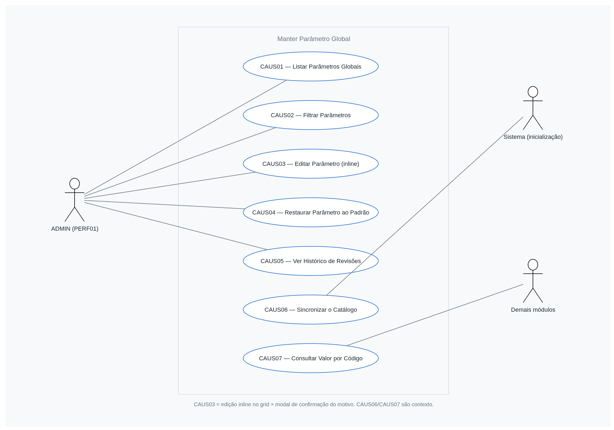
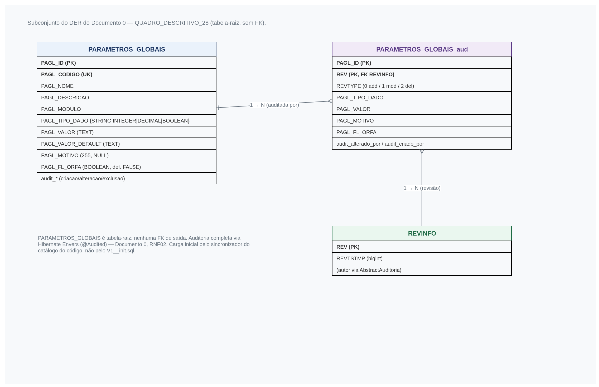
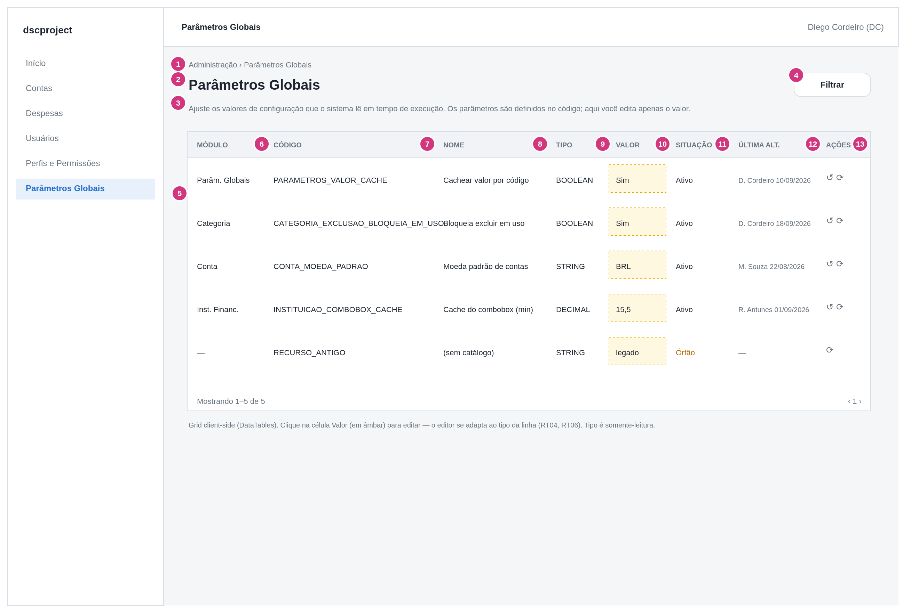
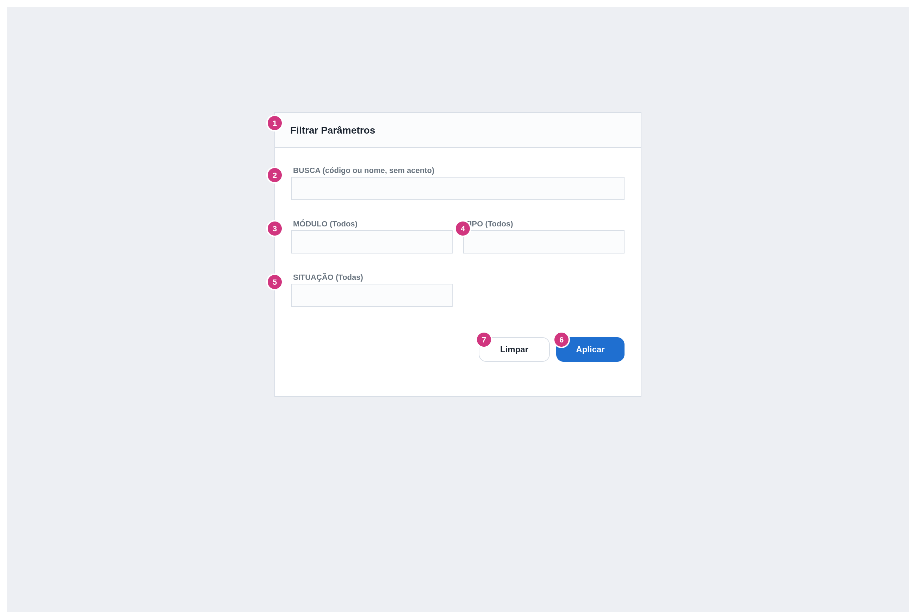
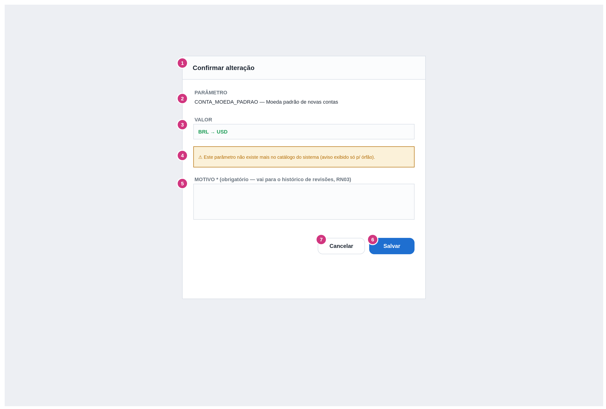
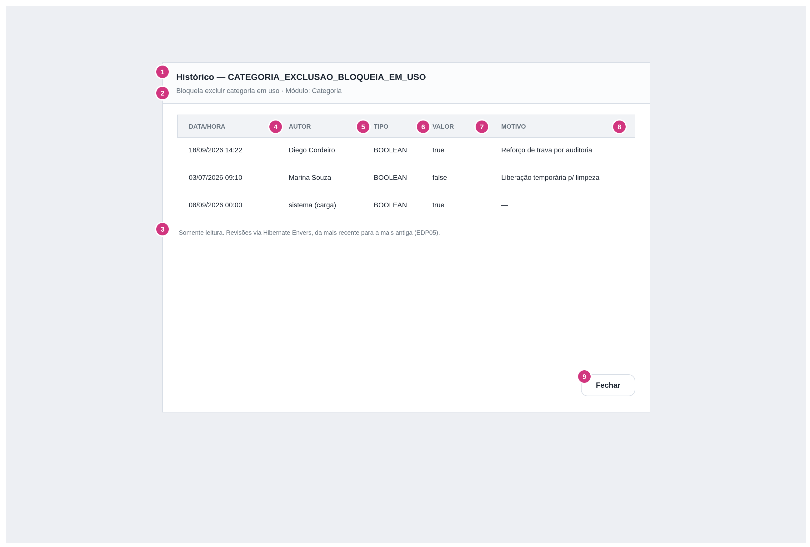

# dscproject — Análise de Sistemas
## Módulo Parâmetros Globais — ADMIN — Manter Parâmetro Global

**Gerado em:** 08/09/2026
**Versão:** 1.1
**Status:** Desenvolvido
**Projeto:** `dscproject-spring-mvc` (geração 2)

---

## Informações sobre o Documento

| Órgão | dscproject | Setor | Pessoal |
|---|---|---|---|
| Plataforma | dscproject-spring-mvc | Disciplina | Documentação |
| Área Cliente | Diego Cordeiro | Versão do Modelo | 2 (padrão híbrido) |

## Revisões e Aprovações

| Responsável por | Nome | Data de Execução |
|---|---|---|
| Revisão | Diego dos Santos Cordeiro | — |

## Histórico de Versões

| Versão | Data | Analista Responsável | Descrição da Alteração |
|---|---|---|---|
| 1.0 | 08/09/2026 | Diego dos Santos Cordeiro | Criação do documento. Tela **só de edição** dos parâmetros globais do sistema (`PARAMETROS_GLOBAIS`, prefixo `PAGL_`). Os parâmetros são semeados por um **loader no código** (mesmo padrão do catálogo de permissões do documento `02 - manter-perfil-permissao`): a tela não cria nem exclui, apenas edita o `valor` (com `motivo` obrigatório a cada alteração) — o `tipo` vem do catálogo e é somente-leitura. Ação "restaurar padrão" (`PAGL_VALOR_DEFAULT`) no escopo. Tipos suportados: `STRING`, `INTEGER`, `DECIMAL`, `BOOLEAN`, `JSON`. Histórico de revisões (Hibernate Envers) no escopo. Engenharia reversa da feature `ParametroGlobal` do `portal-lgpd-api`. A estrutura da tabela é a do Documento 0 ([QUADRO_DESCRITIVO_28](../00%20-%20analise-geral/documento-0-fundacao.md#quadro-descritivo-28), acréscimo v1.4) — este documento não introduz tabela nova |
| 1.1 | 08/09/2026 | Diego dos Santos Cordeiro | A edição do `valor` passa a ser **inline no próprio grid** — clicar na célula Valor a transforma, em tempo de execução, no editor adequado ao tipo daquela linha. Não há mais tela nem modal de "editar parâmetro": o antigo "Modal: Editar Parâmetro" ([QUADRO_DESCRITIVO_3](#quadro-descritivo-3)) foi substituído por "Modal: Confirmar Alteração", que só mostra o resumo da mudança (`valor` anterior → novo) e pede o `motivo` obrigatório. O `tipo` continua somente-leitura (badge no grid), e `JSON` / restaurar-padrão (`EDP06`) seguem como na v1.0. Reescritas as Seções 1, 2, 3, 5, 7, 8, 15, 16 e 17. |

---

## Diretrizes para Elaboração do Documento

| Nº | DIRETRIZ |
|---|---|
| D01 | As responsabilidades de camada são documentadas como **Regra de Tela (RT)** e **Regra de Negócio (RN)** — nunca "o backend deve" / "o frontend deve". |
| D02 | O termo `endpoint` é aceito na Seção 8. Fora dela, "chamada ao serviço". |
| D03 | A estrutura de dados é a do Documento 0 (`00 - analise-geral`). Este documento **referencia** o [QUADRO_DESCRITIVO_28](../00%20-%20analise-geral/documento-0-fundacao.md#quadro-descritivo-28) e **não introduz tabela nova**. |

---

## 1. Introdução

Este documento descreve a funcionalidade **Manter Parâmetro Global** do `dscproject-spring-mvc`.

Um **parâmetro global** é um valor de configuração que o sistema lê em tempo de execução — por exemplo `CATEGORIA_EXCLUSAO_BLOQUEIA_EM_USO`, `CONTA_MOEDA_PADRAO` ou o e-mail institucional de contato. Cada parâmetro tem um **código** estável (a chave que o código consulta), um **tipo de dado** (`STRING`, `INTEGER`, `DECIMAL`, `BOOLEAN`, `JSON`) e um **valor**. A ideia é que ajustar o comportamento do sistema não exija recompilar nem editar o banco na mão.

Na geração 1 (`portal-lgpd-api`), a feature `ParametroGlobal` tinha CRUD completo (cadastrar, editar, excluir) e a carga vinha de scripts SQL (`sql/executar/executados/*carga-parametro-global*`). O `dscproject-spring-mvc` adota um modelo diferente, registrado na Seção 2 e na Seção 17:

- **A tela não cria nem exclui parâmetro.** Os parâmetros são declarados no **código**, num catálogo (uma classe/`enum` por módulo implementando a interface `ParametroDefinido`), e um **sincronizador** roda na inicialização da aplicação inserindo em `PARAMETROS_GLOBAIS` os que faltam. É o mesmo padrão do catálogo de permissões do documento `02 - manter-perfil-permissao`. Justificativa: um parâmetro é um **contrato da aplicação** — o código lê `buscarValorPorCodigo(codigo)` e espera que a chave exista —, não um dado editável livre.
- **A tela edita só o `valor`** (`PAGL_VALOR`), e edita **inline**: ao clicar na célula Valor do grid, ela vira, em tempo de execução, o editor adequado ao tipo daquela linha (texto, número, alternância, editor de JSON). Não há tela nem modal de edição de parâmetro. Ao confirmar a célula, abre um modal enxuto que mostra o resumo da mudança e pede o `motivo` (`PAGL_MOTIVO`) — sem motivo, a gravação é recusada. Código, nome, descrição, módulo **e o tipo de dado** vêm do catálogo do código e não têm célula editável.
- **A tela permite restaurar o valor ao padrão** definido no código (`PAGL_VALOR_DEFAULT`), também exigindo o motivo.
- **O histórico de revisões está no escopo:** a tela mostra, para cada parâmetro, quem mudou, quando, o valor anterior → o novo e o motivo (via Hibernate Envers, como o `/usuarios/historico/{id}` do documento `01 - manter-usuario`). É o objetivo declarado da tela — controlar os valores editados ao longo do tempo.

Este é um documento de **infraestrutura**, na posição `03` (logo após o RBAC, antes dos catálogos de domínio), porque os documentos de tela seguintes (`04` a `07`) já declaram parâmetros na própria Seção 12 que passam a ser linhas geridas por aqui.

**Escopo deste documento:**
- Tela de **listagem** dos parâmetros globais (grid client-side com edição inline), restrita a quem tem [PERM01](#perm01), com filtro por modal.
- **Edição inline** do `valor` de um parâmetro, direto na célula do grid, com o editor adaptado ao tipo em tempo de execução, `motivo` obrigatório capturado num modal de confirmação e validação do valor conforme o tipo.
- **Restaurar o valor ao padrão** definido no código (`PAGL_VALOR_DEFAULT`).
- **Histórico de revisões** de um parâmetro (Envers).
- O **sincronizador** do catálogo (código → tabela), executado na inicialização: insere os que faltam, marca como órfão (`PAGL_FL_ORFA`) os que sumiram do código, nunca exclui.
- Definição das permissões que esta tela usa.

**Não contempla:**
- **Cadastro e exclusão** de parâmetro pela interface — não existem (ver Seção 2).
- **Edição do tipo de dado** de um parâmetro pela interface — o tipo é definido pelo catálogo do código (ver Seção 2, Observação 7).
- A **definição do catálogo de parâmetros** em si (as classes/`enum` no código) — decisão técnica registrada na Seção 2.
- O **consumo** dos valores pelo resto do sistema (`buscarValorPorCodigo`) — cada documento de tela que lê um parâmetro descreve o efeito dele. Aqui apenas o contrato de leitura é citado.
- Parâmetros **por usuário** ou por ambiente — `PARAMETROS_GLOBAIS` é global e único (ver Seção 17).

**Perfis com acesso:** [PERF01](#perf01) (ADMIN). O [PERF02](#perf02) (USER) não acessa a tela.

---

## 2. Observações

| Nº | OBSERVAÇÃO | REFERÊNCIA / IMPACTO |
|---|---|---|
| 1 | **A tela não cria nem exclui parâmetro — só edita o `valor` (mais o `motivo`) e restaura o valor ao padrão.** Cadastrar e excluir parâmetro, que existiam na geração 1 (`portal-lgpd-api`), foram removidos de propósito. Um parâmetro é contrato: o código chama `buscarValorPorCodigo(codigo)` esperando a chave. | [RN04](#rn04), [RF09](#rf09) |
| 2 | **O catálogo de parâmetros vive no código.** Proposta: uma interface `ParametroDefinido` (`codigo`, `nome`, `descricao`, `modulo`, `tipo`, `valorDefault`), uma classe/`enum` por módulo que a implementa (ex.: `ParametrosCategoria`, `ParametrosConta`), um agregador `CatalogoParametros` e um `ParametroCatalogoService.sincronizar()`. Mesmo desenho do catálogo de permissões (documento `02 - manter-perfil-permissao`, Observação 1 — `CatalogoPermissoes` + `PermissaoCatalogoService.sincronizar()`). **[Requer código]** | [RN05](#rn05), [RN06](#rn06) |
| 3 | **Sincronização na inicialização.** O `ParametroCatalogoService` roda a cada subida da aplicação: insere em `PARAMETROS_GLOBAIS` todo `PAGL_CODIGO` do catálogo que não existir na tabela, preenchendo `PAGL_NOME`, `PAGL_DESCRICAO`, `PAGL_MODULO`, `PAGL_TIPO_DADO` e `PAGL_VALOR` = `PAGL_VALOR_DEFAULT` (o default do catálogo). **Nunca** altera o `PAGL_VALOR` de um parâmetro que já existe — o valor pertence ao operador. Controlado pelo parâmetro `PARAMETROS_SYNC_CATALOGO_NA_INICIALIZACAO` ([Seção 12](#12-parâmetros-de-sistema)). | [RN05](#rn05) |
| 4 | **Parâmetro órfão.** `PAGL_CODIGO` que existe na tabela mas não no catálogo do código recebe `PAGL_FL_ORFA = TRUE` na sincronização; um que reaparece no código tem a flag desmarcada. O sincronizador **nunca apaga** uma linha (por causa do histórico de revisões e de leituras antigas por código). Mesmo conceito de `PERM_FL_ORFA` (documento `02`). A tela mostra o parâmetro órfão — ver a decisão em aberto na Seção 17 sobre permitir ou travar a edição. | [RN06](#rn06) |
| 5 | **Motivo obrigatório a cada alteração.** `PAGL_MOTIVO` guarda o "porquê" da última mudança e é gravado também na revisão (Envers). Sem motivo, a gravação é recusada. Mesma regra do `ParametroGlobalValidator` da geração 1 (motivo obrigatório quando há `id`, ou seja, em edição). | [RN03](#rn03) |
| 6 | **Histórico de revisões no escopo.** A tela tem uma visão do histórico de um parâmetro (Envers / `REVINFO`): quando, quem, `valor` anterior → novo e o motivo. Espelha o `/usuarios/historico/{id}` do documento `01 - manter-usuario`. É o objetivo declarado da tela. | [RF06](#rf06), [EDP05](#edp05) |
| 7 | **O `tipo` não é editável pela tela.** `PAGL_TIPO_DADO` é definido pelo catálogo do código; na tela é uma coluna/campo exibido, nunca editável. Trocar o tipo de um parâmetro é uma mudança de código (nova versão do `ParametroDefinido` daquele módulo), aplicada na próxima sincronização. A tela apenas valida o `valor` editado contra o tipo vigente. | [RN04](#rn04), [RN08](#rn08) |
| 8 | **Validação do valor conforme o tipo.** Segue a do `portal-lgpd-api` (`ParametroGlobalValidator`), acrescido de `JSON`: `STRING` aceita qualquer texto não vazio; `INTEGER` deve converter por `Integer.parseInt`; `DECIMAL` deve converter por `BigDecimal`, aceitando `,` como separador decimal; `BOOLEAN` deve ser exatamente `true` ou `false` (ignorando maiúsculas/minúsculas); `JSON` deve ser sintaticamente válido (*parse*, mesma abordagem do RNF06 do Documento 0). O validador da geração 1 tem um defeito lógico conhecido na checagem de `BOOLEAN` (`!a || !b`, sempre verdadeiro) que **não** deve ser reproduzido. | [RN02](#rn02) |
| 9 | **Valor padrão e "restaurar padrão".** `PAGL_VALOR_DEFAULT` guarda o valor que o catálogo semeia. A tela oferece a ação "restaurar padrão" (no grid e no modal): repõe `PAGL_VALOR = PAGL_VALOR_DEFAULT`, ainda exigindo o motivo e registrando a revisão. | [RF07](#rf07), [RN07](#rn07) |
| 10 | **Auditoria.** `PARAMETROS_GLOBAIS` é auditada via Hibernate Envers (`@Audited`), conforme o Documento 0 — herda `AbstractAuditoria`. Toda alteração fica registrada (quem, quando, `valor` anterior → novo, motivo). | [RNF02](#rnf02) |
| 11 | **Grid client-side com edição inline.** A tela carrega a lista completa uma vez e pagina/ordena/filtra no navegador (DataTables). O catálogo tem poucas dezenas de parâmetros; paginação server-side seria complexidade sem ganho. A coluna `Valor` é uma **célula editável**: clicar na célula a transforma no editor da linha ([RT04](#rt04)); as demais colunas (inclusive `Tipo`) são somente-leitura. | [RNF04](#rnf04), [RT04](#rt04) |
| 12 | **Consumo por código.** O resto do sistema lê o valor por `buscarValorPorCodigo(codigo)`. O valor lido pode ser cacheado em memória e invalidado nas gravações desta tela ([EDP04](#edp04), [EDP06](#edp06)), controlado por `PARAMETROS_VALOR_CACHE` ([Seção 12](#12-parâmetros-de-sistema)). | [RN10](#rn10) |
| 13 | **Parâmetros dos demais documentos de tela.** Os parâmetros que os documentos `04`, `05`, `06` e `07` declaram na Seção 12 (ex.: `CATEGORIA_EXCLUSAO_BLOQUEIA_EM_USO`, `INSTITUICAO_EXCLUSAO_BLOQUEIA_EM_USO`, `CONTA_MOEDA_PADRAO`, `CARTAO_EXCLUSAO_BLOQUEIA_EM_USO`) passam a ser **linhas de `PARAMETROS_GLOBAIS`** geridas por esta tela. Cada Seção 12 daqueles documentos é a fonte que o catálogo do código consolida — a confirmar (Seção 17). | Seção 17 |
| 14 | **Nova tabela no Documento 0.** `PARAMETROS_GLOBAIS` entra no Documento 0 como [QUADRO_DESCRITIVO_28](../00%20-%20analise-geral/documento-0-fundacao.md#quadro-descritivo-28) (acréscimo v1.4). É tabela-raiz, sem FK. Total do Documento 0 passa a 27 tabelas. | Documento 0 v1.4 |
| 15 | **Edição inline, sem tela de edição.** Não existe tela nem modal de "editar parâmetro". O `valor` é alterado clicando na célula do grid; o editor da célula é escolhido em tempo de execução conforme o `PAGL_TIPO_DADO` daquela linha ([RT04](#rt04), [RT06](#rt06)). Ao confirmar a célula, abre o modal de confirmação — [QUADRO_DESCRITIVO_3](#quadro-descritivo-3), "Confirmar Alteração" —, que mostra o resumo da mudança e pede o `motivo` obrigatório; só então a gravação é chamada ([RT05](#rt05)). Cancelar reverte a célula. | [RT04](#rt04), [RT05](#rt05), [QUADRO_DESCRITIVO_3](#quadro-descritivo-3) |

---

## 3. Requisitos

### 3.1 Requisitos Funcionais

| ID | DESCRIÇÃO | PRIORIDADE | SITUAÇÃO |
|---|---|---|---|
| <a id="rf01"></a>RF01 | O sistema deve listar os parâmetros globais, com: código, nome, descrição, módulo, tipo de dado, valor atual, situação (ativo / órfão) e a última alteração (autor e data). | Alta | Em análise |
| <a id="rf02"></a>RF02 | O sistema deve permitir filtrar a listagem por texto (código/nome), módulo, tipo de dado e situação, por meio de um modal acionado pelo botão "Filtrar". | Média | Em análise |
| <a id="rf03"></a>RF03 | O sistema deve permitir editar o valor de um parâmetro **inline, na própria célula do grid**, com o editor adaptado ao tipo da linha em tempo de execução; código, nome, descrição, módulo e tipo de dado não têm célula editável. A alteração só é gravada após a confirmação num modal que pede o motivo. | Alta | Em análise |
| <a id="rf04"></a>RF04 | O sistema deve validar o valor conforme o tipo de dado (`STRING`, `INTEGER`, `DECIMAL`, `BOOLEAN`, `JSON`) antes de gravar, na tela e no serviço. | Alta | Em análise |
| <a id="rf05"></a>RF05 | O sistema deve exigir um motivo a cada alteração e registrá-lo na revisão do parâmetro. | Alta | Em análise |
| <a id="rf06"></a>RF06 | O sistema deve exibir o histórico de revisões de um parâmetro: quando, quem, valor anterior → novo e o motivo. | Alta | Em análise |
| <a id="rf07"></a>RF07 | O sistema deve permitir restaurar o valor de um parâmetro ao padrão definido no código (`PAGL_VALOR_DEFAULT`), ainda exigindo o motivo. | Média | Em análise |
| <a id="rf08"></a>RF08 | O sistema deve, na inicialização, semear os parâmetros a partir do catálogo do código: inserir os que faltam e marcar como órfão os que sumiram do código, sem nunca excluir. | Alta | Em análise |
| <a id="rf09"></a>RF09 | O sistema **não** deve permitir cadastrar nem excluir parâmetro, nem alterar o tipo de dado, pela interface. | Alta | Em análise |

### 3.2 Requisitos Não Funcionais

| ID | CATEGORIA | DESCRIÇÃO | CRITÉRIO DE ACEITAÇÃO |
|---|---|---|---|
| <a id="rnf01"></a>RNF01 | Segurança | Cada endpoint desta tela exige a autoridade da sua operação (`PERM_PARAMETROS_LISTAR` ou `PERM_PARAMETROS_EDITAR` — ver Seção 13 e [RN01](#rn01)). | Teste de acesso com ADMIN, com USER e com um perfil que só liste. |
| <a id="rnf02"></a>RNF02 | Auditoria | `PARAMETROS_GLOBAIS` tem auditoria completa via Hibernate Envers. Toda alteração registra quem, quando, `valor` anterior → novo e o motivo. | Inspeção da tabela `PARAMETROS_GLOBAIS_aud` e de `REVINFO` após edições. |
| <a id="rnf03"></a>RNF03 | Integridade | `PAGL_CODIGO` é único no banco (`uq_parametros_globais_codigo`). A validação do valor por tipo ([RN02](#rn02)) e a obrigatoriedade do motivo ([RN03](#rn03)) são aplicadas no serviço, não só na tela. | Teste chamando o endpoint diretamente. |
| <a id="rnf04"></a>RNF04 | Desempenho | A listagem ([EDP02](#edp02)) responde em menos de 1 s carregando a lista completa uma vez. O valor lido por código pode ser cacheado e invalidado nas gravações desta tela. | Medição em homologação. |
| <a id="rnf05"></a>RNF05 | Usabilidade | A interface segue o padrão do projeto (Thymeleaf + Tabler + DataTables + AJAX) e é responsiva. A edição é feita **inline, na célula Valor do grid**, com o editor adaptado ao tipo em tempo de execução; a confirmação da alteração pede o motivo num modal enxuto. | Revisão visual do protótipo. |
| <a id="rnf06"></a>RNF06 | Consistência do catálogo | O catálogo do código é a fonte da verdade da existência, do tipo e do default de cada parâmetro. O sincronizador roda a cada subida da aplicação (parametrizável) e nunca apaga linha. | Revisão do log de sincronização contra o catálogo do código. |

---

## 4. Casos de Uso



Fonte: `prototipo/manter-parametro-global-casos-uso.drawio` (gerador `prototipo/gen-diagramas.py`).

| CÓDIGO | NOME | ATOR PRINCIPAL | DESCRIÇÃO |
|---|---|---|---|
| <a id="caus01"></a>CAUS01 | Listar Parâmetros Globais | [PERF01](#perf01) | ADMIN acessa o menu e visualiza a lista de parâmetros. ([RF01](#rf01)) |
| <a id="caus02"></a>CAUS02 | Filtrar Parâmetros | [PERF01](#perf01) | ADMIN abre o modal de filtro, informa os critérios e aplica. ([RF02](#rf02)) |
| <a id="caus03"></a>CAUS03 | Editar Parâmetro | [PERF01](#perf01) | ADMIN clica na célula Valor de uma linha do grid, altera o conteúdo, confirma a célula, informa o motivo no modal de confirmação e salva. ([RF03](#rf03), [RF04](#rf04), [RF05](#rf05)) |
| <a id="caus04"></a>CAUS04 | Restaurar Parâmetro ao Padrão | [PERF01](#perf01) | ADMIN restaura o valor de um parâmetro ao `PAGL_VALOR_DEFAULT`, informando o motivo. ([RF07](#rf07)) |
| <a id="caus05"></a>CAUS05 | Ver Histórico de Revisões de um Parâmetro | [PERF01](#perf01) | ADMIN abre a visão de histórico de um parâmetro e navega pelas revisões. ([RF06](#rf06)) |
| <a id="caus06"></a>CAUS06 | Sincronizar o Catálogo de Parâmetros | Sistema (inicialização) | Na subida da aplicação, o sincronizador insere os parâmetros novos do catálogo e marca os órfãos, sem excluir nada. ([RF08](#rf08)) |
| <a id="caus07"></a>CAUS07 | Consultar Valor de Parâmetro por Código | Sistema (demais módulos) | Um serviço qualquer lê `buscarValorPorCodigo(codigo)` para decidir um comportamento. Contexto — o efeito é descrito no documento de tela que consome o parâmetro. |

---

## 5. Localização / Critérios de Aceitação

**Caminho de Navegação:**
- Menu principal > Administração > Parâmetros Globais

**Critérios de Aceitação:**
- O menu 'Parâmetros Globais' é visível apenas para quem tem [PERM01](#perm01).
- Ao acessar a tela, a listagem é carregada automaticamente, ordenada por módulo e depois por nome.
- O filtro é aplicado por um modal acionado pelo botão "Filtrar".
- A edição do Valor é feita **inline, clicando na célula do grid** — disponível só para quem tem [PERM02](#perm02). As células Código, Nome, Descrição, Módulo e Tipo de dado não são editáveis.
- Ao editar a célula, o editor de Valor se adapta ao tipo da linha (texto livre, número inteiro, número decimal, alternância true/false ou editor de JSON).
- Ao confirmar a célula, abre um modal que mostra a mudança (valor anterior → novo) e pede o motivo; não é possível salvar sem informar o motivo. Cancelar reverte a célula.
- Não há botão de "Novo parâmetro" nem de "Excluir", nem tela/modal de edição de parâmetro, nem forma de alterar o tipo de dado.
- A ação "Restaurar padrão" repõe o valor de fábrica do parâmetro, ainda exigindo o motivo.
- A visão de histórico lista as revisões do parâmetro em ordem decrescente de data, sem permitir edição.
- Um parâmetro órfão aparece marcado como tal na listagem.

---

## 6. Banco de Dados

Toda a estrutura está no **Documento 0** (`00 - analise-geral`). Este documento **não introduz tabela nova**.

| Tabela | Onde | Papel nesta tela |
|---|---|---|
| `PARAMETROS_GLOBAIS` | Documento 0 — [QUADRO_DESCRITIVO_28](../00%20-%20analise-geral/documento-0-fundacao.md#quadro-descritivo-28) | Listagem + edição de `PAGL_VALOR` + `PAGL_MOTIVO`; leitura das revisões (Envers) |

> Nenhum `ALTER TABLE` neste documento. A tabela `PARAMETROS_GLOBAIS` nasce completa no Documento 0 (acréscimo v1.4) — tabela-raiz, sem FK, com carga inicial pelo sincronizador do código (Seção 6.4 do Documento 0, grupo 0), não pelo `V1__init.sql`. O `CHECK` de `PAGL_TIPO_DADO` já inclui `JSON`.

### 6.1 Diagrama ER



`PARAMETROS_GLOBAIS` isolada (sem FK) e sua tabela de auditoria `PARAMETROS_GLOBAIS_aud` + `REVINFO`. Fonte: `prototipo/manter-parametro-global-der.drawio`.

### 6.2 Auditoria de Tabelas

| TABELA PRINCIPAL | TABELA DE AUDITORIA | CAMPOS AUDITADOS |
|---|---|---|
| PARAMETROS_GLOBAIS | PARAMETROS_GLOBAIS_aud | Todos os campos. Na prática, `PAGL_VALOR` e `PAGL_MOTIVO` (editados pela tela) e `PAGL_FL_ORFA` (marcado pelo sincronizador). Cada revisão carrega o autor e o carimbo de tempo de `REVINFO`. |

### 6.3 Procedures / Views / Triggers / Functions

Nenhuma. O sincronizador do catálogo, a validação do valor por tipo e a leitura das revisões ficam na camada de serviço.

---

## 7. Protótipos de Interface

Protótipo navegável (HTML): `prototipo/manter-parametro-global-prototipo.html`. Wireframes: `prototipo/manter-parametro-global-prototipo.drawio` (4 telas). Gerador dos `.drawio`: `prototipo/gen-diagramas.py`. Os números em destaque nas telas correspondem aos IDs dos itens do respectivo QUADRO_DESCRITIVO.

### <a id="quadro-descritivo-1"></a>7.1 Tela: Parâmetros Globais (Listagem) — QUADRO_DESCRITIVO_1



> OBSERVAÇÕES: Tela acessada via 'Administração > Parâmetros Globais'. Restrita a quem tem [PERM01](#perm01). Grid client-side com edição inline: a célula Valor ([ID10](#qdd1-10)) é editável para quem tem [PERM02](#perm02) ([RT04](#rt04)); as demais colunas (inclusive Tipo) são somente-leitura. Não há botão "Novo" nem "Excluir", nem modal de edição de parâmetro. O filtro é acionado por um modal (botão "Filtrar").

| ID | NOME | PROPRIEDADES | OBSERVAÇÕES |
|---|---|---|---|
| <a id="qdd1-0"></a>0 | LINK | Caminho: "/parametros/listar" | — |
| <a id="qdd1-1"></a>1 | BREADCRUMB | Tipo: Texto<br>Texto: Administração > Parâmetros Globais | — |
| <a id="qdd1-2"></a>2 | TÍTULO DA TELA | Tipo: Texto<br>Texto: Parâmetros Globais | — |
| <a id="qdd1-3"></a>3 | DESCRIÇÃO | Tipo: Texto<br>Texto: Ajuste os valores de configuração que o sistema lê em tempo de execução. Os parâmetros são definidos no código; aqui você edita apenas o valor. | — |
| <a id="qdd1-4"></a>4 | BOTÃO FILTRAR | Tipo: Botão<br>Texto: Filtrar<br>Ícone: filter | Ao clicar, executar [RT01](#rt01). |
| <a id="qdd1-5"></a>5 | GRID DE LISTAGEM | Tipo: Grid (DataTables, client-side)<br>Colunas: [ID6](#qdd1-6)…[ID13](#qdd1-13)<br>Itens por página: 10, 25, 50<br>Ordenação padrão: Módulo crescente, depois Nome crescente<br>Endpoint: [EDP02](#edp02) | Carrega a lista completa uma vez. Filtra em memória conforme [RT02](#rt02). Só a célula Valor ([ID10](#qdd1-10)) é editável ([RT04](#rt04)). |
| <a id="qdd1-6"></a>6 | MÓDULO | Tipo: Coluna (badge)<br>Ordenação: Sim | Exibe [C1](#c1).modulo — vem do catálogo do código. |
| <a id="qdd1-7"></a>7 | CÓDIGO | Tipo: Coluna (mono)<br>Ordenação: Sim | Exibe [C1](#c1).codigo — a chave lida por `buscarValorPorCodigo`. |
| <a id="qdd1-8"></a>8 | NOME | Tipo: Coluna<br>Ordenação: Sim | Exibe [C1](#c1).nome. Tooltip com [C1](#c1).descricao. |
| <a id="qdd1-9"></a>9 | TIPO | Tipo: Coluna (badge)<br>Ordenação: Sim | Exibe [C1](#c1).tipoDado. Somente-leitura ([RN04](#rn04)). Ver [SB01](#sb01). |
| <a id="qdd1-10"></a>10 | VALOR | Tipo: Coluna / **Célula editável** (campo adaptativo)<br>Ordenação: Não | Exibe [C1](#c1).valor. `BOOLEAN` renderizado como selo Sim/Não; `JSON` e textos longos truncados com tooltip. Editável só com [PERM02](#perm02): ao clicar, vira o editor do tipo da linha ([RT06](#rt06)) e executa [RT04](#rt04). |
| <a id="qdd1-11"></a>11 | SITUAÇÃO | Tipo: Coluna (badge)<br>Ordenação: Sim | "Ativo" (verde) quando `PAGL_FL_ORFA = FALSE`; "Órfão" (âmbar) quando `PAGL_FL_ORFA = TRUE` — parâmetro sem correspondente no catálogo do código ([RN06](#rn06)). |
| <a id="qdd1-12"></a>12 | ÚLTIMA ALTERAÇÃO | Tipo: Coluna<br>Ordenação: Sim | Exibe [C1](#c1).alteradoPor e [C1](#c1).dataAlteracao. Vazio quando o parâmetro nunca foi editado após a carga. |
| <a id="qdd1-13"></a>13 | ÍCONES DE AÇÃO | Tipo: Ícones<br>Restaurar padrão (ícone: rotate, tooltip: Restaurar valor padrão)<br>Histórico (ícone: history, tooltip: Ver histórico) | Restaurar padrão → [RT08](#rt08); visível a quem tem [PERM02](#perm02), desabilitado quando [C1](#c1).valor = [C1](#c1).valorDefault. Histórico → [RT07](#rt07). Não há ícone Editar — a edição do valor é feita na célula [ID10](#qdd1-10). |

### <a id="quadro-descritivo-2"></a>7.2 Modal: Filtrar Parâmetros — QUADRO_DESCRITIVO_2



> OBSERVAÇÕES: Todos os campos são opcionais. O filtro é aplicado em memória sobre a lista já carregada ([RT02](#rt02)).

| ID | NOME | PROPRIEDADES | OBSERVAÇÕES |
|---|---|---|---|
| <a id="qdd2-1"></a>1 | TÍTULO DO MODAL | Tipo: Texto<br>Texto: Filtrar Parâmetros | — |
| <a id="qdd2-2"></a>2 | FILTRO – BUSCA | Tipo: Input Text<br>Obrigatório: Não<br>Placeholder: Código ou nome<br>Tooltip: Filtre por parte do código ou do nome. | Filtro parcial e sem acento sobre código e nome. |
| <a id="qdd2-3"></a>3 | FILTRO – MÓDULO | Tipo: Combobox<br>Obrigatório: Não<br>Placeholder: Todos<br>Domínio: "Todos" + módulos distintos da lista carregada | Filtra por [C1](#c1).modulo. Ver [SB02](#sb02). |
| <a id="qdd2-4"></a>4 | FILTRO – TIPO | Tipo: Combobox<br>Obrigatório: Não<br>Placeholder: Todos<br>Domínio: Todos / STRING / INTEGER / DECIMAL / BOOLEAN / JSON | Filtra por [C1](#c1).tipoDado. Ver [SB03](#sb03). |
| <a id="qdd2-5"></a>5 | FILTRO – SITUAÇÃO | Tipo: Combobox<br>Obrigatório: Não<br>Valor default: Todas<br>Domínio: Todas / Ativo / Órfão | Filtra por `PAGL_FL_ORFA`. Ver [SB04](#sb04). |
| <a id="qdd2-6"></a>6 | BOTÃO APLICAR | Tipo: Botão<br>Texto: Aplicar | Ao clicar, executar [RT02](#rt02). |
| <a id="qdd2-7"></a>7 | BOTÃO LIMPAR | Tipo: Botão<br>Texto: Limpar | Ao clicar, executar [RT03](#rt03). |

### <a id="quadro-descritivo-3"></a>7.3 Modal: Confirmar Alteração — QUADRO_DESCRITIVO_3



> OBSERVAÇÕES: Modal de confirmação de gravação. Abre depois que o operador confirma a célula Valor editada no grid ([RT05](#rt05)) ou aciona Restaurar padrão ([RT08](#rt08)). Não edita nada — só mostra o resumo da mudança e coleta o Motivo, obrigatório ([RN03](#rn03)). Código, Nome, Descrição, Módulo e Tipo não aparecem (não há edição de identificação).

| ID | NOME | PROPRIEDADES | OBSERVAÇÕES |
|---|---|---|---|
| <a id="qdd3-1"></a>1 | TÍTULO DO MODAL | Tipo: Texto<br>Texto: Confirmar alteração | — |
| <a id="qdd3-2"></a>2 | IDENTIFICAÇÃO DO PARÂMETRO | Tipo: Texto (somente leitura) | Exibe `PAGL_CODIGO` e `PAGL_NOME` da linha editada. |
| <a id="qdd3-3"></a>3 | RESUMO – VALOR | Tipo: Texto (somente leitura)<br>Formato: {anterior} → {novo} | A mudança confirmada. No caso de Restaurar padrão: {atual} → {`PAGL_VALOR_DEFAULT`}. |
| <a id="qdd3-4"></a>4 | AVISO – PARÂMETRO ÓRFÃO | Tipo: Texto informativo | Exibido quando `PAGL_FL_ORFA = TRUE`: "Este parâmetro não existe mais no catálogo do sistema. Ele ainda pode estar sendo lido por rotinas antigas." Comportamento conforme a decisão da Seção 17. |
| <a id="qdd3-5"></a>5 | CAMPO – MOTIVO | Tipo: Textarea<br>Tamanho: 255<br>Obrigatório: Sim | Grava `PAGL_MOTIVO` e entra na revisão ([RN03](#rn03)). Placeholder: "Explique por que este valor está mudando." |
| <a id="qdd3-6"></a>6 | BOTÃO SALVAR | Tipo: Botão (primário)<br>Texto: Salvar<br>Endpoint: [EDP04](#edp04) | Ao clicar, executar [RT05](#rt05). |
| <a id="qdd3-7"></a>7 | BOTÃO CANCELAR | Tipo: Botão<br>Texto: Cancelar | Fecha o modal e reverte a célula ao valor anterior ([RT05](#rt05)). |

### <a id="quadro-descritivo-4"></a>7.4 Tela/Modal: Histórico de Revisões do Parâmetro — QUADRO_DESCRITIVO_4



> OBSERVAÇÕES: Somente leitura. Uma linha por revisão do parâmetro (Hibernate Envers), da mais recente para a mais antiga. Espelha o histórico do documento `01 - manter-usuario`.

| ID | NOME | PROPRIEDADES | OBSERVAÇÕES |
|---|---|---|---|
| <a id="qdd4-1"></a>1 | TÍTULO | Tipo: Texto<br>Texto: Histórico — {código do parâmetro} | — |
| <a id="qdd4-2"></a>2 | SUBTÍTULO | Tipo: Texto | Exibe `PAGL_NOME` e `PAGL_MODULO`. |
| <a id="qdd4-3"></a>3 | LISTA DE REVISÕES | Tipo: Tabela (client-side)<br>Endpoint: [EDP05](#edp05)<br>Ordenação padrão: Data decrescente | Colunas [ID4](#qdd4-4)…[ID7](#qdd4-7). Paginada. |
| <a id="qdd4-4"></a>4 | DATA/HORA | Tipo: Coluna | Carimbo de tempo da revisão (`REVINFO`). |
| <a id="qdd4-5"></a>5 | AUTOR | Tipo: Coluna | Autor da revisão (`audit_alterado_por` / `audit_criado_por`). |
| <a id="qdd4-6"></a>6 | VALOR | Tipo: Coluna | `PAGL_VALOR` na revisão. Realça a mudança (anterior → novo). |
| <a id="qdd4-7"></a>7 | MOTIVO | Tipo: Coluna | `PAGL_MOTIVO` informado naquela alteração. |
| <a id="qdd4-8"></a>8 | BOTÃO FECHAR | Tipo: Botão<br>Texto: Fechar | Fecha a visão de histórico. |

### 7.5 Suggestion Boxes

| ID | NOME | DESCRIÇÃO |
|---|---|---|
| <a id="sb01"></a>SB01 | TIPO DE DADO | Domínio fixo do enum de negócio: `STRING`, `INTEGER`, `DECIMAL`, `BOOLEAN`, `JSON`. Exibido como badge no grid — nunca editável na tela ([RN04](#rn04)); determina o editor da célula Valor ([RT06](#rt06)). Não é entidade. |
| <a id="sb02"></a>SB02 | FILTRO MÓDULO | Itens derivados dos valores distintos de `PAGL_MODULO` na lista já carregada ([C1](#c1)), mais a opção "Todos". Domínio sempre da fonte de dados — nunca `<option>` fixo no HTML. |
| <a id="sb03"></a>SB03 | FILTRO TIPO | Domínio fixo do próprio filtro: Todos, STRING, INTEGER, DECIMAL, BOOLEAN, JSON. |
| <a id="sb04"></a>SB04 | FILTRO SITUAÇÃO | Domínio fixo do próprio filtro: Todas, Ativo, Órfão. |

### 7.6 Regras de Tela

| ID | DESCRIÇÃO |
|---|---|
| <a id="rt01"></a>RT01 | Ao clicar em "Filtrar" ([ID4](#qdd1-4)), abrir o modal de filtro ([QUADRO_DESCRITIVO_2](#quadro-descritivo-2)) com os valores atualmente aplicados. |
| <a id="rt02"></a>RT02 | Ao clicar em "Aplicar" ([ID6](#qdd2-6)), filtrar **em memória** a lista já carregada: busca parcial e sem acento sobre código/nome, e correspondência exata de módulo, tipo e situação. Fechar o modal. Se nada restar, exibir [MSG08](#msg08) na área do grid. |
| <a id="rt03"></a>RT03 | Ao clicar em "Limpar" ([ID7](#qdd2-7)), voltar todos os campos do filtro para vazio/"Todos" e reaplicar conforme [RT02](#rt02). |
| <a id="rt04"></a>RT04 | Ao clicar na célula Valor ([ID10](#qdd1-10)) de uma linha — só com [PERM02](#perm02) —, transformar a célula no editor do tipo daquela linha ([RT06](#rt06)), montado em tempo de execução. Só uma célula fica em edição por vez; abrir outra ou sair da linha sem confirmar reverte a célula. |
| <a id="rt05"></a>RT05 | Ao confirmar a célula (Enter ou saída do campo): se o valor não mudou, sair da edição sem mais nada. Se mudou, validar conforme o tipo da linha ([RT06](#rt06)); inválido → manter a célula em edição e exibir [MSG03](#msg03) (inteiro), [MSG04](#msg04) (decimal), [MSG05](#msg05) (booleano) ou [MSG06](#msg06) (JSON). Válido → abrir o modal de confirmação ([QUADRO_DESCRITIVO_3](#quadro-descritivo-3)) com o resumo da mudança; se `PAGL_FL_ORFA = TRUE`, exibir o aviso [ID4](#qdd3-4). Ao clicar em "Salvar" ([ID6](#qdd3-6)) no modal, executar [RT09](#rt09); em "Cancelar" ([ID7](#qdd3-7)), fechar o modal e reverter a célula. |
| <a id="rt06"></a>RT06 | O editor da célula Valor ([ID10](#qdd1-10)) se adapta ao Tipo vigente do parâmetro: `STRING` → texto livre; `INTEGER` → aceita apenas dígitos e sinal, valida por conversão a inteiro; `DECIMAL` → aceita dígitos e um separador (`,` ou `.`), valida por conversão a decimal; `BOOLEAN` → alternância `true`/`false`; `JSON` → editor com validação de *parse* a cada digitação. A validação roda a cada digitação e ao perder o foco. |
| <a id="rt07"></a>RT07 | Ao clicar no ícone Histórico ([ID13](#qdd1-13)), chamar [EDP05](#edp05) com o id e abrir a visão de histórico ([QUADRO_DESCRITIVO_4](#quadro-descritivo-4)), com as revisões em ordem decrescente de data. Nenhum campo é editável. |
| <a id="rt08"></a>RT08 | Ao clicar no ícone Restaurar padrão ([ID13](#qdd1-13)) — visível só com [PERM02](#perm02) e habilitado quando `PAGL_VALOR` ≠ `PAGL_VALOR_DEFAULT` —, exibir a confirmação [MSG11](#msg11). Ao confirmar, abrir o modal de confirmação ([QUADRO_DESCRITIVO_3](#quadro-descritivo-3)) com Valor {atual} → {`PAGL_VALOR_DEFAULT`} e o Motivo obrigatório; ao "Salvar", chamar [EDP06](#edp06) (em vez de [EDP04](#edp04)) por [RT09](#rt09). |
| <a id="rt09"></a>RT09 | No modal de confirmação, ao clicar em "Salvar" ([ID6](#qdd3-6)): exigir o Motivo ([MSG02](#msg02)) e chamar [EDP04](#edp04) (alteração de valor) ou [EDP06](#edp06) (restaurar padrão). Em sucesso, exibir [MSG01](#msg01) (ou [MSG10](#msg10) no restaurar), fechar o modal e recarregar o grid via [EDP02](#edp02). Valor inválido no serviço → [MSG03](#msg03) / [MSG04](#msg04) / [MSG05](#msg05) / [MSG06](#msg06) / [MSG07](#msg07); parâmetro órfão travado ([RN06](#rn06)) → [MSG09](#msg09). Ao clicar em "Cancelar" ([ID7](#qdd3-7)), fechar o modal e reverter a célula ao valor anterior. |

---

## 8. Endpoints

| CÓDIGO | HTTP | PERMISSÃO | PATH | FINALIZADO? |
|---|---|---|---|---|
| <a id="edp01"></a>EDP01 | GET | [PERM01](#perm01) | /parametros/listar | N |
| Retorna a página da listagem de parâmetros globais (Thymeleaf). O grid é carregado por [EDP02](#edp02). | | | | |
| <a id="edp02"></a>EDP02 | GET | [PERM01](#perm01) | /parametros/listar-dados | N |
| Lista de parâmetros para o grid, em JSON. Executa [C1](#c1). Campos: id, codigo, nome, descricao, modulo, tipoDado, valor, valorDefault, orfa (boolean), alteradoPor, dataAlteracao. Sem paginação (client-side). | | | | |
| <a id="edp03"></a>EDP03 | GET | [PERM02](#perm02) | /parametros/buscar/{id} | N |
| Relê o estado atual de um parâmetro, para a tela reconferir o valor persistido antes de abrir o modal de confirmação de uma alteração inline (detecção de edição concorrente). Executa [C3](#c3). Campos: id, codigo, nome, descricao, modulo, tipoDado, valor, valorDefault, orfa. | | | | |
| <a id="edp04"></a>EDP04 | PUT | [PERM02](#perm02) | /parametros/editar/{id} | N |
| Grava a alteração inline do valor de um parâmetro, confirmada no modal ([QUADRO_DESCRITIVO_3](#quadro-descritivo-3)). Dados: valor, motivo (qualquer `codigo`, `nome`, `descricao`, `modulo` ou `tipoDado` enviado é **ignorado** — [RN04](#rn04)). Executa, na ordem: [RN06](#rn06) (recusa se órfão e a decisão da Seção 17 for travar → [MSG09](#msg09)), [RN08](#rn08) (valida o valor contra o tipo vigente do parâmetro), [RN02](#rn02) (valida o valor conforme o tipo → [MSG03](#msg03)/[MSG04](#msg04)/[MSG05](#msg05)/[MSG06](#msg06)/[MSG07](#msg07)), [RN03](#rn03) (motivo obrigatório → [MSG02](#msg02)). Persiste `PAGL_VALOR` e `PAGL_MOTIVO`, registra a revisão (Envers) com o motivo e invalida o cache de valor ([RN10](#rn10)). Retorno: 200 ([MSG01](#msg01)) ou 422. | | | | |
| <a id="edp05"></a>EDP05 | GET | [PERM01](#perm01) | /parametros/historico/{id} | N |
| Retorna as revisões do parâmetro (Hibernate Envers), paginado, da mais recente para a mais antiga. Executa [C2](#c2). Campos por revisão: dataHora, autor, valor, motivo, revtype. | | | | |
| <a id="edp06"></a>EDP06 | PUT | [PERM02](#perm02) | /parametros/restaurar-padrao/{id} | N |
| Restaura o valor ao padrão do catálogo do código. Dados: motivo. Executa [RN04](#rn04), [RN06](#rn06) (órfão), [RN03](#rn03) (motivo obrigatório → [MSG02](#msg02)), [RN07](#rn07): grava `PAGL_VALOR = PAGL_VALOR_DEFAULT`, registra a revisão (Envers) com o motivo e invalida o cache de valor ([RN10](#rn10)). Retorno: 200 ([MSG10](#msg10)) ou 422. | | | | |

> Não há endpoint de criação nem de exclusão de parâmetro, nem de alteração de tipo ([RF09](#rf09)). A sincronização do catálogo ([RN05](#rn05)) roda na inicialização da aplicação; expor um gatilho manual pela tela fica **A Confirmar** (Seção 17).

---

## 9. Regras de Negócio

| ID | DESCRIÇÃO |
|---|---|
| <a id="rn01"></a>RN01 | Cada endpoint exige a autoridade da sua operação: [EDP01](#edp01)/[EDP02](#edp02)/[EDP05](#edp05) → `PERM_PARAMETROS_LISTAR`; [EDP03](#edp03)/[EDP04](#edp04)/[EDP06](#edp06) → `PERM_PARAMETROS_EDITAR`. `PARAMETROS_EDITAR` pressupõe `PARAMETROS_LISTAR` (sem listar não há tela). As autoridades são resolvidas pelo `getAuthorities()` do `Usuario` a partir do perfil e das permissões vinculadas em `PERFIL_PERMISSAO`. |
| <a id="rn02"></a>RN02 | O valor (`PAGL_VALOR`) é validado conforme o tipo (`PAGL_TIPO_DADO`), na tela ([RT06](#rt06)) e no serviço ([EDP04](#edp04), [EDP06](#edp06)): **STRING** — qualquer texto não vazio; **INTEGER** — deve converter por `Integer.parseInt`, senão [MSG03](#msg03); **DECIMAL** — deve converter por `BigDecimal` após trocar `,` por `.`, senão [MSG04](#msg04); **BOOLEAN** — ignorando maiúsculas/minúsculas, deve ser exatamente `true` ou `false`, senão [MSG05](#msg05); **JSON** — deve ser sintaticamente válido (*parse*), senão [MSG06](#msg06). Tipo fora do domínio (integridade do catálogo) → [MSG07](#msg07). Regra baseada na do `ParametroGlobalValidator` do `portal-lgpd-api`, acrescido de `JSON` e corrigido o defeito lógico da checagem de `BOOLEAN` da geração 1. |
| <a id="rn03"></a>RN03 | O motivo (`PAGL_MOTIVO`, máx. 255) é obrigatório em toda alteração por [EDP04](#edp04) e [EDP06](#edp06). Sem motivo → [MSG02](#msg02). O motivo é gravado na coluna `PAGL_MOTIVO` (última alteração) e fica na revisão do Envers. |
| <a id="rn04"></a>RN04 | `PAGL_CODIGO`, `PAGL_NOME`, `PAGL_DESCRICAO`, `PAGL_MODULO` **e `PAGL_TIPO_DADO`** vêm do catálogo do código e são **somente-leitura** na tela. [EDP04](#edp04) e [EDP06](#edp06) ignoram qualquer valor divergente enviado nesses campos — só `PAGL_VALOR` e `PAGL_MOTIVO` são graváveis pela tela. |
| <a id="rn05"></a>RN05 | O catálogo de parâmetros do código é a fonte da verdade da existência e do tipo de cada parâmetro. O `ParametroCatalogoService.sincronizar()` roda na inicialização da aplicação (quando `PARAMETROS_SYNC_CATALOGO_NA_INICIALIZACAO = true`, [Seção 12](#12-parâmetros-de-sistema)) e insere em `PARAMETROS_GLOBAIS` todo `PAGL_CODIGO` do catálogo que não existir, preenchendo `PAGL_NOME`, `PAGL_DESCRICAO`, `PAGL_MODULO`, `PAGL_TIPO_DADO`, `PAGL_VALOR_DEFAULT` e `PAGL_VALOR = PAGL_VALOR_DEFAULT`. **Nunca** altera o `PAGL_VALOR` de um parâmetro que já existe. Uma mudança de tipo no catálogo é refletida em `PAGL_TIPO_DADO` na sincronização seguinte. |
| <a id="rn06"></a>RN06 | Todo `PAGL_CODIGO` que existe em `PARAMETROS_GLOBAIS` mas **não** no catálogo do código recebe `PAGL_FL_ORFA = TRUE` na sincronização; um que reaparece no código tem a flag desmarcada. O sincronizador **nunca apaga** uma linha (histórico de revisões + leituras antigas por código). Mesmo conceito de `PERM_FL_ORFA` (documento `02 - manter-perfil-permissao`, RN09). Se a tela permite editar um parâmetro órfão ou o trava (retornando [MSG09](#msg09)) é decisão **A Confirmar** (Seção 17). |
| <a id="rn07"></a>RN07 | Restaurar ao padrão ([EDP06](#edp06)): grava `PAGL_VALOR = PAGL_VALOR_DEFAULT`, ainda exigindo o motivo ([RN03](#rn03)) e registrando a revisão (Envers). Retornar [MSG10](#msg10). O `PAGL_VALOR_DEFAULT` é o valor semeado pelo catálogo do código na primeira carga ([RN05](#rn05)). |
| <a id="rn08"></a>RN08 | O tipo (`PAGL_TIPO_DADO`) é definido pelo catálogo do código e **não é alterável pela tela**. A tela valida o valor editado ([EDP04](#edp04), [EDP06](#edp06)) contra o tipo vigente do parâmetro ([RN02](#rn02)). Trocar o tipo de um parâmetro é uma alteração de código, aplicada na próxima sincronização ([RN05](#rn05)). |
| <a id="rn09"></a>RN09 | `PARAMETROS_GLOBAIS` é auditada via Hibernate Envers (`@Audited`). Cada gravação de [EDP04](#edp04) e [EDP06](#edp06) gera uma revisão com o autor, o carimbo de tempo, `PAGL_VALOR` e `PAGL_MOTIVO`. [EDP05](#edp05) lê essas revisões. Nenhuma revisão é apagada. |
| <a id="rn10"></a>RN10 | O valor lido por `buscarValorPorCodigo(codigo)` pode ser cacheado em memória (quando `PARAMETROS_VALOR_CACHE = true`, [Seção 12](#12-parâmetros-de-sistema)). Toda gravação de [EDP04](#edp04) e [EDP06](#edp06) invalida a entrada de cache daquele `PAGL_CODIGO`, para que a próxima leitura reflita o novo valor. |

---

## 10. Mensagens de Sistema

| CÓDIGO | DESCRIÇÃO |
|---|---|
| <a id="msg01"></a>MSG01 | Parâmetro atualizado com sucesso. |
| <a id="msg02"></a>MSG02 | O campo {campo} é obrigatório. |
| <a id="msg03"></a>MSG03 | O valor informado não é um número inteiro válido. |
| <a id="msg04"></a>MSG04 | O valor informado não é um número decimal válido. |
| <a id="msg05"></a>MSG05 | O valor informado não é um booleano válido. Use "true" ou "false". |
| <a id="msg06"></a>MSG06 | O valor informado não é um JSON válido. |
| <a id="msg07"></a>MSG07 | Tipo de dado desconhecido. |
| <a id="msg08"></a>MSG08 | Nenhum parâmetro encontrado com os filtros informados. |
| <a id="msg09"></a>MSG09 | Este parâmetro não existe mais no catálogo do sistema (órfão) e não pode ser editado. |
| <a id="msg10"></a>MSG10 | Valor restaurado para o padrão do sistema. |
| <a id="msg11"></a>MSG11 | Confirma restaurar o parâmetro "{nome}" para o valor padrão "{valorDefault}"? |

---

## 11. Consultas

| CÓDIGO | DESCRIÇÃO |
|---|---|
| <a id="c1"></a>C1 | Listagem dos parâmetros para o grid ([EDP02](#edp02)).<br>`SELECT p.PAGL_ID, p.PAGL_CODIGO, p.PAGL_NOME, p.PAGL_DESCRICAO, p.PAGL_MODULO,`<br>`       p.PAGL_TIPO_DADO, p.PAGL_VALOR, p.PAGL_VALOR_DEFAULT, p.PAGL_FL_ORFA,`<br>`       p.audit_alterado_por, p.audit_data_alteracao`<br>`FROM PARAMETROS_GLOBAIS p`<br>`WHERE p.audit_data_exclusao IS NULL`<br>`ORDER BY p.PAGL_MODULO ASC, p.PAGL_NOME ASC;` |
| <a id="c2"></a>C2 | Revisões de um parâmetro para a visão de histórico ([EDP05](#edp05)). Lida via API do Hibernate Envers (`AuditReader.createQuery().forRevisionsOfEntity(ParametroGlobal.class, ...)`), equivalente a:<br>`SELECT a.REV, ri.REVTSTMP, a.PAGL_VALOR, a.PAGL_MOTIVO, a.audit_alterado_por, a.audit_criado_por, a.REVTYPE`<br>`FROM PARAMETROS_GLOBAIS_aud a`<br>`JOIN REVINFO ri ON ri.REV = a.REV`<br>`WHERE a.PAGL_ID = :id`<br>`ORDER BY a.REV DESC;` |
| <a id="c3"></a>C3 | Estado atual de um parâmetro, relido antes de confirmar uma alteração inline ([EDP03](#edp03)).<br>`SELECT p.PAGL_ID, p.PAGL_CODIGO, p.PAGL_NOME, p.PAGL_DESCRICAO, p.PAGL_MODULO,`<br>`       p.PAGL_TIPO_DADO, p.PAGL_VALOR, p.PAGL_VALOR_DEFAULT, p.PAGL_FL_ORFA`<br>`FROM PARAMETROS_GLOBAIS p`<br>`WHERE p.PAGL_ID = :id AND p.audit_data_exclusao IS NULL;` |
| <a id="c4"></a>C4 | Valor de um parâmetro por código, para o consumo pelo resto do sistema (`buscarValorPorCodigo`).<br>`SELECT p.PAGL_VALOR`<br>`FROM PARAMETROS_GLOBAIS p`<br>`WHERE p.PAGL_CODIGO = :codigo AND p.audit_data_exclusao IS NULL;` |

---

## 12. Parâmetros de Sistema

Esta tela gere os próprios parâmetros globais. Os itens abaixo condicionam o **comportamento desta tela** e são, eles mesmos, linhas de `PARAMETROS_GLOBAIS` (`PAGL_MODULO = 'Parâmetros Globais'`), semeadas pelo catálogo do código.

| PARÂMETRO | VALOR PADRÃO | DESCRIÇÃO |
|---|---|---|
| PARAMETROS_SYNC_CATALOGO_NA_INICIALIZACAO | true | Se `true`, o `ParametroCatalogoService.sincronizar()` ([RN05](#rn05)) roda a cada subida da aplicação. |
| PARAMETROS_VALOR_CACHE | true | Se `true`, o valor lido por `buscarValorPorCodigo` é cacheado em memória e invalidado nas gravações de [EDP04](#edp04) e [EDP06](#edp06) ([RN10](#rn10)). |

> Os parâmetros que os documentos `04`, `05`, `06` e `07` declaram nas suas Seções 12 (`CATEGORIA_EXCLUSAO_BLOQUEIA_EM_USO`, `CATEGORIA_COMBOBOX_CACHE`, `INSTITUICAO_EXCLUSAO_BLOQUEIA_EM_USO`, `INSTITUICAO_COMBOBOX_CACHE`, `CONTA_EXCLUSAO_BLOQUEIA_EM_USO`, `CONTA_MOEDA_PADRAO`, `CONTA_COMBOBOX_CACHE`, `CARTAO_EXCLUSAO_BLOQUEIA_EM_USO`, `CARTAO_COMBOBOX_CACHE`) passam a ser linhas geridas por esta tela. A consolidação das Seções 12 num único catálogo de código é item **A Confirmar** (Seção 17).

---

## 13. Permissões

Duas permissões do módulo **Parâmetros Globais** (`PERM_MODULO = 'Parâmetros Globais'`). Fazem parte do catálogo do código e da carga inicial (Documento 0, [QUADRO_DESCRITIVO_26](../00%20-%20analise-geral/documento-0-fundacao.md#quadro-descritivo-26)). Convenção domínio-primeiro; cada uma vira a autoridade `PERM_{CÓDIGO}`. Não há `PARAMETROS_MANTER` — a tela não cria nem exclui.

| CÓDIGO | DESCRIÇÃO | PERFIS COM ACESSO |
|---|---|---|
| <a id="perm01"></a>PERM01 | `PARAMETROS_LISTAR` — abrir a tela de Parâmetros Globais, listar, filtrar e ver o histórico de um parâmetro. Controla a visibilidade do menu 'Parâmetros Globais'. | [PERF01](#perf01) |
| <a id="perm02"></a>PERM02 | `PARAMETROS_EDITAR` — editar o valor de um parâmetro (com motivo obrigatório) e restaurar o valor ao padrão. | [PERF01](#perf01) |

> `PARAMETROS_EDITAR` pressupõe `PARAMETROS_LISTAR` (sem listar não há tela). Estas permissões e seus vínculos vêm de carga inicial.

### 13.1 Matriz Perfil × Permissão

| PERMISSÃO | ADMIN | USER |
|---|:-:|:-:|
| `PARAMETROS_LISTAR` | ✓ | · |
| `PARAMETROS_EDITAR` | ✓ | · |

`USER` não recebe nenhuma permissão deste módulo — o menu 'Parâmetros Globais' e todos os endpoints ficam indisponíveis. Um perfil "auditor de configuração" (só `PARAMETROS_LISTAR`) é uma configuração possível que o editor de perfil (documento `02 - manter-perfil-permissao`) permite montar.

---

## 14. Perfis

| CÓDIGO | NOME | DESCRIÇÃO |
|---|---|---|
| <a id="perf01"></a>PERF01 | ADMIN | Administrador do sistema. `PERF_FL_SISTEMA = TRUE`. Recebe todas as permissões na carga inicial, inclusive as duas deste módulo (Seção 13.1). Corresponde a `ROLE_ADMIN`. |
| <a id="perf02"></a>PERF02 | USER | Usuário comum. `PERF_FL_SISTEMA = TRUE`. Não tem nenhuma permissão de Parâmetros Globais. Corresponde a `ROLE_USER`. |

---

## 15. Fluxo de Eventos

**Editar um parâmetro (inline):**

```
1. ADMIN clica na célula Valor de uma linha do grid (só com PERM02).
   A célula vira o editor do tipo da linha, montado em tempo de execução (RT04, RT06).
2. ADMIN ajusta o Valor.
3. ADMIN confirma a célula (Enter / sai do campo) → RT05.
        ├─ Valor não mudou           → sai da edição, nada acontece.
        ├─ Valor inválido para o tipo → MSG03 / MSG04 / MSG05 / MSG06, célula continua em edição.
        └─ Válido → abre o modal de confirmação QUADRO_DESCRITIVO_3 com o resumo da mudança.
4. ADMIN informa o Motivo e clica em Salvar → EDP04 (RT09).
        │
        ├─ Motivo vazio (RN03)                    → MSG02.
        ├─ Valor inválido no serviço (RN02)       → MSG03 / MSG04 / MSG05 / MSG06 / MSG07.
        ├─ Parâmetro órfão e a tela trava (RN06)  → MSG09.
        └─ OK → persiste valor/motivo, registra a revisão (Envers, RN09),
                 invalida o cache do código (RN10), retorna MSG01, recarrega o grid.
   Cancelar no modal → reverte a célula ao valor anterior.
```

**Restaurar um parâmetro ao padrão:**

```
1. ADMIN clica no ícone Restaurar padrão de uma linha → confirmação MSG11.
2. ADMIN confirma → abre o modal de confirmação QUADRO_DESCRITIVO_3 com Valor {atual} → {default}.
3. ADMIN informa o Motivo e clica em Salvar → EDP06 (RT09).
        │
        ├─ Motivo vazio (RN03)                    → MSG02.
        ├─ Parâmetro órfão e a tela trava (RN06)  → MSG09.
        └─ OK → grava PAGL_VALOR = PAGL_VALOR_DEFAULT (RN07), registra a revisão (RN09),
                 invalida o cache (RN10), retorna MSG10, recarrega o grid.
```

**Sincronizar o catálogo na inicialização:**

```
1. Aplicação sobe. Se PARAMETROS_SYNC_CATALOGO_NA_INICIALIZACAO = true, roda ParametroCatalogoService.sincronizar().
2. Para cada ParametroDefinido do catálogo do código:
        ├─ Não existe em PARAMETROS_GLOBAIS → INSERT com PAGL_VALOR = PAGL_VALOR_DEFAULT (RN05).
        └─ Já existe → não toca no PAGL_VALOR; garante nome/descrição/módulo/tipo/default do catálogo.
3. Para cada linha de PARAMETROS_GLOBAIS sem PAGL_CODIGO correspondente no catálogo → PAGL_FL_ORFA = TRUE (RN06).
4. Linha órfã que voltou ao catálogo → PAGL_FL_ORFA = FALSE. Nada é apagado.
```

---

## 16. Critérios de Aceitação / BDD

### 16.0 Listar parâmetros globais

Dado que estou autenticado com um usuário que tem a permissão [PERM01](#perm01).
E que acesso o menu "Administração > Parâmetros Globais".
Quando a tela carregar.
Então o sistema deve exibir o grid com os parâmetros, agrupados por módulo e ordenados por nome, mostrando código, nome, tipo, valor, situação e a última alteração.
E não deve haver botão "Novo parâmetro" nem "Excluir"; só a célula Valor é editável.

### 16.1 Bloquear acesso de usuário sem permissão

Dado que estou autenticado com um usuário de perfil USER.
Quando eu tentar acessar "/parametros/listar" ou chamar "/parametros/listar-dados".
Então o sistema deve negar o acesso (HTTP 403).

### 16.2 Editar o valor de um parâmetro STRING

Dado que existe o parâmetro "CONTA_MOEDA_PADRAO" do tipo STRING com valor "BRL".
Quando eu clicar na célula Valor da linha, mudar para "USD", confirmar a célula, informar o motivo "Conta internacional" no modal de confirmação e salvar.
Então o sistema deve gravar "USD", exibir [MSG01](#msg01) e recarregar o grid.

### 16.3 Valor inteiro inválido

Dado que cliquei na célula Valor de um parâmetro do tipo INTEGER.
Quando eu informar o valor "abc" e confirmar a célula.
Então o sistema deve impedir, manter a célula em edição e exibir [MSG03](#msg03).

### 16.4 Valor decimal aceita vírgula

Dado que cliquei na célula Valor de um parâmetro do tipo DECIMAL.
Quando eu informar o valor "10,50", confirmar a célula, informar um motivo e salvar.
Então o sistema deve aceitar e gravar o valor.

### 16.5 Valor booleano inválido

Dado que cliquei na célula Valor de um parâmetro do tipo BOOLEAN.
Quando eu informar o valor "sim" e confirmar a célula.
Então o sistema deve impedir e exibir [MSG05](#msg05).

### 16.6 Valor JSON inválido

Dado que cliquei na célula Valor de um parâmetro do tipo JSON.
Quando eu informar o valor `{"chave": }` e confirmar a célula.
Então o sistema deve impedir e exibir [MSG06](#msg06).

### 16.7 Motivo obrigatório

Dado que alterei a célula Valor e o modal de confirmação está aberto.
Quando eu clicar em "Salvar" sem preencher o Motivo.
Então o sistema deve impedir e exibir [MSG02](#msg02) no campo Motivo.

### 16.8 Identificação e tipo não são editáveis

Dado que estou no grid de parâmetros.
Então só a célula Valor é editável; Código, Nome, Descrição, Módulo e Tipo de dado não têm célula editável.
E, mesmo que esses campos sejam enviados alterados na requisição, o sistema deve ignorá-los ([RN04](#rn04)).

### 16.9 Histórico de revisões

Dado que o parâmetro "CATEGORIA_EXCLUSAO_BLOQUEIA_EM_USO" foi alterado duas vezes.
Quando eu abrir o histórico dele.
Então devo ver as duas revisões, da mais recente para a mais antiga, com autor, data, valor anterior → novo e o motivo de cada uma.

### 16.10 Não criar, excluir nem mudar o tipo pela tela

Dado que estou na tela de Parâmetros Globais como ADMIN.
Então não deve existir nenhuma ação de cadastrar nem de excluir parâmetro.
E o campo Tipo de dado nunca deve ser editável.
E não deve haver endpoint `POST /parametros/inserir` nem `DELETE /parametros/excluir/{id}`.

### 16.11 Sincronização insere parâmetro novo do catálogo

Dado que o catálogo do código passou a declarar o parâmetro "DASHBOARD_MESES_PADRAO" (INTEGER, default "6"), ainda ausente da tabela.
Quando a aplicação subir com `PARAMETROS_SYNC_CATALOGO_NA_INICIALIZACAO = true`.
Então "DASHBOARD_MESES_PADRAO" deve ser inserido em `PARAMETROS_GLOBAIS` com valor "6" e aparecer na listagem.

### 16.12 Parâmetro órfão

Dado que o parâmetro "RECURSO_ANTIGO" existe na tabela mas não no catálogo do código.
Quando o catálogo for sincronizado.
Então "RECURSO_ANTIGO" deve ficar com `PAGL_FL_ORFA = TRUE`, aparecer marcado como "Órfão" na listagem e não ser apagado.

### 16.13 Restaurar valor ao padrão

Dado que o parâmetro "CONTA_MOEDA_PADRAO" tem valor "USD" e default "BRL".
Quando eu clicar no ícone Restaurar padrão da linha, confirmar [MSG11](#msg11) e informar o motivo no modal de confirmação.
Então o valor deve voltar para "BRL" e o sistema deve exibir [MSG10](#msg10).

### 16.14 Auditoria da alteração

Dado que altero o valor de um parâmetro e salvo com um motivo.
Quando eu consultar a auditoria de `PARAMETROS_GLOBAIS`.
Então deve haver a revisão com quem alterou, quando, o valor anterior, o valor novo e o motivo.

---

## 17. Workshop de Análise

Data: —
Convidados: Diego Cordeiro
Participantes: Diego Cordeiro
Descrição: Levantamento a partir da engenharia reversa da feature `ParametroGlobal` do `portal-lgpd-api` (`models/entities/ParametroGlobal.java`, `dtos/validation/ParametroGlobalValidator.java`, `services/ParametroGlobalService.java` e os scripts `sql/executar/executados/*carga-parametro-global*`), do padrão de catálogo sincronizado do documento `02 - manter-perfil-permissao` e do histórico Envers do documento `01 - manter-usuario`.

**Decisões tomadas:**
- A tela **não cria nem exclui** parâmetro (diferente da geração 1). Os parâmetros são declarados num **catálogo no código** (`ParametroDefinido` + classe/`enum` por módulo + agregador + `ParametroCatalogoService.sincronizar()`), semeados por um sincronizador na inicialização, que **nunca apaga** — parâmetro que sumiu do código vira órfão (`PAGL_FL_ORFA`). Justificativa: parâmetro é contrato da aplicação (o código lê `buscarValorPorCodigo`), não dado editável livre.
- A tela edita **só `PAGL_VALOR`** (mais `PAGL_MOTIVO`). Código, nome, descrição, módulo **e o tipo (`PAGL_TIPO_DADO`)** são somente-leitura, vindos do catálogo. Trocar o tipo de um parâmetro é mudança de código, aplicada na próxima sincronização. (Reverte a ideia inicial de "editar tipo e valor".)
- **Edição inline no grid, sem tela de edição** (v1.1). O `valor` é alterado clicando na célula Valor do grid; o editor da célula é montado em tempo de execução conforme o `PAGL_TIPO_DADO` da linha. Não há tela nem modal de "editar parâmetro". Ao confirmar a célula, abre o **modal "Confirmar Alteração"**, que só mostra o resumo `valor` anterior → novo e coleta o `motivo`; Cancelar reverte a célula. O "restaurar padrão" também passa por esse modal antes de gravar.
- **Motivo obrigatório** a cada alteração, gravado na revisão (Envers) e em `PAGL_MOTIVO`.
- **`PAGL_VALOR_DEFAULT` e a ação "Restaurar padrão" entram na v1.0** — ação no grid e no modal ([EDP06](#edp06)), repõe `PAGL_VALOR = PAGL_VALOR_DEFAULT`, exige motivo e audita.
- **Tipo `JSON` entra na v1.0** — domínio de `PAGL_TIPO_DADO` passa a `STRING` / `INTEGER` / `DECIMAL` / `BOOLEAN` / `JSON`; o `JSON` é validado por *parse* sintático (mesma abordagem do RNF06 do Documento 0). O `CHECK` de [QUADRO_DESCRITIVO_28](../00%20-%20analise-geral/documento-0-fundacao.md#quadro-descritivo-28) e o enum `TipoParametro` já incluem `JSON` no Documento 0 v1.4.
- **Histórico de revisões no escopo** (não adiado) — visão de revisões via Envers, espelhando o `/usuarios/historico/{id}` do documento `01`.
- Validação do valor por tipo baseada na do `portal-lgpd-api`, corrigido o defeito lógico da checagem de `BOOLEAN` da geração 1.
- Permissões **domínio-primeiro**: `PARAMETROS_LISTAR` e `PARAMETROS_EDITAR` (não "MANTER" — não há criação/exclusão). ADMIN only.
- Caminho de navegação: "Administração > Parâmetros Globais". Posição `03` — tela de infraestrutura, logo após o RBAC.
- A tabela `PARAMETROS_GLOBAIS` entra no Documento 0 como [QUADRO_DESCRITIVO_28](../00%20-%20analise-geral/documento-0-fundacao.md#quadro-descritivo-28) (acréscimo v1.4, total de 27 tabelas), com `PAGL_TIPO_DADO` com domínio e `CHECK`, `PAGL_FL_ORFA`, `PAGL_VALOR_DEFAULT` e `PAGL_CODIGO` único; tabela-raiz, sem FK.

**A Confirmar:**
- **Parâmetro órfão** ([RN06](#rn06)): a tela mostra e **deixa editar** o valor (pode haver rotina antiga ainda lendo), ou **trava** a edição e retorna [MSG09](#msg09), como a permissão órfã do documento `02`?
- **Consolidação das Seções 12 dos documentos de tela:** os parâmetros que os documentos `04`/`05`/`06`/`07` declaram nas próprias Seções 12 passam a ser linhas geridas aqui — confirmar que a Seção 12 de cada documento de tela é a fonte que o catálogo do código consolida (uma classe/`enum` de catálogo por módulo).
- **Gatilho manual de sincronização** pela tela: expor um botão "Sincronizar catálogo" (como o do documento `02`) exigiria uma terceira permissão ou reuso de `PARAMETROS_EDITAR`. Por ora, a sincronização é só na inicialização.
- **Cifra de valores sensíveis:** algum parâmetro pode conter segredo (token, senha de serviço)? Se sim, `PAGL_VALOR` em texto puro não serve e é preciso um marcador de "valor sensível" com cifra — hoje fora do escopo.

---

## 18. Anexos

- **Protótipo e diagramas (v1.1):** em `prototipo/` — protótipo navegável (`manter-parametro-global-prototipo.html`), wireframes das 4 telas (`manter-parametro-global-prototipo.drawio`), DER do subconjunto (`manter-parametro-global-der.drawio`) e diagrama de casos de uso (`manter-parametro-global-casos-uso.drawio`). Gerador dos `.drawio`: `prototipo/gen-diagramas.py`. PNG exportados em `images/` (`mpg-tela-1..4.png`, `manter-parametro-global-der.png`, `manter-parametro-global-casos-uso.png`).
- Documento 0 — Fundação: `../00 - analise-geral/documento-0-fundacao.md` ([QUADRO_DESCRITIVO_28](../00%20-%20analise-geral/documento-0-fundacao.md#quadro-descritivo-28), [QUADRO_DESCRITIVO_26](../00%20-%20analise-geral/documento-0-fundacao.md#quadro-descritivo-26)).
- Documento `01 - manter-usuario`: `../01 - manter-usuario/documento-analise-manter-usuario.md` (padrão do histórico via Envers — `/usuarios/historico/{id}`).
- Documento `02 - manter-perfil-permissao`: `../02 - manter-perfil-permissao/documento-analise-manter-perfil-permissao.md` (padrão "catálogo no código + sincronizador" espelhado aqui no catálogo de parâmetros).
- Código de referência geração 1: `portal-lgpd-api` (`lgpd/portal/models/entities/ParametroGlobal.java`, `lgpd/portal/dtos/validation/ParametroGlobalValidator.java`, `lgpd/portal/services/ParametroGlobalService.java`, `sql/executar/executados/*carga-parametro-global*`, `*carga-parametros-globais*`).
