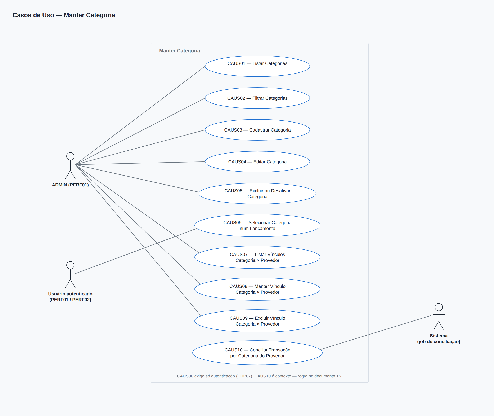
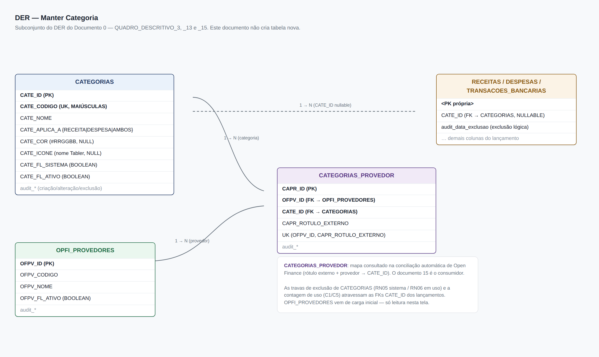
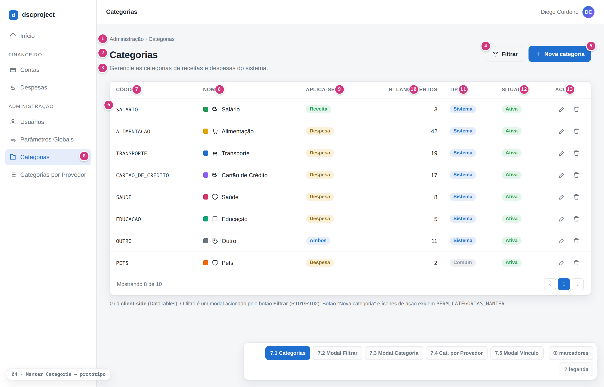
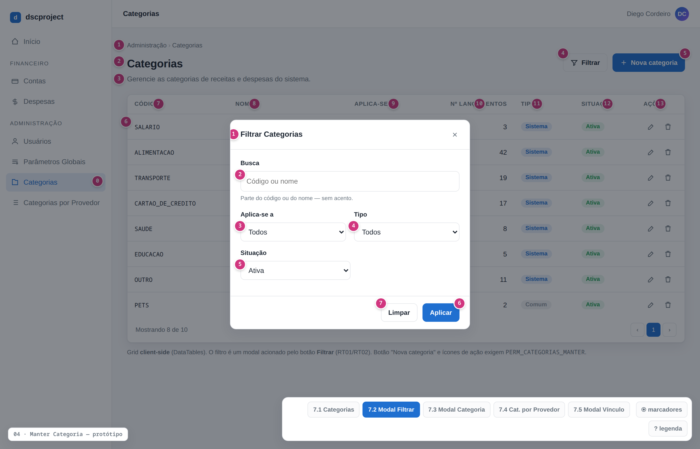
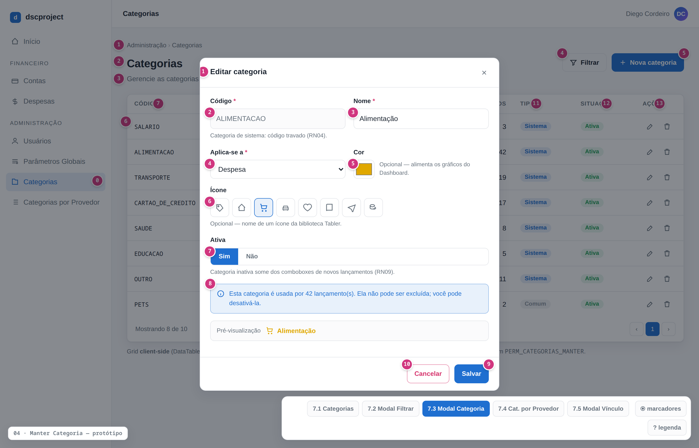
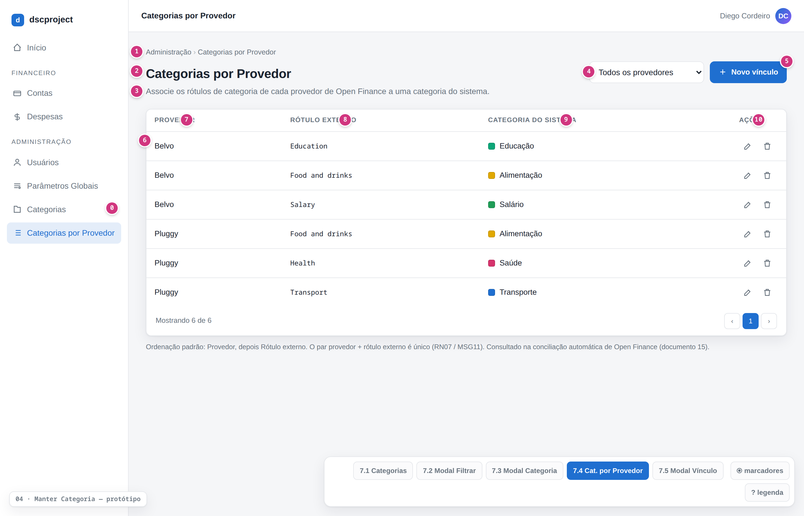
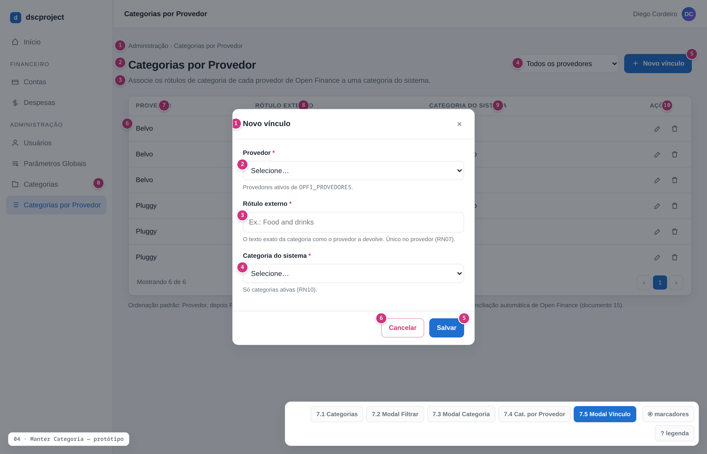

# dscproject — Análise de Sistemas
## Módulo Categorias — ADMIN — Manter Categoria

**Gerado em:** 07/09/2026
**Versão:** 1.0
**Status:** Analisado
**Projeto:** `dscproject-spring-mvc` (geração 2)

---

## Informações sobre o Documento

| Órgão | dscproject | Setor | Pessoal |
|---|---|---|---|
| Plataforma | dscproject-spring-mvc | Disciplina | Documentação |
| Área Cliente | Diego Cordeiro | Versão do Modelo | 2 (padrão híbrido) |

## Revisões e Aprovações

| Responsável por | Nome | Data de Execução |
|---|---|---|
| Revisão | Diego dos Santos Cordeiro | — |

## Histórico de Versões

| Versão | Data | Analista Responsável | Descrição da Alteração |
|---|---|---|---|
| 1.0 | 07/09/2026 | Diego dos Santos Cordeiro | Criação do documento. CRUD administrativo de Categoria (substitui o enum `CategoriaRegistroFinanceiro` da geração 1) e a tela do mapa `CATEGORIAS_PROVEDOR` (rótulo de categoria de um provedor de Open Finance → categoria do sistema), usada na conciliação automática. A estrutura das duas tabelas é a do Documento 0 ([QUADRO_DESCRITIVO_3](../00%20-%20analise-geral/documento-0-fundacao.md#quadro-descritivo-3) e [QUADRO_DESCRITIVO_15](../00%20-%20analise-geral/documento-0-fundacao.md#quadro-descritivo-15)) — este documento não introduz tabela nova |

---

## Diretrizes para Elaboração do Documento

| Nº | DIRETRIZ |
|---|---|
| D01 | As responsabilidades de camada são documentadas como **Regra de Tela (RT)** e **Regra de Negócio (RN)** — nunca "o backend deve" / "o frontend deve". |
| D02 | O termo `endpoint` é aceito na Seção 8. Fora dela, "chamada ao serviço". |
| D03 | A estrutura de dados é a do Documento 0 (`00 - analise-geral`). Este documento **referencia** os QUADRO_DESCRITIVO do Documento 0 e **não introduz tabela nova**. |

---

## 1. Introdução

Este documento descreve a funcionalidade **Manter Categoria** do `dscproject-spring-mvc`, junto com a tela auxiliar **Categorias por Provedor**.

Na geração 1 (API REST + SPA Angular), a categoria de um lançamento é o enum `CategoriaRegistroFinanceiro` (`SALARIO`, `ALIMENTACAO`, `CARTAO_DE_CREDITO`, …) — uma lista fixa no código, sem tela. O Documento 0 (Observação 14) travou a decisão de transformar esse enum na tabela **`CATEGORIAS`**, editável por tela, e de guardar o mapa "categoria do provedor → categoria do sistema" na tabela **`CATEGORIAS_PROVEDOR`**, consultada na conciliação automática das transações de Open Finance.

Este documento cobre:

- a **tela administrativa de Categorias** — listar, cadastrar, editar, desativar e excluir (exclusão lógica), com a proteção das categorias de carga inicial (`CATE_FL_SISTEMA = TRUE`);
- a **tela administrativa de Categorias por Provedor** — cadastrar e manter os vínculos rótulo externo + provedor → categoria;
- o **contrato de consulta** que as telas de lançamento (Receita, Despesa, Transação Bancária) usam para carregar as categorias no combobox.

**Escopo deste documento:**
- Tela de **listagem de categorias** (grid client-side), restrita a quem tem [PERM01](#perm01), com filtro por modal.
- **Cadastro e edição** de categoria via modal único (código, nome, aplica-se a, cor, ícone, situação).
- **Exclusão lógica** de categoria, com as travas: categoria de sistema não é excluível; categoria em uso por lançamentos não é excluível (pode ser desativada).
- **Desativação** de categoria (`CATE_FL_ATIVO = FALSE`) — some dos comboboxes de novos lançamentos sem afetar os lançamentos que já a usam.
- Tela de **listagem e manutenção** dos vínculos `CATEGORIAS_PROVEDOR`.
- **Fornecimento das categorias ativas** (filtradas por aplica-se a) para os comboboxes das telas de lançamento.
- Definição das permissões que estas telas usam. O RBAC completo é do Documento 0 e a tela que edita perfil × permissão é o documento `02 - manter-perfil-permissao`.

**Não contempla:**
- CRUD de Receita, Despesa e Transação Bancária, que **consomem** a categoria — documentos `08`, `09` e `10`.
- O job de sincronização de Open Finance e o passo de conciliação em si — documentos `14` e `15`. Aqui, apenas o mapa que a conciliação automática consulta.
- Cadastro de provedores de Open Finance (`OPFI_PROVEDORES`) — vem de carga inicial; a tela de Categorias por Provedor apenas o referencia num combobox.
- Categoria **por usuário**: `CATEGORIAS` não tem dono no Documento 0 — as categorias são globais (ver Seção 17).

**Perfis com acesso:** [PERF01](#perf01) (ADMIN) para as duas telas administrativas. O combobox de categorias das telas de lançamento ([EDP07](#edp07)) é disponível a qualquer usuário autenticado ([PERF01](#perf01) e [PERF02](#perf02)).

---

## 2. Observações

| Nº | OBSERVAÇÃO | REFERÊNCIA / IMPACTO |
|---|---|---|
| 1 | **A categoria deixa de ser enum.** `CategoriaRegistroFinanceiro` da geração 1 vira a tabela `CATEGORIAS` ([QUADRO_DESCRITIVO_3 do Documento 0](../00%20-%20analise-geral/documento-0-fundacao.md#quadro-descritivo-3)). `Receita`, `Despesa` e `TransacaoBancaria` passam a ter `CATE_ID` (FK, **nullable**) no lugar da coluna de enum. **[Requer código]** | [RN02](#rn02) |
| 2 | **Categorias são globais, geridas só por ADMIN.** `CATEGORIAS` não tem `USU_ID` no Documento 0 — não há categoria "de um usuário". Todo usuário vê o mesmo catálogo. Um eventual modelo de categoria própria por usuário exigiria coluna nova no Documento 0 e está fora do escopo (ver Seção 17). | [PERM01](#perm01), [PERM02](#perm02) |
| 3 | **Categoria de sistema** (`CATE_FL_SISTEMA = TRUE` — as de carga inicial, Seção 6.4): o código (`CATE_CODIGO`) **não é editável** e a categoria **não é excluível**. Nome, aplica-se a, cor, ícone e situação (ativa/inativa) **são** editáveis. Mesma regra do "perfil de sistema" do documento `02 - manter-perfil-permissao`. | [RN04](#rn04), [RN05](#rn05) |
| 4 | **Exclusão em uso.** Excluir uma categoria referenciada por algum lançamento (Receita, Despesa ou Transação Bancária não excluído) é **bloqueado** ([RN06](#rn06)); a alternativa é **desativar** a categoria. O comportamento é parametrizável ([Seção 12](#12-parâmetros-de-sistema)) — ver a decisão em aberto na Seção 17. | [RN06](#rn06) |
| 5 | **Desativação ≠ exclusão.** Uma categoria inativa (`CATE_FL_ATIVO = FALSE`) some dos comboboxes de **novos** lançamentos ([EDP07](#edp07)) e não pode ser escolhida em novos vínculos de provedor, mas continua válida nos lançamentos que já a usam, nos relatórios e na conciliação. | [RN09](#rn09) |
| 6 | **`CATE_APLICA_A`** (`RECEITA` / `DESPESA` / `AMBOS`) restringe em quais telas de lançamento a categoria aparece: a tela de Receita só mostra `RECEITA` e `AMBOS`; a de Despesa, `DESPESA` e `AMBOS`; a de Transação Bancária, todas. É um campo de negócio, não de auditoria. | [RN03](#rn03) |
| 7 | **Mapa de provedor em tela própria.** `CATEGORIAS_PROVEDOR` é mantido numa **tela administrativa dedicada**, não numa aba do modal de categoria (ver Seção 17). Como `OPFI_PROVEDORES` vem de carga inicial, esta tela funciona antes das telas de Open Finance (`14`/`15`). | [QUADRO_DESCRITIVO_4](#quadro-descritivo-4) |
| 8 | **Uso do mapa na conciliação automática.** Quando uma transação de *staging* chega com `OFTR_CATEGORIA_EXTERNA` preenchida, o passo de conciliação (documento `15`) casa esse rótulo + o provedor da conexão com uma linha de `CATEGORIAS_PROVEDOR` e resolve o `CATE_ID`. Sem correspondência, a transação fica sem categoria para a conciliação manual. Este documento só mantém o mapa; a regra de casamento é detalhada no documento `15`. | Documento 0, Observação 19 |
| 9 | **Pagamento de fatura de cartão** entra como `TransacaoBancaria` com `TRBA_FL_PAGAMENTO_FATURA = TRUE` e é **excluído** do total de gastos por categoria (Documento 0, Observação 16). Não há categoria específica para isso — a regra de exclusão é do documento do Dashboard. A categoria `CARTAO_DE_CREDITO` da carga inicial continua existindo para classificar compras, não o pagamento da fatura. | Documento 0, Observação 16 |
| 10 | **Carga inicial.** As 19 categorias equivalentes ao enum da geração 1 nascem com `CATE_FL_SISTEMA = TRUE` e `CATE_FL_ATIVO = TRUE`, via o `V1__init.sql` (Documento 0, Seção 6.4, grupo 2). A lista está na Seção 6.4 deste documento. | [RNF06](#rnf06) |
| 11 | **Grid client-side.** As duas telas carregam a lista completa uma vez e paginam/ordenam/filtram no navegador (DataTables). O catálogo de categorias tem dezenas de linhas; paginação server-side seria complexidade sem ganho. | [RNF04](#rnf04) |
| 12 | **Auditoria.** `CATEGORIAS` e `CATEGORIAS_PROVEDOR` são auditadas via Hibernate Envers (`@Audited`), conforme o Documento 0. Criação, edição, desativação e exclusão lógica ficam registradas (quem, quando, o quê). | [RNF02](#rnf02) |
| 13 | **Normalização do código.** `CATE_CODIGO` é gravado em MAIÚSCULAS, sem acento, com espaços trocados por `_` (ex.: "Cartão de Crédito" → `CARTAO_DE_CREDITO`). A tela reflete a normalização em tempo real; o serviço aplica de novo antes de persistir. | [RN02](#rn02), [RT08](#rt08) |
| 14 | **Cor e ícone.** `CATE_COR` (`#RRGGBB`) alimenta os gráficos do Dashboard; `CATE_ICONE` guarda o nome de um ícone da biblioteca do projeto (Tabler). Ambos opcionais. O conjunto de ícones aceitos é decisão de front — ver Seção 17. | Documento 0, [QUADRO_DESCRITIVO_3](../00%20-%20analise-geral/documento-0-fundacao.md#quadro-descritivo-3) |

---

## 3. Requisitos

### 3.1 Requisitos Funcionais

| ID | DESCRIÇÃO | PRIORIDADE | SITUAÇÃO |
|---|---|---|---|
| <a id="rf01"></a>RF01 | O sistema deve listar as categorias cadastradas, com: código, nome, aplica-se a, cor, ícone, quantidade de lançamentos que a usam, tipo (sistema/comum) e situação (ativa/inativa/excluída). | Alta | Em análise |
| <a id="rf02"></a>RF02 | O sistema deve permitir filtrar a listagem de categorias por texto (código/nome), aplica-se a, tipo e situação, por meio de um modal acionado pelo botão "Filtrar". | Média | Em análise |
| <a id="rf03"></a>RF03 | O sistema deve permitir cadastrar uma nova categoria via modal, com os campos: código, nome, aplica-se a, cor, ícone e situação (ativa). | Alta | Em análise |
| <a id="rf04"></a>RF04 | O sistema deve permitir editar uma categoria existente; o código só é editável em categorias que não são de sistema. | Alta | Em análise |
| <a id="rf05"></a>RF05 | O sistema deve impedir o cadastro ou a alteração de uma categoria com um código já em uso por outra categoria. | Alta | Em análise |
| <a id="rf06"></a>RF06 | O sistema deve impedir a exclusão de uma categoria de sistema e de uma categoria em uso por lançamentos, permitindo, nesses casos, apenas a desativação. | Alta | Em análise |
| <a id="rf07"></a>RF07 | O sistema deve fornecer às telas de lançamento (Receita, Despesa, Transação Bancária) a lista de categorias ativas, filtrada por aplica-se a, para o combobox de categoria. | Alta | Em análise |
| <a id="rf08"></a>RF08 | O sistema deve listar os vínculos categoria × provedor de Open Finance, com: rótulo externo, provedor e categoria do sistema. | Média | Em análise |
| <a id="rf09"></a>RF09 | O sistema deve permitir cadastrar e editar um vínculo categoria × provedor (rótulo externo + provedor → categoria). | Média | Em análise |
| <a id="rf10"></a>RF10 | O sistema deve impedir o cadastro de dois vínculos com o mesmo rótulo externo no mesmo provedor. | Média | Em análise |
| <a id="rf11"></a>RF11 | O sistema deve permitir a exclusão lógica de um vínculo categoria × provedor. | Média | Em análise |
| <a id="rf12"></a>RF12 | O sistema deve, no passo de conciliação automática das transações de Open Finance, consultar o mapa categoria × provedor para resolver a categoria de uma transação importada (regra detalhada no documento `15`). | Média | Em análise |

### 3.2 Requisitos Não Funcionais

| ID | CATEGORIA | DESCRIÇÃO | CRITÉRIO DE ACEITAÇÃO |
|---|---|---|---|
| <a id="rnf01"></a>RNF01 | Segurança | Cada endpoint das telas administrativas exige a autoridade da sua operação (`PERM_CATEGORIAS_LISTAR`, `PERM_CATEGORIAS_MANTER`, `PERM_CATEGORIAS_PROVEDOR_LISTAR`, `PERM_CATEGORIAS_PROVEDOR_MANTER` — ver Seção 13 e [RN01](#rn01)). O combobox de categorias ([EDP07](#edp07)) exige apenas usuário autenticado. | Teste de acesso com ADMIN, com USER e com um perfil que tenha só parte das permissões. |
| <a id="rnf02"></a>RNF02 | Auditoria | `CATEGORIAS` e `CATEGORIAS_PROVEDOR` têm auditoria completa via Hibernate Envers. | Inspeção das tabelas `_aud` após operações de CRUD. |
| <a id="rnf03"></a>RNF03 | Integridade | `CATE_CODIGO` é único no banco (`uq_categorias_codigo`); o par provedor + rótulo externo é único (`uq_categorias_provedor_rotulo`). As travas de exclusão ([RN05](#rn05), [RN06](#rn06)) e as unicidades ([RN02](#rn02), [RN07](#rn07)) são validadas no serviço, não só na tela. | Teste chamando o endpoint diretamente. |
| <a id="rnf04"></a>RNF04 | Desempenho | As listagens ([EDP02](#edp02), [EDP09](#edp09)) respondem em menos de 1 s carregando a lista completa uma vez. O combobox de categorias ([EDP07](#edp07)) pode ser cacheado e invalidado nas gravações desta tela. | Medição em homologação. |
| <a id="rnf05"></a>RNF05 | Usabilidade | A interface segue o padrão do projeto (Thymeleaf + Tabler + DataTables + AJAX) e é responsiva. O modal de categoria tem seletor de cor e seletor de ícone. | Revisão visual do protótipo. |
| <a id="rnf06"></a>RNF06 | Consistência da carga inicial | As 19 categorias equivalentes ao enum da geração 1 são criadas pelo `V1__init.sql` com `CATE_FL_SISTEMA = TRUE`. | Revisão do script Flyway contra a Seção 6.4. |

---

## 4. Casos de Uso



Fonte: `prototipo/manter-categoria-casos-uso.drawio` (editável) e `prototipo/_diagrama-casos-uso.html` (render).

| CÓDIGO | NOME | ATOR PRINCIPAL | DESCRIÇÃO |
|---|---|---|---|
| <a id="caus01"></a>CAUS01 | Listar Categorias | [PERF01](#perf01) | ADMIN acessa o menu e visualiza a lista de categorias. ([RF01](#rf01)) |
| <a id="caus02"></a>CAUS02 | Filtrar Categorias | [PERF01](#perf01) | ADMIN abre o modal de filtro, informa os critérios e aplica. ([RF02](#rf02)) |
| <a id="caus03"></a>CAUS03 | Cadastrar Categoria | [PERF01](#perf01) | ADMIN abre o modal de cadastro, preenche os dados e confirma. ([RF03](#rf03), [RF05](#rf05)) |
| <a id="caus04"></a>CAUS04 | Editar Categoria | [PERF01](#perf01) | ADMIN abre o modal de edição, altera os dados e confirma; o código de categoria de sistema fica bloqueado. ([RF04](#rf04), [RF05](#rf05)) |
| <a id="caus05"></a>CAUS05 | Excluir ou Desativar Categoria | [PERF01](#perf01) | ADMIN exclui logicamente uma categoria comum sem uso, ou a desativa quando ela é de sistema ou está em uso. ([RF06](#rf06)) |
| <a id="caus06"></a>CAUS06 | Selecionar Categoria num Lançamento | [PERF01](#perf01), [PERF02](#perf02) | Usuário autenticado, ao cadastrar uma receita/despesa/transação, escolhe a categoria num combobox alimentado pelas categorias ativas. ([RF07](#rf07)) |
| <a id="caus07"></a>CAUS07 | Listar Vínculos Categoria × Provedor | [PERF01](#perf01) | ADMIN acessa o menu e visualiza o mapa categoria × provedor. ([RF08](#rf08)) |
| <a id="caus08"></a>CAUS08 | Manter Vínculo Categoria × Provedor | [PERF01](#perf01) | ADMIN cadastra ou edita um vínculo rótulo externo + provedor → categoria. ([RF09](#rf09), [RF10](#rf10)) |
| <a id="caus09"></a>CAUS09 | Excluir Vínculo Categoria × Provedor | [PERF01](#perf01) | ADMIN exclui logicamente um vínculo. ([RF11](#rf11)) |
| <a id="caus10"></a>CAUS10 | Conciliar Transação por Categoria do Provedor | Sistema (job de conciliação) | O passo de conciliação automática consulta o mapa para resolver a categoria de uma transação importada. Contexto — regra no documento `15`. ([RF12](#rf12)) |

---

## 5. Localização / Critérios de Aceitação

**Caminho de Navegação:**
- Menu principal > Administração > Categorias
- Menu principal > Administração > Categorias por Provedor

**Critérios de Aceitação:**
- O menu 'Categorias' e o menu 'Categorias por Provedor' são visíveis apenas para quem tem, respectivamente, [PERM01](#perm01) e [PERM03](#perm03).
- Ao acessar cada tela, a listagem é carregada automaticamente.
- O filtro de categorias é aplicado por um modal acionado pelo botão "Filtrar".
- O cadastro e a edição de categoria são feitos num modal único.
- O campo Código fica desabilitado ao editar uma categoria de sistema.
- Não é possível excluir uma categoria de sistema nem uma categoria em uso por lançamentos; nesses casos, a tela oferece a desativação.
- Uma categoria inativa não aparece nos comboboxes de novos lançamentos, mas os lançamentos que já a usam permanecem inalterados.
- Não é possível cadastrar dois vínculos com o mesmo rótulo externo no mesmo provedor.
- As telas de lançamento recebem apenas as categorias ativas, já filtradas por aplica-se a.

---

## 6. Banco de Dados

Toda a estrutura está no **Documento 0** (`00 - analise-geral`). Este documento **não introduz tabela nova**.

| Tabela | Onde | Papel nesta tela |
|---|---|---|
| `CATEGORIAS` | Documento 0 — [QUADRO_DESCRITIVO_3](../00%20-%20analise-geral/documento-0-fundacao.md#quadro-descritivo-3) | CRUD + desativação |
| `CATEGORIAS_PROVEDOR` | Documento 0 — [QUADRO_DESCRITIVO_15](../00%20-%20analise-geral/documento-0-fundacao.md#quadro-descritivo-15) | CRUD do vínculo |
| `OPFI_PROVEDORES` | Documento 0 — [QUADRO_DESCRITIVO_13](../00%20-%20analise-geral/documento-0-fundacao.md#quadro-descritivo-13) | Somente leitura (combobox de provedor no vínculo) |
| `RECEITAS` / `DESPESAS` / `TRANSACOES_BANCARIAS` | Documento 0 — [QUADRO_DESCRITIVO_9](../00%20-%20analise-geral/documento-0-fundacao.md#quadro-descritivo-9), [_10](../00%20-%20analise-geral/documento-0-fundacao.md#quadro-descritivo-10), [_7](../00%20-%20analise-geral/documento-0-fundacao.md#quadro-descritivo-7) | Somente leitura (contagem de uso de uma categoria — [C5](#c5)); `CATE_ID` é FK **nullable** |

> Nenhum `ALTER TABLE` neste documento. A FK `CATE_ID` já existe em `RECEITAS`, `DESPESAS` e `TRANSACOES_BANCARIAS` (Documento 0), e a coluna é anulável — a base do comportamento discutido em [RN06](#rn06).

### 6.1 Diagrama ER



Subconjunto do DER do Documento 0: `CATEGORIAS`, `CATEGORIAS_PROVEDOR`, `OPFI_PROVEDORES` e as FKs `CATE_ID` (nullable) em `RECEITAS`/`DESPESAS`/`TRANSACOES_BANCARIAS`. Fonte: `prototipo/manter-categoria-der.drawio` (editável) e `prototipo/_diagrama-der.html` (render).

### 6.2 Auditoria de Tabelas

| TABELA PRINCIPAL | TABELA DE AUDITORIA | CAMPOS AUDITADOS |
|---|---|---|
| CATEGORIAS | CATEGORIAS_aud | Código, nome, aplica-se a, cor, ícone, flag de ativo, flag de sistema. Registra criação, edição, desativação e exclusão lógica |
| CATEGORIAS_PROVEDOR | CATEGORIAS_PROVEDOR_aud | Rótulo externo, categoria e provedor do vínculo. Registra criação e exclusão lógica |

### 6.3 Procedures / Views / Triggers / Functions

Nenhuma. A normalização do código, a contagem de uso e o casamento da conciliação ficam na camada de serviço.

### 6.4 Carga Inicial das Categorias de Sistema

As 19 categorias abaixo equivalem ao enum `CategoriaRegistroFinanceiro` da geração 1 (`dsc-backend`, `enums/CategoriaRegistroFinanceiro.java`). São inseridas pelo `V1__init.sql` (Documento 0, Seção 6.4, grupo 2) com `CATE_FL_SISTEMA = TRUE`, `CATE_FL_ATIVO = TRUE`, `CATE_COR` e `CATE_ICONE` nulos (ajustáveis por tela depois).

| CATE_CODIGO | CATE_NOME | CATE_APLICA_A |
|---|---|---|
| SALARIO | Salário | RECEITA |
| SALARIO_DECIMO_TERCEIRO | 13º Salário | RECEITA |
| EXTRA | Renda Extra | RECEITA |
| FERIAS | Férias | RECEITA |
| INVESTIMENTO | Investimento | RECEITA |
| MORADIA | Moradia | DESPESA |
| ALIMENTACAO | Alimentação | DESPESA |
| LAZER | Lazer | DESPESA |
| VESTUARIO | Vestuário | DESPESA |
| TRANSPORTE | Transporte | DESPESA |
| CARRO | Carro | DESPESA |
| SAUDE | Saúde | DESPESA |
| EDUCACAO | Educação | DESPESA |
| SERVICOS | Serviços | DESPESA |
| EMPRESTIMOS | Empréstimos | DESPESA |
| CARTAO_DE_CREDITO | Cartão de Crédito | DESPESA |
| TAXAS_EMPRESA | Taxas PJ | DESPESA |
| EMPRESA | Empresa | DESPESA |
| OUTRO | Outro | AMBOS |

> O agrupamento receita/despesa segue os comentários do enum da geração 1. `INVESTIMENTO` (como `RECEITA`) e `OUTRO` (como `AMBOS`) são pontos a confirmar — ver Seção 17.

---

## 7. Protótipos de Interface

Protótipo navegável: `prototipo/manter-categoria-prototipo.html`. Wireframes editáveis: `prototipo/manter-categoria-prototipo.drawio` (5 páginas, 7.1 a 7.5). PNGs regeráveis por `prototipo/render-pngs.py`. Os números em destaque nas telas correspondem aos IDs dos itens do respectivo QUADRO_DESCRITIVO.

### <a id="quadro-descritivo-1"></a>7.1 Tela: Categorias (Listagem) — QUADRO_DESCRITIVO_1



> OBSERVAÇÕES: Tela acessada via 'Administração > Categorias'. Restrita a quem tem [PERM01](#perm01). Grid client-side. O filtro é acionado por um modal (botão "Filtrar").

| ID | NOME | PROPRIEDADES | OBSERVAÇÕES |
|---|---|---|---|
| <a id="qdd1-0"></a>0 | LINK | Caminho: "/categorias/listar" | — |
| <a id="qdd1-1"></a>1 | BREADCRUMB | Tipo: Texto<br>Texto: Administração > Categorias | — |
| <a id="qdd1-2"></a>2 | TÍTULO DA TELA | Tipo: Texto<br>Texto: Categorias | — |
| <a id="qdd1-3"></a>3 | DESCRIÇÃO | Tipo: Texto<br>Texto: Gerencie as categorias de receitas e despesas do sistema. | — |
| <a id="qdd1-4"></a>4 | BOTÃO FILTRAR | Tipo: Botão<br>Texto: Filtrar<br>Ícone: filter | Ao clicar, executar [RT01](#rt01). |
| <a id="qdd1-5"></a>5 | BOTÃO NOVA CATEGORIA | Tipo: Botão (primário)<br>Texto: Nova categoria<br>Ícone: plus | Visível a quem tem [PERM02](#perm02). Ao clicar, executar [RT04](#rt04). |
| <a id="qdd1-6"></a>6 | GRID DE LISTAGEM | Tipo: Grid (DataTables, client-side)<br>Colunas: [ID7](#qdd1-7)…[ID14](#qdd1-14)<br>Itens por página: 10, 25, 50<br>Ordenação padrão: Nome crescente<br>Endpoint: [EDP02](#edp02) | Carrega a lista completa uma vez. Filtra em memória conforme [RT02](#rt02). |
| <a id="qdd1-7"></a>7 | CÓDIGO | Tipo: Coluna<br>Ordenação: Sim | Exibe [C1](#c1).codigo. |
| <a id="qdd1-8"></a>8 | NOME | Tipo: Coluna<br>Ordenação: Sim | Exibe [C1](#c1).nome. Precedido do ícone ([C1](#c1).icone) e de um marcador na cor ([C1](#c1).cor), quando houver. |
| <a id="qdd1-9"></a>9 | APLICA-SE A | Tipo: Coluna (badge)<br>Ordenação: Sim | Receita / Despesa / Ambos, de [C1](#c1).aplicaA. |
| <a id="qdd1-10"></a>10 | Nº DE LANÇAMENTOS | Tipo: Coluna (número)<br>Ordenação: Sim | Exibe [C1](#c1).qtdUso — soma de receitas, despesas e transações não excluídas que usam a categoria. |
| <a id="qdd1-11"></a>11 | TIPO | Tipo: Coluna (badge)<br>Ordenação: Sim | "Sistema" quando `CATE_FL_SISTEMA`; "Comum" caso contrário. |
| <a id="qdd1-12"></a>12 | SITUAÇÃO | Tipo: Coluna (badge)<br>Ordenação: Sim | "Ativa" (verde) quando `CATE_FL_ATIVO` e sem `audit_data_exclusao`; "Inativa" (cinza) quando `CATE_FL_ATIVO = FALSE`; "Excluída" quando há `audit_data_exclusao`. |
| <a id="qdd1-13"></a>13 | AÇÃO | Tipo: Coluna | Visível a quem tem [PERM02](#perm02). Ícones [ID14](#qdd1-14). |
| <a id="qdd1-14"></a>14 | ÍCONES DE AÇÃO | Tipo: Ícones<br>Editar (ícone: edit, tooltip: Editar categoria)<br>Excluir (ícone: trash, tooltip: Excluir categoria) | Editar → [RT05](#rt05). Excluir → [RT07](#rt07); oculto quando a categoria já está excluída. |

### <a id="quadro-descritivo-2"></a>7.2 Modal: Filtrar Categorias — QUADRO_DESCRITIVO_2



> OBSERVAÇÕES: Todos os campos são opcionais. O filtro é aplicado em memória sobre a lista já carregada ([RT02](#rt02)).

| ID | NOME | PROPRIEDADES | OBSERVAÇÕES |
|---|---|---|---|
| <a id="qdd2-1"></a>1 | TÍTULO DO MODAL | Tipo: Texto<br>Texto: Filtrar Categorias | — |
| <a id="qdd2-2"></a>2 | FILTRO – BUSCA | Tipo: Input Text<br>Obrigatório: Não<br>Placeholder: Código ou nome<br>Tooltip: Filtre por parte do código ou do nome. | Filtro parcial e sem acento sobre código e nome. |
| <a id="qdd2-3"></a>3 | FILTRO – APLICA-SE A | Tipo: Combobox<br>Obrigatório: Não<br>Placeholder: Todos<br>Domínio: Todos / Receita / Despesa / Ambos | Filtra por [C1](#c1).aplicaA. Ver [SB02](#sb02). |
| <a id="qdd2-4"></a>4 | FILTRO – TIPO | Tipo: Combobox<br>Obrigatório: Não<br>Placeholder: Todos<br>Domínio: Todos / Sistema / Comum | Filtra por `CATE_FL_SISTEMA`. Ver [SB03](#sb03). |
| <a id="qdd2-5"></a>5 | FILTRO – SITUAÇÃO | Tipo: Combobox<br>Obrigatório: Não<br>Valor default: Ativa<br>Domínio: Ativa / Inativa / Excluída / Todas | Filtra por `CATE_FL_ATIVO` e pela presença de `audit_data_exclusao`. Ver [SB04](#sb04). |
| <a id="qdd2-6"></a>6 | BOTÃO APLICAR | Tipo: Botão<br>Texto: Aplicar | Ao clicar, executar [RT02](#rt02). |
| <a id="qdd2-7"></a>7 | BOTÃO LIMPAR | Tipo: Botão<br>Texto: Limpar | Ao clicar, executar [RT03](#rt03). |

### <a id="quadro-descritivo-3"></a>7.3 Modal: Cadastro / Edição de Categoria — QUADRO_DESCRITIVO_3



> OBSERVAÇÕES: Modal único de cadastro e edição, restrito a [PERM02](#perm02). Ao editar uma categoria de sistema, o campo Código fica desabilitado ([RN04](#rn04)) e não há como alterar o tipo. O campo Situação (ativa) só aparece na edição.

| ID | NOME | PROPRIEDADES | OBSERVAÇÕES |
|---|---|---|---|
| <a id="qdd3-1"></a>1 | TÍTULO DO MODAL | Tipo: Texto<br>Texto: Nova categoria / Editar categoria | Varia conforme o modo. |
| <a id="qdd3-2"></a>2 | CAMPO – CÓDIGO | Tipo: Input Text<br>Tamanho: 40<br>Obrigatório: Sim | Grava `CATE_CODIGO`. Normalizado ([RT08](#rt08)). Único ([RN02](#rn02)). **Desabilitado** ao editar categoria de sistema ([RN04](#rn04)). |
| <a id="qdd3-3"></a>3 | CAMPO – NOME | Tipo: Input Text<br>Tamanho: 100<br>Obrigatório: Sim | Grava `CATE_NOME`. Nome de exibição. |
| <a id="qdd3-4"></a>4 | CAMPO – APLICA-SE A | Tipo: Combobox<br>Obrigatório: Sim<br>Domínio: Receita / Despesa / Ambos | Grava `CATE_APLICA_A`. Ver [SB01](#sb01) e [RN03](#rn03). |
| <a id="qdd3-5"></a>5 | CAMPO – COR | Tipo: Seletor de cor (input color)<br>Obrigatório: Não | Grava `CATE_COR` (`#RRGGBB`). Usada nos gráficos do Dashboard. |
| <a id="qdd3-6"></a>6 | CAMPO – ÍCONE | Tipo: Seletor de ícone<br>Obrigatório: Não | Grava `CATE_ICONE` (nome do ícone Tabler). Ver [SB05](#sb05). |
| <a id="qdd3-7"></a>7 | CAMPO – ATIVA | Tipo: Toggle (Sim/Não)<br>Valor default: Sim<br>Exibição: só no modo edição | Grava `CATE_FL_ATIVO`. Ver [RN09](#rn09). |
| <a id="qdd3-8"></a>8 | AVISO – CATEGORIA EM USO | Tipo: Texto informativo | Exibido no modo edição quando [C1](#c1).qtdUso > 0: "Esta categoria é usada por {n} lançamento(s). Ela não pode ser excluída; você pode desativá-la." |
| <a id="qdd3-9"></a>9 | BOTÃO SALVAR | Tipo: Botão (primário)<br>Texto: Salvar<br>Endpoint: [EDP04](#edp04) (criação) ou [EDP05](#edp05) (edição) | Ao clicar, executar [RT06](#rt06). |
| <a id="qdd3-10"></a>10 | BOTÃO CANCELAR | Tipo: Botão<br>Texto: Cancelar | Fecha sem salvar. |

### <a id="quadro-descritivo-4"></a>7.4 Tela: Categorias por Provedor (Listagem) — QUADRO_DESCRITIVO_4



> OBSERVAÇÕES: Tela acessada via 'Administração > Categorias por Provedor'. Restrita a quem tem [PERM03](#perm03). Grid client-side. Mantém o mapa que a conciliação automática de Open Finance consulta ([Observação 8](#2-observações)).

| ID | NOME | PROPRIEDADES | OBSERVAÇÕES |
|---|---|---|---|
| <a id="qdd4-0"></a>0 | LINK | Caminho: "/categorias-provedor/listar" | — |
| <a id="qdd4-1"></a>1 | BREADCRUMB | Tipo: Texto<br>Texto: Administração > Categorias por Provedor | — |
| <a id="qdd4-2"></a>2 | TÍTULO DA TELA | Tipo: Texto<br>Texto: Categorias por Provedor | — |
| <a id="qdd4-3"></a>3 | DESCRIÇÃO | Tipo: Texto<br>Texto: Associe os rótulos de categoria de cada provedor de Open Finance a uma categoria do sistema. | — |
| <a id="qdd4-4"></a>4 | FILTRO – PROVEDOR | Tipo: Combobox<br>Obrigatório: Não<br>Placeholder: Todos os provedores<br>Domínio: "Todos" + provedores de `OPFI_PROVEDORES` | Filtra o grid em memória. Ver [SB06](#sb06). |
| <a id="qdd4-5"></a>5 | BOTÃO NOVO VÍNCULO | Tipo: Botão (primário)<br>Texto: Novo vínculo<br>Ícone: plus | Visível a quem tem [PERM04](#perm04). Ao clicar, executar [RT10](#rt10). |
| <a id="qdd4-6"></a>6 | GRID DE LISTAGEM | Tipo: Grid (DataTables, client-side)<br>Colunas: [ID7](#qdd4-7)…[ID10](#qdd4-10)<br>Ordenação padrão: Provedor, depois Rótulo externo<br>Endpoint: [EDP09](#edp09) | Filtra em memória conforme [RT02](#rt02). |
| <a id="qdd4-7"></a>7 | PROVEDOR | Tipo: Coluna<br>Ordenação: Sim | Exibe [C3](#c3).provedorNome. |
| <a id="qdd4-8"></a>8 | RÓTULO EXTERNO | Tipo: Coluna<br>Ordenação: Sim | Exibe [C3](#c3).rotuloExterno — a categoria como o provedor a nomeia. |
| <a id="qdd4-9"></a>9 | CATEGORIA DO SISTEMA | Tipo: Coluna (badge)<br>Ordenação: Sim | Exibe [C3](#c3).categoriaNome. |
| <a id="qdd4-10"></a>10 | AÇÃO | Tipo: Coluna | Visível a quem tem [PERM04](#perm04). Ícone Editar → [RT11](#rt11); ícone Excluir → [RT13](#rt13). |

### <a id="quadro-descritivo-5"></a>7.5 Modal: Cadastro / Edição de Vínculo Categoria × Provedor — QUADRO_DESCRITIVO_5



> OBSERVAÇÕES: Modal único de cadastro e edição, restrito a [PERM04](#perm04). O par provedor + rótulo externo é único ([RN07](#rn07)).

| ID | NOME | PROPRIEDADES | OBSERVAÇÕES |
|---|---|---|---|
| <a id="qdd5-1"></a>1 | TÍTULO DO MODAL | Tipo: Texto<br>Texto: Novo vínculo / Editar vínculo | Varia conforme o modo. |
| <a id="qdd5-2"></a>2 | CAMPO – PROVEDOR | Tipo: Combobox<br>Obrigatório: Sim<br>Domínio: provedores ativos de `OPFI_PROVEDORES` | Grava `OFPV_ID`. Ver [SB06](#sb06). |
| <a id="qdd5-3"></a>3 | CAMPO – RÓTULO EXTERNO | Tipo: Input Text<br>Tamanho: 120<br>Obrigatório: Sim | Grava `CAPR_ROTULO_EXTERNO` — o texto exato da categoria como o provedor a devolve. Único no provedor ([RN07](#rn07)). |
| <a id="qdd5-4"></a>4 | CAMPO – CATEGORIA DO SISTEMA | Tipo: Combobox<br>Obrigatório: Sim<br>Domínio: categorias ativas | Grava `CATE_ID`. Ver [SB07](#sb07) e [RN10](#rn10). |
| <a id="qdd5-5"></a>5 | BOTÃO SALVAR | Tipo: Botão (primário)<br>Texto: Salvar<br>Endpoint: [EDP11](#edp11) (criação) ou [EDP12](#edp12) (edição) | Ao clicar, executar [RT12](#rt12). |
| <a id="qdd5-6"></a>6 | BOTÃO CANCELAR | Tipo: Botão<br>Texto: Cancelar | Fecha sem salvar. |

### 7.6 Suggestion Boxes

| ID | NOME | DESCRIÇÃO |
|---|---|---|
| <a id="sb01"></a>SB01 | APLICA-SE A | Domínio fixo do enum de negócio (Receita, Despesa, Ambos). Renderizado como combobox; não é entidade. |
| <a id="sb02"></a>SB02 | FILTRO APLICA-SE A | Domínio fixo do próprio filtro: Todos, Receita, Despesa, Ambos. |
| <a id="sb03"></a>SB03 | FILTRO TIPO | Domínio fixo do próprio filtro: Todos, Sistema, Comum. |
| <a id="sb04"></a>SB04 | FILTRO SITUAÇÃO | Domínio fixo do próprio filtro: Ativa, Inativa, Excluída, Todas. |
| <a id="sb05"></a>SB05 | ÍCONE | Lista de ícones da biblioteca do projeto (Tabler), carregada de um recurso estático de front. Não é entidade. Conjunto aceito a confirmar (Seção 17). |
| <a id="sb06"></a>SB06 | PROVEDOR | Itens carregados de `OPFI_PROVEDORES` (Documento 0, [QUADRO_DESCRITIVO_13](../00%20-%20analise-geral/documento-0-fundacao.md#quadro-descritivo-13)) via [EDP14](#edp14), ordenados por nome. No filtro do grid ([ID4](#qdd4-4)), a opção "Todos os provedores" é adicional. No modal de vínculo, só provedores ativos. Nunca `<option>` fixo no HTML. |
| <a id="sb07"></a>SB07 | CATEGORIA DO SISTEMA | Itens carregados de `CATEGORIAS` via [EDP07](#edp07) sem filtro de aplica-se a (todas as ativas), ordenados por nome. Nunca `<option>` fixo no HTML. |

### 7.7 Regras de Tela

| ID | DESCRIÇÃO |
|---|---|
| <a id="rt01"></a>RT01 | Ao clicar em "Filtrar" ([ID4](#qdd1-4)), abrir o modal de filtro ([QUADRO_DESCRITIVO_2](#quadro-descritivo-2)) com os valores atualmente aplicados. |
| <a id="rt02"></a>RT02 | Ao clicar em "Aplicar" ([ID6](#qdd2-6)), filtrar **em memória** a lista já carregada: busca parcial e sem acento sobre código/nome, e correspondência exata de aplica-se a, tipo e situação. Fechar o modal. Se nada restar, exibir [MSG09](#msg09) na área do grid. A mesma filtragem em memória vale para o filtro de provedor da tela de Categorias por Provedor ([ID4](#qdd4-4)). |
| <a id="rt03"></a>RT03 | Ao clicar em "Limpar" ([ID7](#qdd2-7)), voltar Busca, Aplica-se a e Tipo para vazio, Situação para "Ativa", e reaplicar conforme [RT02](#rt02). |
| <a id="rt04"></a>RT04 | Ao clicar em "Nova categoria" ([ID5](#qdd1-5)) — visível só com [PERM02](#perm02) —, abrir o modal ([QUADRO_DESCRITIVO_3](#quadro-descritivo-3)) em modo criação: campos vazios, Aplica-se a sem seleção, sem o campo Ativa. |
| <a id="rt05"></a>RT05 | Ao clicar no ícone Editar ([ID14](#qdd1-14)) — visível só com [PERM02](#perm02) —, chamar [EDP03](#edp03) com o id e abrir o modal em modo edição, com os campos preenchidos. Se a categoria for de sistema, o campo Código fica desabilitado ([RN04](#rn04)). Se [C1](#c1).qtdUso > 0, exibir o aviso [ID8](#qdd3-8). |
| <a id="rt06"></a>RT06 | Ao clicar em "Salvar" ([ID9](#qdd3-9)): validar Código, Nome e Aplica-se a obrigatórios ([MSG02](#msg02)) e aplicar [RT08](#rt08). Em criação, chamar [EDP04](#edp04); em edição, [EDP05](#edp05). Em sucesso, exibir [MSG01](#msg01) (criação) ou [MSG04](#msg04) (edição), fechar o modal e recarregar o grid via [EDP02](#edp02). Código duplicado → [MSG03](#msg03). Tentativa de alterar o código de categoria de sistema no servidor ([RN04](#rn04)) → [MSG05](#msg05). |
| <a id="rt07"></a>RT07 | Ao clicar no ícone Excluir ([ID14](#qdd1-14)) — visível só com [PERM02](#perm02) —, exibir a confirmação [MSG07](#msg07). Ao confirmar, chamar [EDP06](#edp06). Categoria de sistema → [MSG05](#msg05); categoria em uso → [MSG06](#msg06), com a oferta de desativar (ao aceitar, chamar [EDP05](#edp05) apenas com `CATE_FL_ATIVO = FALSE`). Em sucesso da exclusão, exibir [MSG08](#msg08) e recarregar o grid. |
| <a id="rt08"></a>RT08 | Ao digitar no campo Código ([ID2](#qdd3-2)), normalizar em tempo real: maiúsculas, remoção de acento, espaços e hífens trocados por `_`, e remoção dos demais caracteres não alfanuméricos. |
| <a id="rt09"></a>RT09 | Ao selecionar uma cor ([ID5](#qdd3-5)) ou um ícone ([ID6](#qdd3-6)), exibir a pré-visualização do par cor + ícone ao lado do campo Nome. |
| <a id="rt10"></a>RT10 | Ao clicar em "Novo vínculo" ([ID5](#qdd4-5)) — visível só com [PERM04](#perm04) —, abrir o modal ([QUADRO_DESCRITIVO_5](#quadro-descritivo-5)) em modo criação: Provedor carregado por [EDP14](#edp14), Categoria carregada por [EDP07](#edp07), campos vazios. |
| <a id="rt11"></a>RT11 | Ao clicar no ícone Editar ([ID10](#qdd4-10)) — visível só com [PERM04](#perm04) —, chamar [EDP10](#edp10) com o id e abrir o modal em modo edição, com Provedor, Rótulo externo e Categoria preenchidos. |
| <a id="rt12"></a>RT12 | Ao clicar em "Salvar" ([ID5](#qdd5-5)): validar Provedor, Rótulo externo e Categoria obrigatórios ([MSG02](#msg02)). Em criação, chamar [EDP11](#edp11); em edição, [EDP12](#edp12). Em sucesso, exibir [MSG10](#msg10) (criação) ou [MSG12](#msg12) (edição), fechar o modal e recarregar o grid via [EDP09](#edp09). Rótulo já mapeado no provedor → [MSG11](#msg11). |
| <a id="rt13"></a>RT13 | Ao clicar no ícone Excluir ([ID10](#qdd4-10)) — visível só com [PERM04](#perm04) —, exibir a confirmação [MSG13](#msg13). Ao confirmar, chamar [EDP13](#edp13). Em sucesso, exibir [MSG14](#msg14) e recarregar o grid. |

---

## 8. Endpoints

| CÓDIGO | HTTP | PERMISSÃO | PATH | FINALIZADO? |
|---|---|---|---|---|
| <a id="edp01"></a>EDP01 | GET | [PERM01](#perm01) | /categorias/listar | N |
| Retorna a página da listagem de categorias (Thymeleaf). O grid é carregado por [EDP02](#edp02). | | | | |
| <a id="edp02"></a>EDP02 | GET | [PERM01](#perm01) | /categorias/listar-dados | N |
| Lista de categorias para o grid, em JSON. Executa [C1](#c1). Campos: id, codigo, nome, aplicaA, cor, icone, qtdUso, sistema (boolean), ativo (boolean), excluido (boolean). Sem paginação (client-side). | | | | |
| <a id="edp03"></a>EDP03 | GET | [PERM02](#perm02) | /categorias/buscar/{id} | N |
| Retorna uma categoria para edição. Campos: id, codigo, nome, aplicaA, cor, icone, ativo, sistema, qtdUso. | | | | |
| <a id="edp04"></a>EDP04 | POST | [PERM02](#perm02) | /categorias/inserir | N |
| Cria uma categoria. Executa [RN02](#rn02) (normaliza e valida o código único, via [C4](#c4)), [RN03](#rn03). Dados: codigo, nome, aplicaA, cor, icone. `CATE_FL_ATIVO = TRUE` e `CATE_FL_SISTEMA = FALSE` fixos. Retorno: 200 ([MSG01](#msg01)) ou 422 ([MSG02](#msg02)/[MSG03](#msg03)). | | | | |
| <a id="edp05"></a>EDP05 | PUT | [PERM02](#perm02) | /categorias/editar/{id} | N |
| Edita uma categoria. Executa [RN02](#rn02), [RN03](#rn03), [RN04](#rn04) (categoria de sistema: ignora qualquer mudança de `CATE_CODIGO` e de `CATE_FL_SISTEMA`), [RN09](#rn09) (desativação). Dados: codigo, nome, aplicaA, cor, icone, ativo. Invalida o cache do combobox de categorias ([RNF04](#rnf04)). Retorno: 200 ([MSG04](#msg04)) ou 422 ([MSG02](#msg02)/[MSG03](#msg03)/[MSG05](#msg05)). | | | | |
| <a id="edp06"></a>EDP06 | DELETE | [PERM02](#perm02) | /categorias/excluir/{id} | N |
| Exclusão lógica da categoria. Executa [RN05](#rn05) (recusa se `CATE_FL_SISTEMA` → [MSG05](#msg05)) e [RN06](#rn06) (recusa se em uso, via [C5](#c5) → [MSG06](#msg06)). Preenche `audit_data_exclusao` / `audit_excluido_por`. Retorno: 200 ([MSG08](#msg08)) ou 422. | | | | |
| <a id="edp07"></a>EDP07 | GET | Autenticado | /categorias/opcoes?aplicaA= | N |
| Retorna as categorias **ativas** para o combobox das telas de lançamento. Executa [C2](#c2). O parâmetro `aplicaA` (RECEITA / DESPESA) é opcional: quando informado, devolve as categorias com esse valor mais as `AMBOS`; quando omitido, todas as ativas. Campos: id, codigo, nome, cor, icone. Consumido pelas telas de Receita, Despesa e Transação Bancária e pelo modal de vínculo ([SB07](#sb07)). | | | | |
| <a id="edp08"></a>EDP08 | GET | [PERM03](#perm03) | /categorias-provedor/listar | N |
| Retorna a página da listagem de vínculos categoria × provedor (Thymeleaf). O grid é carregado por [EDP09](#edp09). | | | | |
| <a id="edp09"></a>EDP09 | GET | [PERM03](#perm03) | /categorias-provedor/listar-dados | N |
| Lista de vínculos para o grid, em JSON. Executa [C3](#c3). Campos: id, rotuloExterno, provedorId, provedorNome, categoriaId, categoriaNome. Sem paginação (client-side). | | | | |
| <a id="edp10"></a>EDP10 | GET | [PERM04](#perm04) | /categorias-provedor/buscar/{id} | N |
| Retorna um vínculo para edição. Campos: id, rotuloExterno, provedorId, categoriaId. | | | | |
| <a id="edp11"></a>EDP11 | POST | [PERM04](#perm04) | /categorias-provedor/inserir | N |
| Cria um vínculo. Executa [RN07](#rn07) (par provedor + rótulo externo único, via [C6](#c6)) e [RN10](#rn10) (categoria ativa). Dados: rotuloExterno, provedorId, categoriaId. Retorno: 200 ([MSG10](#msg10)) ou 422 ([MSG02](#msg02)/[MSG11](#msg11)). | | | | |
| <a id="edp12"></a>EDP12 | PUT | [PERM04](#perm04) | /categorias-provedor/editar/{id} | N |
| Edita um vínculo. Executa [RN07](#rn07), [RN10](#rn10). Dados: rotuloExterno, provedorId, categoriaId. Retorno: 200 ([MSG12](#msg12)) ou 422. | | | | |
| <a id="edp13"></a>EDP13 | DELETE | [PERM04](#perm04) | /categorias-provedor/excluir/{id} | N |
| Exclusão lógica do vínculo. Preenche `audit_data_exclusao` / `audit_excluido_por`. Retorno: 200 ([MSG14](#msg14)) ou 422. | | | | |
| <a id="edp14"></a>EDP14 | GET | [PERM04](#perm04) | /categorias-provedor/provedores-opcoes | N |
| Retorna os provedores de `OPFI_PROVEDORES` para os comboboxes desta tela. Executa [C7](#c7). Campos: id, codigo, nome, ativo. O filtro do grid recebe todos; o modal de vínculo usa só os ativos. | | | | |

---

## 9. Regras de Negócio

| ID | DESCRIÇÃO |
|---|---|
| <a id="rn01"></a>RN01 | Cada endpoint exige a autoridade da sua operação: [EDP01](#edp01)/[EDP02](#edp02) → `PERM_CATEGORIAS_LISTAR`; [EDP03](#edp03)/[EDP04](#edp04)/[EDP05](#edp05)/[EDP06](#edp06) → `PERM_CATEGORIAS_MANTER`; [EDP08](#edp08)/[EDP09](#edp09) → `PERM_CATEGORIAS_PROVEDOR_LISTAR`; [EDP10](#edp10)/[EDP11](#edp11)/[EDP12](#edp12)/[EDP13](#edp13)/[EDP14](#edp14) → `PERM_CATEGORIAS_PROVEDOR_MANTER`. [EDP07](#edp07) exige apenas usuário autenticado. As autoridades são resolvidas pelo `getAuthorities()` do `Usuario` a partir do perfil e das permissões vinculadas em `PERFIL_PERMISSAO`. `CATEGORIAS_MANTER` pressupõe `CATEGORIAS_LISTAR`, e `CATEGORIAS_PROVEDOR_MANTER` pressupõe `CATEGORIAS_PROVEDOR_LISTAR` (sem listar não há tela). |
| <a id="rn02"></a>RN02 | `CATE_CODIGO` é único entre categorias não excluídas. Antes de comparar, o serviço normaliza o valor recebido: maiúsculas, sem acento, espaços e hífens trocados por `_`, demais caracteres não alfanuméricos removidos. Ao criar ([EDP04](#edp04)) ou editar ([EDP05](#edp05)), se o código normalizado já pertencer a **outra** categoria, impedir e retornar [MSG03](#msg03). Executa [C4](#c4). |
| <a id="rn03"></a>RN03 | `CATE_APLICA_A` é obrigatório e deve ser `RECEITA`, `DESPESA` ou `AMBOS`. Ele determina em quais telas de lançamento a categoria aparece ([EDP07](#edp07)): `RECEITA` e `AMBOS` na tela de Receita; `DESPESA` e `AMBOS` na de Despesa; todas na de Transação Bancária. |
| <a id="rn04"></a>RN04 | Categoria de sistema (`CATE_FL_SISTEMA = TRUE`): `CATE_CODIGO` e `CATE_FL_SISTEMA` **não** são alteráveis por [EDP05](#edp05) — qualquer valor divergente enviado é ignorado; se a intenção explícita for mudar o código, retornar [MSG05](#msg05). Nome, aplica-se a, cor, ícone e situação (ativa/inativa) **são** editáveis. Mesma regra do "perfil de sistema" (documento `02 - manter-perfil-permissao`, RN02). |
| <a id="rn05"></a>RN05 | Exclusão de categoria ([EDP06](#edp06)): recusar se `CATE_FL_SISTEMA = TRUE` e retornar [MSG05](#msg05). A categoria de sistema só pode ser desativada. |
| <a id="rn06"></a>RN06 | Exclusão de categoria ([EDP06](#edp06)): recusar se existir **qualquer** lançamento não excluído (`RECEITAS`, `DESPESAS` ou `TRANSACOES_BANCARIAS`) com `CATE_ID` apontando para a categoria — executa [C5](#c5) — e retornar [MSG06](#msg06). A alternativa oferecida é a desativação ([RN09](#rn09)). O comportamento é controlado pelo parâmetro `CATEGORIA_EXCLUSAO_BLOQUEIA_EM_USO` (Seção 12): quando `false`, a exclusão é permitida e os lançamentos afetados ficam com `CATE_ID` nulo. Ver a decisão em aberto na Seção 17. |
| <a id="rn07"></a>RN07 | O par `OFPV_ID` + `CAPR_ROTULO_EXTERNO` é único entre vínculos não excluídos (constraint `uq_categorias_provedor_rotulo`). Ao criar ([EDP11](#edp11)) ou editar ([EDP12](#edp12)), se já existir outro vínculo com o mesmo rótulo no mesmo provedor, impedir e retornar [MSG11](#msg11). Executa [C6](#c6). |
| <a id="rn08"></a>RN08 | Exclusão de vínculo categoria × provedor ([EDP13](#edp13)) é sempre lógica (`audit_data_exclusao` / `audit_excluido_por`). Nenhuma trava adicional — o vínculo não é referenciado por FK de outra tabela. |
| <a id="rn09"></a>RN09 | Categoria inativa (`CATE_FL_ATIVO = FALSE`): não é devolvida por [EDP07](#edp07) e não pode ser escolhida em novos vínculos de provedor ([RN10](#rn10)). Os lançamentos que já a referenciam permanecem inalterados, e ela continua contando nos relatórios e na conciliação. Reativar é apenas voltar `CATE_FL_ATIVO = TRUE` por [EDP05](#edp05). |
| <a id="rn10"></a>RN10 | Um vínculo categoria × provedor ([EDP11](#edp11)/[EDP12](#edp12)) só aceita `CATE_ID` de categoria ativa e não excluída. Categoria inexistente, inativa ou excluída → [MSG02](#msg02) no campo Categoria. |
| <a id="rn11"></a>RN11 | Na conciliação automática (documento `15`), ao processar uma transação de *staging* com `OFTR_CATEGORIA_EXTERNA` preenchida, o sistema busca em `CATEGORIAS_PROVEDOR` a linha cujo `OFPV_ID` é o provedor da conexão e cujo `CAPR_ROTULO_EXTERNO` casa com `OFTR_CATEGORIA_EXTERNA`, e usa o `CATE_ID` dela no lançamento gerado. Sem correspondência, o lançamento é criado sem categoria, para a conciliação manual resolver. Esta regra é **consumidora** do mapa; a manutenção do mapa é o escopo deste documento. |

---

## 10. Mensagens de Sistema

| CÓDIGO | DESCRIÇÃO |
|---|---|
| <a id="msg01"></a>MSG01 | Categoria cadastrada com sucesso. |
| <a id="msg02"></a>MSG02 | O campo {campo} é obrigatório. |
| <a id="msg03"></a>MSG03 | Já existe uma categoria com este código. |
| <a id="msg04"></a>MSG04 | Categoria atualizada com sucesso. |
| <a id="msg05"></a>MSG05 | Categorias de sistema não podem ser excluídas nem ter o código alterado. |
| <a id="msg06"></a>MSG06 | Esta categoria é usada por lançamentos e não pode ser excluída. Desative-a para ocultá-la de novos lançamentos. |
| <a id="msg07"></a>MSG07 | Confirma a exclusão da categoria "{nome}"? |
| <a id="msg08"></a>MSG08 | Categoria excluída com sucesso. |
| <a id="msg09"></a>MSG09 | Nenhuma categoria encontrada com os filtros informados. |
| <a id="msg10"></a>MSG10 | Vínculo de categoria por provedor cadastrado com sucesso. |
| <a id="msg11"></a>MSG11 | Já existe um vínculo para este rótulo neste provedor. |
| <a id="msg12"></a>MSG12 | Vínculo atualizado com sucesso. |
| <a id="msg13"></a>MSG13 | Confirma a exclusão do vínculo "{rotuloExterno}" → "{categoria}"? |
| <a id="msg14"></a>MSG14 | Vínculo excluído com sucesso. |

---

## 11. Consultas

| CÓDIGO | DESCRIÇÃO |
|---|---|
| <a id="c1"></a>C1 | Listagem de categorias para o grid, com a contagem de uso.<br>`SELECT c.CATE_ID, c.CATE_CODIGO, c.CATE_NOME, c.CATE_APLICA_A, c.CATE_COR, c.CATE_ICONE,`<br>`       c.CATE_FL_SISTEMA, c.CATE_FL_ATIVO,`<br>`       (c.audit_data_exclusao IS NOT NULL) AS excluido,`<br>`       ((SELECT COUNT(*) FROM RECEITAS r WHERE r.CATE_ID = c.CATE_ID AND r.audit_data_exclusao IS NULL)`<br>`      + (SELECT COUNT(*) FROM DESPESAS d WHERE d.CATE_ID = c.CATE_ID AND d.audit_data_exclusao IS NULL)`<br>`      + (SELECT COUNT(*) FROM TRANSACOES_BANCARIAS t WHERE t.CATE_ID = c.CATE_ID AND t.audit_data_exclusao IS NULL)) AS qtd_uso`<br>`FROM CATEGORIAS c`<br>`ORDER BY c.CATE_NOME ASC;` |
| <a id="c2"></a>C2 | Categorias ativas para o combobox das telas de lançamento (EDP07).<br>`SELECT c.CATE_ID, c.CATE_CODIGO, c.CATE_NOME, c.CATE_COR, c.CATE_ICONE`<br>`FROM CATEGORIAS c`<br>`WHERE c.audit_data_exclusao IS NULL`<br>`  AND c.CATE_FL_ATIVO = TRUE`<br>`  AND (:aplicaA IS NULL OR c.CATE_APLICA_A = :aplicaA OR c.CATE_APLICA_A = 'AMBOS')`<br>`ORDER BY c.CATE_NOME ASC;` |
| <a id="c3"></a>C3 | Listagem dos vínculos categoria × provedor para o grid (EDP09).<br>`SELECT cp.CAPR_ID, cp.CAPR_ROTULO_EXTERNO,`<br>`       p.OFPV_ID, p.OFPV_NOME,`<br>`       c.CATE_ID, c.CATE_NOME`<br>`FROM CATEGORIAS_PROVEDOR cp`<br>`JOIN OPFI_PROVEDORES p ON p.OFPV_ID = cp.OFPV_ID`<br>`JOIN CATEGORIAS c ON c.CATE_ID = cp.CATE_ID`<br>`WHERE cp.audit_data_exclusao IS NULL`<br>`ORDER BY p.OFPV_NOME ASC, cp.CAPR_ROTULO_EXTERNO ASC;` |
| <a id="c4"></a>C4 | Verifica código de categoria duplicado (RN02). O serviço passa o código já normalizado.<br>`SELECT COUNT(*) FROM CATEGORIAS c`<br>`WHERE c.audit_data_exclusao IS NULL`<br>`  AND c.CATE_CODIGO = :codigo`<br>`  AND (:idAtual IS NULL OR c.CATE_ID <> :idAtual);` |
| <a id="c5"></a>C5 | Conta os lançamentos não excluídos que usam a categoria (RN06).<br>`SELECT`<br>`   (SELECT COUNT(*) FROM RECEITAS r WHERE r.CATE_ID = :cateId AND r.audit_data_exclusao IS NULL)`<br>` + (SELECT COUNT(*) FROM DESPESAS d WHERE d.CATE_ID = :cateId AND d.audit_data_exclusao IS NULL)`<br>` + (SELECT COUNT(*) FROM TRANSACOES_BANCARIAS t WHERE t.CATE_ID = :cateId AND t.audit_data_exclusao IS NULL) AS qtd_uso;` |
| <a id="c6"></a>C6 | Verifica rótulo externo duplicado no provedor (RN07).<br>`SELECT COUNT(*) FROM CATEGORIAS_PROVEDOR cp`<br>`WHERE cp.audit_data_exclusao IS NULL`<br>`  AND cp.OFPV_ID = :provedorId`<br>`  AND cp.CAPR_ROTULO_EXTERNO = :rotuloExterno`<br>`  AND (:idAtual IS NULL OR cp.CAPR_ID <> :idAtual);` |
| <a id="c7"></a>C7 | Provedores para os comboboxes da tela de Categorias por Provedor (EDP14).<br>`SELECT p.OFPV_ID, p.OFPV_CODIGO, p.OFPV_NOME, p.OFPV_FL_ATIVO`<br>`FROM OPFI_PROVEDORES p`<br>`WHERE p.audit_data_exclusao IS NULL`<br>`ORDER BY p.OFPV_NOME ASC;` |

---

## 12. Parâmetros de Sistema

| PARÂMETRO | VALOR PADRÃO | DESCRIÇÃO |
|---|---|---|
| CATEGORIA_EXCLUSAO_BLOQUEIA_EM_USO | true | Se `true`, [RN06](#rn06) impede excluir uma categoria referenciada por lançamentos (só desativar). Se `false`, a exclusão é permitida e os lançamentos afetados ficam com `CATE_ID` nulo. |
| CATEGORIA_COMBOBOX_CACHE | true | Se `true`, a lista de [EDP07](#edp07) é cacheada em memória e invalidada nas gravações de [EDP04](#edp04)/[EDP05](#edp05)/[EDP06](#edp06). |

---

## 13. Permissões

Duas do módulo **Categorias** (`PERM_MODULO = 'Categorias'`) e duas do módulo **Categorias por Provedor** (`PERM_MODULO = 'Categorias por Provedor'`). Fazem parte do catálogo do código e da carga inicial (Documento 0, [QUADRO_DESCRITIVO_26](../00%20-%20analise-geral/documento-0-fundacao.md#quadro-descritivo-26)). Convenção domínio-primeiro; cada uma vira a autoridade `PERM_{CÓDIGO}`.

| CÓDIGO | DESCRIÇÃO | PERFIS COM ACESSO |
|---|---|---|
| <a id="perm01"></a>PERM01 | `CATEGORIAS_LISTAR` — abrir a tela de Categorias, listar e filtrar. Controla a visibilidade do menu 'Categorias'. | [PERF01](#perf01) |
| <a id="perm02"></a>PERM02 | `CATEGORIAS_MANTER` — cadastrar, editar, desativar/reativar e excluir categoria. | [PERF01](#perf01) |
| <a id="perm03"></a>PERM03 | `CATEGORIAS_PROVEDOR_LISTAR` — abrir a tela de Categorias por Provedor, listar e filtrar. Controla a visibilidade do menu 'Categorias por Provedor'. | [PERF01](#perf01) |
| <a id="perm04"></a>PERM04 | `CATEGORIAS_PROVEDOR_MANTER` — cadastrar, editar e excluir o vínculo categoria × provedor. | [PERF01](#perf01) |

> `CATEGORIAS_MANTER` pressupõe `CATEGORIAS_LISTAR`, e `CATEGORIAS_PROVEDOR_MANTER` pressupõe `CATEGORIAS_PROVEDOR_LISTAR`. Estas permissões e seus vínculos vêm de carga inicial. O combobox de categorias das telas de lançamento ([EDP07](#edp07)) não usa permissão — basta o usuário estar autenticado —, portanto não entra na matriz abaixo.

### 13.1 Matriz Perfil × Permissão

| PERMISSÃO | ADMIN | USER |
|---|:-:|:-:|
| `CATEGORIAS_LISTAR` | ✓ | · |
| `CATEGORIAS_MANTER` | ✓ | · |
| `CATEGORIAS_PROVEDOR_LISTAR` | ✓ | · |
| `CATEGORIAS_PROVEDOR_MANTER` | ✓ | · |

`USER` não recebe nenhuma permissão destes módulos — os menus 'Categorias' e 'Categorias por Provedor' e todos os endpoints administrativos ficam indisponíveis. O `USER` continua enxergando as categorias ativas nas telas de lançamento por meio de [EDP07](#edp07), que exige apenas autenticação. Um perfil "consultor de categorias" (só `CATEGORIAS_LISTAR`) é uma configuração possível que o editor de perfil (documento `02`) permite montar.

---

## 14. Perfis

| CÓDIGO | NOME | DESCRIÇÃO |
|---|---|---|
| <a id="perf01"></a>PERF01 | ADMIN | Administrador do sistema. `PERF_FL_SISTEMA = TRUE`. Recebe todas as permissões na carga inicial, inclusive as quatro destes módulos (Seção 13.1). Corresponde a `ROLE_ADMIN`. |
| <a id="perf02"></a>PERF02 | USER | Usuário comum. `PERF_FL_SISTEMA = TRUE`. Não tem nenhuma permissão de Categorias ou Categorias por Provedor; consome as categorias ativas nas próprias telas de lançamento. Corresponde a `ROLE_USER`. |

---

## 15. Fluxo de Eventos

**Excluir ou desativar uma categoria:**

```
1. ADMIN clica no ícone Excluir de uma linha do grid.
2. Sistema exibe a confirmação MSG07.
3. ADMIN confirma → chama EDP06.
        │
        ├─ Categoria de sistema (RN05)              → MSG05, nada muda.
        ├─ Categoria em uso (RN06 / C5) e o
        │  parâmetro bloqueia a exclusão            → MSG06 + oferta de desativar.
        │        └─ ADMIN aceita desativar → EDP05 com CATE_FL_ATIVO = FALSE
        │                                            → MSG04, grid recarrega.
        └─ OK → preenche audit_data_exclusao / audit_excluido_por,
                 audita (Envers), invalida o cache do combobox,
                 retorna MSG08 e o grid é recarregado.
```

**Manter um vínculo categoria × provedor:**

```
1. ADMIN clica em "Novo vínculo" → modal QUADRO_DESCRITIVO_5.
        Provedor ← EDP14 (ativos)   Categoria ← EDP07 (ativas)
2. ADMIN informa provedor, rótulo externo e categoria, clica em Salvar → EDP11.
        │
        ├─ Rótulo já mapeado no provedor (RN07 / C6)  → MSG11.
        ├─ Categoria inativa/inexistente (RN10)        → MSG02 no campo Categoria.
        └─ OK → grava o vínculo, audita, retorna MSG10, recarrega o grid.
```

---

## 16. Critérios de Aceitação / BDD

### 16.0 Listar categorias

Dado que estou autenticado com um usuário que tem a permissão [PERM01](#perm01).
E que acesso o menu "Administração > Categorias".
Quando a tela carregar.
Então o sistema deve exibir o grid com as categorias, ordenadas por nome, mostrando o código, o nome, o aplica-se a, o número de lançamentos, o tipo e a situação.
E os botões "Nova categoria" e os ícones de ação só aparecem se eu também tiver [PERM02](#perm02).

### 16.1 Bloquear acesso de usuário sem permissão

Dado que estou autenticado com um usuário de perfil USER.
Quando eu tentar acessar "/categorias/listar" ou chamar "/categorias/listar-dados".
Então o sistema deve negar o acesso (HTTP 403).

### 16.2 Cadastrar categoria

Dado que estou na tela de Categorias com [PERM01](#perm01) e [PERM02](#perm02) e clico em "Nova categoria".
Quando eu informar o nome "Pets", o código "PETS", o aplica-se a "Despesa" e clicar em "Salvar".
Então o sistema deve criar a categoria como comum e ativa, exibir [MSG01](#msg01) e recarregar o grid.

### 16.3 Normalização do código

Dado que estou cadastrando uma categoria e digito "Cartão de Crédito" no campo Código.
Quando o campo perder o foco.
Então o valor exibido deve ser "CARTAO_DE_CREDITO".

### 16.4 Código de categoria duplicado

Dado que já existe a categoria com o código "ALIMENTACAO".
Quando eu tentar criar outra categoria com o código "alimentacao".
Então o sistema deve impedir e exibir [MSG03](#msg03).

### 16.5 Não editar o código de uma categoria de sistema

Dado que abro a categoria "SALARIO" (de sistema) em edição.
Então o campo Código deve estar desabilitado.
E ao salvar, o código deve permanecer "SALARIO".

### 16.6 Editar os demais campos de uma categoria de sistema

Dado que abro a categoria "LAZER" (de sistema) em edição.
Quando eu alterar o nome para "Lazer e Hobbies", escolher uma cor e salvar.
Então o sistema deve atualizar o nome e a cor e exibir [MSG04](#msg04).

### 16.7 Não excluir categoria de sistema

Quando eu tentar excluir a categoria "MORADIA".
Então o sistema deve impedir e exibir [MSG05](#msg05).

### 16.8 Não excluir categoria em uso

Dado que a categoria "Pets" é usada por 2 despesas.
E que o parâmetro CATEGORIA_EXCLUSAO_BLOQUEIA_EM_USO está em "true".
Quando eu tentar excluí-la.
Então o sistema deve impedir, exibir [MSG06](#msg06) e oferecer a desativação.

### 16.9 Desativar categoria em uso

Dado que a categoria "Pets" é usada por lançamentos.
Quando eu desativá-la.
Então as 2 despesas que a usam permanecem com a categoria "Pets".
E a categoria "Pets" não deve mais aparecer no combobox de uma nova despesa.

### 16.10 Excluir categoria comum sem uso

Dado que a categoria "Teste" é comum e não tem nenhum lançamento.
Quando eu excluí-la e confirmar.
Então o sistema deve fazer a exclusão lógica, exibir [MSG08](#msg08) e recarregar o grid.

### 16.11 Combobox de lançamento filtra por aplica-se a

Dado que existem as categorias "Salário" (Receita), "Aluguel" (Despesa) e "Ajuste" (Ambos), todas ativas.
Quando a tela de nova Despesa carregar o combobox de categoria.
Então devem aparecer "Aluguel" e "Ajuste", e não "Salário".

### 16.12 Cadastrar vínculo categoria × provedor

Dado que estou na tela de Categorias por Provedor com [PERM03](#perm03) e [PERM04](#perm04) e clico em "Novo vínculo".
Quando eu escolher o provedor "Pluggy", informar o rótulo externo "Food and drinks", escolher a categoria "Alimentação" e salvar.
Então o sistema deve criar o vínculo, exibir [MSG10](#msg10) e recarregar o grid.

### 16.13 Rótulo externo duplicado no mesmo provedor

Dado que já existe o vínculo "Food and drinks" no provedor "Pluggy".
Quando eu tentar criar outro vínculo "Food and drinks" no provedor "Pluggy".
Então o sistema deve impedir e exibir [MSG11](#msg11).

### 16.14 Mesmo rótulo em provedores diferentes é permitido

Dado que existe o vínculo "Food and drinks" no provedor "Pluggy".
Quando eu criar o vínculo "Food and drinks" no provedor "Belvo".
Então o sistema deve aceitar o cadastro.

### 16.15 Vínculo só aceita categoria ativa

Dado que a categoria "Pets" está inativa.
Quando eu tentar criar um vínculo apontando para "Pets".
Então o sistema deve impedir e sinalizar o campo Categoria com [MSG02](#msg02).

### 16.16 Auditoria da categoria

Dado que altero o nome de uma categoria e salvo.
Quando eu consultar a auditoria de `CATEGORIAS`.
Então deve haver o registro de quem alterou e quando, com o nome anterior e o novo.

---

## 17. Workshop de Análise

Data: —
Convidados: Diego Cordeiro
Participantes: Diego Cordeiro
Descrição: Levantamento a partir do Documento 0 (Observações 14, 16 e 19; [QUADRO_DESCRITIVO_3](../00%20-%20analise-geral/documento-0-fundacao.md#quadro-descritivo-3) e [_15](../00%20-%20analise-geral/documento-0-fundacao.md#quadro-descritivo-15)) e do enum `CategoriaRegistroFinanceiro` da geração 1 (`dsc-backend`).

**Decisões tomadas:**
- O enum `CategoriaRegistroFinanceiro` vira a tabela `CATEGORIAS`, editável por tela; `Receita`/`Despesa`/`TransacaoBancaria` passam a ter `CATE_ID` (FK nullable).
- Categorias são **globais** e geridas só por ADMIN — `CATEGORIAS` não tem `USU_ID` no Documento 0. O `USER` consome as categorias ativas via [EDP07](#edp07) (só autenticação).
- Categoria de sistema espelha o "perfil de sistema" do documento `02`: código imutável, flag de sistema não editável pela tela, não excluível; demais campos editáveis.
- O mapa `CATEGORIAS_PROVEDOR` fica numa **tela administrativa própria** (não numa aba do modal de categoria), com permissões próprias (`CATEGORIAS_PROVEDOR_LISTAR` / `CATEGORIAS_PROVEDOR_MANTER`). Funciona antes das telas `14`/`15` porque `OPFI_PROVEDORES` vem de carga inicial.
- Exclusão de categoria em uso: bloqueada por padrão ([RN06](#rn06)), com a desativação como alternativa; comportamento parametrizável por `CATEGORIA_EXCLUSAO_BLOQUEIA_EM_USO`.
- Permissões no padrão `LISTAR` / `MANTER` por recurso (mesmo do documento `02`).
- Carga inicial: 19 categorias equivalentes ao enum, com `CATE_FL_SISTEMA = TRUE` (Seção 6.4).

**A Confirmar:**
- `CATE_APLICA_A` da carga inicial: `INVESTIMENTO` deve ser `RECEITA` (como no agrupamento da geração 1) ou `AMBOS`? `OUTRO` deve ser `AMBOS` ou existir uma variante por tipo?
- Categoria de sistema: além do código, o campo `CATE_APLICA_A` também deve ser imutável, para não mudar em que telas de lançamento a categoria aparece depois de já estar em uso?
- Manter `CATEGORIA_EXCLUSAO_BLOQUEIA_EM_USO` como parâmetro, ou fixar o bloqueio em regra dura (sem parâmetro)?
- Conjunto de ícones aceitos em `CATE_ICONE`: qualquer nome da biblioteca Tabler (validação livre) ou uma lista curada mantida no front?
- Cor obrigatória para categorias que aparecem nos gráficos do Dashboard, ou o Dashboard atribui uma cor automática quando `CATE_COR` é nulo?
- Categoria própria por usuário (futuro): fica descartada nesta versão; se um dia entrar, exige `USU_ID` em `CATEGORIAS` no Documento 0 e revisão do escopo global × por usuário.
- Necessidade de uma tela/modal de histórico de alterações da categoria (Envers) nesta versão, ou basta a auditoria em banco.

---

## 18. Anexos

- **Protótipo e diagramas (v1.0):** gerados. Casos de uso (`prototipo/manter-categoria-casos-uso.drawio` + `images/manter-categoria-casos-uso.png`), DER do subconjunto (`prototipo/manter-categoria-der.drawio` + `images/manter-categoria-der.png`), wireframes das cinco telas/modais (`prototipo/manter-categoria-prototipo.drawio` + `images/mc-tela-1..5.png`) e protótipo navegável (`prototipo/manter-categoria-prototipo.html`). PNGs regeráveis por `prototipo/render-pngs.py` (Playwright).
- Documento 0 — Fundação: `../00 - analise-geral/documento-0-fundacao.md` ([QUADRO_DESCRITIVO_3](../00%20-%20analise-geral/documento-0-fundacao.md#quadro-descritivo-3), [QUADRO_DESCRITIVO_13](../00%20-%20analise-geral/documento-0-fundacao.md#quadro-descritivo-13), [QUADRO_DESCRITIVO_15](../00%20-%20analise-geral/documento-0-fundacao.md#quadro-descritivo-15)).
- Documento `01 - manter-usuario`: `../01 - manter-usuario/documento-analise-manter-usuario.md` (referência de forma e voz).
- Documento `02 - manter-perfil-permissao`: `../02 - manter-perfil-permissao/documento-analise-manter-perfil-permissao.md` (regra do "perfil de sistema" espelhada aqui na categoria de sistema).
- Código de referência geração 1: `dsc-backend` (`enums/CategoriaRegistroFinanceiro.java`, `enums/TipoRegistroFinanceiro.java`; uso em `Receita`, `Despesa`, `TransacaoBancaria` e no `DashCardDespesaPorCategoriaDTO`).
