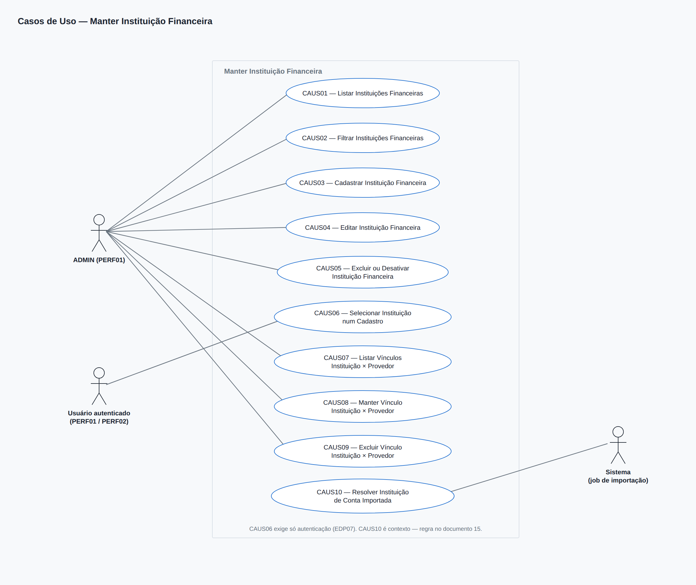
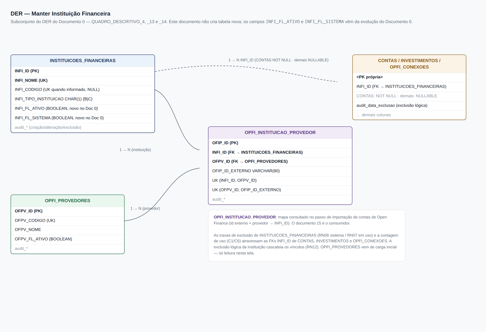
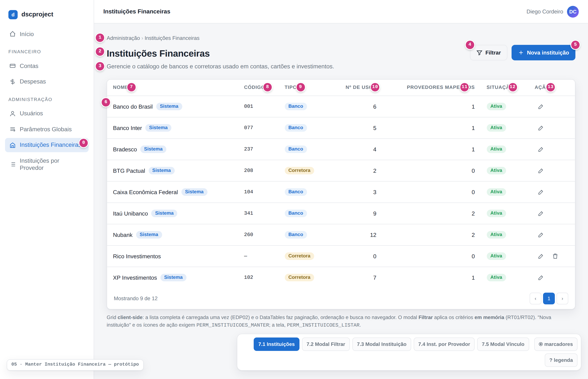
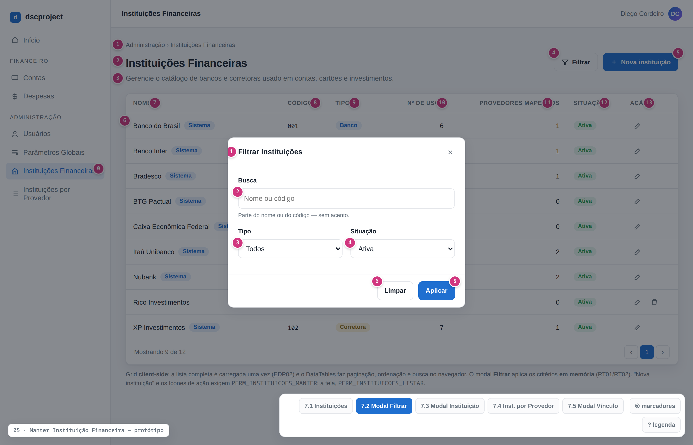
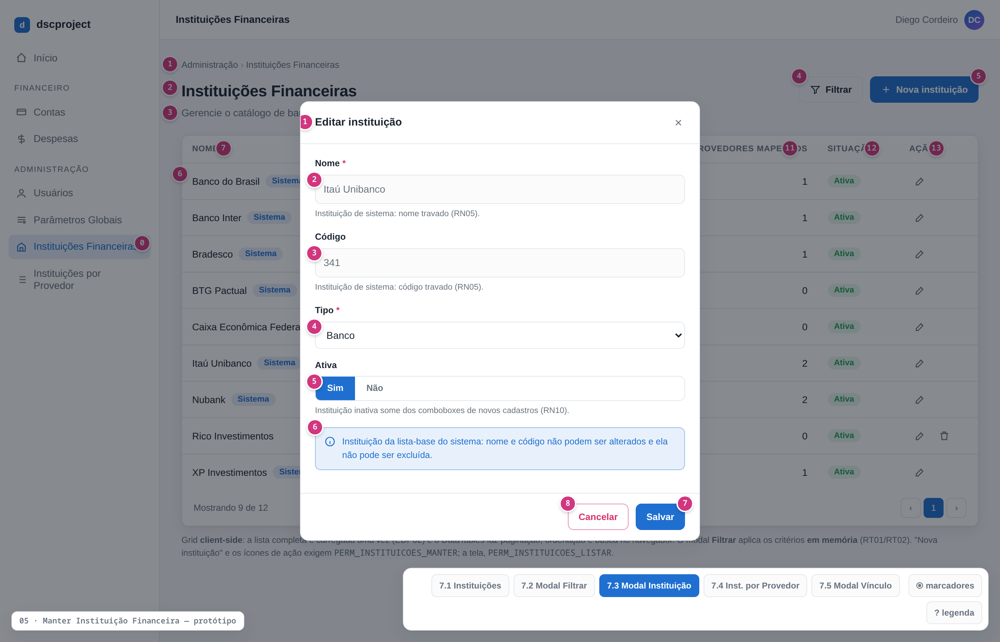
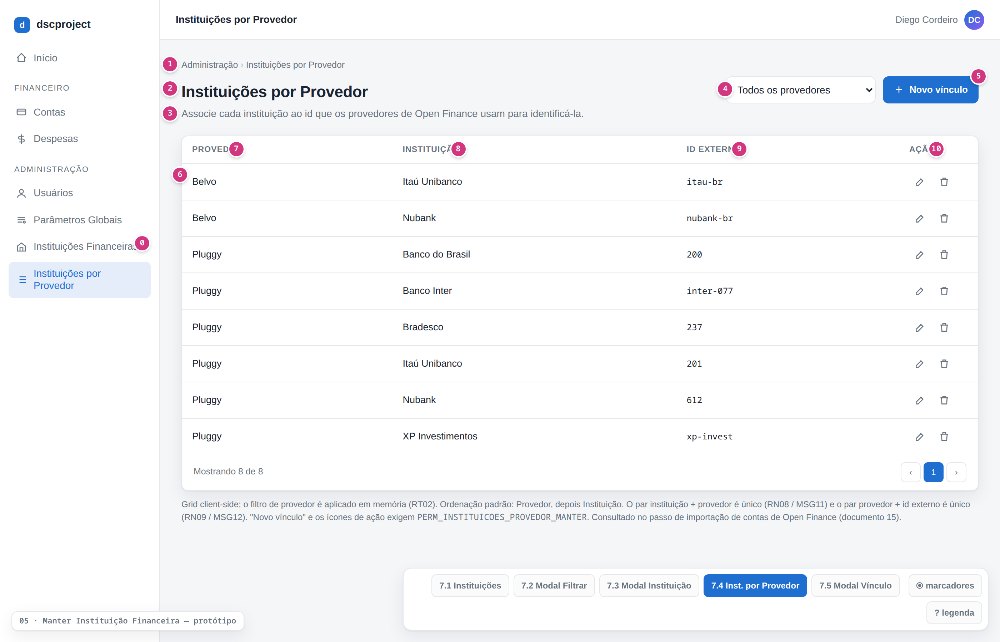
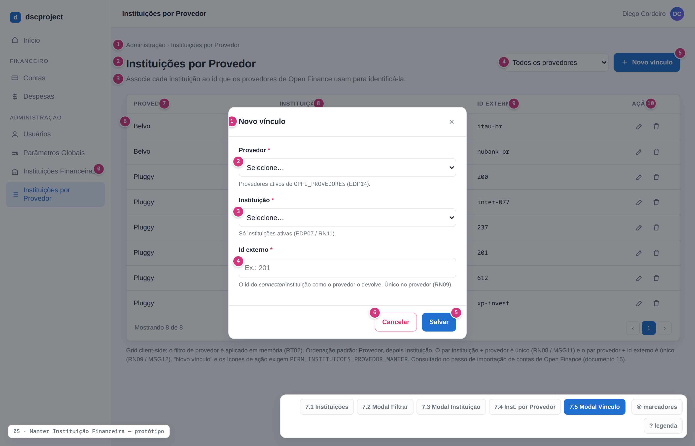

# dscproject — Análise de Sistemas
## Módulo Instituições Financeiras — ADMIN — Manter Instituição Financeira

**Gerado em:** 08/09/2026
**Versão:** 1.2
**Status:** Desenvolvido
**Projeto:** `dscproject-spring-mvc` (geração 2)

---

## Informações sobre o Documento

| Órgão | dscproject | Setor | Pessoal |
|---|---|---|---|
| Plataforma | dscproject-spring-mvc | Disciplina | Documentação |
| Área Cliente | Diego Cordeiro | Versão do Modelo | 2 (padrão híbrido) |

## Revisões e Aprovações

| Responsável por | Nome | Data de Execução |
|---|---|---|
| Revisão | Diego dos Santos Cordeiro | — |

## Histórico de Versões

| Versão | Data | Analista Responsável | Descrição da Alteração |
|---|---|---|---|
| 1.0 | 08/09/2026 | Diego dos Santos Cordeiro | Criação do documento. CRUD administrativo de Instituição Financeira (dá tela ao `InstituicaoFinanceiraController` REST da geração 1 e adiciona os campos novos `INFI_FL_ATIVO` e `INFI_FL_SISTEMA`; instituição de sistema protegida como a categoria de sistema do documento `04 - manter-categoria`) e a tela do mapa `OPFI_INSTITUICAO_PROVEDOR` (instituição + provedor de Open Finance → id do *connector* externo), usada na importação de contas. A estrutura das duas tabelas é a do Documento 0 ([QUADRO_DESCRITIVO_4](../00%20-%20analise-geral/documento-0-fundacao.md#quadro-descritivo-4) e [QUADRO_DESCRITIVO_14](../00%20-%20analise-geral/documento-0-fundacao.md#quadro-descritivo-14)) — este documento não introduz tabela nova |
| 1.1 | 11/09/2026 | Diego dos Santos Cordeiro | Desmembramento de `INSTITUICOES_MANTER` em `INSTITUICOES_INSERIR`, `INSTITUICOES_EDITAR`, `INSTITUICOES_EXCLUIR` e `INSTITUICOES_DESATIVAR`, e de `INSTITUICOES_PROVEDOR_MANTER` em `INSTITUICOES_PROVEDOR_INSERIR`, `INSTITUICOES_PROVEDOR_EDITAR` e `INSTITUICOES_PROVEDOR_EXCLUIR`, em conformidade com as diretrizes de governança RBAC granular e Observação 28 do Documento 0. |
| 1.2 | 12/09/2026 | Diego dos Santos Cordeiro | Padronização visual do sistema: explicitação do alinhamento à esquerda para a coluna de Ações nos grids de Instituições Financeiras (QUADRO_DESCRITIVO_1) e Instituições por Provedor (QUADRO_DESCRITIVO_4). |

---

## Diretrizes para Elaboração do Documento

| Nº | DIRETRIZ |
|---|---|
| D01 | As responsabilidades de camada são documentadas como **Regra de Tela (RT)** e **Regra de Negócio (RN)** — nunca "o backend deve" / "o frontend deve". |
| D02 | O termo `endpoint` é aceito na Seção 8. Fora dela, "chamada ao serviço". |
| D03 | A estrutura de dados é a do Documento 0 (`00 - analise-geral`). Este documento **referencia** os QUADRO_DESCRITIVO do Documento 0 e **não introduz tabela nova**. |

---

## 1. Introdução

Este documento descreve a funcionalidade **Manter Instituição Financeira** do `dscproject-spring-mvc`, junto com a tela auxiliar **Instituições por Provedor**.

Na geração 1 (API REST + SPA Angular), a instituição financeira é a entidade `InstituicaoFinanceira`, exposta por um `InstituicaoFinanceiraController` REST cru (`GET /instituicoes-financeiras`, `POST /inserir`, `PUT /editar/{id}`, `DELETE /excluir/{id}`), **sem tela** no Angular. O vínculo "conta do usuário nesta instituição" era a entidade `InstituicaoFinanceiraUsuario`. O Documento 0 (Observação 11) travou a decisão de renomear `INSTITUICOES_FINANCEIRAS_USUARIO` para **`CONTAS`** (documento `06`), mantendo `INSTITUICOES_FINANCEIRAS` como o **catálogo global de bancos e corretoras** — este documento.

Este documento cobre:

- a **tela administrativa de Instituições Financeiras** — listar, cadastrar, editar, desativar e excluir (exclusão lógica), com a trava de exclusão de instituição em uso;
- a **tela administrativa de Instituições por Provedor** — cadastrar e manter os vínculos instituição + provedor → id do *connector* externo, consultados na importação de contas de Open Finance;
- o **contrato de consulta** que as telas de Conta, Cartão de Crédito e Investimento usam para carregar as instituições ativas no combobox.

**Escopo deste documento:**
- Tela de **listagem de instituições** (grid client-side), restrita a quem tem [PERM01](#perm01), com filtro por modal.
- **Cadastro e edição** de instituição via modal único (nome, código COMPE/ISPB, tipo, situação).
- **Exclusão lógica** de instituição, com a trava: instituição em uso por contas, investimentos ou conexões de Open Finance não é excluível (pode ser desativada).
- **Desativação** de instituição (`INFI_FL_ATIVO = FALSE`) — some dos comboboxes de novos cadastros sem afetar contas e investimentos que já a usam.
- Tela de **listagem e manutenção** dos vínculos `OPFI_INSTITUICAO_PROVEDOR`.
- **Fornecimento das instituições ativas** para os comboboxes das telas de Conta, Cartão de Crédito e Investimento.
- Definição das permissões que estas telas usam. O RBAC completo é do Documento 0 e a tela que edita perfil × permissão é o documento `02 - manter-perfil-permissao`.

**Não contempla:**
- CRUD de **Conta**, que representa a conta do usuário numa instituição — documento `06`. `CONTAS` **consome** o catálogo por FK `INFI_ID`.
- CRUD de **Cartão de Crédito** (`07`) e **Investimento** (`12`), que também referenciam a instituição.
- O job de sincronização de Open Finance e o passo de importação/conciliação de contas — documentos `14` e `15`. Aqui, apenas o mapa que a importação consulta para resolver a instituição de uma conta trazida do provedor.
- Cadastro de provedores de Open Finance (`OPFI_PROVEDORES`) — vem de carga inicial; a tela de Instituições por Provedor apenas o referencia num combobox.
- Instituição **por usuário**: `INSTITUICOES_FINANCEIRAS` não tem dono no Documento 0 — o catálogo é global (ver Seção 17).

**Perfis com acesso:** [PERF01](#perf01) (ADMIN) para as duas telas administrativas. O combobox de instituições das telas de cadastro ([EDP07](#edp07)) é disponível a qualquer usuário autenticado ([PERF01](#perf01) e [PERF02](#perf02)).

---

## 2. Observações

| Nº | OBSERVAÇÃO | REFERÊNCIA / IMPACTO |
|---|---|---|
| 1 | **A instituição ganha tela.** Na geração 1, `InstituicaoFinanceiraController` é um CRUD REST sem interface. A geração 2 passa a ter uma tela administrativa Thymeleaf. O campo `INFI_FL_ATIVO` é **novo** ([QUADRO_DESCRITIVO_4 do Documento 0](../00%20-%20analise-geral/documento-0-fundacao.md#quadro-descritivo-4), item 5). **[Requer código]** | [RN10](#rn10) |
| 2 | **Catálogo global, gerido só por ADMIN.** `INSTITUICOES_FINANCEIRAS` não tem `USU_ID` no Documento 0 — não há instituição "de um usuário". Todo usuário vê o mesmo catálogo. O vínculo usuário ↔ instituição da geração 1 (`InstituicaoFinanceiraUsuario`) virou a tabela `CONTAS` (documento `06`). | [PERM01](#perm01), [PERM02](#perm02), [PERM03](#perm03), [PERM04](#perm04), [PERM05](#perm05) |
| 3 | **Instituição de sistema** (`INFI_FL_SISTEMA = TRUE` — as da carga inicial, Seção 6.4): a instituição **não é excluível** e `INFI_NOME` / `INFI_CODIGO` (a identidade Bacen — nome + COMPE/ISPB) **não são editáveis**. `INFI_TIPO_INSTITUICAO` e a situação (ativa/inativa) **são** editáveis. Mesmo padrão da "categoria de sistema" do documento `04 - manter-categoria` (RN04/RN05). `INFI_FL_SISTEMA` é campo novo no Documento 0 ([QUADRO_DESCRITIVO_4](../00%20-%20analise-geral/documento-0-fundacao.md#quadro-descritivo-4), item 6). **[Requer código]** | [RN05](#rn05), [RN06](#rn06) |
| 4 | **Exclusão em uso.** Excluir uma instituição referenciada por `CONTAS`, `INVESTIMENTOS` ou `OPFI_CONEXOES` não excluídos é **bloqueado** ([RN07](#rn07)); a alternativa é **desativar** a instituição. O comportamento é parametrizável ([Seção 12](#12-parâmetros-de-sistema)) — ver a decisão em aberto na Seção 17. | [RN07](#rn07) |
| 5 | **Desativação ≠ exclusão.** Uma instituição inativa (`INFI_FL_ATIVO = FALSE`) some dos comboboxes de **novos** cadastros ([EDP07](#edp07)) e não pode ser escolhida em novos vínculos de provedor, mas continua válida nas contas, cartões e investimentos que já a usam e nas conexões de Open Finance ativas. | [RN10](#rn10) |
| 6 | **`INFI_CODIGO`** guarda o código **COMPE** (3 dígitos, ex.: `341`) ou **ISPB** (8 dígitos, ex.: `60746948`) do banco. É **opcional** (`NULL` no Documento 0) e **único quando informado**. Validação de formato e obrigatoriedade prática para instituições de Open Finance ficam a confirmar (Seção 17). | [RN03](#rn03) |
| 7 | **`INFI_TIPO_INSTITUICAO`** (`B` = Banco, `C` = Corretora): enum `TipoInstituicaoFinanceira` da geração 1. É um **enum de 1 caractere** — grava o código curto em `CHAR(1)` (Documento 0, mapeamento de enums). Domínio fechado; a tela o oferece como combobox, não como lista editável. | [RN04](#rn04) |
| 8 | **Mapa de provedor em tela própria.** `OPFI_INSTITUICAO_PROVEDOR` é mantido numa **tela administrativa dedicada**, não numa aba do modal de instituição (ver Seção 17). Como `OPFI_PROVEDORES` vem de carga inicial, esta tela funciona antes das telas de Open Finance (`14`/`15`). É a análoga da tela "Categorias por Provedor" do documento `04`. | [QUADRO_DESCRITIVO_4](#quadro-descritivo-4) |
| 9 | **Uso do mapa na importação de contas.** Quando uma conexão a um provedor devolve as contas do usuário, cada conta externa vem com o id do *connector*/instituição no provedor. O passo de importação (documento `15`) casa esse id + o provedor da conexão com uma linha de `OPFI_INSTITUICAO_PROVEDOR` e resolve o `INFI_ID`. Sem correspondência, a conta importada fica sem instituição do catálogo até a conciliação manual. Este documento só mantém o mapa; a regra de casamento é detalhada no documento `15`. | [RN14](#rn14) |
| 10 | **Duas unicidades no mapa.** `uq_opfi_instituicao_provedor_par` (`INFI_ID` + `OFPV_ID`): uma instituição tem **no máximo um** id por provedor. `uq_opfi_instituicao_provedor_externo` (`OFPV_ID` + `OFIP_ID_EXTERNO`): um id externo aponta para **uma só** instituição em cada provedor. | [RN08](#rn08), [RN09](#rn09) |
| 11 | **Grid client-side.** As duas telas carregam a lista completa uma vez e paginam/ordenam/filtram no navegador (DataTables). O catálogo de instituições tem dezenas a poucas centenas de linhas; paginação server-side seria complexidade sem ganho. | [RNF04](#rnf04) |
| 12 | **Auditoria.** `INSTITUICOES_FINANCEIRAS` e `OPFI_INSTITUICAO_PROVEDOR` são auditadas via Hibernate Envers (`@Audited`), conforme o Documento 0. Criação, edição, desativação e exclusão lógica ficam registradas (quem, quando, o quê). | [RNF02](#rnf02) |
| 13 | **Exclusão em cascata dos vínculos.** Excluir logicamente uma instituição ([EDP06](#edp06)) também exclui logicamente os vínculos de `OPFI_INSTITUICAO_PROVEDOR` dela ([RN12](#rn12)) — o mapa é configuração derivada da instituição. Alternativa (bloquear enquanto houver vínculos) em aberto na Seção 17. | [RN12](#rn12) |
| 14 | **Nome único.** A geração 1 já impede duas instituições com o mesmo nome (`findByNome` no serviço). A geração 2 mantém a regra ([RN02](#rn02)), com comparação sem diferenciar maiúsculas/minúsculas e ignorando espaços nas pontas. | [RN02](#rn02) |

---

## 3. Requisitos

### 3.1 Requisitos Funcionais

| ID | DESCRIÇÃO | PRIORIDADE | SITUAÇÃO |
|---|---|---|---|
| <a id="rf01"></a>RF01 | O sistema deve listar as instituições financeiras cadastradas, com: nome, código, tipo (Banco/Corretora), quantidade de contas/investimentos/conexões que a usam, quantidade de provedores mapeados e situação (ativa/inativa/excluída). | Alta | Em análise |
| <a id="rf02"></a>RF02 | O sistema deve permitir filtrar a listagem por texto (nome/código), tipo e situação, por meio de um modal acionado pelo botão "Filtrar". | Média | Em análise |
| <a id="rf03"></a>RF03 | O sistema deve permitir cadastrar uma nova instituição via modal, com os campos: nome, código (opcional) e tipo. | Alta | Em análise |
| <a id="rf04"></a>RF04 | O sistema deve permitir editar uma instituição existente, incluindo ativá-la/desativá-la; nas instituições de sistema, o nome e o código não são editáveis. | Alta | Em análise |
| <a id="rf05"></a>RF05 | O sistema deve impedir o cadastro ou a alteração de uma instituição com um nome já em uso por outra instituição. | Alta | Em análise |
| <a id="rf06"></a>RF06 | O sistema deve impedir o cadastro ou a alteração de uma instituição com um código já em uso por outra instituição, quando o código for informado. | Média | Em análise |
| <a id="rf07"></a>RF07 | O sistema deve impedir a exclusão de uma instituição de sistema e de uma instituição em uso por contas, investimentos ou conexões de Open Finance, permitindo, nesses casos, apenas a desativação. | Alta | Em análise |
| <a id="rf08"></a>RF08 | O sistema deve fornecer às telas de Conta, Cartão de Crédito e Investimento a lista de instituições ativas para o combobox de instituição, opcionalmente filtrada por tipo. | Alta | Em análise |
| <a id="rf09"></a>RF09 | O sistema deve listar os vínculos instituição × provedor de Open Finance, com: instituição, provedor e id externo. | Média | Em análise |
| <a id="rf10"></a>RF10 | O sistema deve permitir cadastrar e editar um vínculo instituição × provedor (instituição + provedor → id externo). | Média | Em análise |
| <a id="rf11"></a>RF11 | O sistema deve impedir dois ids para a mesma instituição no mesmo provedor e o mesmo id externo apontando para instituições diferentes no mesmo provedor. | Média | Em análise |
| <a id="rf12"></a>RF12 | O sistema deve permitir a exclusão lógica de um vínculo instituição × provedor. | Média | Em análise |
| <a id="rf13"></a>RF13 | O sistema deve, no passo de importação das contas de Open Finance, consultar o mapa instituição × provedor para resolver a instituição de uma conta trazida do provedor (regra detalhada no documento `15`). | Média | Em análise |

### 3.2 Requisitos Não Funcionais

| ID | CATEGORIA | DESCRIÇÃO | CRITÉRIO DE ACEITAÇÃO |
|---|---|---|---|
| <a id="rnf01"></a>RNF01 | Segurança | Cada endpoint das telas administrativas exige a autoridade da sua operação (`PERM_INSTITUICOES_LISTAR`, `PERM_INSTITUICOES_INSERIR`, `PERM_INSTITUICOES_EDITAR`, `PERM_INSTITUICOES_EXCLUIR`, `PERM_INSTITUICOES_DESATIVAR`, `PERM_INSTITUICOES_PROVEDOR_LISTAR`, `PERM_INSTITUICOES_PROVEDOR_INSERIR`, `PERM_INSTITUICOES_PROVEDOR_EDITAR`, `PERM_INSTITUICOES_PROVEDOR_EXCLUIR` — ver Seção 13 e [RN01](#rn01)). O combobox de instituições ([EDP07](#edp07)) exige apenas usuário autenticado. | Teste de acesso com ADMIN, com USER e com um perfil que tenha só parte das permissões. |
| <a id="rnf02"></a>RNF02 | Auditoria | `INSTITUICOES_FINANCEIRAS` e `OPFI_INSTITUICAO_PROVEDOR` têm auditoria completa via Hibernate Envers. | Inspeção das tabelas `_aud` após operações de CRUD. |
| <a id="rnf03"></a>RNF03 | Integridade | `INFI_NOME` é único no banco (`uq_instituicoes_financeiras_nome`); `INFI_CODIGO` é único quando informado (`uq_instituicoes_financeiras_codigo`); os pares `INFI_ID` + `OFPV_ID` e `OFPV_ID` + `OFIP_ID_EXTERNO` são únicos. As travas de exclusão ([RN06](#rn06), [RN07](#rn07)), a imutabilidade dos campos-chave da instituição de sistema ([RN05](#rn05)) e as unicidades ([RN02](#rn02), [RN03](#rn03), [RN08](#rn08), [RN09](#rn09)) são validadas no serviço, não só na tela. | Teste chamando o endpoint diretamente. |
| <a id="rnf04"></a>RNF04 | Desempenho | As listagens ([EDP02](#edp02), [EDP09](#edp09)) respondem em menos de 1 s carregando a lista completa uma vez. O combobox de instituições ([EDP07](#edp07)) pode ser cacheado e invalidado nas gravações desta tela. | Medição em homologação. |
| <a id="rnf05"></a>RNF05 | Usabilidade | A interface segue o padrão do projeto (Thymeleaf + Tabler + DataTables + AJAX) e é responsiva. O filtro e o cadastro/edição são feitos por modal. | Revisão visual do protótipo. |
| <a id="rnf06"></a>RNF06 | Extensibilidade | Adicionar um provedor de Open Finance novo não exige mudança nesta tela além de cadastrar os vínculos instituição × provedor — o mapa (`OPFI_INSTITUICAO_PROVEDOR`) desacopla o catálogo de qualquer provedor específico. | Revisão do modelo contra a Observação 1a do Documento 0. |
| <a id="rnf07"></a>RNF07 | Consistência da carga inicial | As instituições da lista-base são criadas pelo `V1__init.sql` com `INFI_FL_SISTEMA = TRUE`. | Revisão do script Flyway contra a Seção 6.4. |

---

## 4. Casos de Uso



Fonte: `prototipo/manter-instituicao-financeira-casos-uso.drawio` (editável) e `prototipo/_diagrama-casos-uso.html` (render).

| CÓDIGO | NOME | ATOR PRINCIPAL | DESCRIÇÃO |
|---|---|---|---|
| <a id="caus01"></a>CAUS01 | Listar Instituições Financeiras | [PERF01](#perf01) | ADMIN acessa o menu e visualiza a lista de instituições. ([RF01](#rf01)) |
| <a id="caus02"></a>CAUS02 | Filtrar Instituições Financeiras | [PERF01](#perf01) | ADMIN abre o modal de filtro, informa os critérios e aplica. ([RF02](#rf02)) |
| <a id="caus03"></a>CAUS03 | Cadastrar Instituição Financeira | [PERF01](#perf01) | ADMIN abre o modal de cadastro, preenche os dados e confirma. ([RF03](#rf03), [RF05](#rf05), [RF06](#rf06)) |
| <a id="caus04"></a>CAUS04 | Editar Instituição Financeira | [PERF01](#perf01) | ADMIN abre o modal de edição, altera os dados e confirma, podendo ativar/desativar a instituição; nome e código ficam bloqueados nas instituições de sistema. ([RF04](#rf04), [RF05](#rf05), [RF06](#rf06)) |
| <a id="caus05"></a>CAUS05 | Excluir ou Desativar Instituição Financeira | [PERF01](#perf01) | ADMIN exclui logicamente uma instituição comum sem uso, ou a desativa quando ela é de sistema ou está em uso. ([RF07](#rf07)) |
| <a id="caus06"></a>CAUS06 | Selecionar Instituição num Cadastro | [PERF01](#perf01), [PERF02](#perf02) | Usuário autenticado, ao cadastrar uma conta, cartão ou investimento, escolhe a instituição num combobox alimentado pelas instituições ativas. ([RF08](#rf08)) |
| <a id="caus07"></a>CAUS07 | Listar Vínculos Instituição × Provedor | [PERF01](#perf01) | ADMIN acessa o menu e visualiza o mapa instituição × provedor. ([RF09](#rf09)) |
| <a id="caus08"></a>CAUS08 | Manter Vínculo Instituição × Provedor | [PERF01](#perf01) | ADMIN cadastra ou edita um vínculo instituição + provedor → id externo. ([RF10](#rf10), [RF11](#rf11)) |
| <a id="caus09"></a>CAUS09 | Excluir Vínculo Instituição × Provedor | [PERF01](#perf01) | ADMIN exclui logicamente um vínculo. ([RF12](#rf12)) |
| <a id="caus10"></a>CAUS10 | Resolver Instituição de Conta Importada | Sistema (job de importação) | O passo de importação de contas de Open Finance consulta o mapa para resolver a instituição de uma conta trazida do provedor. Contexto — regra no documento `15`. ([RF13](#rf13)) |

---

## 5. Localização / Critérios de Aceitação

**Caminho de Navegação:**
- Menu principal > Administração > Instituições Financeiras
- Menu principal > Administração > Instituições por Provedor

**Critérios de Aceitação:**
- O menu 'Instituições Financeiras' e o menu 'Instituições por Provedor' são visíveis apenas para quem tem, respectivamente, [PERM01](#perm01) e [PERM03](#perm03).
- Ao acessar cada tela, a listagem é carregada automaticamente.
- O filtro de instituições é aplicado por um modal acionado pelo botão "Filtrar".
- O cadastro e a edição de instituição são feitos num modal único.
- Os campos Nome e Código ficam desabilitados ao editar uma instituição de sistema.
- Não é possível cadastrar duas instituições com o mesmo nome, nem com o mesmo código quando informado.
- Não é possível excluir uma instituição de sistema nem uma instituição em uso por contas, investimentos ou conexões de Open Finance; nesses casos, a tela oferece a desativação.
- Uma instituição inativa não aparece nos comboboxes de novos cadastros, mas as contas e os investimentos que já a usam permanecem inalterados.
- Não é possível cadastrar dois ids para a mesma instituição no mesmo provedor, nem o mesmo id externo para instituições diferentes no mesmo provedor.
- As telas de Conta, Cartão de Crédito e Investimento recebem apenas as instituições ativas.

---

## 6. Banco de Dados

Toda a estrutura está no **Documento 0** (`00 - analise-geral`). Este documento **não introduz tabela nova**.

| Tabela | Onde | Papel nesta tela |
|---|---|---|
| `INSTITUICOES_FINANCEIRAS` | Documento 0 — [QUADRO_DESCRITIVO_4](../00%20-%20analise-geral/documento-0-fundacao.md#quadro-descritivo-4) | CRUD + desativação |
| `OPFI_INSTITUICAO_PROVEDOR` | Documento 0 — [QUADRO_DESCRITIVO_14](../00%20-%20analise-geral/documento-0-fundacao.md#quadro-descritivo-14) | CRUD do vínculo |
| `OPFI_PROVEDORES` | Documento 0 — [QUADRO_DESCRITIVO_13](../00%20-%20analise-geral/documento-0-fundacao.md#quadro-descritivo-13) | Somente leitura (combobox de provedor no vínculo) |
| `CONTAS` | Documento 0 — [QUADRO_DESCRITIVO_5](../00%20-%20analise-geral/documento-0-fundacao.md#quadro-descritivo-5) | Somente leitura (contagem de uso — [C6](#c6)); `INFI_ID` é FK **NOT NULL** |
| `INVESTIMENTOS` | Documento 0 — [QUADRO_DESCRITIVO_12](../00%20-%20analise-geral/documento-0-fundacao.md#quadro-descritivo-12) | Somente leitura (contagem de uso — [C6](#c6)); `INFI_ID` é FK **nullable** |
| `OPFI_CONEXOES` | Documento 0 — [QUADRO_DESCRITIVO_17](../00%20-%20analise-geral/documento-0-fundacao.md#quadro-descritivo-17) | Somente leitura (contagem de uso — [C6](#c6)); `INFI_ID` é FK **nullable** |

> Nenhum `ALTER TABLE` neste documento. A FK `INFI_ID` já existe em `CONTAS`, `INVESTIMENTOS` e `OPFI_CONEXOES` (Documento 0) — a base do comportamento discutido em [RN07](#rn07). Os campos `INFI_FL_ATIVO` e `INFI_FL_SISTEMA` são criados pela evolução do Documento 0 ([QUADRO_DESCRITIVO_4](../00%20-%20analise-geral/documento-0-fundacao.md#quadro-descritivo-4), itens 5 e 6), não por este documento.

### 6.1 Diagrama ER



Subconjunto do DER do Documento 0: `INSTITUICOES_FINANCEIRAS`, `OPFI_INSTITUICAO_PROVEDOR`, `OPFI_PROVEDORES` e as FKs `INFI_ID` em `CONTAS` (NOT NULL), `INVESTIMENTOS` e `OPFI_CONEXOES` (nullable). Fonte: `prototipo/manter-instituicao-financeira-der.drawio` (editável) e `prototipo/_diagrama-der.html` (render).

### 6.2 Auditoria de Tabelas

| TABELA PRINCIPAL | TABELA DE AUDITORIA | CAMPOS AUDITADOS |
|---|---|---|
| INSTITUICOES_FINANCEIRAS | INSTITUICOES_FINANCEIRAS_aud | Nome, código, tipo de instituição, flag de ativo, flag de sistema. Registra criação, edição, desativação e exclusão lógica |
| OPFI_INSTITUICAO_PROVEDOR | OPFI_INSTITUICAO_PROVEDOR_aud | Id externo, instituição e provedor do vínculo. Registra criação, edição e exclusão lógica |

### 6.3 Procedures / Views / Triggers / Functions

Nenhuma. A validação de unicidade, a contagem de uso e o casamento da importação ficam na camada de serviço.

### 6.4 Carga Inicial

Na geração 1 não há *seed* nem `DataLoader` de instituições — as linhas eram criadas manualmente pela API REST. Nesta versão, o `V1__init.sql` (Documento 0, Seção 6.4, grupo 3) **semeia uma lista-base de bancos e corretoras brasileiros** (nome + código COMPE/ISPB + tipo), cada linha com `INFI_FL_SISTEMA = TRUE` e `INFI_FL_ATIVO = TRUE`. Essas instituições não são excluíveis pela tela e têm nome e código imutáveis ([RN05](#rn05), [RN06](#rn06)); tipo e situação continuam editáveis. O ADMIN cadastra livremente as demais instituições (`INFI_FL_SISTEMA = FALSE`).

> **A Confirmar (Seção 17):** a lista exata de bancos/corretoras do *seed* e a fonte (relação COMPE/ISPB do Bacen). O **mecanismo** de proteção (`INFI_FL_SISTEMA`) está decidido; falta fechar **quais** linhas entram.

---

## 7. Protótipos de Interface

Protótipo navegável: `prototipo/manter-instituicao-financeira-prototipo.html`. Wireframes editáveis: `prototipo/manter-instituicao-financeira-prototipo.drawio` (5 páginas, 7.1 a 7.5). PNGs regeráveis por `prototipo/render-pngs.py`. Os números em destaque nas telas correspondem aos IDs dos itens do respectivo QUADRO_DESCRITIVO.

### <a id="quadro-descritivo-1"></a>7.1 Tela: Instituições Financeiras (Listagem) — QUADRO_DESCRITIVO_1



> OBSERVAÇÕES: Tela acessada via 'Administração > Instituições Financeiras'. Restrita a quem tem [PERM01](#perm01). Grid client-side. O filtro é acionado por um modal (botão "Filtrar").

| ID | NOME | PROPRIEDADES | OBSERVAÇÕES |
|---|---|---|---|
| <a id="qdd1-0"></a>0 | LINK | Caminho: "/instituicoes-financeiras/listar" | — |
| <a id="qdd1-1"></a>1 | BREADCRUMB | Tipo: Texto<br>Texto: Administração > Instituições Financeiras | — |
| <a id="qdd1-2"></a>2 | TÍTULO DA TELA | Tipo: Texto<br>Texto: Instituições Financeiras | — |
| <a id="qdd1-3"></a>3 | DESCRIÇÃO | Tipo: Texto<br>Texto: Gerencie o catálogo de bancos e corretoras usado em contas, cartões e investimentos. | — |
| <a id="qdd1-4"></a>4 | BOTÃO FILTRAR | Tipo: Botão<br>Texto: Filtrar<br>Ícone: filter | Ao clicar, executar [RT01](#rt01). |
| <a id="qdd1-5"></a>5 | BOTÃO NOVA INSTITUIÇÃO | Tipo: Botão (primário)<br>Texto: Nova instituição<br>Ícone: plus | Visível a quem tem [PERM02](#perm02). Ao clicar, executar [RT04](#rt04). |
| <a id="qdd1-6"></a>6 | GRID DE LISTAGEM | Tipo: Grid (DataTables, client-side)<br>Colunas: [ID7](#qdd1-7)…[ID13](#qdd1-13)<br>Itens por página: 10, 25, 50<br>Ordenação padrão: Nome crescente<br>Endpoint: [EDP02](#edp02) | Carrega a lista completa uma vez. Filtra em memória conforme [RT02](#rt02). |
| <a id="qdd1-7"></a>7 | NOME | Tipo: Coluna<br>Ordenação: Sim | Exibe [C1](#c1).nome. Um selo "Sistema" acompanha o nome quando [C1](#c1).sistema é verdadeiro. |
| <a id="qdd1-8"></a>8 | CÓDIGO | Tipo: Coluna<br>Ordenação: Sim | Exibe [C1](#c1).codigo (COMPE/ISPB) ou "—" quando vazio. |
| <a id="qdd1-9"></a>9 | TIPO | Tipo: Coluna (badge)<br>Ordenação: Sim | "Banco" ou "Corretora", de [C1](#c1).tipo. |
| <a id="qdd1-10"></a>10 | Nº DE USOS | Tipo: Coluna (número)<br>Ordenação: Sim | Exibe [C1](#c1).qtdUso — soma de contas, investimentos e conexões de Open Finance não excluídos que usam a instituição. |
| <a id="qdd1-11"></a>11 | PROVEDORES MAPEADOS | Tipo: Coluna (número)<br>Ordenação: Sim | Exibe [C1](#c1).qtdProvedores — vínculos ativos em `OPFI_INSTITUICAO_PROVEDOR`. |
| <a id="qdd1-12"></a>12 | SITUAÇÃO | Tipo: Coluna (badge)<br>Ordenação: Sim | "Ativa" (verde) quando `INFI_FL_ATIVO` e sem `audit_data_exclusao`; "Inativa" (cinza) quando `INFI_FL_ATIVO = FALSE`; "Excluída" quando há `audit_data_exclusao`. |
| <a id="qdd1-13"></a>13 | AÇÃO | Tipo: Coluna (alinhada à esquerda)<br>Ícones: Editar (ícone: edit, tooltip: Editar instituição), Excluir (ícone: trash, tooltip: Excluir instituição) | Ícone Editar visível com [PERM03](#perm03) → [RT05](#rt05). Ícone Excluir visível com [PERM04](#perm04) → [RT07](#rt07); oculto quando a instituição é de sistema ([C1](#c1).sistema) ou já está excluída. |

### <a id="quadro-descritivo-2"></a>7.2 Modal: Filtrar Instituições — QUADRO_DESCRITIVO_2



> OBSERVAÇÕES: Todos os campos são opcionais. O filtro é aplicado em memória sobre a lista já carregada ([RT02](#rt02)).

| ID | NOME | PROPRIEDADES | OBSERVAÇÕES |
|---|---|---|---|
| <a id="qdd2-1"></a>1 | TÍTULO DO MODAL | Tipo: Texto<br>Texto: Filtrar Instituições | — |
| <a id="qdd2-2"></a>2 | FILTRO – BUSCA | Tipo: Input Text<br>Obrigatório: Não<br>Placeholder: Nome ou código<br>Tooltip: Filtre por parte do nome ou do código. | Filtro parcial e sem acento sobre nome e código. |
| <a id="qdd2-3"></a>3 | FILTRO – TIPO | Tipo: Combobox<br>Obrigatório: Não<br>Placeholder: Todos<br>Domínio: Todos / Banco / Corretora | Filtra por [C1](#c1).tipo. Ver [SB02](#sb02). |
| <a id="qdd2-4"></a>4 | FILTRO – SITUAÇÃO | Tipo: Combobox<br>Obrigatório: Não<br>Valor default: Ativa<br>Domínio: Ativa / Inativa / Excluída / Todas | Filtra por `INFI_FL_ATIVO` e pela presença de `audit_data_exclusao`. Ver [SB03](#sb03). |
| <a id="qdd2-5"></a>5 | BOTÃO APLICAR | Tipo: Botão<br>Texto: Aplicar | Ao clicar, executar [RT02](#rt02). |
| <a id="qdd2-6"></a>6 | BOTÃO LIMPAR | Tipo: Botão<br>Texto: Limpar | Ao clicar, executar [RT03](#rt03). |

### <a id="quadro-descritivo-3"></a>7.3 Modal: Cadastro / Edição de Instituição — QUADRO_DESCRITIVO_3



> OBSERVAÇÕES: Modal único de cadastro (exige [PERM02](#perm02)) e edição (exige [PERM03](#perm03) e [PERM05](#perm05)). Ao editar uma instituição de sistema, os campos Nome e Código ficam desabilitados ([RN05](#rn05)). O campo Situação (ativa) só aparece na edição.

| ID | NOME | PROPRIEDADES | OBSERVAÇÕES |
|---|---|---|---|
| <a id="qdd3-1"></a>1 | TÍTULO DO MODAL | Tipo: Texto<br>Texto: Nova instituição / Editar instituição | Varia conforme o modo. |
| <a id="qdd3-2"></a>2 | CAMPO – NOME | Tipo: Input Text<br>Tamanho: 100<br>Obrigatório: Sim | Grava `INFI_NOME`. Único ([RN02](#rn02)). **Desabilitado** ao editar instituição de sistema ([RN05](#rn05)). |
| <a id="qdd3-3"></a>3 | CAMPO – CÓDIGO | Tipo: Input Text<br>Tamanho: 100<br>Obrigatório: Não<br>Placeholder: COMPE (3 díg.) ou ISPB (8 díg.)<br>Tooltip: Código do banco no Bacen. Opcional. | Grava `INFI_CODIGO`. Aceita só dígitos ([RT08](#rt08)). Único quando informado ([RN03](#rn03)). **Desabilitado** ao editar instituição de sistema ([RN05](#rn05)). |
| <a id="qdd3-4"></a>4 | CAMPO – TIPO | Tipo: Combobox<br>Obrigatório: Sim<br>Domínio: Banco / Corretora | Grava `INFI_TIPO_INSTITUICAO`. Ver [SB01](#sb01) e [RN04](#rn04). |
| <a id="qdd3-5"></a>5 | CAMPO – ATIVA | Tipo: Toggle (Sim/Não)<br>Valor default: Sim<br>Exibição: só no modo edição | Grava `INFI_FL_ATIVO`. Exige [PERM05](#perm05) para alteração. Ver [RN10](#rn10). |
| <a id="qdd3-6"></a>6 | AVISO – INSTITUIÇÃO PROTEGIDA | Tipo: Texto informativo | No modo edição: quando [C1](#c1).sistema, "Instituição da lista-base do sistema: nome e código não podem ser alterados e ela não pode ser excluída."; senão, quando [C1](#c1).qtdUso > 0, "Esta instituição é usada por {n} cadastro(s). Ela não pode ser excluída; você pode desativá-la." |
| <a id="qdd3-7"></a>7 | BOTÃO SALVAR | Tipo: Botão (primário)<br>Texto: Salvar<br>Endpoint: [EDP04](#edp04) (criação) ou [EDP05](#edp05) (edição) | Ao clicar, executar [RT06](#rt06). |
| <a id="qdd3-8"></a>8 | BOTÃO CANCELAR | Tipo: Botão<br>Texto: Cancelar | Fecha sem salvar. |

### <a id="quadro-descritivo-4"></a>7.4 Tela: Instituições por Provedor (Listagem) — QUADRO_DESCRITIVO_4



> OBSERVAÇÕES: Tela acessada via 'Administração > Instituições por Provedor'. Restrita a quem tem [PERM06](#perm06). Grid client-side. Mantém o mapa que a importação de contas de Open Finance consulta ([Observação 9](#2-observações)).

| ID | NOME | PROPRIEDADES | OBSERVAÇÕES |
|---|---|---|---|
| <a id="qdd4-0"></a>0 | LINK | Caminho: "/instituicoes-provedor/listar" | — |
| <a id="qdd4-1"></a>1 | BREADCRUMB | Tipo: Texto<br>Texto: Administração > Instituições por Provedor | — |
| <a id="qdd4-2"></a>2 | TÍTULO DA TELA | Tipo: Texto<br>Texto: Instituições por Provedor | — |
| <a id="qdd4-3"></a>3 | DESCRIÇÃO | Tipo: Texto<br>Texto: Associe cada instituição ao id que os provedores de Open Finance usam para identificá-la. | — |
| <a id="qdd4-4"></a>4 | FILTRO – PROVEDOR | Tipo: Combobox<br>Obrigatório: Não<br>Placeholder: Todos os provedores<br>Domínio: "Todos" + provedores de `OPFI_PROVEDORES` | Filtra o grid em memória. Ver [SB04](#sb04). |
| <a id="qdd4-5"></a>5 | BOTÃO NOVO VÍNCULO | Tipo: Botão (primário)<br>Texto: Novo vínculo<br>Ícone: plus | Visível a quem tem [PERM07](#perm07). Ao clicar, executar [RT09](#rt09). |
| <a id="qdd4-6"></a>6 | GRID DE LISTAGEM | Tipo: Grid (DataTables, client-side)<br>Colunas: [ID7](#qdd4-7)…[ID10](#qdd4-10)<br>Ordenação padrão: Provedor, depois Instituição<br>Endpoint: [EDP09](#edp09) | Filtra em memória conforme [RT02](#rt02). |
| <a id="qdd4-7"></a>7 | PROVEDOR | Tipo: Coluna<br>Ordenação: Sim | Exibe [C3](#c3).provedorNome. |
| <a id="qdd4-8"></a>8 | INSTITUIÇÃO | Tipo: Coluna<br>Ordenação: Sim | Exibe [C3](#c3).instituicaoNome. |
| <a id="qdd4-9"></a>9 | ID EXTERNO | Tipo: Coluna<br>Ordenação: Sim | Exibe [C3](#c3).idExterno — o id do *connector*/instituição no provedor. |
| <a id="qdd4-10"></a>10 | AÇÃO | Tipo: Coluna (alinhada à esquerda) | Visível a quem tem [PERM08](#perm08) ou [PERM09](#perm09). Ícone Editar (com [PERM08](#perm08)) → [RT10](#rt10); ícone Excluir (com [PERM09](#perm09)) → [RT12](#rt12). |

### <a id="quadro-descritivo-5"></a>7.5 Modal: Cadastro / Edição de Vínculo Instituição × Provedor — QUADRO_DESCRITIVO_5



> OBSERVAÇÕES: Modal único de cadastro (exige [PERM07](#perm07)) e edição (exige [PERM08](#perm08)). O par instituição + provedor é único ([RN08](#rn08)) e o par provedor + id externo é único ([RN09](#rn09)).

| ID | NOME | PROPRIEDADES | OBSERVAÇÕES |
|---|---|---|---|
| <a id="qdd5-1"></a>1 | TÍTULO DO MODAL | Tipo: Texto<br>Texto: Novo vínculo / Editar vínculo | Varia conforme o modo. |
| <a id="qdd5-2"></a>2 | CAMPO – PROVEDOR | Tipo: Combobox<br>Obrigatório: Sim<br>Domínio: provedores ativos de `OPFI_PROVEDORES` | Grava `OFPV_ID`. Ver [SB04](#sb04). |
| <a id="qdd5-3"></a>3 | CAMPO – INSTITUIÇÃO | Tipo: Combobox<br>Obrigatório: Sim<br>Domínio: instituições ativas | Grava `INFI_ID`. Ver [SB05](#sb05) e [RN11](#rn11). |
| <a id="qdd5-4"></a>4 | CAMPO – ID EXTERNO | Tipo: Input Text<br>Tamanho: 80<br>Obrigatório: Sim | Grava `OFIP_ID_EXTERNO` — o id do *connector*/instituição como o provedor o devolve. Único no provedor ([RN09](#rn09)). |
| <a id="qdd5-5"></a>5 | BOTÃO SALVAR | Tipo: Botão (primário)<br>Texto: Salvar<br>Endpoint: [EDP11](#edp11) (criação) ou [EDP12](#edp12) (edição) | Ao clicar, executar [RT11](#rt11). |
| <a id="qdd5-6"></a>6 | BOTÃO CANCELAR | Tipo: Botão<br>Texto: Cancelar | Fecha sem salvar. |

### 7.6 Suggestion Boxes

| ID | NOME | DESCRIÇÃO |
|---|---|---|
| <a id="sb01"></a>SB01 | TIPO DE INSTITUIÇÃO | Domínio fixo do enum `TipoInstituicaoFinanceira` (Banco, Corretora). Renderizado como combobox; não é entidade. |
| <a id="sb02"></a>SB02 | FILTRO TIPO | Domínio fixo do próprio filtro: Todos, Banco, Corretora. |
| <a id="sb03"></a>SB03 | FILTRO SITUAÇÃO | Domínio fixo do próprio filtro: Ativa, Inativa, Excluída, Todas. |
| <a id="sb04"></a>SB04 | PROVEDOR | Itens carregados de `OPFI_PROVEDORES` (Documento 0, [QUADRO_DESCRITIVO_13](../00%20-%20analise-geral/documento-0-fundacao.md#quadro-descritivo-13)) via [EDP14](#edp14), ordenados por nome. No filtro do grid ([ID4](#qdd4-4)), a opção "Todos os provedores" é adicional. No modal de vínculo, só provedores ativos. Nunca `<option>` fixo no HTML. |
| <a id="sb05"></a>SB05 | INSTITUIÇÃO | Itens carregados de `INSTITUICOES_FINANCEIRAS` via [EDP07](#edp07) sem filtro de tipo (todas as ativas), ordenados por nome. Nunca `<option>` fixo no HTML. |

### 7.7 Regras de Tela

| ID | DESCRIÇÃO |
|---|---|
| <a id="rt01"></a>RT01 | Ao clicar em "Filtrar" ([ID4](#qdd1-4)), abrir o modal de filtro ([QUADRO_DESCRITIVO_2](#quadro-descritivo-2)) com os valores atualmente aplicados. |
| <a id="rt02"></a>RT02 | Ao clicar em "Aplicar" ([ID5](#qdd2-5)), filtrar **em memória** a lista já carregada: busca parcial e sem acento sobre nome/código, e correspondência exata de tipo e situação. Fechar o modal. Se nada restar, exibir [MSG08](#msg08) na área do grid. A mesma filtragem em memória vale para o filtro de provedor da tela de Instituições por Provedor ([ID4](#qdd4-4)). |
| <a id="rt03"></a>RT03 | Ao clicar em "Limpar" ([ID6](#qdd2-6)), voltar Busca e Tipo para vazio, Situação para "Ativa", e reaplicar conforme [RT02](#rt02). |
| <a id="rt04"></a>RT04 | Ao clicar em "Nova instituição" ([ID5](#qdd1-5)) — visível só com [PERM02](#perm02) —, abrir o modal ([QUADRO_DESCRITIVO_3](#quadro-descritivo-3)) em modo criação: campos vazios, Tipo sem seleção, sem o campo Ativa. |
| <a id="rt05"></a>RT05 | Ao clicar no ícone Editar ([ID13](#qdd1-13)) — visível só com [PERM03](#perm03) —, chamar [EDP03](#edp03) com o id e abrir o modal em modo edição, com os campos preenchidos. Se a instituição for de sistema ([C1](#c1).sistema), os campos Nome e Código ficam desabilitados ([RN05](#rn05)) e o aviso [ID6](#qdd3-6) mostra o texto de instituição protegida. Se [C1](#c1).qtdUso > 0, exibir o aviso [ID6](#qdd3-6). |
| <a id="rt06"></a>RT06 | Ao clicar em "Salvar" ([ID7](#qdd3-7)): validar Nome e Tipo obrigatórios ([MSG02](#msg02)) e aplicar [RT08](#rt08). Em criação (exige [PERM02](#perm02)), chamar [EDP04](#edp04); em edição (exige [PERM03](#perm03)), chamar [EDP05](#edp05). Em sucesso, exibir [MSG01](#msg01) (criação) ou [MSG04](#msg04) (edição), fechar o modal e recarregar o grid via [EDP02](#edp02). Nome duplicado → [MSG03](#msg03). Código duplicado → [MSG09](#msg09). Tentativa de alterar nome ou código de instituição de sistema no servidor ([RN05](#rn05)) → [MSG16](#msg16). |
| <a id="rt07"></a>RT07 | Ao clicar no ícone Excluir ([ID13](#qdd1-13)) — visível só com [PERM04](#perm04) —, exibir a confirmação [MSG05](#msg05). Ao confirmar, chamar [EDP06](#edp06). Instituição de sistema → [MSG16](#msg16); instituição em uso → [MSG06](#msg06), com a oferta de desativar (ao aceitar com [PERM05](#perm05), chamar [EDP05](#edp05) apenas com `INFI_FL_ATIVO = FALSE`). Em sucesso da exclusão, exibir [MSG07](#msg07) e recarregar o grid. |
| <a id="rt08"></a>RT08 | Ao digitar no campo Código ([ID3](#qdd3-3)), manter em tempo real apenas os dígitos, descartando qualquer outro caractere. |
| <a id="rt09"></a>RT09 | Ao clicar em "Novo vínculo" ([ID5](#qdd4-5)) — visível só com [PERM07](#perm07) —, abrir o modal ([QUADRO_DESCRITIVO_5](#quadro-descritivo-5)) em modo criação: Provedor carregado por [EDP14](#edp14), Instituição carregada por [EDP07](#edp07), campos vazios. |
| <a id="rt10"></a>RT10 | Ao clicar no ícone Editar ([ID10](#qdd4-10)) — visível só com [PERM08](#perm08) —, chamar [EDP10](#edp10) com o id e abrir o modal em modo edição, com Provedor, Instituição e Id externo preenchidos. |
| <a id="rt11"></a>RT11 | Ao clicar em "Salvar" ([ID5](#qdd5-5)): validar Provedor, Instituição e Id externo obrigatórios ([MSG02](#msg02)). Em criação (exige [PERM07](#perm07)), chamar [EDP11](#edp11); em edição (exige [PERM08](#perm08)), chamar [EDP12](#edp12). Em sucesso, exibir [MSG10](#msg10) (criação) ou [MSG13](#msg13) (edição), fechar o modal e recarregar o grid via [EDP09](#edp09). Instituição já mapeada no provedor → [MSG11](#msg11). Id externo já usado no provedor → [MSG12](#msg12). |
| <a id="rt12"></a>RT12 | Ao clicar no ícone Excluir ([ID10](#qdd4-10)) — visível só com [PERM09](#perm09) —, exibir a confirmação [MSG14](#msg14). Ao confirmar, chamar [EDP13](#edp13). Em sucesso, exibir [MSG15](#msg15) e recarregar o grid. |

---

## 8. Endpoints

| CÓDIGO | HTTP | PERMISSÃO | PATH | FINALIZADO? |
|---|---|---|---|---|
| <a id="edp01"></a>EDP01 | GET | [PERM01](#perm01) | /instituicoes-financeiras/listar | N |
| Retorna a página da listagem de instituições (Thymeleaf). O grid é carregado por [EDP02](#edp02). | | | | |
| <a id="edp02"></a>EDP02 | GET | [PERM01](#perm01) | /instituicoes-financeiras/listar-dados | N |
| Lista de instituições para o grid, em JSON. Executa [C1](#c1). Campos: id, nome, codigo, tipo, qtdUso, qtdProvedores, sistema (boolean), ativo (boolean), excluido (boolean). Sem paginação (client-side). | | | | |
| <a id="edp03"></a>EDP03 | GET | [PERM03](#perm03) | /instituicoes-financeiras/buscar/{id} | N |
| Retorna uma instituição para edição. Campos: id, nome, codigo, tipo, ativo, sistema, qtdUso. | | | | |
| <a id="edp04"></a>EDP04 | POST | [PERM02](#perm02) | /instituicoes-financeiras/inserir | N |
| Cria uma instituição. Executa [RN02](#rn02) (nome único, via [C4](#c4)), [RN03](#rn03) (código único quando informado, via [C5](#c5)), [RN04](#rn04) (tipo). Dados: nome, codigo, tipo. `INFI_FL_ATIVO = TRUE` e `INFI_FL_SISTEMA = FALSE` fixos. Retorno: 200 ([MSG01](#msg01)) ou 422 ([MSG02](#msg02)/[MSG03](#msg03)/[MSG09](#msg09)). | | | | |
| <a id="edp05"></a>EDP05 | PUT | [PERM03](#perm03) / [PERM05](#perm05) | /instituicoes-financeiras/editar/{id} | N |
| Edita uma instituição. Executa [RN02](#rn02), [RN03](#rn03), [RN04](#rn04), [RN05](#rn05) (instituição de sistema: ignora qualquer mudança de `INFI_NOME`, `INFI_CODIGO` e `INFI_FL_SISTEMA`), [RN10](#rn10) (desativação). Dados: nome, codigo, tipo, ativo. Exige [PERM03](#perm03) para dados cadastrais e [PERM05](#perm05) para alteração de situação (ativo). Invalida o cache do combobox de instituições ([RNF04](#rnf04)). Retorno: 200 ([MSG04](#msg04)) ou 422 ([MSG02](#msg02)/[MSG03](#msg03)/[MSG09](#msg09)/[MSG16](#msg16)). | | | | |
| <a id="edp06"></a>EDP06 | DELETE | [PERM04](#perm04) | /instituicoes-financeiras/excluir/{id} | N |
| Exclusão lógica da instituição. Executa [RN06](#rn06) (recusa se `INFI_FL_SISTEMA` → [MSG16](#msg16)), [RN07](#rn07) (recusa se em uso, via [C6](#c6) → [MSG06](#msg06)) e [RN12](#rn12) (cascateia exclusão lógica dos vínculos de provedor). Preenche `audit_data_exclusao` / `audit_excluido_por`. Retorno: 200 ([MSG07](#msg07)) ou 422. | | | | |
| <a id="edp07"></a>EDP07 | GET | Autenticado | /instituicoes-financeiras/opcoes?tipo= | N |
| Retorna as instituições **ativas** para os comboboxes das telas de Conta, Cartão de Crédito e Investimento. Executa [C2](#c2). O parâmetro `tipo` (BANCO / CORRETORA) é opcional: quando informado, filtra pelo tipo; quando omitido, devolve todas as ativas. Campos: id, nome, codigo, tipo. Consumido também pelo modal de vínculo ([SB05](#sb05)). | | | | |
| <a id="edp08"></a>EDP08 | GET | [PERM06](#perm06) | /instituicoes-provedor/listar | N |
| Retorna a página da listagem de vínculos instituição × provedor (Thymeleaf). O grid é carregado por [EDP09](#edp09). | | | | |
| <a id="edp09"></a>EDP09 | GET | [PERM06](#perm06) | /instituicoes-provedor/listar-dados | N |
| Lista de vínculos para o grid, em JSON. Executa [C3](#c3). Campos: id, idExterno, provedorId, provedorNome, instituicaoId, instituicaoNome. Sem paginação (client-side). | | | | |
| <a id="edp10"></a>EDP10 | GET | [PERM08](#perm08) | /instituicoes-provedor/buscar/{id} | N |
| Retorna um vínculo para edição. Campos: id, idExterno, provedorId, instituicaoId. | | | | |
| <a id="edp11"></a>EDP11 | POST | [PERM07](#perm07) | /instituicoes-provedor/inserir | N |
| Cria um vínculo. Executa [RN08](#rn08) (par instituição + provedor único, via [C7](#c7)), [RN09](#rn09) (par provedor + id externo único, via [C8](#c8)) e [RN11](#rn11) (instituição ativa). Dados: idExterno, provedorId, instituicaoId. Retorno: 200 ([MSG10](#msg10)) ou 422 ([MSG02](#msg02)/[MSG11](#msg11)/[MSG12](#msg12)). | | | | |
| <a id="edp12"></a>EDP12 | PUT | [PERM08](#perm08) | /instituicoes-provedor/editar/{id} | N |
| Edita um vínculo. Executa [RN08](#rn08), [RN09](#rn09), [RN11](#rn11). Dados: idExterno, provedorId, instituicaoId. Retorno: 200 ([MSG13](#msg13)) ou 422. | | | | |
| <a id="edp13"></a>EDP13 | DELETE | [PERM09](#perm09) | /instituicoes-provedor/excluir/{id} | N |
| Exclusão lógica do vínculo. Preenche `audit_data_exclusao` / `audit_excluido_por`. Retorno: 200 ([MSG15](#msg15)) ou 422. | | | | |
| <a id="edp14"></a>EDP14 | GET | [PERM06](#perm06) | /instituicoes-provedor/provedores-opcoes | N |
| Retorna os provedores de `OPFI_PROVEDORES` para os comboboxes desta tela. Executa [C9](#c9). Campos: id, codigo, nome, ativo. O filtro do grid recebe todos; o modal de vínculo usa só os ativos. | | | | |

---

## 9. Regras de Negócio

| ID | DESCRIÇÃO |
|---|---|
| <a id="rn01"></a>RN01 | Cada endpoint exige a autoridade da sua operação: [EDP01](#edp01)/[EDP02](#edp02) → `PERM_INSTITUICOES_LISTAR`; [EDP04](#edp04) → `PERM_INSTITUICOES_INSERIR`; [EDP03](#edp03)/[EDP05](#edp05) → `PERM_INSTITUICOES_EDITAR` (a alteração da situação ativa/inativa em [EDP05](#edp05) exige `PERM_INSTITUICOES_DESATIVAR`); [EDP06](#edp06) → `PERM_INSTITUICOES_EXCLUIR`; [EDP08](#edp08)/[EDP09](#edp09)/[EDP14](#edp14) → `PERM_INSTITUICOES_PROVEDOR_LISTAR`; [EDP11](#edp11) → `PERM_INSTITUICOES_PROVEDOR_INSERIR`; [EDP10](#edp10)/[EDP12](#edp12) → `PERM_INSTITUICOES_PROVEDOR_EDITAR`; [EDP13](#edp13) → `PERM_INSTITUICOES_PROVEDOR_EXCLUIR`. [EDP07](#edp07) exige apenas usuário autenticado. As autoridades são resolvidas pelo `getAuthorities()` do `Usuario` a partir do perfil e das permissões vinculadas em `PERFIL_PERMISSAO`. É expressamente proibida a criação de permissões genéricas com sufixo `MANTER`. |
| <a id="rn02"></a>RN02 | `INFI_NOME` é único entre instituições não excluídas (constraint `uq_instituicoes_financeiras_nome`). Antes de comparar, o serviço remove espaços nas pontas; a comparação não diferencia maiúsculas de minúsculas. Ao criar ([EDP04](#edp04)) ou editar ([EDP05](#edp05)), se o nome já pertencer a **outra** instituição, impedir e retornar [MSG03](#msg03). Executa [C4](#c4). Regra herdada da geração 1 (`InstituicaoFinanceiraService.inserir`/`editar`). |
| <a id="rn03"></a>RN03 | `INFI_CODIGO` é **opcional**. Quando informado, o serviço mantém apenas os dígitos e o valor é único entre instituições não excluídas (constraint `uq_instituicoes_financeiras_codigo`). Ao criar ([EDP04](#edp04)) ou editar ([EDP05](#edp05)), se o código já pertencer a **outra** instituição, impedir e retornar [MSG09](#msg09). Executa [C5](#c5). Validação de formato (COMPE de 3 dígitos × ISPB de 8 dígitos) a confirmar — ver Seção 17. |
| <a id="rn04"></a>RN04 | `INFI_TIPO_INSTITUICAO` é obrigatório e deve ser `B` (Banco) ou `C` (Corretora). O serviço recebe o enum `TipoInstituicaoFinanceira` e grava o código curto de 1 caractere na coluna `CHAR(1)` (Documento 0, mapeamento de enums). Valor fora do domínio → [MSG02](#msg02) no campo Tipo. |
| <a id="rn05"></a>RN05 | Instituição de sistema (`INFI_FL_SISTEMA = TRUE` — as da carga inicial, Seção 6.4): `INFI_NOME` e `INFI_CODIGO` **não** são alteráveis por [EDP05](#edp05) — qualquer valor divergente enviado é ignorado; se a intenção explícita for mudar o nome ou o código, retornar [MSG16](#msg16). `INFI_TIPO_INSTITUICAO` e a situação (ativa/inativa) **são** editáveis. `INFI_FL_SISTEMA` nunca é alterável pela tela. Mesma regra da "categoria de sistema" (documento `04 - manter-categoria`, RN04). |
| <a id="rn06"></a>RN06 | Exclusão de instituição ([EDP06](#edp06)): recusar se `INFI_FL_SISTEMA = TRUE` e retornar [MSG16](#msg16). A instituição de sistema só pode ser desativada ([RN10](#rn10)). Mesma regra da "categoria de sistema" (documento `04 - manter-categoria`, RN05). |
| <a id="rn07"></a>RN07 | Exclusão de instituição ([EDP06](#edp06)): recusar se existir **qualquer** registro não excluído referenciando `INFI_ID` em `CONTAS`, `INVESTIMENTOS` ou `OPFI_CONEXOES` — executa [C6](#c6) — e retornar [MSG06](#msg06). A alternativa oferecida é a desativação ([RN10](#rn10)). O comportamento é controlado pelo parâmetro `INSTITUICAO_EXCLUSAO_BLOQUEIA_EM_USO` (Seção 12): quando `false`, a exclusão é permitida e os registros com FK **nullable** (`INVESTIMENTOS`, `OPFI_CONEXOES`) ficam com `INFI_ID` nulo; `CONTAS` (FK **NOT NULL**) sempre bloqueia. Ver a decisão em aberto na Seção 17. |
| <a id="rn08"></a>RN08 | O par `INFI_ID` + `OFPV_ID` é único entre vínculos não excluídos (constraint `uq_opfi_instituicao_provedor_par`). Ao criar ([EDP11](#edp11)) ou editar ([EDP12](#edp12)), se já existir outro vínculo da mesma instituição no mesmo provedor, impedir e retornar [MSG11](#msg11). Executa [C7](#c7). |
| <a id="rn09"></a>RN09 | O par `OFPV_ID` + `OFIP_ID_EXTERNO` é único entre vínculos não excluídos (constraint `uq_opfi_instituicao_provedor_externo`) — o mesmo id externo não pode apontar para duas instituições no mesmo provedor. Ao criar ([EDP11](#edp11)) ou editar ([EDP12](#edp12)), se já existir outro vínculo com o mesmo id externo no mesmo provedor, impedir e retornar [MSG12](#msg12). Executa [C8](#c8). |
| <a id="rn10"></a>RN10 | Instituição inativa (`INFI_FL_ATIVO = FALSE`): não é devolvida por [EDP07](#edp07) e não pode ser escolhida em novos vínculos de provedor ([RN11](#rn11)). As contas, cartões e investimentos que já a referenciam permanecem inalterados, e as conexões de Open Finance ativas continuam sincronizando. Reativar é apenas voltar `INFI_FL_ATIVO = TRUE` por [EDP05](#edp05). |
| <a id="rn11"></a>RN11 | Um vínculo instituição × provedor ([EDP11](#edp11)/[EDP12](#edp12)) só aceita `INFI_ID` de instituição ativa e não excluída. Instituição inexistente, inativa ou excluída → [MSG02](#msg02) no campo Instituição. |
| <a id="rn12"></a>RN12 | Exclusão lógica de instituição ([EDP06](#edp06)) cascateia a exclusão lógica dos vínculos de `OPFI_INSTITUICAO_PROVEDOR` daquela instituição (`audit_data_exclusao` / `audit_excluido_por` nos vínculos). O mapa é configuração derivada da instituição; sem instituição, o vínculo não tem uso. Alternativa (bloquear a exclusão enquanto houver vínculos) em aberto na Seção 17. |
| <a id="rn13"></a>RN13 | Exclusão de vínculo instituição × provedor ([EDP13](#edp13)) é sempre lógica. Nenhuma trava adicional — o vínculo não é referenciado por FK de outra tabela (as conexões de Open Finance referenciam a instituição diretamente, não o vínculo). |
| <a id="rn14"></a>RN14 | Na importação das contas de Open Finance (documento `15`), ao processar uma conta trazida do provedor, o sistema busca em `OPFI_INSTITUICAO_PROVEDOR` a linha cujo `OFPV_ID` é o provedor da conexão e cujo `OFIP_ID_EXTERNO` casa com o id da instituição devolvido pelo provedor, e usa o `INFI_ID` dela na conta gerada. Sem correspondência, a conta é criada sem instituição do catálogo, para a conciliação manual resolver. Esta regra é **consumidora** do mapa; a manutenção do mapa é o escopo deste documento. |

---

## 10. Mensagens de Sistema

| CÓDIGO | DESCRIÇÃO |
|---|---|
| <a id="msg01"></a>MSG01 | Instituição financeira cadastrada com sucesso. |
| <a id="msg02"></a>MSG02 | O campo {campo} é obrigatório. |
| <a id="msg03"></a>MSG03 | Já existe uma instituição financeira com este nome. |
| <a id="msg04"></a>MSG04 | Instituição financeira atualizada com sucesso. |
| <a id="msg05"></a>MSG05 | Confirma a exclusão da instituição financeira "{nome}"? |
| <a id="msg06"></a>MSG06 | Esta instituição está em uso por contas, investimentos ou conexões de Open Finance e não pode ser excluída. Desative-a para ocultá-la de novos cadastros. |
| <a id="msg07"></a>MSG07 | Instituição financeira excluída com sucesso. |
| <a id="msg08"></a>MSG08 | Nenhuma instituição financeira encontrada com os filtros informados. |
| <a id="msg09"></a>MSG09 | Já existe uma instituição financeira com este código. |
| <a id="msg10"></a>MSG10 | Vínculo de instituição por provedor cadastrado com sucesso. |
| <a id="msg11"></a>MSG11 | Esta instituição já possui um id neste provedor. |
| <a id="msg12"></a>MSG12 | Este id externo já está vinculado a outra instituição neste provedor. |
| <a id="msg13"></a>MSG13 | Vínculo atualizado com sucesso. |
| <a id="msg14"></a>MSG14 | Confirma a exclusão do vínculo de "{instituicao}" no provedor "{provedor}"? |
| <a id="msg15"></a>MSG15 | Vínculo excluído com sucesso. |
| <a id="msg16"></a>MSG16 | Instituições de sistema não podem ser excluídas nem ter o nome ou o código alterados. |

---

## 11. Consultas

| CÓDIGO | DESCRIÇÃO |
|---|---|
| <a id="c1"></a>C1 | Listagem de instituições para o grid, com a contagem de uso e de provedores mapeados.<br>`SELECT i.INFI_ID, i.INFI_NOME, i.INFI_CODIGO, i.INFI_TIPO_INSTITUICAO,`<br>`       i.INFI_FL_ATIVO, i.INFI_FL_SISTEMA,`<br>`       (i.audit_data_exclusao IS NOT NULL) AS excluido,`<br>`       ((SELECT COUNT(*) FROM CONTAS c WHERE c.INFI_ID = i.INFI_ID AND c.audit_data_exclusao IS NULL)`<br>`      + (SELECT COUNT(*) FROM INVESTIMENTOS v WHERE v.INFI_ID = i.INFI_ID AND v.audit_data_exclusao IS NULL)`<br>`      + (SELECT COUNT(*) FROM OPFI_CONEXOES x WHERE x.INFI_ID = i.INFI_ID AND x.audit_data_exclusao IS NULL)) AS qtd_uso,`<br>`       (SELECT COUNT(*) FROM OPFI_INSTITUICAO_PROVEDOR m WHERE m.INFI_ID = i.INFI_ID AND m.audit_data_exclusao IS NULL) AS qtd_provedores`<br>`FROM INSTITUICOES_FINANCEIRAS i`<br>`ORDER BY i.INFI_NOME ASC;` |
| <a id="c2"></a>C2 | Instituições ativas para os comboboxes das telas de cadastro (EDP07).<br>`SELECT i.INFI_ID, i.INFI_NOME, i.INFI_CODIGO, i.INFI_TIPO_INSTITUICAO`<br>`FROM INSTITUICOES_FINANCEIRAS i`<br>`WHERE i.audit_data_exclusao IS NULL`<br>`  AND i.INFI_FL_ATIVO = TRUE`<br>`  AND (:tipo IS NULL OR i.INFI_TIPO_INSTITUICAO = :tipo)`<br>`ORDER BY i.INFI_NOME ASC;` |
| <a id="c3"></a>C3 | Listagem dos vínculos instituição × provedor para o grid (EDP09).<br>`SELECT m.OFIP_ID, m.OFIP_ID_EXTERNO,`<br>`       p.OFPV_ID, p.OFPV_NOME,`<br>`       i.INFI_ID, i.INFI_NOME`<br>`FROM OPFI_INSTITUICAO_PROVEDOR m`<br>`JOIN OPFI_PROVEDORES p ON p.OFPV_ID = m.OFPV_ID`<br>`JOIN INSTITUICOES_FINANCEIRAS i ON i.INFI_ID = m.INFI_ID`<br>`WHERE m.audit_data_exclusao IS NULL`<br>`ORDER BY p.OFPV_NOME ASC, i.INFI_NOME ASC;` |
| <a id="c4"></a>C4 | Verifica nome de instituição duplicado (RN02). O serviço passa o nome já sem espaços nas pontas; a comparação é *case-insensitive*.<br>`SELECT COUNT(*) FROM INSTITUICOES_FINANCEIRAS i`<br>`WHERE i.audit_data_exclusao IS NULL`<br>`  AND UPPER(i.INFI_NOME) = UPPER(:nome)`<br>`  AND (:idAtual IS NULL OR i.INFI_ID <> :idAtual);` |
| <a id="c5"></a>C5 | Verifica código de instituição duplicado (RN03). Só executa quando o código foi informado.<br>`SELECT COUNT(*) FROM INSTITUICOES_FINANCEIRAS i`<br>`WHERE i.audit_data_exclusao IS NULL`<br>`  AND i.INFI_CODIGO = :codigo`<br>`  AND (:idAtual IS NULL OR i.INFI_ID <> :idAtual);` |
| <a id="c6"></a>C6 | Conta os registros não excluídos que usam a instituição (RN07).<br>`SELECT`<br>`   (SELECT COUNT(*) FROM CONTAS c WHERE c.INFI_ID = :infiId AND c.audit_data_exclusao IS NULL)`<br>` + (SELECT COUNT(*) FROM INVESTIMENTOS v WHERE v.INFI_ID = :infiId AND v.audit_data_exclusao IS NULL)`<br>` + (SELECT COUNT(*) FROM OPFI_CONEXOES x WHERE x.INFI_ID = :infiId AND x.audit_data_exclusao IS NULL) AS qtd_uso;` |
| <a id="c7"></a>C7 | Verifica par instituição + provedor duplicado (RN08).<br>`SELECT COUNT(*) FROM OPFI_INSTITUICAO_PROVEDOR m`<br>`WHERE m.audit_data_exclusao IS NULL`<br>`  AND m.INFI_ID = :instituicaoId`<br>`  AND m.OFPV_ID = :provedorId`<br>`  AND (:idAtual IS NULL OR m.OFIP_ID <> :idAtual);` |
| <a id="c8"></a>C8 | Verifica id externo duplicado no provedor (RN09).<br>`SELECT COUNT(*) FROM OPFI_INSTITUICAO_PROVEDOR m`<br>`WHERE m.audit_data_exclusao IS NULL`<br>`  AND m.OFPV_ID = :provedorId`<br>`  AND m.OFIP_ID_EXTERNO = :idExterno`<br>`  AND (:idAtual IS NULL OR m.OFIP_ID <> :idAtual);` |
| <a id="c9"></a>C9 | Provedores para os comboboxes da tela de Instituições por Provedor (EDP14).<br>`SELECT p.OFPV_ID, p.OFPV_CODIGO, p.OFPV_NOME, p.OFPV_FL_ATIVO`<br>`FROM OPFI_PROVEDORES p`<br>`WHERE p.audit_data_exclusao IS NULL`<br>`ORDER BY p.OFPV_NOME ASC;` |

---

## 12. Parâmetros de Sistema

| PARÂMETRO | VALOR PADRÃO | DESCRIÇÃO |
|---|---|---|
| INSTITUICAO_EXCLUSAO_BLOQUEIA_EM_USO | true | Se `true`, [RN07](#rn07) impede excluir uma instituição referenciada por investimentos ou conexões de Open Finance (só desativar). Se `false`, a exclusão é permitida e esses registros ficam com `INFI_ID` nulo. `CONTAS` (FK NOT NULL) bloqueia a exclusão independentemente do parâmetro. |
| INSTITUICAO_COMBOBOX_CACHE | true | Se `true`, a lista de [EDP07](#edp07) é cacheada em memória e invalidada nas gravações de [EDP04](#edp04)/[EDP05](#edp05)/[EDP06](#edp06). |

---

## 13. Permissões

Cinco permissões atômicas do módulo **Instituições Financeiras** (`PERM_MODULO = 'Instituições Financeiras'`) e quatro do módulo **Instituições por Provedor** (`PERM_MODULO = 'Instituições por Provedor'`), totalizando 9 permissões atômicas. Fazem parte do catálogo do código e da carga inicial (Documento 0, [QUADRO_DESCRITIVO_26](../00%20-%20analise-geral/documento-0-fundacao.md#quadro-descritivo-26)). Convenção domínio-primeiro; cada uma vira a autoridade `PERM_{CÓDIGO}`.

| CÓDIGO | DESCRIÇÃO | PERFIS COM ACESSO |
|---|---|---|
| <a id="perm01"></a>PERM01 | `INSTITUICOES_LISTAR` — abrir a tela de Instituições Financeiras, listar e filtrar. Controla a visibilidade do menu 'Instituições Financeiras'. | [PERF01](#perf01) |
| <a id="perm02"></a>PERM02 | `INSTITUICOES_INSERIR` — cadastrar nova instituição financeira. | [PERF01](#perf01) |
| <a id="perm03"></a>PERM03 | `INSTITUICOES_EDITAR` — editar dados cadastrais de instituição financeira existente. | [PERF01](#perf01) |
| <a id="perm04"></a>PERM04 | `INSTITUICOES_EXCLUIR` — realizar exclusão lógica de instituição financeira sem vínculos impeditivos. | [PERF01](#perf01) |
| <a id="perm05"></a>PERM05 | `INSTITUICOES_DESATIVAR` — desativar ou reativar instituição financeira (`INFI_FL_ATIVO`). | [PERF01](#perf01) |
| <a id="perm06"></a>PERM06 | `INSTITUICOES_PROVEDOR_LISTAR` — abrir a tela de Instituições por Provedor, listar e filtrar. Controla a visibilidade do menu 'Instituições por Provedor'. | [PERF01](#perf01) |
| <a id="perm07"></a>PERM07 | `INSTITUICOES_PROVEDOR_INSERIR` — cadastrar novo vínculo instituição × provedor. | [PERF01](#perf01) |
| <a id="perm08"></a>PERM08 | `INSTITUICOES_PROVEDOR_EDITAR` — editar vínculo instituição × provedor existente. | [PERF01](#perf01) |
| <a id="perm09"></a>PERM09 | `INSTITUICOES_PROVEDOR_EXCLUIR` — realizar exclusão lógica de vínculo instituição × provedor. | [PERF01](#perf01) |

> O combobox de instituições das telas de cadastro ([EDP07](#edp07)) não usa permissão — basta o usuário estar autenticado —, portanto não entra na matriz abaixo. É expressamente proibida a criação de permissões genéricas com sufixo `MANTER`.

### 13.1 Matriz Perfil × Permissão

| PERMISSÃO | ADMIN | USER |
|---|:-:|:-:|
| `INSTITUICOES_LISTAR` | ✓ | · |
| `INSTITUICOES_INSERIR` | ✓ | · |
| `INSTITUICOES_EDITAR` | ✓ | · |
| `INSTITUICOES_EXCLUIR` | ✓ | · |
| `INSTITUICOES_DESATIVAR` | ✓ | · |
| `INSTITUICOES_PROVEDOR_LISTAR` | ✓ | · |
| `INSTITUICOES_PROVEDOR_INSERIR` | ✓ | · |
| `INSTITUICOES_PROVEDOR_EDITAR` | ✓ | · |
| `INSTITUICOES_PROVEDOR_EXCLUIR` | ✓ | · |

`USER` não recebe nenhuma permissão destes módulos — os menus 'Instituições Financeiras' e 'Instituições por Provedor' e todos os endpoints administrativos ficam indisponíveis. O `USER` continua enxergando as instituições ativas nas telas de Conta, Cartão de Crédito e Investimento por meio de [EDP07](#edp07), que exige apenas autenticação.

---

## 14. Perfis

| CÓDIGO | NOME | DESCRIÇÃO |
|---|---|---|
| <a id="perf01"></a>PERF01 | ADMIN | Administrador do sistema. `PERF_FL_SISTEMA = TRUE`. Recebe todas as permissões na carga inicial, inclusive as 9 destes módulos (Seção 13.1). Corresponde a `ROLE_ADMIN`. |
| <a id="perf02"></a>PERF02 | USER | Usuário comum. `PERF_FL_SISTEMA = TRUE`. Não tem nenhuma permissão de Instituições Financeiras ou Instituições por Provedor; consome as instituições ativas nas próprias telas de cadastro. Corresponde a `ROLE_USER`. |

---

## 15. Fluxo de Eventos

**Excluir ou desativar uma instituição:**

```
1. ADMIN clica no ícone Excluir de uma linha do grid.
2. Sistema exibe a confirmação MSG05.
3. ADMIN confirma → chama EDP06.
        │
        ├─ Instituição de sistema (RN06 / INFI_FL_SISTEMA)  → MSG16, nada muda.
        ├─ Instituição em uso (RN07 / C6) e o
        │  parâmetro bloqueia a exclusão            → MSG06 + oferta de desativar.
        │        └─ ADMIN aceita desativar → EDP05 com INFI_FL_ATIVO = FALSE
        │                                            → MSG04, grid recarrega.
        └─ OK → cascateia exclusão lógica dos vínculos de provedor (RN12),
                 preenche audit_data_exclusao / audit_excluido_por,
                 audita (Envers), invalida o cache do combobox,
                 retorna MSG07 e o grid é recarregado.
```

**Manter um vínculo instituição × provedor:**

```
1. ADMIN clica em "Novo vínculo" → modal QUADRO_DESCRITIVO_5.
        Provedor ← EDP14 (ativos)   Instituição ← EDP07 (ativas)
2. ADMIN informa provedor, instituição e id externo, clica em Salvar → EDP11.
        │
        ├─ Instituição já mapeada no provedor (RN08 / C7)   → MSG11.
        ├─ Id externo já usado no provedor (RN09 / C8)       → MSG12.
        ├─ Instituição inativa/inexistente (RN11)            → MSG02 no campo Instituição.
        └─ OK → grava o vínculo, audita, retorna MSG10, recarrega o grid.
```

---

## 16. Critérios de Aceitação / BDD

### 16.0 Listar instituições

Dado que estou autenticado com um usuário que tem a permissão [PERM01](#perm01).
E que acesso o menu "Administração > Instituições Financeiras".
Quando a tela carregar.
Então o sistema deve exibir o grid com as instituições, ordenadas por nome, mostrando o nome, o código, o tipo, o número de usos, os provedores mapeados e a situação.
E o botão "Nova instituição" só aparece se eu tiver [PERM02](#perm02), o ícone Editar com [PERM03](#perm03) e o ícone Excluir com [PERM04](#perm04).

### 16.1 Bloquear acesso de usuário sem permissão

Dado que estou autenticado com um usuário de perfil USER.
Quando eu tentar acessar "/instituicoes-financeiras/listar" ou chamar "/instituicoes-financeiras/listar-dados".
Então o sistema deve negar o acesso (HTTP 403).

### 16.2 Cadastrar instituição

Dado que estou na tela de Instituições Financeiras com [PERM01](#perm01) e [PERM02](#perm02) e clico em "Nova instituição".
Quando eu informar o nome "Banco XP", o código "102" e o tipo "Corretora" e clicar em "Salvar".
Então o sistema deve criar a instituição como ativa, exibir [MSG01](#msg01) e recarregar o grid.

### 16.3 Nome de instituição duplicado

Dado que já existe a instituição "Nubank".
Quando eu tentar criar outra instituição com o nome "  nubank  ".
Então o sistema deve impedir e exibir [MSG03](#msg03).

### 16.4 Código de instituição duplicado

Dado que já existe uma instituição com o código "260".
Quando eu tentar criar outra instituição com o código "260".
Então o sistema deve impedir e exibir [MSG09](#msg09).

### 16.5 Cadastrar instituição sem código

Dado que estou cadastrando a instituição "Corretora Local", tipo "Corretora", sem informar o código.
Quando eu clicar em "Salvar".
Então o sistema deve criar a instituição normalmente, com o código vazio.

### 16.6 Editar instituição

Dado que abro a instituição "Banco XP" em edição.
Quando eu alterar o tipo para "Banco" e salvar.
Então o sistema deve atualizar o tipo e exibir [MSG04](#msg04).

### 16.7 Não editar o nome nem o código de uma instituição de sistema

Dado que abro a instituição "Banco do Brasil" (de sistema) em edição.
Então os campos Nome e Código devem estar desabilitados.
E ao salvar, o nome e o código devem permanecer os originais.

### 16.8 Editar os demais campos de uma instituição de sistema

Dado que abro a instituição "Banco do Brasil" (de sistema) em edição.
Quando eu alterar o tipo para "Corretora" e salvar.
Então o sistema deve atualizar o tipo e exibir [MSG04](#msg04).

### 16.9 Não excluir instituição de sistema

Quando eu tentar excluir a instituição "Itaú Unibanco" (de sistema).
Então o sistema deve impedir e exibir [MSG16](#msg16).

### 16.10 Não excluir instituição em uso

Dado que a instituição "Itaú" é usada por 3 contas.
E que o parâmetro INSTITUICAO_EXCLUSAO_BLOQUEIA_EM_USO está em "true".
Quando eu tentar excluí-la.
Então o sistema deve impedir, exibir [MSG06](#msg06) e oferecer a desativação.

### 16.11 Desativar instituição em uso

Dado que a instituição "Itaú" é usada por contas.
Quando eu desativá-la.
Então as contas que a usam permanecem com a instituição "Itaú".
E a instituição "Itaú" não deve mais aparecer no combobox de uma nova conta.

### 16.12 Excluir instituição sem uso

Dado que a instituição "Teste" não tem nenhuma conta, investimento ou conexão.
Quando eu excluí-la e confirmar.
Então o sistema deve fazer a exclusão lógica, exibir [MSG07](#msg07) e recarregar o grid.

### 16.13 Exclusão de instituição cascateia os vínculos de provedor

Dado que a instituição "Teste" tem 2 vínculos em Instituições por Provedor e nenhum uso.
Quando eu excluí-la.
Então os 2 vínculos devem ficar com exclusão lógica registrada.

### 16.14 Combobox de cadastro retorna só instituições ativas

Dado que existem "Itaú" (ativa) e "Banco Antigo" (inativa).
Quando a tela de nova Conta carregar o combobox de instituição.
Então deve aparecer "Itaú" e não "Banco Antigo".

### 16.15 Combobox filtra por tipo

Dado que existem "Itaú" (Banco) e "XP" (Corretora), ambas ativas.
Quando a tela de novo Investimento pedir o combobox com o parâmetro tipo = CORRETORA.
Então deve aparecer "XP" e não "Itaú".

### 16.16 Cadastrar vínculo instituição × provedor

Dado que estou na tela de Instituições por Provedor com [PERM06](#perm06) e [PERM07](#perm07) e clico em "Novo vínculo".
Quando eu escolher o provedor "Pluggy", a instituição "Itaú" e informar o id externo "201".
Então o sistema deve criar o vínculo, exibir [MSG10](#msg10) e recarregar o grid.

### 16.17 Uma instituição não pode ter dois ids no mesmo provedor

Dado que já existe o vínculo de "Itaú" no provedor "Pluggy".
Quando eu tentar criar outro vínculo de "Itaú" no provedor "Pluggy".
Então o sistema deve impedir e exibir [MSG11](#msg11).

### 16.18 Mesmo id externo em provedores diferentes é permitido

Dado que existe o vínculo de "Itaú" no provedor "Pluggy" com o id externo "201".
Quando eu criar o vínculo de "Itaú" no provedor "Belvo" com o id externo "201".
Então o sistema deve aceitar o cadastro.

### 16.19 Id externo já usado por outra instituição no mesmo provedor

Dado que já existe o vínculo com o id externo "201" no provedor "Pluggy", apontando para "Itaú".
Quando eu tentar criar um vínculo com o id externo "201" no provedor "Pluggy" apontando para "Bradesco".
Então o sistema deve impedir e exibir [MSG12](#msg12).

### 16.20 Vínculo só aceita instituição ativa

Dado que a instituição "Banco Antigo" está inativa.
Quando eu tentar criar um vínculo apontando para "Banco Antigo".
Então o sistema deve impedir e sinalizar o campo Instituição com [MSG02](#msg02).

### 16.21 Auditoria da instituição

Dado que altero o nome de uma instituição e salvo.
Quando eu consultar a auditoria de `INSTITUICOES_FINANCEIRAS`.
Então deve haver o registro de quem alterou e quando, com o nome anterior e o novo.

---

## 17. Workshop de Análise

Data: —
Convidados: Diego Cordeiro
Participantes: Diego Cordeiro
Descrição: Levantamento a partir do Documento 0 (Observações 1a e 11; [QUADRO_DESCRITIVO_4](../00%20-%20analise-geral/documento-0-fundacao.md#quadro-descritivo-4), [_13](../00%20-%20analise-geral/documento-0-fundacao.md#quadro-descritivo-13) e [_14](../00%20-%20analise-geral/documento-0-fundacao.md#quadro-descritivo-14)) e da engenharia reversa da geração 1 (`dsc-backend`: `InstituicaoFinanceira`, `InstituicaoFinanceiraController`, `InstituicaoFinanceiraService`, `TipoInstituicaoFinanceira`, `InstituicaoFinanceiraUsuario`).

**Decisões tomadas:**
- O `InstituicaoFinanceiraController` REST da geração 1 ganha uma tela administrativa Thymeleaf; os campos `INFI_FL_ATIVO` e `INFI_FL_SISTEMA` (novos no Documento 0) passam a existir.
- Instituições são um **catálogo global** e geridas só por ADMIN — `INSTITUICOES_FINANCEIRAS` não tem `USU_ID` no Documento 0. O vínculo usuário ↔ instituição da geração 1 (`InstituicaoFinanceiraUsuario`) virou a tabela `CONTAS` (documento `06`).
- Nome único mantido da geração 1 (comparação *case-insensitive*, sem espaços nas pontas). Código (`INFI_CODIGO`) opcional e único quando informado.
- Exclusão de instituição em uso: bloqueada por padrão ([RN07](#rn07)), com a desativação como alternativa; comportamento parametrizável por `INSTITUICAO_EXCLUSAO_BLOQUEIA_EM_USO` para as FKs *nullable* (`CONTAS` sempre bloqueia).
- **Instituição de sistema:** as instituições da lista-base vêm da carga inicial com `INFI_FL_SISTEMA = TRUE` e são protegidas pelo mesmo mecanismo da "categoria de sistema" do documento `04 - manter-categoria` — não excluíveis, nome e código imutáveis, demais campos editáveis ([RN05](#rn05), [RN06](#rn06)). O `INFI_FL_SISTEMA` foi acrescentado ao Documento 0 ([QUADRO_DESCRITIVO_4](../00%20-%20analise-geral/documento-0-fundacao.md#quadro-descritivo-4), item 6).
- O mapa `OPFI_INSTITUICAO_PROVEDOR` fica numa **tela administrativa própria** (não numa aba do modal de instituição), com permissões próprias (`INSTITUICOES_PROVEDOR_LISTAR`, `INSTITUICOES_PROVEDOR_INSERIR`, `INSTITUICOES_PROVEDOR_EDITAR`, `INSTITUICOES_PROVEDOR_EXCLUIR`). Funciona antes das telas `14`/`15` porque `OPFI_PROVEDORES` vem de carga inicial.
- Permissões atômicas por operação (`INSTITUICOES_LISTAR`, `INSTITUICOES_INSERIR`, `INSTITUICOES_EDITAR`, `INSTITUICOES_EXCLUIR`, `INSTITUICOES_DESATIVAR`, `INSTITUICOES_PROVEDOR_LISTAR`, `INSTITUICOES_PROVEDOR_INSERIR`, `INSTITUICOES_PROVEDOR_EDITAR`, `INSTITUICOES_PROVEDOR_EXCLUIR`), eliminando os sufixos `MANTER` conforme governança RBAC granular e Observação 28 do Documento 0.
- Combobox das telas de Conta/Cartão/Investimento via [EDP07](#edp07) (só autenticação, sem permissão).
- Exclusão de instituição cascateia a exclusão lógica dos vínculos de provedor ([RN12](#rn12)).

**A Confirmar:**
- **Lista-base de instituições do *seed*:** o **mecanismo** está decidido (carga inicial com `INFI_FL_SISTEMA = TRUE`); falta definir **quais** bancos e corretoras entram e a fonte da relação (COMPE/ISPB do Bacen — lista completa, ou um subconjunto das instituições mais usadas / suportadas por Open Finance).
- **`INFI_CODIGO`:** validar o formato (COMPE = 3 dígitos × ISPB = 8 dígitos)? Guardar os dois num só campo ou separar em duas colunas? O código deve ser **obrigatório** para instituições que serão usadas em Open Finance?
- **`INFI_TIPO_INSTITUICAO` imutável?** Depois de a instituição ter contas ou investimentos, o tipo deve ficar bloqueado para edição, para não mudar em que telas de cadastro ela aparece?
- **`INSTITUICAO_EXCLUSAO_BLOQUEIA_EM_USO`:** manter como parâmetro ou fixar o bloqueio em regra dura (sem parâmetro), como acontecerá de qualquer forma para `CONTAS`?
- **Exclusão de instituição × vínculos de provedor:** cascatear a exclusão lógica dos vínculos ([RN12](#rn12)) ou bloquear a exclusão da instituição enquanto houver vínculos ativos?
- **USER e o catálogo:** confirmar que o `USER` **não** precisa de permissão para ver a lista de instituições — o [EDP07](#edp07) autenticado alimenta os comboboxes das telas de cadastro e basta.
- **Mapa de provedor:** confirmar a tela própria (adotada, como no documento `04`) em vez de uma aba no modal de instituição.
- Necessidade de uma tela/modal de histórico de alterações da instituição (Envers) nesta versão, ou basta a auditoria em banco.

---

## 18. Anexos

- **Protótipo e diagramas (v1.0):** gerados. Casos de uso (`prototipo/manter-instituicao-financeira-casos-uso.drawio` + `images/manter-instituicao-financeira-casos-uso.png`), DER do subconjunto (`prototipo/manter-instituicao-financeira-der.drawio` + `images/manter-instituicao-financeira-der.png`), wireframes das cinco telas/modais (`prototipo/manter-instituicao-financeira-prototipo.drawio` + `images/mif-tela-1..5.png`) e protótipo navegável (`prototipo/manter-instituicao-financeira-prototipo.html`). PNGs regeráveis por `prototipo/render-pngs.py` (Playwright); diagramas `.drawio` por `prototipo/gen-diagramas.py`.
- Documento 0 — Fundação: `../00 - analise-geral/documento-0-fundacao.md` ([QUADRO_DESCRITIVO_4](../00%20-%20analise-geral/documento-0-fundacao.md#quadro-descritivo-4), [QUADRO_DESCRITIVO_13](../00%20-%20analise-geral/documento-0-fundacao.md#quadro-descritivo-13), [QUADRO_DESCRITIVO_14](../00%20-%20analise-geral/documento-0-fundacao.md#quadro-descritivo-14), [QUADRO_DESCRITIVO_5](../00%20-%20analise-geral/documento-0-fundacao.md#quadro-descritivo-5), [QUADRO_DESCRITIVO_12](../00%20-%20analise-geral/documento-0-fundacao.md#quadro-descritivo-12), [QUADRO_DESCRITIVO_17](../00%20-%20analise-geral/documento-0-fundacao.md#quadro-descritivo-17)).
- Documento `02 - manter-perfil-permissao`: `../02 - manter-perfil-permissao/documento-analise-manter-perfil-permissao.md` (catálogo e governança de permissões granulares por operação).
- Documento `04 - manter-categoria`: `../04 - manter-categoria/documento-analise-manter-categoria.md` (documento-espelho — catálogo administrativo global + tela de mapa de provedor).
- Código de referência geração 1: `dsc-backend` (`domain/InstituicaoFinanceira.java`, `controller/InstituicaoFinanceiraController.java`, `services/InstituicaoFinanceiraService.java`, `enums/TipoInstituicaoFinanceira.java`, `domain/InstituicaoFinanceiraUsuario.java`).
