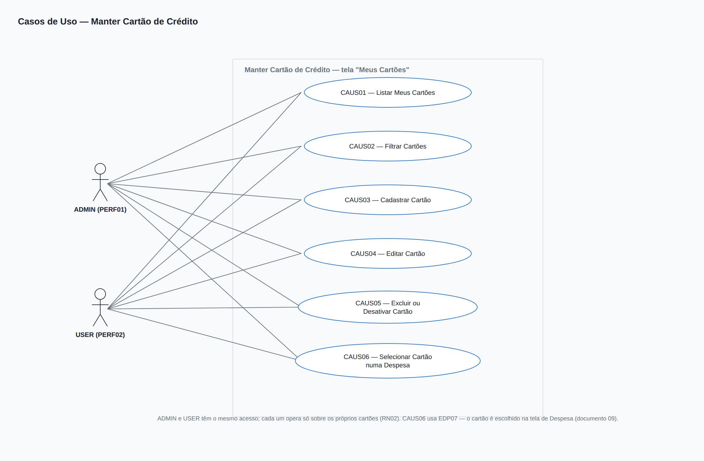
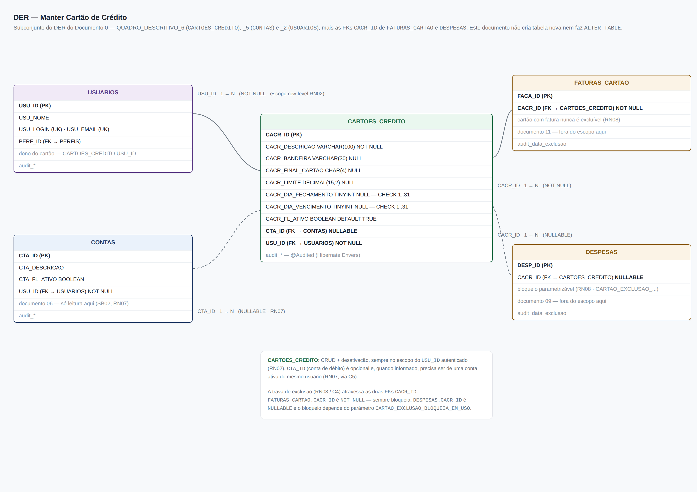
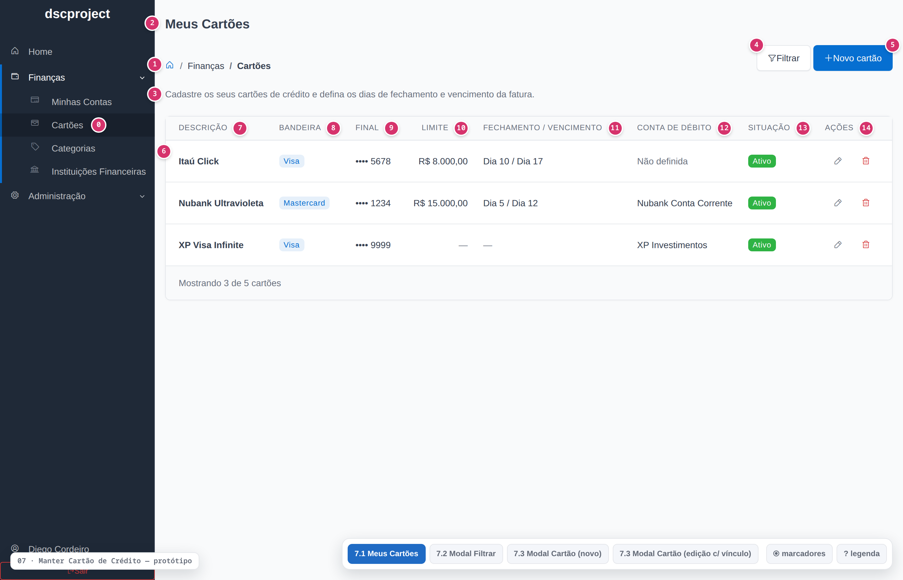
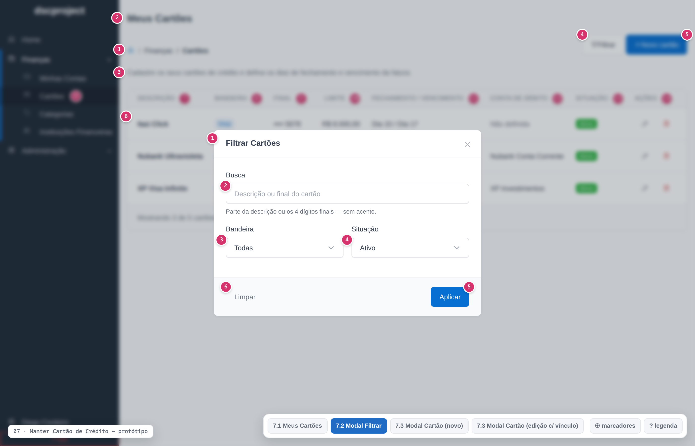
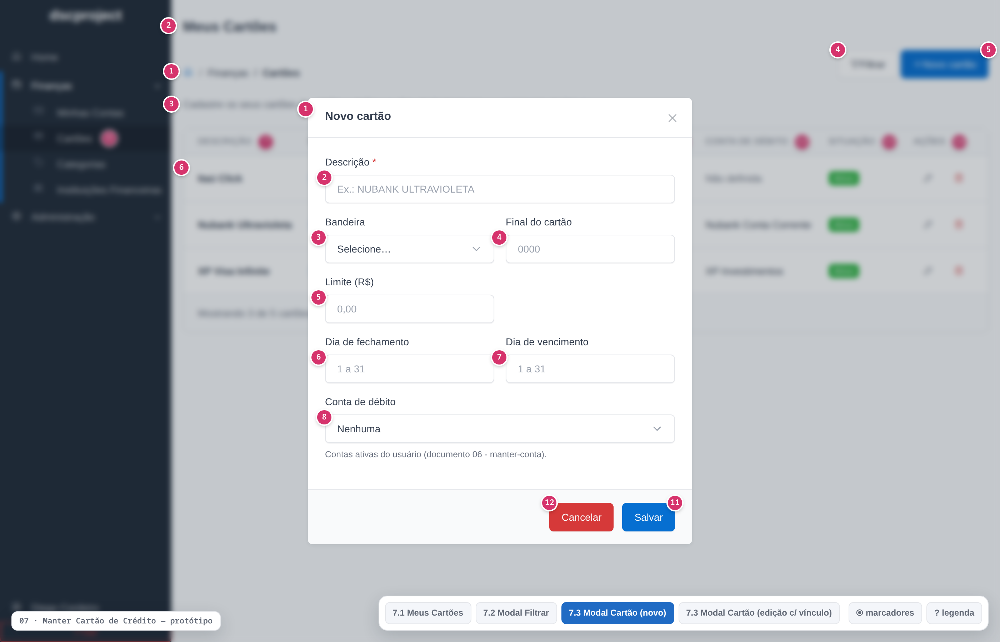

# dscproject — Análise de Sistemas
## Módulo Cartões de Crédito — USER — Manter Cartão de Crédito

**Gerado em:** 08/09/2026
**Versão:** 1.2
**Status:** Desenvolvido
**Projeto:** `dscproject-spring-mvc` (geração 2)

---

## Informações sobre o Documento

| Órgão | dscproject | Setor | Pessoal |
|---|---|---|---|
| Plataforma | dscproject-spring-mvc | Disciplina | Documentação |
| Área Cliente | Diego Cordeiro | Versão do Modelo | 2 (padrão híbrido) |

## Revisões e Aprovações

| Responsável por | Nome | Data de Execução |
|---|---|---|
| Revisão | Diego dos Santos Cordeiro | — |

## Histórico de Versões

| Versão | Data | Analista Responsável | Descrição da Alteração |
|---|---|---|---|
| 1.0 | 08/09/2026 | Diego dos Santos Cordeiro | Criação do documento. CRUD dos cartões de crédito **do usuário** (a tela "Meus Cartões"): descrição, bandeira, final do cartão, limite, dia de fechamento, dia de vencimento, conta de débito (opcional) e situação, com grid client-side, modal de filtro, modal de cadastro/edição e exclusão lógica. A estrutura da tabela é a do Documento 0 ([QUADRO_DESCRITIVO_6](../00%20-%20analise-geral/documento-0-fundacao.md#quadro-descritivo-6)) — este documento não introduz tabela nova. Depende do documento `06 - manter-conta` para o combobox de conta de débito. Não cobre a fatura de cartão (documento `11`) |
| 1.1 | 11/09/2026 | Diego dos Santos Cordeiro | Desmembramento de `CARTOES_MANTER` em `CARTOES_INSERIR`, `CARTOES_EDITAR`, `CARTOES_EXCLUIR` e `CARTOES_DESATIVAR`, diretriz mandatória de máscara monetária client-side em tempo real (`pt-BR`, `R$ 0,00`) para o campo Limite e proibição de permissões genéricas com sufixo `MANTER` conforme governança RBAC granular e Observação 28 do Documento 0. |
| 1.2 | 12/09/2026 | Diego dos Santos Cordeiro | Padronização visual do sistema: explicitação do alinhamento à esquerda para a coluna de Ações no grid de Cartões de Crédito (QUADRO_DESCRITIVO_1). |

---

## Diretrizes para Elaboração do Documento

| Nº | DIRETRIZ |
|---|---|
| D01 | As responsabilidades de camada são documentadas como **Regra de Tela (RT)** e **Regra de Negócio (RN)** — nunca "o backend deve" / "o frontend deve". |
| D02 | O termo `endpoint` é aceito na Seção 8. Fora dela, "chamada ao serviço". |
| D03 | A estrutura de dados é a do Documento 0 (`00 - analise-geral`). Este documento **referencia** os QUADRO_DESCRITIVO do Documento 0 e **não introduz tabela nova**. |
| D04 | `CARTOES_CREDITO` é **dado do próprio usuário** (tem `USU_ID`), não catálogo administrativo. Todo dado exibido ou gravado é restrito ao usuário autenticado, com o escopo aplicado no serviço ([RN02](#rn02)). |

---

## 1. Introdução

Este documento descreve a funcionalidade **Manter Cartão de Crédito** do `dscproject-spring-mvc` — a tela **Meus Cartões**, em que cada usuário cadastra e mantém os seus próprios cartões.

Na geração 1 (API REST + SPA Angular) **não existe cadastro de cartão**: a compra no cartão é registrada como `RegistroFinanceiro` do tipo despesa com a categoria `CARTAO_DE_CREDITO`, sem entidade que represente o cartão em si (não há classe de domínio de cartão em `dsc-backend`). O Documento 0 (Observação 15) travou a decisão de criar a tabela de referência **`CARTOES_CREDITO`** (limite, dia de fechamento, dia de vencimento, conta de débito) e a tabela **`FATURAS_CARTAO`** para o ciclo da fatura. As compras continuam sendo `Despesa`, agora com a FK `CACR_ID` opcional.

Este documento cobre **apenas o cadastro do cartão**:

- a **tela de Meus Cartões** — listar, cadastrar, editar, desativar e excluir (exclusão lógica) os cartões do usuário autenticado;
- a **validação** dos dias de fechamento e vencimento (1 a 31, espelhando o `CHECK` do Documento 0) e do final do cartão (4 dígitos quando informado);
- o **vínculo opcional** com uma conta de débito, escolhida entre as contas do próprio usuário (combobox alimentado pelo documento `06 - manter-conta`);
- o **contrato de consulta** que a tela de Despesa (documento `09`) usa para carregar os cartões ativos do usuário no combobox de cartão.

**Escopo deste documento:**
- Tela de **listagem dos cartões do usuário** (grid client-side), com filtro por modal.
- **Cadastro e edição** de cartão via modal único (descrição, bandeira, final do cartão, limite, dia de fechamento, dia de vencimento, conta de débito, situação).
- **Exclusão lógica** de cartão, com a trava: cartão com faturas ou despesas vinculadas não é excluível (pode ser desativado).
- **Desativação** de cartão (`CACR_FL_ATIVO = FALSE`) — some do combobox de novas despesas sem afetar as despesas e faturas que já o referenciam.
- **Escopo por usuário** (row-level): toda consulta e todo comando são filtrados pelo `USU_ID` do usuário autenticado, resolvido no serviço.
- **Fornecimento dos cartões ativos do usuário** para o combobox da tela de Despesa.
- Definição das permissões atômicas que esta tela usa (`CARTOES_LISTAR`, `CARTOES_INSERIR`, `CARTOES_EDITAR`, `CARTOES_EXCLUIR`, `CARTOES_DESATIVAR`). O RBAC completo é do Documento 0 e a tela que edita perfil × permissão é o documento `02 - manter-perfil-permissao`.

**Não contempla:**
- **Fatura de cartão** — ciclo de vida (`ABERTA` → `FECHADA` → `PAGA` / `PAGA_PARCIAL`), fechamento, pagamento e o valor parcial da fatura em aberto. Tudo isso é o documento `11 - manter-fatura-cartao`. Aqui, apenas os campos `CACR_DIA_FECHAMENTO` e `CACR_DIA_VENCIMENTO`, que a geração da fatura do documento `11` consome.
- CRUD de Despesa, que **consome** o cartão (`CACR_ID`) — documento `09`.
- CRUD de Conta, que fornece o combobox de conta de débito — documento `06`.
- Alerta de estouro de limite, projeção de fatura e "limite disponível" — cálculos do Dashboard (documento `13`) e da fatura (documento `11`). Ver Seção 17.
- Cartão de débito / cartão de sistema: não existem. `CARTOES_CREDITO` só guarda cartão de crédito, sempre de um usuário.

**Perfis com acesso:** [PERF01](#perf01) (ADMIN) e [PERF02](#perf02) (USER). A tela não é administrativa — cada perfil enxerga e mantém **apenas os próprios cartões** ([RN02](#rn02)). O ADMIN não tem visão consolidada dos cartões de outros usuários.

---

## 2. Observações

| Nº | OBSERVAÇÃO | REFERÊNCIA / IMPACTO |
|---|---|---|
| 1 | **O cartão passa a existir como entidade.** A geração 1 não tem domínio de cartão; a compra no cartão é só uma `Despesa` com categoria `CARTAO_DE_CREDITO`. A geração 2 cria `CARTOES_CREDITO` ([QUADRO_DESCRITIVO_6 do Documento 0](../00%20-%20analise-geral/documento-0-fundacao.md#quadro-descritivo-6)) e `Despesa` ganha `CACR_ID` (FK, **nullable**). **[Requer código]** | Documento 0, Observação 15 |
| 2 | **Cartão é dado do usuário, não catálogo.** `CARTOES_CREDITO` tem `USU_ID` obrigatório. Não há "cartão do sistema" nem visão administrativa global. Todo endpoint filtra pelo `USU_ID` do autenticado no serviço ([RN02](#rn02)); o id da requisição nunca amplia o escopo. Modelo igual ao do documento `06 - manter-conta`. | [RN02](#rn02), [RNF06](#rnf06) |
| 3 | **Permissões concedidas a ADMIN e USER.** `CARTOES_LISTAR`, `CARTOES_INSERIR`, `CARTOES_EDITAR`, `CARTOES_EXCLUIR` e `CARTOES_DESATIVAR` ficam nos dois perfis de sistema na carga inicial (Seção 13.1). O que separa um usuário do outro **não** é a permissão, é o escopo por `USU_ID` aplicado no serviço ([RN02](#rn02)). | [PERM01](#perm01), [PERM02](#perm02), [PERM03](#perm03), [PERM04](#perm04), [PERM05](#perm05) |
| 4 | **Conta de débito é opcional.** `CACR_ID → CTA_ID` é **nullable** no Documento 0. O cartão pode ser cadastrado sem conta de débito e ganhar uma depois. Quando informada, a conta tem de ser uma conta **ativa e do próprio usuário** ([RN07](#rn07)). Se a conta deve, na prática, ser obrigatória — ver Seção 17. | [QUADRO_DESCRITIVO_6](../00%20-%20analise-geral/documento-0-fundacao.md#quadro-descritivo-6), [RN07](#rn07) |
| 5 | **Combobox de conta vem do documento `06`.** O modal de cartão carrega as contas ativas do usuário pelo endpoint de opções de contas do documento `06 - manter-conta`. Este documento não redefine esse contrato — apenas o consome ([SB02](#sb02)). | Documento `06 - manter-conta` |
| 6 | **Bandeira: domínio ainda em aberto.** `CACR_BANDEIRA` é `VARCHAR(30)` nullable no Documento 0, com os exemplos VISA, MASTERCARD, ELO, AMEX. A tela trata como combobox desses quatro valores; se será um enum fechado `BandeiraCartao`, texto livre ou combobox editável é decisão da Seção 17. Enquanto isso, persiste a string do valor escolhido. | [RN06](#rn06), Seção 17 |
| 7 | **Dias de fechamento e vencimento.** `CACR_DIA_FECHAMENTO` e `CACR_DIA_VENCIMENTO` são `TINYINT` opcionais, com `CHECK` de 1 a 31 no banco (`ck_cartoes_credito_fech`, `ck_cartoes_credito_venc`). A tela e o serviço repetem essa validação ([RN04](#rn04)). Esses dois campos são a **única** ponte com a fatura: a geração de fatura do documento `11` usa o dia de fechamento para definir o ciclo e o dia de vencimento para a data de pagamento. | [RN04](#rn04), Documento `11` |
| 8 | **Final do cartão.** `CACR_FINAL_CARTAO` é `CHAR(4)` opcional — os últimos 4 dígitos, só para o usuário reconhecer o cartão na lista. Quando informado, tem de ser exatamente 4 dígitos numéricos ([RN05](#rn05)). Nunca se guarda o número completo do cartão. | [RN05](#rn05) |
| 9 | **Exclusão travada por vínculo.** Excluir um cartão referenciado por alguma fatura (`FATURAS_CARTAO`) ou por alguma despesa (`DESPESAS`) não excluída é **bloqueado** ([RN08](#rn08)); a alternativa é **desativar** o cartão. Mesma lógica da [RN06 do documento `04 - manter-categoria`](../04%20-%20manter-categoria/documento-analise-manter-categoria.md#rn06). O comportamento sobre despesas é parametrizável ([Seção 12](#12-parâmetros-de-sistema)); sobre faturas o bloqueio é duro, porque `FATURAS_CARTAO.CACR_ID` é `NOT NULL`. | [RN08](#rn08), [QUADRO_DESCRITIVO_8](../00%20-%20analise-geral/documento-0-fundacao.md#quadro-descritivo-8) |
| 10 | **Desativação ≠ exclusão.** Um cartão inativo (`CACR_FL_ATIVO = FALSE`) some do combobox de **novas** despesas ([EDP07](#edp07)), mas continua válido nas despesas e faturas que já o usam e nos relatórios. | [RN09](#rn09) |
| 11 | **Limite é informativo nesta versão.** `CACR_LIMITE` é guardado e exibido, mas a tela não calcula "limite disponível" nem alerta quando as despesas do ciclo passam do limite — isso depende da fatura (documento `11`) e do Dashboard (documento `13`). Ver Seção 17. | Seção 17 |
| 12 | **Grid client-side.** A lista de cartões de um usuário é curta (raramente mais que uma dúzia). A tela carrega tudo uma vez e pagina/ordena/filtra no navegador (DataTables). | [RNF04](#rnf04) |
| 13 | **Auditoria.** `CARTOES_CREDITO` é auditada via Hibernate Envers (`@Audited`), conforme o Documento 0. Criação, edição, desativação e exclusão lógica ficam registradas (quem, quando, o quê). | [RNF02](#rnf02) |
| 14 | **Mapeamento JPA.** `CartaoCredito` estende `AbstractAuditoria` (Documento 0, Seção 7.5), com `@ManyToOne Conta` (opcional) e `@ManyToOne Usuario` (`@JsonIgnore`). A ordem de criação da tabela é o grupo 4 do `V1__init.sql` (Documento 0, Seção 6.4). | Documento 0, Seções 6.4 e 7.5 |

---

## 3. Requisitos

### 3.1 Requisitos Funcionais

| ID | DESCRIÇÃO | PRIORIDADE | SITUAÇÃO |
|---|---|---|---|
| <a id="rf01"></a>RF01 | O sistema deve listar os cartões de crédito **do usuário autenticado**, com: descrição, bandeira, final do cartão, limite, dia de fechamento, dia de vencimento, conta de débito e situação (ativo/inativo/excluído). | Alta | Em análise |
| <a id="rf02"></a>RF02 | O sistema deve permitir filtrar a listagem por texto (descrição / final do cartão), bandeira e situação, por meio de um modal acionado pelo botão "Filtrar". | Média | Em análise |
| <a id="rf03"></a>RF03 | O sistema deve permitir cadastrar um novo cartão via modal, com os campos: descrição, bandeira, final do cartão, limite, dia de fechamento, dia de vencimento e conta de débito. | Alta | Em análise |
| <a id="rf04"></a>RF04 | O sistema deve permitir editar um cartão existente do próprio usuário, incluindo a situação (ativo/inativo). | Alta | Em análise |
| <a id="rf05"></a>RF05 | O sistema deve validar que o dia de fechamento e o dia de vencimento, quando informados, sejam inteiros entre 1 e 31, e que o final do cartão, quando informado, tenha exatamente 4 dígitos. | Alta | Em análise |
| <a id="rf06"></a>RF06 | O sistema deve impedir a exclusão de um cartão com faturas ou despesas vinculadas, permitindo, nesse caso, apenas a desativação. | Alta | Em análise |
| <a id="rf07"></a>RF07 | O sistema deve permitir a exclusão lógica de um cartão sem faturas nem despesas vinculadas. | Alta | Em análise |
| <a id="rf08"></a>RF08 | O sistema deve permitir desativar e reativar um cartão; um cartão inativo não aparece no combobox de novas despesas, mas as despesas e faturas que já o usam permanecem inalteradas. | Alta | Em análise |
| <a id="rf09"></a>RF09 | O sistema deve fornecer à tela de Despesa (documento `09`) a lista dos cartões **ativos do usuário autenticado**, para o combobox de cartão. | Alta | Em análise |
| <a id="rf10"></a>RF10 | O sistema deve restringir toda leitura e toda gravação de cartão ao usuário autenticado — nenhum usuário lista, consulta, edita ou exclui um cartão de outro usuário. | Alta | Em análise |
| <a id="rf11"></a>RF11 | O sistema deve, ao vincular uma conta de débito ao cartão, aceitar apenas contas ativas e do próprio usuário. | Média | Em análise |

### 3.2 Requisitos Não Funcionais

| ID | CATEGORIA | DESCRIÇÃO | CRITÉRIO DE ACEITAÇÃO |
|---|---|---|---|
| <a id="rnf01"></a>RNF01 | Segurança | Cada endpoint exige a autoridade da sua operação (`PERM_CARTOES_LISTAR`, `PERM_CARTOES_INSERIR`, `PERM_CARTOES_EDITAR`, `PERM_CARTOES_EXCLUIR`, `PERM_CARTOES_DESATIVAR` — ver Seção 13 e [RN01](#rn01)); [EDP07](#edp07) exige apenas usuário autenticado. Além da permissão, o serviço aplica o escopo por `USU_ID` ([RN02](#rn02)). | Teste de acesso com ADMIN, com USER e com um perfil sem as permissões de Cartões. |
| <a id="rnf02"></a>RNF02 | Auditoria | `CARTOES_CREDITO` tem auditoria completa via Hibernate Envers. | Inspeção da tabela `CARTOES_CREDITO_aud` após operações de CRUD. |
| <a id="rnf03"></a>RNF03 | Integridade | O banco garante `CACR_DIA_FECHAMENTO` e `CACR_DIA_VENCIMENTO` entre 1 e 31 (`ck_cartoes_credito_fech`, `ck_cartoes_credito_venc`) e a FK `CTA_ID` válida. As travas de exclusão ([RN08](#rn08)) e as validações de campo ([RN04](#rn04), [RN05](#rn05), [RN07](#rn07)) são aplicadas no serviço, não só na tela. | Teste chamando o endpoint diretamente. |
| <a id="rnf04"></a>RNF04 | Desempenho | A listagem ([EDP02](#edp02)) responde em menos de 1 s carregando a lista completa dos cartões do usuário uma vez. O combobox de cartões ([EDP07](#edp07)) responde em menos de 500 ms. | Medição em homologação. |
| <a id="rnf05"></a>RNF05 | Usabilidade | A interface segue o padrão do projeto (Thymeleaf + Tabler + DataTables + AJAX) e é responsiva. O campo Limite possui máscara monetária client-side em tempo real no padrão `pt-BR` (`R$ 0,00`). O cadastro e a edição são feitos num modal único. | Revisão visual e teste de digitação no input de limite. |
| <a id="rnf06"></a>RNF06 | Privacidade | Um usuário nunca obtém dados de um cartão de outro usuário, nem por listagem, nem por id direto em [EDP03](#edp03)/[EDP05](#edp05)/[EDP06](#edp06). A resposta para um id de outro dono é a mesma de um id inexistente ([MSG11](#msg11), HTTP 404). | Teste de acesso cruzado: usuário A tenta acessar o cartão de B por id. |

---

## 4. Casos de Uso



| CÓDIGO | NOME | ATOR PRINCIPAL | DESCRIÇÃO |
|---|---|---|---|
| <a id="caus01"></a>CAUS01 | Listar Meus Cartões | [PERF01](#perf01), [PERF02](#perf02) | Usuário acessa o menu "Finanças > Cartões" e visualiza a lista dos próprios cartões. ([RF01](#rf01), [RF10](#rf10)) |
| <a id="caus02"></a>CAUS02 | Filtrar Cartões | [PERF01](#perf01), [PERF02](#perf02) | Usuário abre o modal de filtro, informa os critérios e aplica. ([RF02](#rf02)) |
| <a id="caus03"></a>CAUS03 | Cadastrar Cartão | [PERF01](#perf01), [PERF02](#perf02) | Usuário abre o modal de cadastro, preenche os dados e confirma. ([RF03](#rf03), [RF05](#rf05), [RF11](#rf11)) |
| <a id="caus04"></a>CAUS04 | Editar Cartão | [PERF01](#perf01), [PERF02](#perf02) | Usuário abre o modal de edição de um cartão seu, altera os dados e confirma. ([RF04](#rf04), [RF05](#rf05)) |
| <a id="caus05"></a>CAUS05 | Excluir ou Desativar Cartão | [PERF01](#perf01), [PERF02](#perf02) | Usuário exclui logicamente um cartão sem vínculo, ou o desativa quando ele tem faturas ou despesas. ([RF06](#rf06), [RF07](#rf07), [RF08](#rf08)) |
| <a id="caus06"></a>CAUS06 | Selecionar Cartão numa Despesa | [PERF01](#perf01), [PERF02](#perf02) | Ao cadastrar uma despesa no cartão, o usuário escolhe o cartão num combobox alimentado pelos seus cartões ativos. Contexto — regra no documento `09`. ([RF09](#rf09)) |

---

## 5. Localização / Critérios de Aceitação

**Caminho de Navegação:**
- Menu principal > Finanças > Cartões  (rótulo do menu: "Cartões"; título da tela: "Meus Cartões")

**Critérios de Aceitação:**
- O menu 'Cartões' é visível para quem tem [PERM01](#perm01) — por padrão, ADMIN e USER.
- Ao acessar a tela, a listagem dos cartões do usuário é carregada automaticamente.
- Um usuário nunca vê, na lista ou por acesso direto, um cartão de outro usuário.
- O filtro é aplicado por um modal acionado pelo botão "Filtrar".
- O cadastro e a edição de cartão são feitos num modal único.
- O campo Situação (ativo) só aparece na edição.
- Os campos dia de fechamento e dia de vencimento só aceitam inteiros de 1 a 31; o final do cartão só aceita 4 dígitos.
- A conta de débito é opcional e lista apenas as contas ativas do próprio usuário.
- Não é possível excluir um cartão com faturas ou despesas vinculadas; nesse caso, a tela oferece a desativação.
- Um cartão inativo não aparece no combobox de uma nova despesa, mas as despesas que já o usam permanecem inalteradas.
- A tela de Despesa recebe apenas os cartões ativos do usuário autenticado.

---

## 6. Banco de Dados

Toda a estrutura está no **Documento 0** (`00 - analise-geral`). Este documento **não introduz tabela nova** e **não faz `ALTER TABLE`**.

| Tabela | Onde | Papel nesta tela |
|---|---|---|
| `CARTOES_CREDITO` | Documento 0 — [QUADRO_DESCRITIVO_6](../00%20-%20analise-geral/documento-0-fundacao.md#quadro-descritivo-6) | CRUD + desativação, sempre filtrado por `USU_ID` |
| `CONTAS` | Documento 0 — [QUADRO_DESCRITIVO_5](../00%20-%20analise-geral/documento-0-fundacao.md#quadro-descritivo-5) | Somente leitura — combobox de conta de débito ([SB02](#sb02)), restrito às contas ativas do usuário. Contrato no documento `06` |
| `FATURAS_CARTAO` | Documento 0 — [QUADRO_DESCRITIVO_8](../00%20-%20analise-geral/documento-0-fundacao.md#quadro-descritivo-8) | Somente leitura — trava de exclusão ([RN08](#rn08), via [C4](#c4)); `FATURAS_CARTAO.CACR_ID` é `NOT NULL` |
| `DESPESAS` | Documento 0 — [QUADRO_DESCRITIVO_10](../00%20-%20analise-geral/documento-0-fundacao.md#quadro-descritivo-10) | Somente leitura — trava de exclusão ([RN08](#rn08), via [C4](#c4)); `DESPESAS.CACR_ID` é FK **nullable** |
| `USUARIOS` | Documento 0 — [QUADRO_DESCRITIVO_2](../00%20-%20analise-geral/documento-0-fundacao.md#quadro-descritivo-2) | Somente leitura — o `USU_ID` do dono do cartão vem do contexto de segurança |

> Nenhum `ALTER TABLE` neste documento. A FK `CACR_ID` já existe em `DESPESAS` e `FATURAS_CARTAO` (Documento 0). A tabela `CARTOES_CREDITO` já traz `USU_ID` `NOT NULL`, `CTA_ID` `NULL` e os dois `CHECK` de dia — a base do comportamento de [RN02](#rn02), [RN04](#rn04), [RN07](#rn07) e [RN08](#rn08).

### 6.1 Diagrama ER



### 6.2 Auditoria de Tabelas

| TABELA PRINCIPAL | TABELA DE AUDITORIA | CAMPOS AUDITADOS |
|---|---|---|
| CARTOES_CREDITO | CARTOES_CREDITO_aud | Descrição, bandeira, final do cartão, limite, dia de fechamento, dia de vencimento, flag de ativo, conta de débito. Registra criação, edição, desativação e exclusão lógica |

### 6.3 Procedures / Views / Triggers / Functions

Nenhuma. O escopo por usuário, a contagem de vínculos e as validações de campo ficam na camada de serviço.

---

## 7. Protótipos de Interface

Protótipo navegável e wireframes: `prototipo/manter-cartao-credito-prototipo.html` e `prototipo/manter-cartao-credito-prototipo.drawio`. Os números em destaque nas telas correspondem aos IDs dos itens do respectivo QUADRO_DESCRITIVO.

### <a id="quadro-descritivo-1"></a>7.1 Tela: Meus Cartões (Listagem) — QUADRO_DESCRITIVO_1



> OBSERVAÇÕES: Tela acessada via 'Finanças > Cartões'. Restrita a quem tem [PERM01](#perm01). Grid client-side. Lista **somente os cartões do usuário autenticado** ([RN02](#rn02)). O filtro é acionado por um modal (botão "Filtrar").

| ID | NOME | PROPRIEDADES | OBSERVAÇÕES |
|---|---|---|---|
| <a id="qdd1-0"></a>0 | LINK | Caminho: "/cartoes/listar" | — |
| <a id="qdd1-1"></a>1 | BREADCRUMB | Tipo: Texto<br>Texto: Finanças > Cartões | — |
| <a id="qdd1-2"></a>2 | TÍTULO DA TELA | Tipo: Texto<br>Texto: Meus Cartões | — |
| <a id="qdd1-3"></a>3 | DESCRIÇÃO | Tipo: Texto<br>Texto: Cadastre os seus cartões de crédito e defina os dias de fechamento e vencimento da fatura. | — |
| <a id="qdd1-4"></a>4 | BOTÃO FILTRAR | Tipo: Botão<br>Texto: Filtrar<br>Ícone: filter | Ao clicar, executar [RT01](#rt01). |
| <a id="qdd1-5"></a>5 | BOTÃO NOVO CARTÃO | Tipo: Botão (primário)<br>Texto: Novo cartão<br>Ícone: plus | Visível a quem tem [PERM02](#perm02) (`CARTOES_INSERIR`). Ao clicar, executar [RT04](#rt04). |
| <a id="qdd1-6"></a>6 | GRID DE LISTAGEM | Tipo: Grid (DataTables, client-side)<br>Colunas: [ID7](#qdd1-7)…[ID14](#qdd1-14)<br>Itens por página: 10, 25, 50<br>Ordenação padrão: Descrição crescente<br>Endpoint: [EDP02](#edp02) | Carrega a lista completa dos cartões do usuário uma vez. Filtra em memória conforme [RT02](#rt02). |
| <a id="qdd1-7"></a>7 | DESCRIÇÃO | Tipo: Coluna<br>Ordenação: Sim | Exibe [C1](#c1).descricao. Precedida do rótulo da bandeira, quando houver. |
| <a id="qdd1-8"></a>8 | BANDEIRA | Tipo: Coluna (badge)<br>Ordenação: Sim | Exibe [C1](#c1).bandeira; vazio quando não informada. |
| <a id="qdd1-9"></a>9 | FINAL | Tipo: Coluna<br>Ordenação: Não | Exibe "•••• " + [C1](#c1).finalCartao; vazio quando não informado. |
| <a id="qdd1-10"></a>10 | LIMITE | Tipo: Coluna (moeda)<br>Ordenação: Sim | Exibe [C1](#c1).limite formatado em BRL; vazio quando não informado. |
| <a id="qdd1-11"></a>11 | FECHAMENTO / VENCIMENTO | Tipo: Coluna<br>Ordenação: Não | Exibe "Dia {fechamento} / Dia {vencimento}" de [C1](#c1).diaFechamento e [C1](#c1).diaVencimento; "—" quando ambos nulos. |
| <a id="qdd1-12"></a>12 | CONTA DE DÉBITO | Tipo: Coluna<br>Ordenação: Sim | Exibe [C1](#c1).contaDescricao; "Não definida" quando nula. |
| <a id="qdd1-13"></a>13 | SITUAÇÃO | Tipo: Coluna (badge)<br>Ordenação: Sim | "Ativo" (verde) quando `CACR_FL_ATIVO` e sem `audit_data_exclusao`; "Inativo" (cinza) quando `CACR_FL_ATIVO = FALSE`; "Excluído" quando há `audit_data_exclusao`. |
| <a id="qdd1-14"></a>14 | ÍCONES DE AÇÃO | Tipo: Coluna (alinhada à esquerda)<br>Editar (ícone: edit, tooltip: Editar cartão) — visível a quem tem [PERM03](#perm03) (`CARTOES_EDITAR`)<br>Excluir (ícone: trash, tooltip: Excluir cartão) — visível a quem tem [PERM04](#perm04) (`CARTOES_EXCLUIR`) | Editar → [RT05](#rt05). Excluir → [RT07](#rt07); oculto quando o cartão já está excluído. |

### <a id="quadro-descritivo-2"></a>7.2 Modal: Filtrar Cartões — QUADRO_DESCRITIVO_2



> OBSERVAÇÕES: Todos os campos são opcionais. O filtro é aplicado em memória sobre a lista já carregada ([RT02](#rt02)).

| ID | NOME | PROPRIEDADES | OBSERVAÇÕES |
|---|---|---|---|
| <a id="qdd2-1"></a>1 | TÍTULO DO MODAL | Tipo: Texto<br>Texto: Filtrar Cartões | — |
| <a id="qdd2-2"></a>2 | FILTRO – BUSCA | Tipo: Input Text<br>Obrigatório: Não<br>Placeholder: Descrição ou final do cartão<br>Tooltip: Filtre por parte da descrição ou pelos 4 dígitos finais. | Filtro parcial e sem acento sobre descrição e final do cartão. |
| <a id="qdd2-3"></a>3 | FILTRO – BANDEIRA | Tipo: Combobox<br>Obrigatório: Não<br>Placeholder: Todas<br>Domínio: Todas / Visa / Mastercard / Elo / Amex | Filtra por [C1](#c1).bandeira. Ver [SB03](#sb03). |
| <a id="qdd2-4"></a>4 | FILTRO – SITUAÇÃO | Tipo: Combobox<br>Obrigatório: Não<br>Valor default: Ativo<br>Domínio: Ativo / Inativo / Excluído / Todas | Filtra por `CACR_FL_ATIVO` e pela presença de `audit_data_exclusao`. Ver [SB04](#sb04). |
| <a id="qdd2-5"></a>5 | BOTÃO APLICAR | Tipo: Botão<br>Texto: Aplicar | Ao clicar, executar [RT02](#rt02). |
| <a id="qdd2-6"></a>6 | BOTÃO LIMPAR | Tipo: Botão<br>Texto: Limpar | Ao clicar, executar [RT03](#rt03). |

### <a id="quadro-descritivo-3"></a>7.3 Modal: Cadastro / Edição de Cartão — QUADRO_DESCRITIVO_3



> OBSERVAÇÕES: Modal único de cadastro e edição. O cadastro exige [PERM02](#perm02) (`CARTOES_INSERIR`) e a edição exige [PERM03](#perm03) (`CARTOES_EDITAR`). Ao editar, o cartão precisa pertencer ao usuário autenticado ([RN02](#rn02)). O campo Situação (ativo) só aparece na edição e sua alteração exige [PERM05](#perm05) (`CARTOES_DESATIVAR`). A conta de débito é opcional. O campo limite possui máscara monetária em tempo real (`pt-BR`).

| ID | NOME | PROPRIEDADES | OBSERVAÇÕES |
|---|---|---|---|
| <a id="qdd3-1"></a>1 | TÍTULO DO MODAL | Tipo: Texto<br>Texto: Novo cartão / Editar cartão | Varia conforme o modo. |
| <a id="qdd3-2"></a>2 | CAMPO – DESCRIÇÃO | Tipo: Input Text<br>Tamanho: 100<br>Obrigatório: Sim | Grava `CACR_DESCRICAO`. Ex.: "NUBANK ULTRAVIOLETA". |
| <a id="qdd3-3"></a>3 | CAMPO – BANDEIRA | Tipo: Combobox<br>Obrigatório: Não<br>Placeholder: Selecione<br>Domínio: Visa / Mastercard / Elo / Amex | Grava `CACR_BANDEIRA` (string do valor). Ver [SB01](#sb01) e [RN06](#rn06). |
| <a id="qdd3-4"></a>4 | CAMPO – FINAL DO CARTÃO | Tipo: Input Text<br>Tamanho: 4<br>Máscara: 4 dígitos<br>Obrigatório: Não | Grava `CACR_FINAL_CARTAO`. Exatamente 4 dígitos numéricos quando informado ([RN05](#rn05)). |
| <a id="qdd3-5"></a>5 | CAMPO – LIMITE | Tipo: Input moeda (BRL)<br>Máscara: Moeda client-side em tempo real (`pt-BR`, `R$ 0,00`)<br>Obrigatório: Não | Grava `CACR_LIMITE` (`DECIMAL(15,2)`). Informativo nesta versão ([Observação 11](#2-observações)). |
| <a id="qdd3-6"></a>6 | CAMPO – DIA DE FECHAMENTO | Tipo: Input número<br>Mínimo: 1<br>Máximo: 31<br>Obrigatório: Não | Grava `CACR_DIA_FECHAMENTO`. Inteiro de 1 a 31 ([RN04](#rn04)). |
| <a id="qdd3-7"></a>7 | CAMPO – DIA DE VENCIMENTO | Tipo: Input número<br>Mínimo: 1<br>Máximo: 31<br>Obrigatório: Não | Grava `CACR_DIA_VENCIMENTO`. Inteiro de 1 a 31 ([RN04](#rn04)). |
| <a id="qdd3-8"></a>8 | CAMPO – CONTA DE DÉBITO | Tipo: Combobox<br>Obrigatório: Não<br>Placeholder: Nenhuma<br>Domínio: contas ativas do usuário | Grava `CTA_ID`. Ver [SB02](#sb02) e [RN07](#rn07). |
| <a id="qdd3-9"></a>9 | CAMPO – ATIVO | Tipo: Toggle (Sim/Não)<br>Valor default: Sim<br>Exibição: só no modo edição | Grava `CACR_FL_ATIVO`. Exige [PERM05](#perm05) (`CARTOES_DESATIVAR`). Ver [RN09](#rn09). |
| <a id="qdd3-10"></a>10 | AVISO – CARTÃO COM VÍNCULOS | Tipo: Texto informativo | Exibido no modo edição quando [C1](#c1).qtdVinculos > 0: "Este cartão possui {n} fatura(s)/despesa(s) vinculada(s). Ele não pode ser excluído; você pode desativá-lo." |
| <a id="qdd3-11"></a>11 | BOTÃO SALVAR | Tipo: Botão (primário)<br>Texto: Salvar<br>Endpoint: [EDP04](#edp04) (criação - [PERM02](#perm02)) ou [EDP05](#edp05) (edição - [PERM03](#perm03)) | Ao clicar, executar [RT06](#rt06). |
| <a id="qdd3-12"></a>12 | BOTÃO CANCELAR | Tipo: Botão<br>Texto: Cancelar | Fecha sem salvar. |

### 7.4 Suggestion Boxes

| ID | NOME | DESCRIÇÃO |
|---|---|---|
| <a id="sb01"></a>SB01 | BANDEIRA | Domínio dos valores de bandeira aceitos (Visa, Mastercard, Elo, Amex). Renderizado como combobox; grava a string do valor em `CACR_BANDEIRA`. Se vira enum fechado, texto livre ou combobox editável é decisão da Seção 17. |
| <a id="sb02"></a>SB02 | CONTA DE DÉBITO | Itens carregados das **contas ativas do usuário autenticado** pelo endpoint de opções de contas do documento `06 - manter-conta`, ordenados por descrição. No modal, a opção "Nenhuma" é adicional (conta de débito é opcional — [RN07](#rn07)). Nunca `<option>` fixo no HTML. |
| <a id="sb03"></a>SB03 | FILTRO BANDEIRA | Domínio fixo do próprio filtro: Todas, Visa, Mastercard, Elo, Amex. |
| <a id="sb04"></a>SB04 | FILTRO SITUAÇÃO | Domínio fixo do próprio filtro: Ativo, Inativo, Excluído, Todas. |

### 7.5 Regras de Tela

| ID | DESCRIÇÃO |
|---|---|
| <a id="rt01"></a>RT01 | Ao clicar em "Filtrar" ([ID4](#qdd1-4)), abrir o modal de filtro ([QUADRO_DESCRITIVO_2](#quadro-descritivo-2)) com os valores atualmente aplicados. |
| <a id="rt02"></a>RT02 | Ao clicar em "Aplicar" ([ID5](#qdd2-5)), filtrar **em memória** a lista já carregada: busca parcial e sem acento sobre descrição/final do cartão, e correspondência exata de bandeira e situação. Fechar o modal. Se nada restar, exibir [MSG09](#msg09) na área do grid. |
| <a id="rt03"></a>RT03 | Ao clicar em "Limpar" ([ID6](#qdd2-6)), voltar Busca e Bandeira para vazio, Situação para "Ativo", e reaplicar conforme [RT02](#rt02). |
| <a id="rt04"></a>RT04 | Ao clicar em "Novo cartão" ([ID5](#qdd1-5)) — visível só com [PERM02](#perm02) (`CARTOES_INSERIR`) —, abrir o modal ([QUADRO_DESCRITIVO_3](#quadro-descritivo-3)) em modo criação: campos vazios, Bandeira e Conta de débito sem seleção, sem o campo Ativo. Carregar a Conta de débito por [SB02](#sb02). |
| <a id="rt05"></a>RT05 | Ao clicar no ícone Editar ([ID14](#qdd1-14)) — visível só com [PERM03](#perm03) (`CARTOES_EDITAR`) —, chamar [EDP03](#edp03) com o id e abrir o modal em modo edição, com os campos preenchidos. Se [C1](#c1).qtdVinculos > 0, exibir o aviso [ID10](#qdd3-10). Se o id não for do usuário autenticado, o serviço responde 404 e a tela exibe [MSG11](#msg11). |
| <a id="rt06"></a>RT06 | Ao clicar em "Salvar" ([ID11](#qdd3-11)): validar Descrição obrigatória ([MSG02](#msg02)); validar dia de fechamento e dia de vencimento entre 1 e 31 quando preenchidos ([MSG03](#msg03)); validar final do cartão com exatamente 4 dígitos quando preenchido ([MSG04](#msg04)). Em criação, chamar [EDP04](#edp04) (exige [PERM02](#perm02)); em edição, [EDP05](#edp05) (exige [PERM03](#perm03), e [PERM05](#perm05) se alterar a situação ativo/inativo). Em sucesso, exibir [MSG01](#msg01) (criação) ou [MSG05](#msg05) (edição), fechar o modal e recarregar o grid via [EDP02](#edp02). Conta de débito inválida ([RN07](#rn07)) → [MSG10](#msg10) no campo Conta de débito. |
| <a id="rt07"></a>RT07 | Ao clicar no ícone Excluir ([ID14](#qdd1-14)) — visível só com [PERM04](#perm04) (`CARTOES_EXCLUIR`) —, exibir a confirmação [MSG06](#msg06). Ao confirmar, chamar [EDP06](#edp06). Cartão com faturas ou despesas vinculadas → [MSG08](#msg08), com a oferta de desativar (ao aceitar desativar, chamar [EDP05](#edp05) apenas com `CACR_FL_ATIVO = FALSE`, exigindo [PERM05](#perm05)). Em sucesso da exclusão, exibir [MSG07](#msg07) e recarregar o grid. |
| <a id="rt08"></a>RT08 | Ao digitar no campo Final do cartão ([ID4](#qdd3-4)), aceitar somente dígitos e limitar a 4 caracteres. Ao digitar nos campos de dia ([ID6](#qdd3-6), [ID7](#qdd3-7)), aceitar somente inteiros e impedir valores fora de 1 a 31. |

---

## 8. Endpoints

Todos os endpoints deste documento resolvem o `USU_ID` do usuário autenticado a partir do contexto de segurança e aplicam o escopo por usuário no serviço ([RN02](#rn02)). O combobox de conta de débito ([SB02](#sb02)) consome o endpoint de opções de contas do documento `06 - manter-conta` — não reproduzido aqui.

| CÓDIGO | HTTP | PERMISSÃO | PATH | FINALIZADO? |
|---|---|---|---|---|
| <a id="edp01"></a>EDP01 | GET | [PERM01](#perm01) (`CARTOES_LISTAR`) | /cartoes/listar | N |
| Retorna a página da listagem de cartões (Thymeleaf). O grid é carregado por [EDP02](#edp02). | | | | |
| <a id="edp02"></a>EDP02 | GET | [PERM01](#perm01) (`CARTOES_LISTAR`) | /cartoes/listar-dados | N |
| Lista dos cartões **do usuário autenticado** para o grid, em JSON. Executa [C1](#c1). Campos: id, descricao, bandeira, finalCartao, limite, diaFechamento, diaVencimento, contaId, contaDescricao, qtdVinculos, ativo (boolean), excluido (boolean). Sem paginação (client-side). | | | | |
| <a id="edp03"></a>EDP03 | GET | [PERM03](#perm03) (`CARTOES_EDITAR`) | /cartoes/buscar/{id} | N |
| Retorna um cartão do usuário autenticado para edição. Executa [C3](#c3). Campos: id, descricao, bandeira, finalCartao, limite, diaFechamento, diaVencimento, contaId, ativo, qtdVinculos. Se o cartão não existir ou não for do usuário → 404 ([MSG11](#msg11)). | | | | |
| <a id="edp04"></a>EDP04 | POST | [PERM02](#perm02) (`CARTOES_INSERIR`) | /cartoes/inserir | N |
| Cria um cartão para o usuário autenticado. Executa [RN04](#rn04), [RN05](#rn05), [RN06](#rn06) e [RN07](#rn07) (valida a conta de débito, via [C5](#c5)). Dados: descricao, bandeira, finalCartao, limite, diaFechamento, diaVencimento, contaId. `USU_ID` do contexto de segurança; `CACR_FL_ATIVO = TRUE` fixo. Retorno: 200 ([MSG01](#msg01)) ou 422 ([MSG02](#msg02)/[MSG03](#msg03)/[MSG04](#msg04)/[MSG10](#msg10)). | | | | |
| <a id="edp05"></a>EDP05 | PUT | [PERM03](#perm03) (`CARTOES_EDITAR`) / [PERM05](#perm05) (`CARTOES_DESATIVAR`) | /cartoes/editar/{id} | N |
| Edita um cartão do usuário autenticado. Executa [RN02](#rn02) (recusa se o cartão não for do usuário → [MSG11](#msg11)), [RN04](#rn04), [RN05](#rn05), [RN06](#rn06), [RN07](#rn07), [RN09](#rn09) (desativação) e [RN10](#rn10) (edição dos dias com faturas existentes). Dados: descricao, bandeira, finalCartao, limite, diaFechamento, diaVencimento, contaId, ativo. Invalida o cache do combobox de cartões do usuário ([RNF04](#rnf04)). Retorno: 200 ([MSG05](#msg05)) ou 422 ([MSG02](#msg02)/[MSG03](#msg03)/[MSG04](#msg04)/[MSG10](#msg10)/[MSG11](#msg11)). | | | | |
| <a id="edp06"></a>EDP06 | DELETE | [PERM04](#perm04) (`CARTOES_EXCLUIR`) | /cartoes/excluir/{id} | N |
| Exclusão lógica do cartão do usuário autenticado. Executa [RN02](#rn02) (recusa se não for do usuário → [MSG11](#msg11)) e [RN08](#rn08) (recusa se houver faturas ou despesas vinculadas, via [C4](#c4) → [MSG08](#msg08)). Preenche `audit_data_exclusao` / `audit_excluido_por`. Retorno: 200 ([MSG07](#msg07)) ou 422 ([MSG08](#msg08)). | | | | |
| <a id="edp07"></a>EDP07 | GET | Autenticado | /cartoes/opcoes | N |
| Retorna os cartões **ativos do usuário autenticado** para o combobox da tela de Despesa (documento `09`). Executa [C2](#c2). Campos: id, descricao, bandeira, finalCartao, diaFechamento, diaVencimento. Exige apenas usuário autenticado — o escopo por `USU_ID` já restringe o resultado. | | | | |

---

## 9. Regras de Negócio

| ID | DESCRIÇÃO |
|---|---|
| <a id="rn01"></a>RN01 | Cada endpoint exige a autoridade da sua operação específica: [EDP01](#edp01)/[EDP02](#edp02) → `PERM_CARTOES_LISTAR`; [EDP04](#edp04) → `PERM_CARTOES_INSERIR`; [EDP03](#edp03)/[EDP05](#edp05) → `PERM_CARTOES_EDITAR`; [EDP06](#edp06) → `PERM_CARTOES_EXCLUIR`; [EDP05](#edp05) (ao alterar situação ativo/inativo) → `PERM_CARTOES_DESATIVAR`. É terminantemente proibido o uso de permissão agregadora com sufixo `MANTER`. [EDP07](#edp07) exige apenas usuário autenticado. As autoridades são resolvidas pelo `getAuthorities()` do `Usuario` a partir do perfil e das permissões vinculadas em `PERFIL_PERMISSAO`. |
| <a id="rn02"></a>RN02 | **Escopo por usuário (row-level).** Toda consulta ([C1](#c1)–[C5](#c5)) e todo comando ([EDP03](#edp03)–[EDP07](#edp07)) são filtrados pelo `USU_ID` do usuário autenticado, resolvido no serviço a partir do contexto de segurança (`SecurityContext` / token) — **nunca** de parâmetro da requisição. Em [EDP03](#edp03)/[EDP05](#edp05)/[EDP06](#edp06), se o `{id}` não corresponder a um cartão do usuário, o serviço responde **404** com [MSG11](#msg11), sem revelar se o cartão existe para outro dono. O ADMIN ([PERF01](#perf01)) não tem exceção: administra os próprios cartões, como o USER. |
| <a id="rn03"></a>RN03 | `CACR_DESCRICAO` é obrigatória ([MSG02](#msg02)). Não há unicidade de descrição no banco; se a descrição deve ser única entre os cartões não excluídos do mesmo usuário é decisão da Seção 17. |
| <a id="rn04"></a>RN04 | `CACR_DIA_FECHAMENTO` e `CACR_DIA_VENCIMENTO` são opcionais; quando informados, devem ser inteiros entre **1 e 31** — o serviço valida antes de persistir e retorna [MSG03](#msg03) em caso de violação. É a mesma regra dos `CHECK` `ck_cartoes_credito_fech` e `ck_cartoes_credito_venc` do Documento 0. Se um dos dois exige o outro (informar fechamento obriga informar vencimento) é decisão da Seção 17. |
| <a id="rn05"></a>RN05 | `CACR_FINAL_CARTAO` é opcional; quando informado, deve ter **exatamente 4 dígitos numéricos** (`CHAR(4)`). Valor com menos, mais ou com caractere não numérico → [MSG04](#msg04). O número completo do cartão nunca é solicitado nem armazenado. |
| <a id="rn06"></a>RN06 | `CACR_BANDEIRA` é opcional; quando informada, deve ser um dos valores aceitos (Visa, Mastercard, Elo, Amex — [SB01](#sb01)). O serviço grava a string do valor. A forma final do domínio (enum `BandeiraCartao` fechado, texto livre ou combobox editável) é decisão da Seção 17; enquanto isso, valor fora da lista → [MSG02](#msg02) no campo Bandeira. |
| <a id="rn07"></a>RN07 | `CACR_ID → CTA_ID` (conta de débito) é opcional. Quando informado, a conta tem de existir, estar **ativa** (`CTA_FL_ATIVO = TRUE`), não estar excluída e **pertencer ao usuário autenticado** — o serviço verifica via [C5](#c5). Conta inexistente, inativa, excluída ou de outro usuário → [MSG10](#msg10). Se, na prática, a conta de débito deve ser obrigatória a partir de algum momento é decisão da Seção 17. |
| <a id="rn08"></a>RN08 | Exclusão de cartão ([EDP06](#edp06)): recusar se existir **qualquer** fatura (`FATURAS_CARTAO`) ou despesa (`DESPESAS`) não excluída com `CACR_ID` apontando para o cartão — executa [C4](#c4) — e retornar [MSG08](#msg08). A alternativa oferecida é a desativação ([RN09](#rn09)). Sobre despesas, o comportamento é controlado pelo parâmetro `CARTAO_EXCLUSAO_BLOQUEIA_EM_USO` (Seção 12): quando `false`, a exclusão é permitida e as despesas afetadas ficam com `CACR_ID` nulo. Sobre faturas, o bloqueio é **sempre** aplicado, porque `FATURAS_CARTAO.CACR_ID` é `NOT NULL` e não há como desvincular. Ver a decisão em aberto na Seção 17. |
| <a id="rn09"></a>RN09 | Cartão inativo (`CACR_FL_ATIVO = FALSE`): não é devolvido por [EDP07](#edp07) e não pode ser escolhido em novas despesas. As despesas e faturas que já o referenciam permanecem inalteradas, e ele continua contando nos relatórios. Reativar é apenas voltar `CACR_FL_ATIVO = TRUE` por [EDP05](#edp05). |
| <a id="rn10"></a>RN10 | Editar `CACR_DIA_FECHAMENTO` ou `CACR_DIA_VENCIMENTO` de um cartão que já possui faturas ([EDP05](#edp05)) é **permitido**; os novos valores passam a valer para as faturas geradas **a partir da alteração** (documento `11`). As faturas já existentes não são recalculadas nem têm as datas reescritas. Se essa edição deve ser **travada** quando há faturas é decisão da Seção 17. |
| <a id="rn11"></a>RN11 | Exclusão de cartão é sempre **lógica** (`audit_data_exclusao` / `audit_excluido_por`), nunca física — o histórico de despesas e faturas continua referenciável. |
| <a id="rn12"></a>RN12 | `CACR_LIMITE` é um dado informativo nesta versão. O serviço não valida o valor das despesas do ciclo contra o limite, não calcula "limite disponível" e não emite alerta de estouro — isso depende da fatura (documento `11`) e do Dashboard (documento `13`). Ver a decisão em aberto na Seção 17. |

---

## 10. Mensagens de Sistema

| CÓDIGO | DESCRIÇÃO |
|---|---|
| <a id="msg01"></a>MSG01 | Cartão cadastrado com sucesso. |
| <a id="msg02"></a>MSG02 | O campo {campo} é obrigatório. |
| <a id="msg03"></a>MSG03 | Informe um dia entre 1 e 31. |
| <a id="msg04"></a>MSG04 | O final do cartão deve ter exatamente 4 dígitos. |
| <a id="msg05"></a>MSG05 | Cartão atualizado com sucesso. |
| <a id="msg06"></a>MSG06 | Confirma a exclusão do cartão "{descricao}"? |
| <a id="msg07"></a>MSG07 | Cartão excluído com sucesso. |
| <a id="msg08"></a>MSG08 | Este cartão possui faturas ou despesas vinculadas e não pode ser excluído. Desative-o para ocultá-lo de novas despesas. |
| <a id="msg09"></a>MSG09 | Nenhum cartão encontrado com os filtros informados. |
| <a id="msg10"></a>MSG10 | A conta de débito informada não é válida. |
| <a id="msg11"></a>MSG11 | Cartão não encontrado. |

---

## 11. Consultas

Todas as consultas recebem o `:usuId` do usuário autenticado e o aplicam no `WHERE` ([RN02](#rn02)).

| CÓDIGO | DESCRIÇÃO |
|---|---|
| <a id="c1"></a>C1 | Listagem dos cartões do usuário para o grid, com a contagem de vínculos (EDP02).<br>`SELECT c.CACR_ID, c.CACR_DESCRICAO, c.CACR_BANDEIRA, c.CACR_FINAL_CARTAO, c.CACR_LIMITE,`<br>`       c.CACR_DIA_FECHAMENTO, c.CACR_DIA_VENCIMENTO, c.CACR_FL_ATIVO,`<br>`       c.CTA_ID, ct.CTA_DESCRICAO,`<br>`       (c.audit_data_exclusao IS NOT NULL) AS excluido,`<br>`       ((SELECT COUNT(*) FROM FATURAS_CARTAO f WHERE f.CACR_ID = c.CACR_ID AND f.audit_data_exclusao IS NULL)`<br>`      + (SELECT COUNT(*) FROM DESPESAS d WHERE d.CACR_ID = c.CACR_ID AND d.audit_data_exclusao IS NULL)) AS qtd_vinculos`<br>`FROM CARTOES_CREDITO c`<br>`LEFT JOIN CONTAS ct ON ct.CTA_ID = c.CTA_ID`<br>`WHERE c.USU_ID = :usuId`<br>`ORDER BY c.CACR_DESCRICAO ASC;` |
| <a id="c2"></a>C2 | Cartões ativos do usuário para o combobox da tela de Despesa (EDP07).<br>`SELECT c.CACR_ID, c.CACR_DESCRICAO, c.CACR_BANDEIRA, c.CACR_FINAL_CARTAO,`<br>`       c.CACR_DIA_FECHAMENTO, c.CACR_DIA_VENCIMENTO`<br>`FROM CARTOES_CREDITO c`<br>`WHERE c.USU_ID = :usuId`<br>`  AND c.audit_data_exclusao IS NULL`<br>`  AND c.CACR_FL_ATIVO = TRUE`<br>`ORDER BY c.CACR_DESCRICAO ASC;` |
| <a id="c3"></a>C3 | Busca de um cartão do usuário por id, para edição (EDP03/EDP05/EDP06).<br>`SELECT c.CACR_ID, c.CACR_DESCRICAO, c.CACR_BANDEIRA, c.CACR_FINAL_CARTAO, c.CACR_LIMITE,`<br>`       c.CACR_DIA_FECHAMENTO, c.CACR_DIA_VENCIMENTO, c.CACR_FL_ATIVO, c.CTA_ID`<br>`FROM CARTOES_CREDITO c`<br>`WHERE c.CACR_ID = :cacrId`<br>`  AND c.USU_ID = :usuId`<br>`  AND c.audit_data_exclusao IS NULL;` |
| <a id="c4"></a>C4 | Conta as faturas e despesas não excluídas vinculadas ao cartão (RN08).<br>`SELECT`<br>`   (SELECT COUNT(*) FROM FATURAS_CARTAO f WHERE f.CACR_ID = :cacrId AND f.audit_data_exclusao IS NULL)`<br>` + (SELECT COUNT(*) FROM DESPESAS d WHERE d.CACR_ID = :cacrId AND d.audit_data_exclusao IS NULL) AS qtd_vinculos;` |
| <a id="c5"></a>C5 | Valida a conta de débito informada (RN07): existe, ativa, não excluída e do próprio usuário.<br>`SELECT COUNT(*) FROM CONTAS ct`<br>`WHERE ct.CTA_ID = :ctaId`<br>`  AND ct.USU_ID = :usuId`<br>`  AND ct.CTA_FL_ATIVO = TRUE`<br>`  AND ct.audit_data_exclusao IS NULL;` |

---

## 12. Parâmetros de Sistema

| PARÂMETRO | VALOR PADRÃO | DESCRIÇÃO |
|---|---|---|
| CARTAO_EXCLUSAO_BLOQUEIA_EM_USO | true | Se `true`, [RN08](#rn08) impede excluir um cartão referenciado por **despesas** (só desativar). Se `false`, a exclusão é permitida e as despesas afetadas ficam com `CACR_ID` nulo. O bloqueio por **faturas** é sempre aplicado, independentemente deste parâmetro. |
| CARTAO_COMBOBOX_CACHE | true | Se `true`, a lista de [EDP07](#edp07) é cacheada por usuário e invalidada nas gravações de [EDP04](#edp04)/[EDP05](#edp05)/[EDP06](#edp06) daquele usuário. |

---

## 13. Permissões

Cinco do módulo **Cartões de Crédito** (`PERM_MODULO = 'Cartões de Crédito'`). Fazem parte do catálogo do código e da carga inicial (Documento 0, [QUADRO_DESCRITIVO_26](../00%20-%20analise-geral/documento-0-fundacao.md#quadro-descritivo-26) e Observação 28). Convenção domínio-primeiro; cada uma vira a autoridade `PERM_{CÓDIGO}`. É proibido o uso de permissão agregadora com sufixo `MANTER`.

| CÓDIGO | DESCRIÇÃO | PERFIS COM ACESSO |
|---|---|---|
| <a id="perm01"></a>PERM01 | `CARTOES_LISTAR` — abrir a tela Meus Cartões, listar e filtrar os próprios cartões. Controla a visibilidade do menu 'Cartões'. | [PERF01](#perf01), [PERF02](#perf02) |
| <a id="perm02"></a>PERM02 | `CARTOES_INSERIR` — cadastrar novos cartões para si próprio. | [PERF01](#perf01), [PERF02](#perf02) |
| <a id="perm03"></a>PERM03 | `CARTOES_EDITAR` — alterar dados dos próprios cartões existentes. | [PERF01](#perf01), [PERF02](#perf02) |
| <a id="perm04"></a>PERM04 | `CARTOES_EXCLUIR` — excluir logicamente os próprios cartões sem vínculos. | [PERF01](#perf01), [PERF02](#perf02) |
| <a id="perm05"></a>PERM05 | `CARTOES_DESATIVAR` — alterar a situação ativo/inativo dos próprios cartões. | [PERF01](#perf01), [PERF02](#perf02) |

> Estas permissões e seus vínculos vêm de carga inicial nos dois perfis de sistema. A permissão **não** distingue um usuário do outro — o que restringe cada um aos próprios cartões é o escopo por `USU_ID` no serviço ([RN02](#rn02)). O combobox de cartões da tela de Despesa ([EDP07](#edp07)) não usa permissão — basta o usuário estar autenticado —, portanto não entra na matriz abaixo.

### 13.1 Matriz Perfil × Permissão

| PERMISSÃO | ADMIN | USER |
|---|:-:|:-:|
| `CARTOES_LISTAR` | ✓ | ✓ |
| `CARTOES_INSERIR` | ✓ | ✓ |
| `CARTOES_EDITAR` | ✓ | ✓ |
| `CARTOES_EXCLUIR` | ✓ | ✓ |
| `CARTOES_DESATIVAR` | ✓ | ✓ |

Os dois perfis de sistema recebem as cinco permissões na carga inicial. Um perfil personalizado que não as receba (montado no editor de perfil do documento `02`) não enxerga o menu 'Cartões' nem acessa os endpoints desta tela; ainda assim, se tiver acesso à tela de Despesa, consome os próprios cartões ativos por [EDP07](#edp07), que exige apenas autenticação.

---

## 14. Perfis

| CÓDIGO | NOME | DESCRIÇÃO |
|---|---|---|
| <a id="perf01"></a>PERF01 | ADMIN | Administrador do sistema. `PERF_FL_SISTEMA = TRUE`. Recebe todas as permissões na carga inicial, inclusive as cinco de Cartões de Crédito (Seção 13.1). Mantém **apenas os próprios cartões** ([RN02](#rn02)). Corresponde a `ROLE_ADMIN`. |
| <a id="perf02"></a>PERF02 | USER | Usuário comum. `PERF_FL_SISTEMA = TRUE`. Recebe `CARTOES_LISTAR`, `CARTOES_INSERIR`, `CARTOES_EDITAR`, `CARTOES_EXCLUIR` e `CARTOES_DESATIVAR` na carga inicial. Mantém apenas os próprios cartões. Corresponde a `ROLE_USER`. |

---

## 15. Fluxo de Eventos

**Excluir ou desativar um cartão:**

```
1. Usuário clica no ícone Excluir de uma linha do grid (um cartão seu).
2. Sistema exibe a confirmação MSG06.
3. Usuário confirma → chama EDP06.
        │
        ├─ Id não é de um cartão do usuário (RN02)   → MSG11 (404), nada muda.
        ├─ Cartão com faturas ou despesas (RN08 / C4)
        │  e o parâmetro bloqueia a exclusão          → MSG08 + oferta de desativar.
        │        └─ Usuário aceita desativar → EDP05 com CACR_FL_ATIVO = FALSE
        │                                             → MSG05, grid recarrega.
        └─ OK → preenche audit_data_exclusao / audit_excluido_por,
                 audita (Envers), invalida o cache do combobox do usuário,
                 retorna MSG07 e o grid é recarregado.
```

**Cadastrar um cartão com conta de débito:**

```
1. Usuário clica em "Novo cartão" → modal QUADRO_DESCRITIVO_3.
        Conta de débito ← SB02 (contas ativas do usuário, documento 05).
2. Usuário informa descrição, dias de fechamento/vencimento e a conta, clica em Salvar → EDP04.
        │
        ├─ Dia fora de 1..31 (RN04)                   → MSG03.
        ├─ Final do cartão sem 4 dígitos (RN05)        → MSG04.
        ├─ Conta de débito inválida / de outro usuário (RN07 / C5) → MSG10.
        └─ OK → grava o cartão com USU_ID do contexto, audita,
                 retorna MSG01, recarrega o grid.
```

---

## 16. Critérios de Aceitação / BDD

### 16.0 Listar os próprios cartões

Dado que estou autenticado com um usuário que tem a permissão [PERM01](#perm01).
E que possuo três cartões cadastrados e outro usuário possui dois.
E que acesso o menu "Finanças > Cartões".
Quando a tela carregar.
Então o sistema deve exibir o grid apenas com os meus três cartões, ordenados por descrição, mostrando descrição, bandeira, final, limite, fechamento/vencimento, conta de débito e situação.
E os cartões do outro usuário não aparecem.

### 16.1 Bloquear acesso de perfil sem permissão

Dado que estou autenticado com um perfil personalizado sem `CARTOES_LISTAR`.
Quando eu tentar acessar "/cartoes/listar" ou chamar "/cartoes/listar-dados".
Então o sistema deve negar o acesso (HTTP 403).

### 16.2 Escopo por usuário na listagem

Dado que o usuário A possui o cartão "Nubank" e o usuário B possui o cartão "Inter".
Quando o usuário A chamar "/cartoes/listar-dados".
Então a resposta deve conter "Nubank" e não conter "Inter".

### 16.3 Acesso cruzado por id

Dado que o cartão de id 50 pertence ao usuário B.
Quando o usuário A chamar "/cartoes/buscar/50", "/cartoes/editar/50" ou "/cartoes/excluir/50".
Então o sistema deve responder HTTP 404 com [MSG11](#msg11), sem revelar que o cartão existe.

### 16.4 Cadastrar cartão

Dado que estou na tela Meus Cartões com [PERM01](#perm01) e [PERM02](#perm02) e clico em "Novo cartão".
Quando eu informar a descrição "Nubank Ultravioleta", a bandeira "Mastercard", o final "1234", o dia de fechamento 3, o dia de vencimento 10 e clicar em "Salvar".
Então o sistema deve criar o cartão como ativo, vinculado ao meu usuário, exibir [MSG01](#msg01) e recarregar o grid.

### 16.5 Dia de fechamento ou vencimento inválido

Dado que estou cadastrando um cartão.
Quando eu informar o dia de vencimento 35 e salvar.
Então o sistema deve impedir e exibir [MSG03](#msg03).

### 16.6 Final do cartão com quantidade errada de dígitos

Dado que estou cadastrando um cartão.
Quando eu informar "12A" no final do cartão e salvar.
Então o sistema deve impedir e exibir [MSG04](#msg04).

### 16.7 Conta de débito de outro usuário é rejeitada

Dado que a conta de id 9 pertence ao usuário B.
Quando o usuário A tentar salvar um cartão com a conta de débito 9.
Então o sistema deve impedir e sinalizar o campo Conta de débito com [MSG10](#msg10).

### 16.8 Conta de débito é opcional

Dado que estou cadastrando um cartão e não seleciono nenhuma conta de débito.
Quando eu salvar.
Então o sistema deve criar o cartão com `CTA_ID` nulo e exibir [MSG01](#msg01).

### 16.9 Não excluir cartão com fatura ou despesa

Dado que o cartão "Nubank" tem uma fatura registrada e duas despesas vinculadas.
E que o parâmetro CARTAO_EXCLUSAO_BLOQUEIA_EM_USO está em "true".
Quando eu tentar excluí-lo.
Então o sistema deve impedir, exibir [MSG08](#msg08) e oferecer a desativação.

### 16.10 Desativar cartão em uso

Dado que o cartão "Nubank" tem despesas vinculadas.
Quando eu desativá-lo.
Então as despesas que o usam permanecem com o cartão "Nubank".
E o cartão "Nubank" não deve mais aparecer no combobox de uma nova despesa.

### 16.11 Excluir cartão sem vínculo

Dado que o cartão "Cartão de teste" não tem nenhuma fatura nem despesa.
Quando eu excluí-lo e confirmar.
Então o sistema deve fazer a exclusão lógica, exibir [MSG07](#msg07) e recarregar o grid.

### 16.12 Combobox de despesa só mostra os cartões ativos do usuário

Dado que possuo os cartões "Nubank" (ativo) e "Itaú" (inativo), e o usuário B possui "Inter" (ativo).
Quando a tela de nova Despesa carregar o combobox de cartão.
Então deve aparecer apenas "Nubank".

### 16.13 Editar o dia de vencimento com faturas existentes

Dado que o cartão "Nubank" já tem faturas e o dia de vencimento é 10.
Quando eu alterar o dia de vencimento para 15 e salvar.
Então o sistema deve aceitar a alteração e exibir [MSG05](#msg05).
E as faturas já existentes mantêm as datas originais; o novo dia vale para as próximas faturas.

### 16.14 Auditoria do cartão

Dado que altero o limite de um cartão e salvo.
Quando eu consultar a auditoria de `CARTOES_CREDITO`.
Então deve haver o registro de quem alterou e quando, com o limite anterior e o novo.

---

## 17. Workshop de Análise

Data: —
Convidados: Diego Cordeiro
Participantes: Diego Cordeiro
Descrição: Levantamento a partir do Documento 0 (Observação 15; [QUADRO_DESCRITIVO_6](../00%20-%20analise-geral/documento-0-fundacao.md#quadro-descritivo-6), [_5](../00%20-%20analise-geral/documento-0-fundacao.md#quadro-descritivo-5), [_8](../00%20-%20analise-geral/documento-0-fundacao.md#quadro-descritivo-8) e [_10](../00%20-%20analise-geral/documento-0-fundacao.md#quadro-descritivo-10)) e do modelo de dado-do-usuário do documento `06 - manter-conta`. A geração 1 não tem domínio de cartão — o comportamento vem do Documento 0 e de boa prática, com a entidade `InstituicaoFinanceiraUsuario` de `dsc-backend` como referência de estilo de CRUD filtrado por usuário autenticado.

**Decisões tomadas:**
- `CARTOES_CREDITO` é **dado do usuário** (tem `USU_ID`), não catálogo administrativo. A tela é "Meus Cartões", em "Finanças > Cartões", para ADMIN e USER; cada um mantém apenas os próprios cartões.
- Escopo por `USU_ID` aplicado no **serviço** (row-level), sempre a partir do contexto de segurança, nunca da requisição ([RN02](#rn02)). Acesso cruzado por id responde 404, como um id inexistente.
- Permissões atômicas `CARTOES_LISTAR`, `CARTOES_INSERIR`, `CARTOES_EDITAR`, `CARTOES_EXCLUIR` e `CARTOES_DESATIVAR` concedidas a **ADMIN e USER** na carga inicial (matriz 13.1 ✓ nas duas colunas). Proibição expressa de permissões agregadoras com sufixo `MANTER`. O que separa os usuários é o escopo, não a permissão.
- Sem "cartão de sistema". Exclusão sempre lógica.
- Validação dos dias de fechamento e vencimento entre 1 e 31 (espelha o `CHECK` do Documento 0); final do cartão com exatamente 4 dígitos quando informado. Nunca se guarda o número completo.
- Conta de débito **opcional** (`CTA_ID` nullable no Documento 0); quando informada, tem de ser conta ativa do próprio usuário. Combobox alimentado pelo documento `06`.
- Trava de exclusão: cartão com faturas ou despesas vinculadas → bloqueia, oferece desativar (espelha a [RN06 do documento `04`](../04%20-%20manter-categoria/documento-analise-manter-categoria.md#rn06)). Bloqueio por faturas é duro (`FATURAS_CARTAO.CACR_ID` é `NOT NULL`); por despesas, parametrizável (`CARTAO_EXCLUSAO_BLOQUEIA_EM_USO`).
- [EDP07](#edp07) (`/cartoes/opcoes`) fornece os cartões ativos do usuário para a tela de Despesa (documento `09`), exigindo só autenticação.
- Fatura de cartão (ciclo de vida, fechamento, pagamento, valor parcial) fica **inteiramente** no documento `11`. Aqui só o cadastro do cartão e os dois dias que a geração da fatura consome.

**A Confirmar:**
- `CACR_BANDEIRA`: enum fechado `BandeiraCartao` (Visa/Mastercard/Elo/Amex), texto livre ou combobox editável? Enquanto indefinido, a tela usa combobox dos quatro valores e persiste a string.
- Conta de débito: fica opcional (nula até o usuário definir) ou passa a ser obrigatória a partir de algum ponto (ex.: para o cartão aparecer no combobox de despesa, ou para a fatura ser gerada)?
- Editar `CACR_DIA_FECHAMENTO` / `CACR_DIA_VENCIMENTO` depois de já existirem faturas: permitir e valer da próxima fatura ([RN10](#rn10) atual), ou travar a edição enquanto houver faturas?
- Se informar o dia de fechamento deve obrigar a informar o dia de vencimento (e vice-versa), ou os dois seguem independentes e opcionais.
- Descrição do cartão: única entre os cartões não excluídos do mesmo usuário, ou pode repetir?
- `CACR_LIMITE`: fica só informativo (decisão atual — [RN12](#rn12)), ou a tela / o Dashboard passam a alertar quando as despesas do ciclo ultrapassam o limite? (provável fora de escopo — trataria no documento `11` ou `13`.)
- Exibir "fatura atual" / "limite disponível" nesta tela (read-only, calculado a partir das despesas do ciclo), ou deixar 100% para o documento `11`?
- `CARTAO_EXCLUSAO_BLOQUEIA_EM_USO`: manter como parâmetro ou fixar o bloqueio (sobre despesas) em regra dura, já que sobre faturas ele é sempre duro?
- Necessidade de uma tela/modal de histórico de alterações do cartão (Envers) nesta versão, ou basta a auditoria em banco.

---

## 18. Anexos

- **Protótipo e diagramas (v1.0):** gerados. Casos de uso (`prototipo/manter-cartao-credito-casos-uso.drawio` + `images/manter-cartao-credito-casos-uso.png`), DER do subconjunto (`prototipo/manter-cartao-credito-der.drawio` + `images/manter-cartao-credito-der.png`), wireframes das três telas/modais (`prototipo/manter-cartao-credito-prototipo.drawio` + `images/mcc-tela-1..3.png`) e protótipo navegável (`prototipo/manter-cartao-credito-prototipo.html`, espelhando o Tabler/Bootstrap real de `conta/listar.html` e `conta/fragments/modal-*.html`). PNGs regeráveis por `prototipo/render-pngs.py` (Playwright); diagramas `.drawio` por `prototipo/gen-diagramas.py`.
- Documento 0 — Fundação: `../00 - analise-geral/documento-0-fundacao.md` ([QUADRO_DESCRITIVO_6](../00%20-%20analise-geral/documento-0-fundacao.md#quadro-descritivo-6), [QUADRO_DESCRITIVO_5](../00%20-%20analise-geral/documento-0-fundacao.md#quadro-descritivo-5), [QUADRO_DESCRITIVO_8](../00%20-%20analise-geral/documento-0-fundacao.md#quadro-descritivo-8), [QUADRO_DESCRITIVO_10](../00%20-%20analise-geral/documento-0-fundacao.md#quadro-descritivo-10)).
- Documento `04 - manter-categoria`: `../04 - manter-categoria/documento-analise-manter-categoria.md` (trava de exclusão com oferta de desativar espelhada aqui — RN06 → [RN08](#rn08)).
- Documento `06 - manter-conta`: `../06 - manter-conta/documento-analise-manter-conta.md` (modelo de dado-do-usuário e endpoint de opções de contas consumido por [SB02](#sb02)) — em elaboração em paralelo.
- Documento `09 - manter-despesa`: `../09 - manter-despesa/documento-analise-manter-despesa.md` (consome [EDP07](#edp07); a compra no cartão é `Despesa` com `CACR_ID`).
- Documento `11 - manter-fatura-cartao`: `../11 - manter-fatura-cartao/documento-analise-manter-fatura-cartao.md` (ciclo de vida e pagamento da fatura; consome `CACR_DIA_FECHAMENTO` / `CACR_DIA_VENCIMENTO`).
- Código de referência geração 1: `dsc-backend` (`domain/InstituicaoFinanceiraUsuario.java`, `services/InstituicaoFinanceiraUsuarioService.java`, `controller/InstituicaoFinanceiraUsuarioController.java` — estilo de CRUD filtrado pelo usuário autenticado). Não há domínio de cartão na geração 1.
